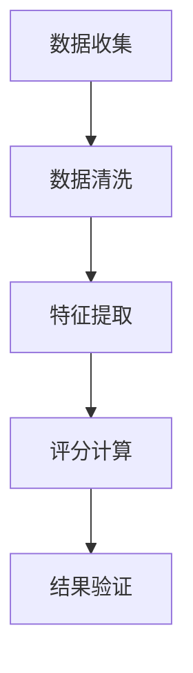
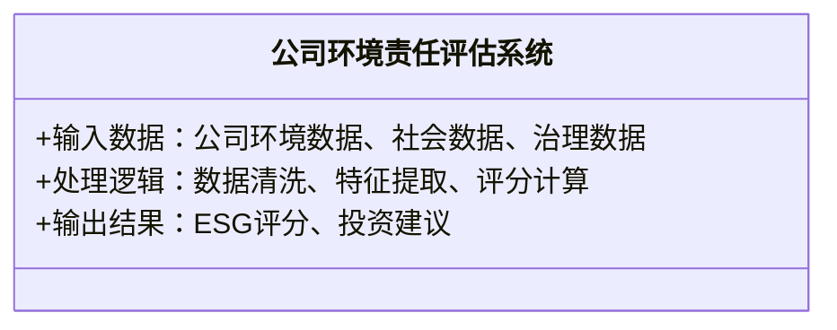
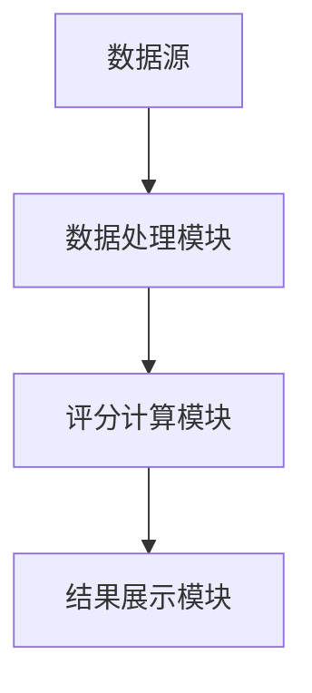

                 


# 彼得林奇对公司环境责任的看法

## 关键词：
- 彼得·林奇
- 环境责任
- 投资策略
- ESG评分
- 可持续发展

## 摘要：
本文探讨彼得·林奇作为投资大师，对公司环境责任的看法及其在投资决策中的重要性。通过分析环境责任与企业价值、ESG评分模型的应用，结合实际案例，深入阐述环境责任在投资中的影响和应用。文章结合技术博客风格，详细讲解相关概念、算法原理和项目实战。

---

# 第一部分：背景介绍

## 第1章：彼得·林奇的背景与投资理念

### 1.1 彼得·林奇的生平与投资成就

彼得·林奇（Peter Lynch）是美国著名投资经理人，以其在富达麦哲伦基金的卓越表现闻名。他于1977年加入该基金，管理期间（1977-1990）基金年平均回报率达到29%，远超市场平均水平。林奇的投资理念强调基本面分析和对公司管理层的信任，他主张投资者应深入研究公司财务状况、行业地位及管理层能力。

### 1.2 环境责任在投资中的重要性

环境责任（Environmental Responsibility）是企业社会责任（CSR）的重要组成部分，涉及企业在环境保护方面的表现，如减少碳排放、资源利用效率等。随着全球对可持续发展的关注增加，环境责任已成为投资者评估企业价值的重要指标。彼得·林奇在其投资策略中，也逐渐意识到环境责任对企业长期价值的影响。

---

## 第2章：公司环境责任的核心概念

### 2.1 环境责任的多维度分析

环境责任不仅关乎企业的环保表现，还涉及其在可持续发展方面的努力。从投资角度看，环境责任表现良好的企业通常具有更低的环境风险和更高的长期盈利能力。环境责任的评估通常包括以下几个方面：

- **环境政策**：企业是否有明确的环保政策和目标。
- **资源利用**：企业是否有效利用资源，减少浪费。
- **碳排放**：企业的碳足迹及减排措施。
- **环保投资**：企业在环保技术上的投入。

### 2.2 彼得·林奇对环境责任的看法

彼得·林奇认为，环境责任是企业长期成功的重要因素。他在《彼得·林奇的成功投资策略》中提到，企业应注重减少对环境的负面影响，这不仅有助于降低成本，还能提升企业的社会形象。林奇指出，那些在环保方面表现优异的企业往往能够在竞争中占据优势，从而为股东创造更多价值。

---

# 第二部分：核心概念与联系

## 第3章：环境责任与企业价值的关联

### 3.1 环境责任对企业财务表现的影响

环境责任直接影响企业的财务表现。例如，一家在环保方面表现不佳的企业可能面临更高的监管罚款和更高的运营成本。相反，注重环保的企业可能获得政府的税收优惠或更低的生产成本。此外，环境责任良好的企业通常更容易吸引环保意识强的消费者，从而提升市场份额。

### 3.2 环境责任与投资回报的量化分析

环境责任的表现可以通过ESG评分来量化。ESG评分是基于环境、社会和治理三个维度对企业进行评估。彼得·林奇在其投资策略中，也逐渐将ESG评分作为重要的参考指标。研究表明，ESG评分较高的企业通常具有较高的投资回报率。

---

# 第三部分：算法原理讲解

## 第4章：ESG评分模型的构建与应用

### 4.1 ESG评分模型的算法原理

ESG评分模型通过收集和分析企业的环境、社会和治理数据，对企业的ESG表现进行评分。以下是模型的主要步骤：

1. **数据收集**：收集企业的环境、社会和治理相关数据。
2. **数据清洗**：对数据进行清洗，处理缺失值和异常值。
3. **特征提取**：提取关键特征，如碳排放强度、董事会多样性等。
4. **评分计算**：基于特征对企业进行评分，通常采用加权平均的方法。

### 4.2 ESG评分模型的Mermaid流程图



### 4.3 Python代码实现

以下是一个简单的ESG评分模型的Python代码示例：

```python
import pandas as pd
import numpy as np

# 假设我们有环境数据、社会数据和治理数据
env_scores = [80, 70, 85]
soc_scores = [75, 80, 70]
gov_scores = [85, 70, 80]

# 计算ESG评分
def calculate_esg(env, soc, gov):
    # 设定权重，环境、社会、治理各占30%、30%、40%
    weights = {'环境': 0.3, '社会': 0.3, '治理': 0.4}
    # 计算加权平均
    esg_score = (env * weights['环境'] + 
                 soc * weights['社会'] + 
                 gov * weights['治理'])
    return esg_score

# 计算每个公司的ESG评分
esg_scores = []
for i in range(len(env_scores)):
    esg = calculate_esg(env_scores[i], soc_scores[i], gov_scores[i])
    esg_scores.append(esg)

print("ESG评分:", esg_scores)
```

### 4.4 算法的数学模型

ESG评分的计算公式可以表示为：

$$ ESG = w_e \times E + w_s \times S + w_g \times G $$

其中，\( E \)、\( S \)、\( G \) 分别代表环境、社会和治理评分，\( w_e \)、\( w_s \)、\( w_g \) 为对应的权重。

---

## 第5章：系统分析与架构设计

### 5.1 系统功能设计

以下是一个企业环境责任评估系统的功能设计图：



### 5.2 系统架构设计

以下是系统架构图：



---

## 第6章：项目实战

### 6.1 项目介绍

本项目旨在构建一个基于ESG评分的企业环境责任评估系统。通过收集和分析企业的环境、社会和治理数据，计算ESG评分，并提供投资建议。

### 6.2 项目实现

以下是项目的Python代码实现：

```python
import pandas as pd

# 创建一个包含环境、社会和治理数据的数据框
data = {
    '公司': ['公司A', '公司B', '公司C'],
    '环境评分': [80, 70, 85],
    '社会评分': [75, 80, 70],
    '治理评分': [85, 70, 80]
}

df = pd.DataFrame(data)

# 计算ESG评分
weights = {'环境': 0.3, '社会': 0.3, '治理': 0.4}
esg_scores = []
for i in range(len(df)):
    esg = (df['环境评分'][i] * weights['环境'] +
           df['社会评分'][i] * weights['社会'] +
           df['治理评分'][i] * weights['治理'])
    esg_scores.append(esg)

# 添加ESG评分到数据框中
df['ESG评分'] = esg_scores

print(df)
```

### 6.3 项目小结

通过该项目，我们可以看到，ESG评分模型能够有效帮助企业评估环境责任表现，并为投资者提供参考。

---

# 第四部分：最佳实践与小结

## 第7章：最佳实践与总结

### 7.1 最佳实践

- **数据来源**：确保数据的准确性和全面性。
- **模型优化**：根据实际情况调整权重和模型参数。
- **持续监测**：定期更新数据和模型，以反映最新的环境责任表现。

### 7.2 总结

彼得·林奇认为，环境责任是企业长期成功的重要因素。通过构建ESG评分模型，投资者可以更准确地评估企业的环境责任表现，从而做出更明智的投资决策。

---

# 作者信息

作者：AI天才研究院/AI Genius Institute & 禅与计算机程序设计艺术 /Zen And The Art of Computer Programming

---

以上是《彼得林奇对公司环境责任的看法》的完整内容，涵盖了从背景介绍、核心概念到算法原理和项目实战的详细分析。希望对您理解彼得·林奇的投资理念有所帮助！

