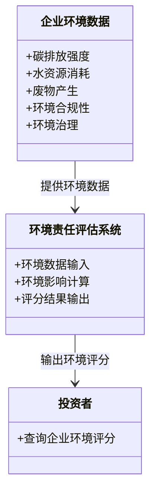

                 


# 彼得林奇对公司环境责任的评估

> 关键词：彼得林奇，公司环境责任，企业社会责任，环境影响评估，可持续发展，风险管理，绿色投资

> 摘要：本文探讨了彼得·林奇在公司环境责任评估中的观点和方法，分析了环境责任评估的核心概念、算法模型、系统架构和实际案例。通过详细分析，本文揭示了如何将环境责任评估与企业可持续发展相结合，为投资者和企业管理者提供了实用的评估工具和方法。

---

# 第一部分：环境责任评估的背景与重要性

## 第1章：环境责任评估的背景与重要性

### 1.1 环境责任评估的背景

#### 1.1.1 环境问题的全球性挑战

随着全球气候变化、资源枯竭和环境污染等问题的加剧，环境责任已成为企业和投资者关注的焦点。企业对环境的影响不仅关系到企业的可持续发展，也影响着企业的声誉和投资价值。彼得·林奇作为著名的投资专家，曾强调企业环境责任的重要性，并将其纳入投资决策的关键考量因素。

#### 1.1.2 企业社会责任的演变

企业社会责任（Corporate Social Responsibility, CSR）的概念起源于20世纪60年代，最初关注企业的经济责任和社会贡献。随着环境问题的加剧，环境责任逐渐成为企业社会责任的重要组成部分。彼得·林奇在其投资实践中，注重分析企业的环境表现，认为良好的环境责任表现是企业长期成功的关键因素。

#### 1.1.3 彼得·林奇与环境责任评估的关联

彼得·林奇在其投资生涯中，始终坚持长期投资和价值投资的理念。他认为，企业的环境责任不仅影响企业的声誉，还直接影响企业的运营成本和市场竞争力。因此，他对企业的环境责任评估提出了独特的方法，强调从环境影响、资源利用和环境治理等多个维度进行综合评估。

---

### 1.2 环境责任评估的定义与范围

#### 1.2.1 环境责任的基本概念

环境责任是指企业在经营活动中对环境造成的影响及其责任。它包括企业在生产、运营和供应链中的环境行为，以及企业对环境保护的承诺和行动。环境责任评估是对企业环境表现的系统性分析，旨在识别和量化企业的环境风险和机会。

#### 1.2.2 企业环境责任的外延

企业环境责任的外延广泛，包括以下方面：
1. **环境影响评估**：分析企业在生产过程中对环境的直接影响，如碳排放、水资源消耗、废物产生等。
2. **环境治理**：企业内部的环境管理机制，包括环境政策、目标设定和执行情况。
3. **环境合规性**：企业是否遵守相关的环境法律法规，是否存在环境违规行为。
4. **环境信息披露**：企业是否定期公开环境数据和报告，供投资者和社会监督。

#### 1.2.3 环境责任与可持续发展的关系

可持续发展是企业长远发展的核心目标，而环境责任是实现可持续发展的重要组成部分。彼得·林奇认为，企业的环境责任表现直接影响其可持续发展能力。通过评估企业的环境责任，投资者可以更好地判断企业的长期价值和风险。

---

### 1.3 环境责任评估的核心要素

#### 1.3.1 环境影响评估

环境影响评估是环境责任评估的重要组成部分，主要关注企业在生产过程中对环境的具体影响。这包括：
1. **碳排放**：企业生产过程中产生的温室气体排放量。
2. **水资源消耗**：企业用水量及其对当地水资源的影响。
3. **废物产生**：企业产生的固体废物和处理方式。

#### 1.3.2 资源利用效率

资源利用效率是衡量企业环境责任的重要指标。高效利用资源可以减少企业的环境足迹，降低成本，并提高企业的竞争力。彼得·林奇在其投资实践中，特别关注企业在资源利用方面的表现，认为这是企业长期盈利能力的重要保障。

#### 1.3.3 环境治理与合规性

环境治理是企业环境责任的核心要素之一。它包括企业内部的环境管理机制、环境政策和目标设定等。合规性则是指企业是否遵守相关的环境法律法规，是否存在环境违规行为。彼得·林奇认为，良好的环境治理和合规性是企业环境责任的重要体现，也是企业长期发展的基础。

---

## 第2章：环境责任评估的核心概念与联系

### 2.1 环境责任评估的核心概念

#### 2.1.1 环境影响的量化

环境影响的量化是环境责任评估的关键步骤。通过量化企业的环境影响，可以更好地分析和比较不同企业的环境表现。例如，计算企业的碳排放强度（单位产品碳排放量）可以帮助投资者判断企业的环境效率。

#### 2.1.2 资源消耗的评估

资源消耗的评估包括对企业能源消耗、水资源消耗和原材料消耗的分析。通过评估资源消耗，可以识别企业在资源管理中的潜在风险和机会。例如，企业采用可再生能源可以降低能源消耗的环境影响。

#### 2.1.3 环境治理的框架

环境治理的框架包括企业内部的环境管理机制、环境政策和目标设定等。彼得·林奇认为，良好的环境治理是企业环境责任的重要体现，也是企业长期发展的基础。他特别关注企业在环境治理方面的表现，认为这是企业长期盈利能力的重要保障。

---

### 2.2 核心概念的对比分析

#### 2.2.1 不同环境责任评估方法的对比

环境责任评估方法多种多样，包括生命周期评估（LCA）、环境影响评价（EIA）和环境社会治理（ESG）等。彼得·林奇在其投资实践中，倾向于使用环境社会治理（ESG）框架，认为这种方法能够全面评估企业的环境、社会和治理表现。

#### 2.2.2 环境责任与经济利益的关系

环境责任与经济利益密切相关。良好的环境责任表现可以降低企业的运营成本、提高企业的市场竞争力，并为企业创造长期价值。彼得·林奇认为，企业在环境责任方面的投入可以带来显著的经济利益，例如减少能源消耗、提高资源利用效率等。

#### 2.2.3 环境责任与企业声誉的关联

环境责任是企业声誉的重要组成部分。良好的环境责任表现可以提升企业的品牌形象，吸引更多关注可持续发展的投资者和客户。彼得·林奇在其投资实践中，特别关注企业的声誉风险，认为良好的环境责任表现是企业长期成功的关键因素。

---

### 2.3 环境责任评估的ER实体关系图

```mermaid
erDiagram
    actor 顾客
    actor 监管机构
    actor 企业
    actor 环境组织
    actor 政府机构
    顾客 --> 环境组织: 投诉环境问题
    顾客 --> 监管机构: 投诉环境问题
    企业 --> 监管机构: 提交环境报告
    监管机构 --> 企业: 审核环境报告
    环境组织 --> 企业: 提供环境建议
```

---

## 第3章：环境责任评估的算法与数学模型

### 3.1 环境责任评分模型

#### 3.1.1 模型的输入变量

环境责任评分模型的输入变量包括以下几项：
1. **碳排放强度**：单位产品碳排放量。
2. **水资源消耗**：单位产品用水量。
3. **废物产生**：单位产品废物产生量。
4. **环境合规性**：企业是否遵守环境法律法规。
5. **环境治理**：企业内部环境管理机制的有效性。

#### 3.1.2 模型的输出结果

模型的输出结果是一个综合评分，表示企业的环境责任表现。评分范围为1到10分，1分为最低，10分为最高。

#### 3.1.3 模型的权重分配

不同输入变量的权重分配如下：
- 碳排放强度：40%
- 水资源消耗：30%
- 废物产生：20%
- 环境合规性：10%

---

### 3.2 环境责任评估的数学模型

#### 3.2.1 环境影响指数的计算公式

环境影响指数（Environmental Impact Index, EII）的计算公式如下：
$$
EII = w_1 \cdot CEI + w_2 \cdot WUC + w_3 \cdot WPG + w_4 \cdot EC + w_5 \cdot EG
$$
其中，\( CEI \) 表示碳排放强度，\( WUC \) 表示水资源消耗，\( WPG \) 表示废物产生，\( EC \) 表示环境合规性，\( EG \) 表示环境治理。

权重 \( w_1, w_2, w_3, w_4, w_5 \) 分别为 0.4、0.3、0.2、0.1 和 0.

---

## 第4章：环境责任评估的系统架构

### 4.1 问题场景介绍

本章将介绍环境责任评估的系统架构设计。系统目标是为企业和投资者提供一个全面的环境责任评估工具，帮助企业识别和管理环境风险，提升环境表现。

### 4.2 系统功能设计

#### 4.2.1 领域模型



---

## 第5章：环境责任评估的项目实战

### 5.1 项目介绍

本章将通过一个实际案例，介绍如何使用彼得·林奇的环境责任评估方法评估一家公司的环境责任表现。

### 5.2 项目实施

#### 5.2.1 环境安装

需要安装以下工具和库：
- Python 3.x
- pandas
- numpy
- matplotlib

#### 5.2.2 核心代码实现

以下是环境责任评估系统的Python代码实现：

```python
import pandas as pd
import numpy as np

def calculate_Environmental_Impact_Index(carbon_emission_intensity, water_usage_per_product, waste_generated_per_product, environmental_compliance, environmental_governance):
    weight_CE = 0.4
    weight_WU = 0.3
    weight_WG = 0.2
    weight_EC = 0.1
    weight_EG = 0.0

    EII = (weight_CE * carbon_emission_intensity +
           weight_WU * water_usage_per_product +
           weight_WG * waste_generated_per_product +
           weight_EC * environmental_compliance +
           weight_EG * environmental_governance)
    return EII

# 示例数据
carbon_emission_intensity = 0.5  # 单位产品碳排放量
water_usage_per_product = 0.2   # 单位产品用水量
waste_generated_per_product = 0.3  # 单位产品废物产生量
environmental_compliance = 0.8    # 环境合规性评分
environmental_governance = 0.7     # 环境治理评分

EII = calculate_Environmental_Impact_Index(carbon_emission_intensity, water_usage_per_product, waste_generated_per_product, environmental_compliance, environmental_governance)
print("环境影响指数 (EII):", EII)
```

---

## 第6章：环境责任评估的最佳实践

### 6.1 小结

通过本文的分析，我们可以看到，环境责任评估是企业可持续发展的重要组成部分。彼得·林奇的环境责任评估方法为我们提供了一个全面的框架，帮助企业识别和管理环境风险，提升环境表现。

### 6.2 注意事项

在实际应用中，需要注意以下几点：
1. 数据的准确性和完整性。
2. 模型的适用性和可扩展性。
3. 环境责任评估的持续性和动态性。

### 6.3 拓展阅读

- 彼得·林奇的《投资之道》
- 环境社会治理（ESG）框架
- 碳中和目标与企业责任

---

# 作者：AI天才研究院 & 禅与计算机程序设计艺术

---

通过本文的详细分析和实例展示，我们希望读者能够更好地理解彼得·林奇对公司环境责任的评估方法，并能够在实际工作中应用这些方法，推动企业的可持续发展。

