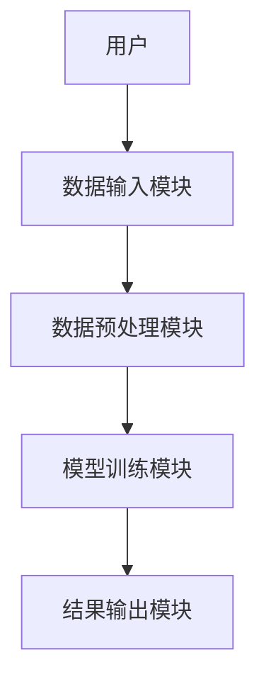

                 


# 彼得林奇对公司现金流波动性的分析

> **关键词**: 彼得林奇, 现金流波动性, 投资分析, 时间序列分析, 现金流预测, 价值投资

> **摘要**: 本文深入分析了彼得林奇在公司现金流波动性分析中的独特见解和方法。通过介绍现金流波动性的基本概念、数学模型、系统架构以及实际项目案例，结合彼得林奇的投资理念，为读者提供了一套全面的现金流波动性分析框架，帮助投资者更好地理解和应用这一分析方法。

---

## 第一章: 引言

### 1.1 彼得林奇与现金流波动性分析

彼得·林奇是全球著名的价值投资者，以其对公司基本面的深入分析和对现金流的关注而闻名。他在投资过程中，尤其注重公司现金流的稳定性和波动性，认为现金流是衡量公司健康状况的重要指标。本文将从现金流波动性的角度，详细分析彼得林奇的投资理念及其在实践中的应用。

---

## 第二章: 现金流波动性的基本概念

### 2.1 现金流的基本概念

现金流是指公司在一定时期内通过经营、投资和筹资活动所获得的现金流入和流出。现金流可以分为以下几类：

- **经营活动现金流**: 公司日常运营中产生的现金流，如销售收入、成本支付等。
- **投资活动现金流**: 与投资相关的现金流，如购买或出售资产。
- **筹资活动现金流**: 与筹资相关的现金流，如借款、偿还债务等。

### 2.2 现金流波动性的定义与特征

现金流波动性是指公司在一定时间内现金流的变化程度。波动性高的现金流意味着公司收入不稳定，可能面临更大的经营风险。波动性低的现金流则表明公司收入较为稳定，经营风险较小。

彼得林奇认为，现金流波动性是评估公司财务健康状况的重要指标。他通常会关注公司过去几年的现金流数据，分析其波动性是否在合理范围内。

---

## 第三章: 现金流波动性的数学模型

### 3.1 现金流波动性的统计分析

现金流波动性的统计分析通常使用方差和标准差来衡量。方差是数据偏离均值的平方的平均值，标准差是方差的平方根。公式如下：

$$ \text{方差} = \frac{1}{n}\sum_{i=1}^{n}(x_i - \bar{x})^2 $$

$$ \text{标准差} = \sqrt{\text{方差}} $$

其中，$\bar{x}$ 是数据的平均值，$n$ 是数据的个数。

### 3.2 时间序列分析模型

时间序列分析是一种常用的现金流预测方法。彼得林奇在分析现金流波动性时，常用ARIMA（自回归积分滑动平均）模型。ARIMA模型的三个参数为$p$（自回归阶数）、$d$（差分阶数）和$q$（移动平均阶数）。模型公式如下：

$$ \phi(B)(1 - B)^d X_t = \theta(B) \epsilon_t $$

其中，$B$ 是延迟算子，$\phi(B)$ 是自回归多项式，$\theta(B)$ 是移动平均多项式，$\epsilon_t$ 是白噪声。

---

## 第四章: 现金流波动性分析的系统架构

### 4.1 系统功能设计

现金流波动性分析系统通常包括以下几个功能模块：

1. **数据输入**: 收集公司历史财务数据，包括现金流数据。
2. **数据预处理**: 对数据进行清洗和标准化处理。
3. **模型训练**: 使用统计模型（如ARIMA）训练现金流波动性预测模型。
4. **结果输出**: 输出预测结果，包括波动性指标和预测值。

### 4.2 系统架构设计

以下是现金流波动性分析系统的架构图：



### 4.3 接口设计

现金流波动性分析系统的接口设计包括：

1. **数据输入接口**: 提供CSV或Excel格式的数据输入。
2. **结果输出接口**: 提供波动性指标的JSON格式输出。

---

## 第五章: 项目实战

### 5.1 环境安装

为了进行现金流波动性分析，需要安装以下工具和库：

- **Python**: 用于数据分析和建模。
- **Pandas**: 用于数据处理。
- **NumPy**: 用于数值计算。
- **Scikit-learn**: 用于机器学习模型。

### 5.2 核心代码实现

以下是使用Python和Pandas进行现金流波动性分析的代码示例：

```python
import pandas as pd
import numpy as np

# 加载数据
df = pd.read_csv('cash_flow.csv')

# 计算现金流均值
mean_flow = df['cash_flow'].mean()

# 计算现金流方差
var_flow = np.var(df['cash_flow'])

# 计算现金流标准差
std_flow = np.sqrt(var_flow)

print(f'均值: {mean_flow}, 方差: {var_flow}, 标准差: {std_flow}')
```

### 5.3 案例分析

以某公司为例，分析其现金流波动性。假设该公司过去5年的现金流数据如下：

| 年份 | 现金流（百万美元） |
|------|--------------------|
| 2018 | 100                |
| 2019 | 120                |
| 2020 | 90                 |
| 2021 | 150                |
| 2022 | 130                |

计算其方差和标准差：

$$ \text{方差} = \frac{(100-120)^2 + (120-120)^2 + (90-120)^2 + (150-120)^2 + (130-120)^2}{5} $$

$$ \text{方差} = \frac{400 + 0 + 900 + 900 + 100}{5} = 420 $$

$$ \text{标准差} = \sqrt{420} \approx 20.49 $$

---

## 第六章: 总结与展望

### 6.1 总结

彼得林奇对公司现金流波动性的分析，为我们提供了一种全新的视角。通过结合统计分析和时间序列模型，我们可以更好地预测和管理现金流波动性，从而做出更明智的投资决策。

### 6.2 注意事项

在实际应用中，需要注意以下几点：

- 数据的准确性和完整性。
- 模型的选择和参数调整。
- 波动性分析的局限性。

### 6.3 拓展阅读

建议读者进一步阅读以下书籍和论文：

- 《彼得林奇的投资之道》
- 《时间序列分析与应用》

---

## 作者：AI天才研究院 & 禅与计算机程序设计艺术

---

以上就是《彼得林奇对公司现金流波动性的分析》的完整内容。希望本文能为读者提供关于现金流波动性分析的深入理解，并帮助投资者在实践中更好地应用这一方法。

