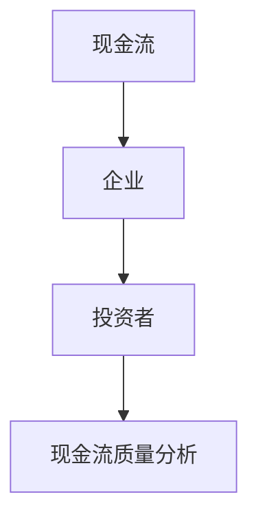
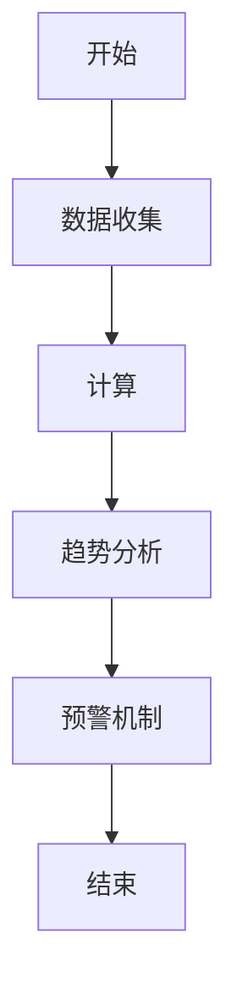
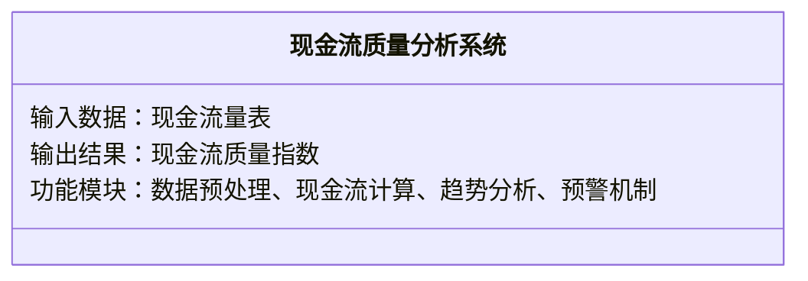
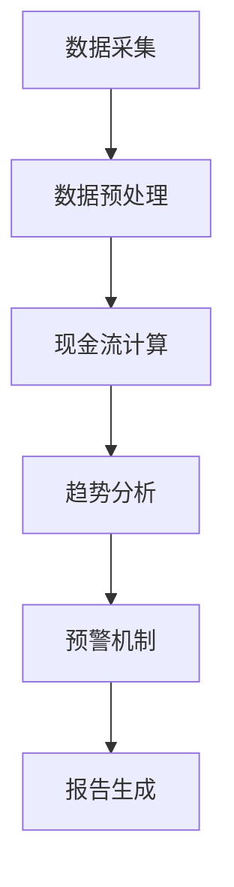

                 


# 彼得林奇对公司现金流质量的分析

## 关键词：现金流质量，彼得林奇，投资分析，财务健康，企业价值

## 摘要：  
现金流质量是评估企业财务健康的重要指标，直接影响企业的生存和投资价值。本文系统地介绍了彼得林奇对公司现金流质量的分析方法，从背景介绍、核心概念、算法原理到实际应用，全面剖析了现金流质量分析的逻辑和技巧。文章结合数学模型和实际案例，深入探讨了现金流质量指数（CFQI）的计算方法，并通过系统架构设计展示了现金流分析在企业中的应用场景。最后，通过项目实战和最佳实践，为读者提供了实用的现金流质量分析工具和方法。

---

# 目录

## 第一部分: 背景介绍

### 第1章: 现金流质量分析的背景与重要性

#### 1.1 现金流质量分析的定义与核心概念
- 1.1.1 现金流质量的定义
  - 现金流质量是指公司产生的现金流量的稳定性和可持续性，反映了企业实际的财务健康状况。
- 1.1.2 现金流质量的核心要素
  - 来源：经营活动、投资活动、筹资活动的现金流。
  - 结构：正向现金流与负向现金流的占比。
  - 质量：现金流的稳定性、可持续性和增长性。
- 1.1.3 现金流质量与企业价值的关系
  - 现金流质量是企业价值的核心驱动因素，高质量的现金流意味着企业具有更强的偿债能力和扩张能力。

#### 1.2 彼得林奇的现金流质量分析方法
- 1.2.1 彼得林奇的现金流分析框架
  - 通过分析公司过去5年的现金流数据，评估其质量。
  - 强调正向现金流的持续性和稳定性。
- 1.2.2 现金流质量分析的边界与外延
  - 现金流质量分析仅关注现金流的来源和结构，不涉及企业的其他财务指标。
  - 现金流质量分析的外延包括企业未来的现金流预测和投资决策。
- 1.2.3 现金流质量分析的步骤与流程
  - 数据收集：获取公司过去5年的现金流量表。
  - 计算：分析正向和负向现金流的比例。
  - 趋势分析：观察现金流的变化趋势。
  - 预警机制：设定现金流质量预警线。

## 第二部分: 核心概念与联系

### 第2章: 现金流质量分析的核心概念与联系

#### 2.1 现金流质量分析的原理
- 2.1.1 现金流的来源与结构
  - 经营活动现金流：企业日常经营产生的现金流。
  - 投资活动现金流：企业投资于固定资产或其他资产的现金流。
  - 筹资活动现金流：企业通过借款或发行股票等方式获得的现金流。
- 2.1.2 现金流的质量特征
  - 稳定性：正向现金流的持续性。
  - 可持续性：现金流的增长潜力。
  - 健康性：现金流的结构是否合理。
- 2.1.3 现金流质量与企业财务健康的关系
  - 高质量现金流的企业具有更强的偿债能力和盈利能力。
  - 现金流质量差的企业容易陷入财务困境。

#### 2.2 核心概念对比分析
- 2.2.1 正向现金流与负向现金流的特征对比
  - 正向现金流：经营活动产生的现金流为正，说明企业能够通过自身经营获得资金。
  - 负向现金流：经营活动产生的现金流为负，说明企业需要依赖外部融资维持运营。
- 2.2.2 现金流质量与企业盈利模式的关系
  - 高质量现金流的企业通常具有稳定的盈利模式。
  - 现金流质量差的企业可能依赖于短期融资维持运营。
- 2.2.3 现金流质量与企业风险控制的关联
  - 现金流质量高的企业具有更强的风险承受能力。
  - 现金流质量差的企业容易受到市场波动的影响。

#### 2.3 现金流质量分析的ER实体关系图


---

## 第三部分: 算法原理讲解

### 第3章: 现金流质量分析的算法原理

#### 3.1 现金流质量分析的步骤
- 3.1.1 数据收集
  - 获取公司过去5年的现金流量表。
  - 确保数据的完整性和准确性。
- 3.1.2 计算
  - 计算正向现金流和负向现金流的比例。
  - 计算现金流质量指数（CFQI）。
- 3.1.3 趋势分析
  - 观察现金流的变化趋势。
  - 分析现金流的波动性。
- 3.1.4 预警机制
  - 设定现金流质量预警线。
  - 及时发现现金流质量下降的信号。

#### 3.2 现金流质量分析的流程图


#### 3.3 现金流质量分析的Python代码实现
```python
import pandas as pd

# 数据收集
def collect_data(company):
    # 假设data是一个包含公司过去5年现金流量表的DataFrame
    return data

# 计算
def calculate_CFQI(data):
    positive = data['经营活动现金流'].sum() / data['总现金流'].sum()
    CFQI = (positive - 0.5) * 100
    return CFQI

# 趋势分析
def analyze_trend(data):
    trend = data['经营活动现金流'].rolling(2).mean().plot()
    return trend

# 预警机制
def set_warning(data):
    threshold = 0.3  # 设定预警线为30%
    if data['经营活动现金流'] < threshold:
        return '警告：现金流质量下降'
    else:
        return '正常'

# 示例
company = 'ABC公司'
data = collect_data(company)
CFQI = calculate_CFQI(data)
trend = analyze_trend(data)
warning = set_warning(data)

print(f"现金流质量指数：{CFQI}")
print(f"趋势分析：{trend}")
print(f"预警机制：{warning}")
```

---

## 第四部分: 数学模型与公式

### 第4章: 现金流质量分析的数学模型与公式

#### 4.1 现金流质量指数（CFQI）的计算公式
$$
CFQI = \left( \frac{\text{正向现金流}}{\text{总现金流}} - 0.5 \right) \times 100
$$

#### 4.2 现金流质量分析的数学模型
$$
\text{正向现金流} = \sum_{i=1}^{n} \text{经营活动现金流}_i
$$
$$
\text{负向现金流} = \sum_{i=1}^{n} \text{筹资活动现金流}_i + \sum_{i=1}^{n} \text{投资活动现金流}_i
$$

#### 4.3 现金流质量分析的案例
假设某公司过去5年的现金流量表如下：
| 年份 | 经营活动现金流 | 投资活动现金流 | 筹资活动现金流 | 总现金流 |
|------|----------------|----------------|----------------|----------|
| 2018 | 100            | -50            | 0              | 50       |
| 2019 | 120            | -30            | 0              | 90       |
| 2020 | 150            | -20            | 0              | 130      |
| 2021 | 180            | -10            | 0              | 170      |
| 2022 | 200            | -15            | 0              | 185      |

计算CFQI：
$$
\text{正向现金流} = 100 + 120 + 150 + 180 + 200 = 750
$$
$$
\text{总现金流} = 50 + 90 + 130 + 170 + 185 = 625
$$
$$
CFQI = \left( \frac{750}{625} - 0.5 \right) \times 100 = 17.5
$$

---

## 第五部分: 系统分析与架构设计

### 第5章: 现金流质量分析的系统架构设计

#### 5.1 系统功能设计
- 领域模型：


- 系统架构：


#### 5.2 系统接口设计
- 输入接口：现金流量表数据。
- 输出接口：现金流质量指数和分析报告。

#### 5.3 系统交互流程
```mermaid
sequenceDiagram
    用户 --> 数据采集模块: 提供现金流量表数据
    数据采集模块 --> 数据预处理模块: 进行数据清洗
    数据预处理模块 --> 现金流计算模块: 计算正向和负向现金流
    现金流计算模块 --> 趋势分析模块: 分析现金流变化趋势
    趋势分析模块 --> 预警机制模块: 判断是否触发预警
    预警机制模块 --> 报告生成模块: 生成分析报告
    用户 <-- 报告生成模块: 返回现金流质量指数和分析报告
```

---

## 第六部分: 项目实战

### 第6章: 现金流质量分析的项目实战

#### 6.1 项目环境安装
- 安装Python和必要的库：
  ```bash
  pip install pandas matplotlib numpy
  ```

#### 6.2 核心代码实现
```python
import pandas as pd
import matplotlib.pyplot as plt

def calculate_CFQI(data):
    positive = data['经营活动现金流'].sum() / data['总现金流'].sum()
    CFQI = (positive - 0.5) * 100
    return CFQI

def analyze_trend(data):
    plt.plot(data['年份'], data['经营活动现金流'], label='经营活动现金流')
    plt.xlabel('年份')
    plt.ylabel('现金流')
    plt.title('现金流变化趋势')
    plt.legend()
    plt.show()

# 示例数据
data = {
    '年份': [2018, 2019, 2020, 2021, 2022],
    '经营活动现金流': [100, 120, 150, 180, 200],
    '总现金流': [50, 90, 130, 170, 185]
}
df = pd.DataFrame(data)

CFQI = calculate_CFQI(df)
print(f"现金流质量指数：{CFQI}")

analyze_trend(df)
```

#### 6.3 项目小结
- 现金流质量分析的核心在于数据的准确性和模型的合理性。
- 通过实际案例分析，可以更好地理解现金流质量指数的计算方法和应用。

---

## 第七部分: 最佳实践与总结

### 第7章: 现金流质量分析的最佳实践

#### 7.1 最佳实践
- 数据质量：确保现金流数据的准确性和完整性。
- 模型优化：根据企业的实际情况调整现金流质量指数的计算公式。
- 风险控制：建立现金流质量预警机制，及时发现和处理问题。

#### 7.2 小结
- 现金流质量分析是评估企业财务健康的重要工具。
- 通过彼得林奇的方法，投资者可以更好地识别高质量的企业。

#### 7.3 注意事项
- 现金流质量分析仅是投资决策的一部分，需要结合其他财务指标综合分析。
- 现金流质量分析的结果可能会受到市场环境和企业战略的影响。

#### 7.4 拓展阅读
- 《彼得·林奇的投资哲学》
- 《财务报表分析与股票投资》

---

## 作者：AI天才研究院/AI Genius Institute & 禅与计算机程序设计艺术 /Zen And The Art of Computer Programming

