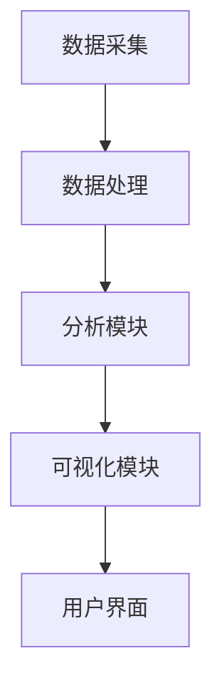

                 


# 彼得林奇对公司现金流质量的季节性分析

**关键词：** 现金流质量分析、彼得·林奇、季节性波动、投资决策、现金流指数

**摘要：**  
现金流质量是评估企业财务健康和投资价值的关键指标，而季节性波动对现金流的影响不容忽视。本文以彼得·林奇的投资理念为核心，系统地分析现金流质量的季节性变化，探讨如何通过数学模型和算法优化来识别和应对这些波动。文章结合实际案例，详细阐述现金流质量分析的方法，帮助投资者做出更明智的投资决策。

---

# 第一部分: 背景介绍与核心概念

## 第1章: 现金流质量分析的背景与重要性

### 1.1 现金流质量分析的定义与作用

现金流质量分析是评估企业财务健康状况的重要工具。现金流不仅反映了企业的盈利情况，还揭示了企业获取现金的能力和效率。高质量的现金流意味着企业能够稳定地产生现金，支持日常运营和未来发展。季节性波动是现金流分析中的重要变量，它反映了企业在不同时间段内的财务表现差异。

- **现金流质量的定义：** 现金流质量指的是企业产生现金流的能力和效率。高质量的现金流意味着企业能够持续、稳定地产生现金，支持其业务发展和偿债能力。

- **现金流质量的作用：** 现金流质量分析帮助企业评估自身的财务健康状况，识别潜在风险，优化财务管理，并为投资者提供重要的决策依据。

- **季节性波动的影响：** 季节性波动是指企业在不同时间段内现金流的波动。这些波动可能由季节性需求、行业特性或企业内部管理等因素引起。正确识别和分析季节性波动，可以帮助投资者更准确地评估现金流质量。

### 1.2 彼得·林奇的投资理念

彼得·林奇是全球著名的职业基金经理，以其独特的投资策略和对现金流质量的高度重视而闻名。他强调通过深入分析企业的财务状况，尤其是现金流质量，来评估其投资价值。

- **彼得·林奇的投资者画像：** 林奇认为，成功的投资者需要具备扎实的财务分析能力，能够从财务报表中发现企业的潜在价值和风险。

- **现金流分析的重要性：** 林奇在其投资策略中，特别关注企业的现金流质量。他认为，现金流是企业财务健康的核心指标，能够真实反映企业的盈利能力和财务稳定性。

- **季节性波动的处理：** 林奇在分析现金流时，特别注意季节性波动的影响。他认为，季节性波动是影响现金流质量的重要因素，必须通过历史数据分析和趋势预测来识别和调整。

### 1.3 本书的核心问题与目标

本书的核心问题是如何通过现金流质量分析，尤其是季节性波动的分析，帮助投资者评估企业的财务健康状况和投资价值。我们的目标是通过系统的方法和实际案例，帮助读者掌握现金流质量分析的技巧，并能够在实际投资中灵活运用。

---

## 第2章: 现金流质量分析的核心概念

### 2.1 现金流的三大部分

现金流通常分为三个部分：经营活动现金流、投资活动现金流和筹资活动现金流。每个部分都有其独特的特征和作用。

- **经营活动现金流：** 经营活动现金流是企业日常经营活动中产生的现金流入和流出。它是企业核心业务的直接反映，也是现金流质量分析的重点。

- **投资活动现金流：** 投资活动现金流是企业投资于长期资产或出售长期资产所产生的现金流量。它反映了企业的投资策略和资本分配能力。

- **筹资活动现金流：** 筹资活动现金流是企业通过发行股票、债券或其他融资方式获得的现金流入，以及偿还债务、支付股息等产生的现金流出。

### 2.2 现金流质量的衡量指标

现金流质量的衡量指标主要包括现金流比率、现金流周期和现金流质量指数。

- **现金流比率：** 现金流比率是经营活动现金流与净利润的比率，反映了企业净利润中有多少是能够转化为现金的。

- **现金流周期：** 现金流周期是指从企业收到现金到支付现金的时间长度，反映了企业的资金周转效率。

- **现金流质量指数：** 现金流质量指数是衡量企业现金流健康状况的综合指标，通常以经营活动现金流占净利润的比例为基础。

### 2.3 季节性波动对现金流的影响

季节性波动对现金流的影响主要体现在经营活动现金流的变化上。企业可能因为季节性需求、销售周期或其他外部因素，导致经营活动现金流在不同时间段内出现显著波动。

- **季节性波动的定义：** 季节性波动是指企业在不同时间段内现金流的周期性变化。这些变化通常与企业的业务周期、行业特性或外部经济环境相关。

- **季节性波动的常见原因：** 行业特性（如零售业在节假日的销售高峰）、企业内部管理策略（如促销活动）或外部经济环境（如季节性消费需求）。

- **季节性波动对现金流质量的影响：** 季节性波动可能导致现金流的短期波动，但如果波动过大，可能反映出企业的财务不稳定或管理问题。

---

## 第3章: 现金流质量分析的数学模型与算法原理

### 3.1 现金流质量分析的数学模型

现金流质量指数是衡量现金流健康状况的重要指标，其计算公式如下：

$$\text{现金流质量指数} = \frac{\text{经营活动现金流}}{\text{净利润}} \times 100$$

- **公式解释：** 经营活动现金流是企业核心业务的现金流入，净利润是企业的会计利润。将经营活动现金流与净利润进行比较，可以评估企业利润的“含金量”。

### 3.2 现金流质量分析的算法流程

以下是现金流质量分析的基本步骤：

1. **数据收集与预处理：** 收集企业的财务报表，提取经营活动现金流和净利润数据。对数据进行清洗和标准化处理。

2. **现金流质量指数的计算：** 使用上述公式计算现金流质量指数。

3. **季节性波动的识别与调整：** 通过历史数据分析，识别季节性波动，并对现金流进行季节性调整。

4. **趋势分析与预测：** 对现金流质量指数进行趋势分析，预测未来的现金流变化趋势。

### 3.3 现金流质量分析的可视化

通过可视化工具，可以更直观地观察现金流质量的变化趋势和季节性波动。

- **现金流质量指数的柱状图：** 柱状图可以展示不同时间段内现金流质量指数的变化情况。

- **季节性波动的折线图：** 折线图可以展示季节性波动对现金流的影响，帮助识别波动的周期性规律。

---

## 第4章: 现金流质量分析的系统架构设计

### 4.1 系统功能设计

以下是现金流质量分析系统的功能模块设计：

1. **数据采集模块：** 负责采集企业的财务数据，包括经营活动现金流和净利润。

2. **数据处理模块：** 对采集到的数据进行清洗、标准化和预处理。

3. **分析模块：** 包括现金流质量指数的计算、季节性波动识别和趋势分析。

4. **可视化模块：** 将分析结果以图表形式展示，帮助用户直观理解。

### 4.2 系统架构设计

以下是系统的架构设计：



### 4.3 系统接口设计

系统接口设计如下：

1. **数据接口：** 提供API接口，用于外部数据源的数据接入。

2. **用户接口：** 提供友好的用户界面，方便用户输入数据和查看分析结果。

---

## 第5章: 项目实战

### 5.1 环境安装与配置

需要安装以下工具和库：

- Python 3.x
- Pandas
- Matplotlib
- Seaborn

### 5.2 核心代码实现

以下是现金流质量指数计算的Python代码示例：

```python
import pandas as pd
import matplotlib.pyplot as plt

# 数据读取
df = pd.read_csv('financial_data.csv')

# 计算现金流质量指数
cfqi = (df['经营活动现金流'] / df['净利润']) * 100

# 绘制柱状图
plt.figure(figsize=(10, 6))
plt.bar(df.index, cfqi, color='blue')
plt.title('现金流质量指数')
plt.xlabel('时间')
plt.ylabel('现金流质量指数')
plt.show()
```

### 5.3 案例分析与解读

以苹果公司为例，分析其现金流质量：

1. **数据收集：** 收集苹果公司过去五年的财务数据。

2. **计算现金流质量指数：** 使用上述公式计算经营活动现金流占净利润的比例。

3. **识别季节性波动：** 分析现金流质量指数的变化趋势，识别是否存在显著的季节性波动。

4. **投资决策：** 根据分析结果，评估苹果公司的现金流质量，做出投资决策。

---

## 第6章: 最佳实践与注意事项

### 6.1 关键点回顾

- 现金流质量分析是评估企业财务健康的重要工具。
- 季节性波动对现金流的影响不容忽视。
- 现金流质量指数是衡量现金流健康状况的重要指标。

### 6.2 注意事项

- 数据的准确性和完整性是分析的基础。
- 季节性波动的识别需要结合行业特性和企业实际情况。
- 投资决策需要综合考虑多方面因素，不能仅依赖现金流质量分析。

### 6.3 拓展阅读

- 彼得·林奇的《投资最重要的事情》
- 其他关于现金流分析的经典书籍和文献

---

# 结语

现金流质量分析是评估企业财务健康和投资价值的重要工具。通过深入分析现金流的季节性波动，可以帮助投资者更准确地评估企业的财务状况，并做出更明智的投资决策。希望本文能够为读者提供有价值的分析方法和实践指导。

---

**作者：AI天才研究院/AI Genius Institute & 禅与计算机程序设计艺术 /Zen And The Art of Computer Programming**

