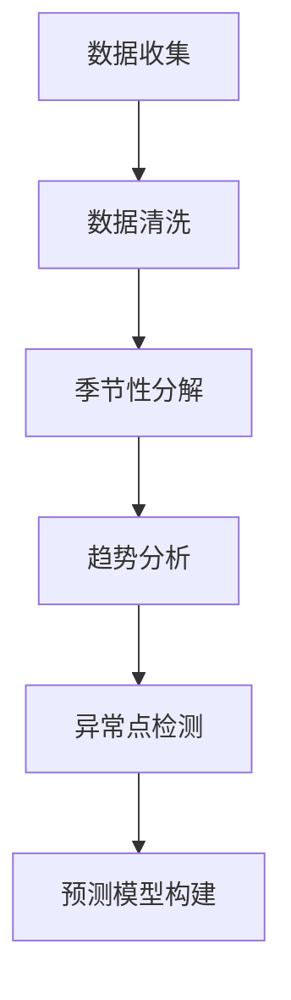

                 

# 彼得林奇对公司现金流质量的季节性分析

> 关键词：彼得林奇，现金流质量，季节性分析，投资决策，财务健康

> 摘要：本文深入探讨了彼得林奇对公司现金流质量进行季节性分析的方法，分析了季节性波动对现金流的影响，结合实际案例和系统架构，详细介绍了现金流质量的评价指标、分析方法和预测模型，帮助投资者更好地理解和应用现金流质量的季节性分析。

---

## 第一部分: 现金流质量的季节性分析概述

### 第1章: 现金流质量的基本概念

#### 1.1 现金流的定义与重要性

现金流是企业在一定时期内通过经营活动、投资活动和筹资活动所产生现金流入和流出的总和。现金流质量是指公司在一定时间内产生现金的能力以及现金流的稳定性、增长性和结构合理性。现金流质量是评估企业财务健康状况的重要指标，也是投资决策的关键依据。

现金流质量的重要性体现在以下几个方面：
1. **企业生存能力**：现金流是企业的“血液”，没有稳定的现金流，企业将难以维持正常运营。
2. **投资能力**：现金流充裕的企业能够进行新项目投资，扩大生产能力。
3. **偿债能力**：现金流充足的企业能够按时偿还债务，避免财务危机。

#### 1.2 季节性分析的背景与意义

季节性波动是指由于行业特性或市场环境的变化，导致企业财务数据在不同时间段内呈现周期性波动。现金流作为财务数据的重要组成部分，也会受到季节性波动的影响。例如，零售行业在节假日销售额大幅增加，导致经营活动现金流在第四季度显著上升。

季节性分析的意义在于：
1. **识别现金流波动规律**：通过分析现金流的季节性波动，可以发现现金流变化的周期性规律，为预测未来现金流提供依据。
2. **优化财务决策**：了解现金流的季节性波动可以帮助企业在财务规划中做出更合理的安排，例如在现金流高峰期提前筹措资金。
3. **评估企业财务健康**：季节性分析可以帮助投资者识别企业现金流波动是否合理，进而评估企业的财务健康状况。

---

### 第2章: 现金流质量的评价指标

现金流质量的评价指标可以从多个维度进行分析，包括稳定性、增长性和结构合理性。

#### 2.1 现金流的核心指标

1. **自由现金流（Free Cash Flow）**：自由现金流是指企业在扣除资本支出后的剩余现金流，是衡量企业财务健康的重要指标。
2. **经营活动现金流（Operating Cash Flow）**：经营活动现金流是指企业通过主营业务活动所产生的现金流，反映企业主营业务的盈利能力。
3. **投资活动现金流（Investing Cash Flow）**：投资活动现金流是指企业通过投资活动所产生的现金流，例如购买或出售资产。
4. **筹资活动现金流（Financing Cash Flow）**：筹资活动现金流是指企业通过筹资活动所产生的现金流，例如发行债券或偿还债务。

#### 2.2 现金流质量的评价标准

1. **稳定性**：现金流波动越小，企业财务越稳定。
2. **增长性**：现金流持续增长表明企业主营业务健康发展。
3. **结构合理性**：经营活动现金流占比较大表明企业主营业务现金流健康。

---

### 第3章: 季节性波动对现金流的影响

#### 3.1 季节性波动的定义与特征

季节性波动是指由于行业特性或市场环境的变化，导致企业财务数据在不同时间段内呈现周期性波动。例如，零售行业的销售额通常在节假日前后出现高峰，导致经营活动现金流在第四季度显著增加。

季节性波动的特征：
1. **周期性**：季节性波动通常具有固定的周期性，例如 quarterly 或 yearly。
2. **可预测性**：通过历史数据可以识别季节性波动的规律，从而预测未来的现金流变化。
3. **行业差异性**：不同行业的季节性波动具有不同的特点，例如零售行业的季节性波动通常与销售旺季相关。

#### 3.2 季节性波动对现金流的具体影响

1. **销售额的季节性波动**：例如，零售行业在节假日销售额大幅增加，导致经营活动现金流在第四季度显著上升。
2. **成本与费用的季节性变化**：某些行业的成本和费用可能在特定季度增加，例如制造行业在生产旺季需要增加原材料采购。
3. **应收账款与应付账款的季节性波动**：例如，某些行业在销售旺季应收账款大幅增加，导致经营活动现金流在旺季后出现回款高峰期。

#### 3.3 季节性波动的案例分析

以零售行业为例，通常在第四季度（尤其是 holiday season）销售额显著增加，导致经营活动现金流在第四季度大幅上升。然而，如果企业未能及时回收应收账款，可能导致经营活动现金流在后续季度出现下降。

---

## 第二部分: 现金流质量的季节性分析方法论

### 第4章: 现金流质量的季节性分析框架

#### 4.1 现金流质量分析的基本步骤

1. **数据收集与整理**：收集企业过去几年的财务报表，提取现金流数据。
2. **数据清洗与标准化**：对现金流数据进行清洗，去除异常值，确保数据的准确性和一致性。
3. **数据分析与建模**：使用时间序列分析模型，对现金流数据进行季节性分解，识别季节性波动规律。
4. **异常点检测**：识别现金流中的异常点，分析异常点的原因及影响。

#### 4.2 季节性分析的数学模型

1. **时间序列分析模型**：
   - ARIMA（Autoregressive Integrated Moving Average）模型
   - SARIMA（Seasonal ARIMA）模型

2. **季节性分解模型**：
   - 使用X-12-ARIMA方法对现金流数据进行季节性分解，分离趋势、季节性和随机成分。

3. **突变点检测模型**：
   - 使用CUSUM检验或EWMA（Exponentially Weighted Moving Average）方法检测现金流中的突变点。

#### 4.3 现金流质量分析的流程图

---

### 第5章: 现金流质量的季节性预测模型

#### 5.1 时间序列分析模型

1. **ARIMA模型**：
   - ARIMA模型通过自回归和移动平均成分，对时间序列数据进行建模和预测。
   - 模型公式：
     $$ ARIMA(p, d, q) $$
     其中，p为自回归阶数，d为差分阶数，q为移动平均阶数。

2. **SARIMA模型**：
   - SARIMA模型在ARIMA模型的基础上，引入季节性成分，适用于具有明显季节性波动的时间序列数据。
   - 模型公式：
     $$ SARIMA(p, d, q, P, D, Q) $$
     其中，P为季节性自回归阶数，D为季节性差分阶数，Q为季节性移动平均阶数。

---

## 第三部分: 现金流质量的季节性分析实战

### 第6章: 现金流质量分析的系统架构

#### 6.1 项目介绍

本项目旨在构建一个现金流质量的季节性分析系统，通过数据采集、清洗、分析和预测，帮助投资者更好地理解企业现金流的季节性波动规律。

#### 6.2 系统功能设计

1. **数据采集模块**：
   - 从企业财务报表中提取现金流数据。
   - 支持多种数据格式的导入，例如Excel、CSV等。

2. **数据清洗模块**：
   - 去除异常值和缺失值。
   - 标准化数据格式，确保数据一致性。

3. **数据分析模块**：
   - 使用时间序列分析模型对现金流数据进行季节性分解。
   - 识别现金流中的趋势和季节性成分。

4. **预测模块**：
   - 使用SARIMA模型对未来的现金流进行预测。
   - 生成预测结果并可视化。

5. **可视化模块**：
   - 生成现金流的时间序列图、季节性分解图和预测结果图。

---

## 第四部分: 总结与展望

### 第7章: 总结

现金流质量的季节性分析是评估企业财务健康的重要方法。通过分析现金流的季节性波动规律，投资者可以更好地理解企业的财务状况，做出更合理的投资决策。

---

### 第8章: 展望

未来，随着大数据和人工智能技术的发展，现金流质量的季节性分析将更加精准和智能化。例如，可以利用机器学习算法，对现金流数据进行深度学习，预测未来的现金流变化。

---

## 作者

作者：AI天才研究院/AI Genius Institute & 禅与计算机程序设计艺术 /Zen And The Art of Computer Programming

---

以上是《彼得林奇对公司现金流质量的季节性分析》的技术博客文章的完整大纲和内容。如果需要进一步扩展某个部分或添加更多细节，请随时告知。

