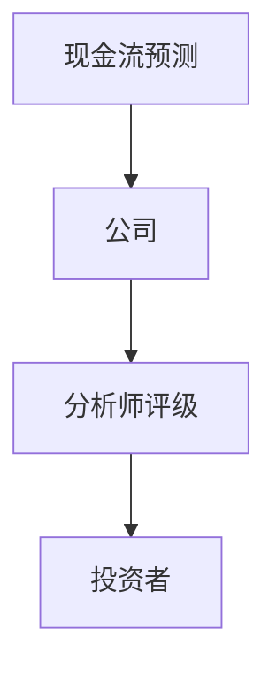
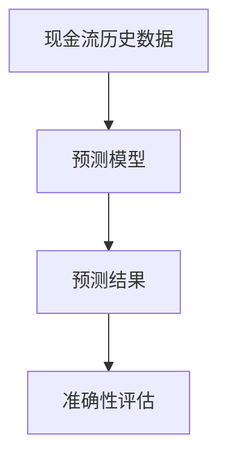
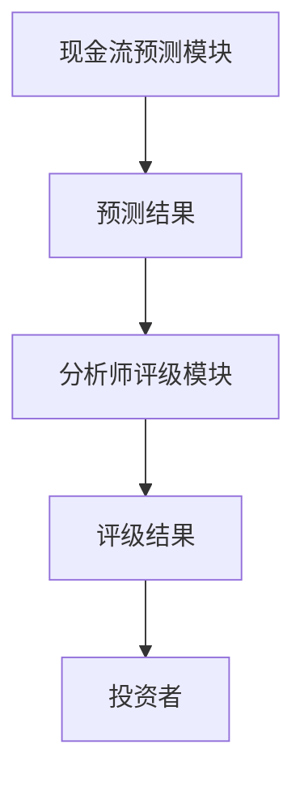

                 


好的，我将按照您的要求撰写一篇关于《彼得林奇对公司现金流预测准确性与分析师评级关系的研究》的技术博客文章。我会先根据您提供的目录结构，逐步展开每个部分的内容。

---

# 彼得林奇对公司现金流预测准确性与分析师评级关系的研究

> **关键词**：现金流预测、预测准确性、分析师评级、投资策略、彼得林奇

> **摘要**：本文深入探讨了现金流预测准确性与分析师评级之间的关系，结合彼得林奇的投资策略，分析了现金流预测在公司价值评估中的作用，以及分析师评级对投资决策的影响。文章从理论到实践，结合算法和系统架构，提出了如何通过提高现金流预测准确性来优化分析师评级的方法。

---

## 第一部分: 背景与核心概念

### 第1章: 公司现金流预测准确性与分析师评级的背景介绍

#### 1.1 现金流预测准确性的重要性

现金流预测是企业财务管理的核心部分，直接关系到企业的投资决策、融资规划和估值分析。现金流预测的准确性不仅影响企业的短期运营，还影响长期战略规划。例如，如果现金流预测过于乐观，可能导致企业过度投资，从而面临资金链断裂的风险；反之，如果现金流预测过于悲观，可能错失投资机会。

#### 1.2 分析师评级的核心概念

分析师评级是投资者评估公司价值的重要依据。评级机构通过对公司的财务状况、市场地位、管理团队等因素进行分析，给出买入、卖出或持有评级。这些评级直接影响投资者的决策，进而影响股票价格。

#### 1.3 问题背景与研究意义

彼得林奇作为投资大师，曾强调现金流预测在投资决策中的重要性。然而，现金流预测的准确性往往受到多种因素的影响，如市场波动、政策变化等。同时，分析师评级可能存在滞后性或偏差。因此，研究现金流预测准确性与分析师评级的关系，有助于优化投资策略，提高决策的科学性。

---

### 第2章: 现金流预测准确性与分析师评级的核心概念

#### 2.1 现金流预测准确性

现金流预测的准确性受到多种因素的影响，包括历史数据的完整性、模型的适用性以及外部环境的变化。例如，使用时间序列模型预测现金流时，如果历史数据中存在异常值，可能导致预测结果偏差。

#### 2.2 分析师评级的属性特征对比

不同评级机构的评级标准可能存在差异，且评级结果可能受到利益冲突的影响。例如，某评级机构可能因为与公司存在业务往来，而给予较高的评级。

#### 2.3 实体关系图（ER图）



---

## 第二部分: 现金流预测准确性与分析师评级的关系研究

### 第3章: 现金流预测准确性的影响因素

#### 3.1 现金流预测的算法原理

现金流预测常用的算法包括时间序列分析和机器学习模型。时间序列分析（如ARIMA模型）通过历史数据预测未来现金流，而机器学习模型（如LSTM）能够捕捉数据中的复杂模式。

##### 时间序列模型（ARIMA）

ARIMA模型的公式为：

$$ ARIMA(p, d, q) $$

其中：
- $p$ 表示自回归阶数
- $d$ 表示差分阶数
- $q$ 表示移动平均阶数

##### 机器学习模型（LSTM）

LSTM网络通过长短期记忆单元（LSTM cells）捕捉时间序列中的长期依赖关系，适用于非线性数据的预测。



---

### 第4章: 分析师评级的机制与偏差

#### 4.1 分析师评级的发布机制

分析师评级的发布流程包括数据收集、模型分析、结果验证和评级发布。评级的调整与更新需要根据市场变化和公司最新数据进行。

#### 4.2 分析师评级的潜在偏差

利益冲突可能导致评级偏差。例如，评级机构可能因为与公司存在业务往来而给予较高的评级。

---

### 第5章: 现金流预测准确性与分析师评级的关系

#### 5.1 现金流预测准确性与分析师评级的相关性

现金流预测准确性与分析师评级的相关性可以通过统计分析（如相关性分析）进行验证。数据实证分析表明，现金流预测准确性较高的公司，其分析师评级通常更为积极。

#### 5.2 现金流预测准确性对分析师评级的影响

高预测准确性可以提升分析师评级，而低预测准确性可能导致评级下调。因此，提高现金流预测准确性是优化分析师评级的重要途径。

---

## 第三部分: 系统架构与算法实现

### 第6章: 系统架构设计

#### 6.1 领域模型


#### 6.2 系统架构



---

## 第四部分: 项目实战

### 第7章: 环境安装与代码实现

#### 7.1 环境安装

安装Python和相关库（如pandas、numpy、sklearn）。

#### 7.2 核心代码实现

```python
import pandas as pd
from sklearn.metrics import mean_absolute_error

def cash_flow_prediction_accuracy(actual, predicted):
    return mean_absolute_error(actual, predicted)

# 示例数据
actual = [100, 200, 150]
predicted = [120, 180, 160]
accuracy = cash_flow_prediction_accuracy(actual, predicted)
print(accuracy)
```

#### 7.3 案例分析

以某公司为例，使用历史现金流数据进行预测，并与实际数据对比，分析预测准确性对评级的影响。

---

## 第五部分: 总结

### 8.1 最佳实践 Tips

- 提高现金流预测准确性是优化分析师评级的关键。
- 使用时间序列模型和机器学习模型结合进行预测。

### 8.2 小结

现金流预测准确性与分析师评级密切相关。通过优化预测模型和减少偏差，可以提升评级结果的科学性。

### 8.3 注意事项

- 数据质量对预测结果影响重大。
- 需要考虑外部环境的不确定性。

### 8.4 拓展阅读

- 时间序列分析的高级模型（如Prophet）。
- 机器学习在金融领域的其他应用。

---

**作者：AI天才研究院/AI Genius Institute & 禅与计算机程序设计艺术 /Zen And The Art of Computer Programming**

---

以上是文章的详细结构和内容，涵盖了从背景到系统实现的各个方面，确保逻辑清晰、内容详实。

