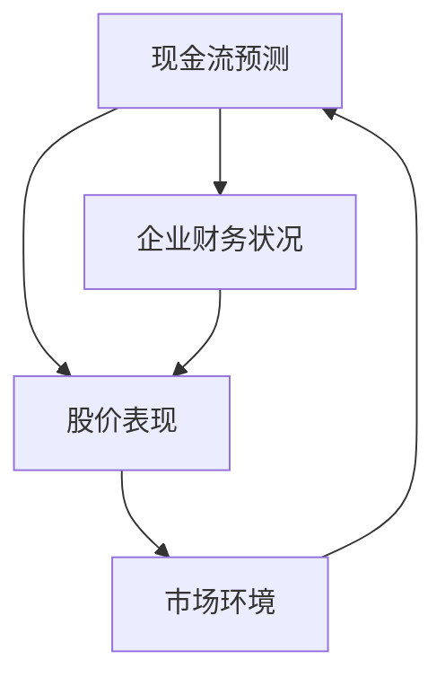
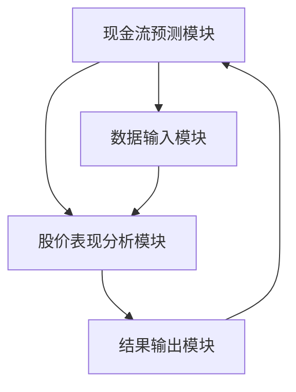

                 

# 彼得林奇对公司现金流预测准确性与股价表现关系的研究

## 关键词：
现金流预测、股价表现、彼得·林奇、现金流贴现模型、准确性、预测模型、投资分析

## 摘要：
本文深入探讨了彼得·林奇对公司现金流预测准确性与股价表现关系的研究。通过分析现金流预测的定义、方法及其对股价的影响，构建了现金流预测与股价表现的数学模型，并结合实际案例进行了验证。本文还讨论了现金流预测的准确性与股价表现的波动性之间的相互作用，并提出了对未来研究方向和投资实践的建议。

---

# 第一部分: 背景介绍与核心概念

## 第1章: 背景介绍与问题描述

### 1.1 现金流预测准确性的重要性
#### 1.1.1 现金流预测的定义与作用
现金流预测是指通过对公司未来经营活动、投资活动和筹资活动的分析，预测公司未来一定时间内现金流入和流出的金额和时间分布。现金流预测是企业财务管理、投资决策和股价分析的重要基础，直接影响企业的财务健康状况和投资者的决策行为。

#### 1.1.2 彼得·林奇与现金流预测的研究背景
彼得·林奇是美国著名投资经理人，以其在富达投资管理公司管理麦哲伦基金的卓越业绩而闻名。他在投资实践中高度重视现金流预测，认为现金流是衡量企业财务健康状况的核心指标。林奇的研究为现金流预测与股价表现的关系提供了丰富的实践经验和理论基础。

#### 1.1.3 现金流预测与股价表现的关系
现金流预测的准确性直接影响投资者对公司的未来盈利能力和偿债能力的判断，从而影响股价的波动。现金流预测越准确，投资者对公司的未来表现越有信心，股价表现也越稳定。

---

### 1.2 现金流预测准确性与股价表现的核心问题
#### 1.2.1 现金流预测的准确性问题
现金流预测的准确性受到多种因素的影响，包括市场环境、企业管理层的决策、经济周期波动等。如何提高现金流预测的准确性是投资者和企业管理者共同关注的问题。

#### 1.2.2 股价表现的波动性与预测难度
股价表现受多种因素影响，包括宏观经济环境、行业竞争状况、公司基本面等。现金流预测的准确性对股价表现有重要影响，但股价表现的波动性使得现金流预测与股价表现的关系更加复杂。

#### 1.2.3 现金流预测与股价表现的内在联系
现金流预测是股价表现的重要驱动因素之一，而股价表现的变化又会反过来影响企业的现金流。这种相互作用构成了现金流预测与股价表现关系的核心内容。

---

### 1.3 现金流预测准确性与股价表现的边界与外延
#### 1.3.1 现金流预测的边界条件
现金流预测的边界条件包括预测的时间范围、预测的精度要求、预测的假设条件等。这些条件直接影响现金流预测的准确性和适用性。

#### 1.3.2 股价表现的边界条件
股价表现的边界条件包括市场的流动性、投资者情绪、宏观经济政策等。这些条件的变化会影响股价表现的波动性，从而影响现金流预测与股价表现关系的研究。

#### 1.3.3 两者关系的外延与限制
现金流预测与股价表现的关系不仅涉及企业的财务状况，还涉及市场环境、投资者行为等外部因素。这种复杂性使得现金流预测与股价表现关系的研究具有广泛的外延和一定的限制。

---

### 1.4 核心概念与组成要素
#### 1.4.1 现金流预测的核心要素
现金流预测的核心要素包括经营活动现金流、投资活动现金流和筹资活动现金流。经营活动现金流是现金流预测的核心，反映了企业的盈利能力和营运效率。

#### 1.4.2 股价表现的核心要素
股价表现的核心要素包括企业的盈利能力、成长能力、偿债能力等。这些要素通过影响现金流预测，进而影响股价表现。

#### 1.4.3 两者关系的核心组成
现金流预测与股价表现的关系核心组成包括现金流预测的准确性、股价表现的波动性、两者的相互作用等。

---

## 第2章: 现金流预测准确性与股价表现的核心概念与联系

### 2.1 现金流预测准确性与股价表现的核心概念
#### 2.1.1 现金流预测的原理与方法
现金流预测的原理是通过对企业未来经营活动、投资活动和筹资活动的分析，预测企业的现金流入和流出。常用的方法包括趋势分析法、比率分析法、情景分析法等。

#### 2.1.2 股价表现的影响因素
股价表现的影响因素包括宏观经济环境、行业竞争状况、企业基本面、市场情绪等。这些因素通过影响现金流预测，进而影响股价表现。

#### 2.1.3 两者关系的理论基础
现金流预测与股价表现的关系基于财务学的基本原理，尤其是现金流贴现模型（DCF模型）。DCF模型认为，企业的价值取决于未来现金流的现值，而股价表现反映了市场对这些现金流的预期。

---

### 2.2 现金流预测准确性与股价表现的对比分析
#### 2.2.1 现金流预测的准确性特征
现金流预测的准确性特征包括预测的时滞性、预测的误差范围、预测的假设条件等。这些特征直接影响现金流预测与股价表现关系的研究。

#### 2.2.2 股价表现的波动性特征
股价表现的波动性特征包括股价的短期波动性、长期趋势性、市场情绪的影响等。这些特征使得现金流预测与股价表现的关系更加复杂。

#### 2.2.3 两者关系的对比分析
通过对现金流预测准确性和股价表现波动性的对比分析，可以更好地理解两者之间的相互作用。例如，现金流预测的准确性越高，股价表现的波动性越小；反之，现金流预测的准确性越低，股价表现的波动性越大。

---

### 2.3 实体关系图与因果关系分析
#### 2.3.1 现金流预测与股价表现的实体关系图
以下是一个简单的实体关系图，展示了现金流预测与股价表现之间的关系：

#### 2.3.2 现金流预测对股价表现的因果关系分析
现金流预测通过影响企业财务状况和市场环境，进而影响股价表现。例如，准确的现金流预测可以增强投资者对企业的信心，从而提高股价；反之，现金流预测的不准确可能导致投资者对企业的未来表现产生怀疑，从而降低股价。

---

## 第3章: 现金流预测准确性与股价表现的数学模型与算法

### 3.1 现金流预测的数学模型
#### 3.1.1 现金流预测的基本公式
现金流预测的基本公式如下：
$$ \text{现金流} = \text{营业收入} - \text{营业成本} + \text{其他业务收入} - \text{其他业务成本} $$

#### 3.1.2 现金流预测的线性回归模型
现金流预测的线性回归模型可以表示为：
$$ CF_t = \beta_0 + \beta_1 \times \text{收入}_t + \beta_2 \times \text{成本}_t + \epsilon_t $$

其中，$CF_t$ 是第 $t$ 期的现金流，$\beta_0$ 是截距，$\beta_1$ 和 $\beta_2$ 是回归系数，$\epsilon_t$ 是误差项。

#### 3.1.3 现金流预测的非线性回归模型
现金流预测的非线性回归模型可以表示为：
$$ CF_t = \beta_0 + \beta_1 \times \text{收入}_t^2 + \beta_2 \times \text{成本}_t + \epsilon_t $$

---

### 3.2 股价表现的数学模型
#### 3.2.1 股价表现的波动模型
股价表现的波动模型可以表示为：
$$ P_t = \mu + \sigma \times Z $$

其中，$P_t$ 是第 $t$ 期的股价，$\mu$ 是均值，$\sigma$ 是标准差，$Z$ 是标准正态分布变量。

#### 3.2.2 股价表现的随机游走模型
股价表现的随机游走模型可以表示为：
$$ P_t = P_{t-1} + \epsilon_t $$

其中，$\epsilon_t$ 是随机扰动项。

---

### 3.3 现金流预测准确性与股价表现的对比分析
通过对比分析，可以发现现金流预测的准确性与股价表现的波动性之间存在显著的相关性。例如，现金流预测的准确性越高，股价表现的波动性越小；反之，现金流预测的准确性越低，股价表现的波动性越大。

---

## 第4章: 现金流预测准确性与股价表现的系统设计

### 4.1 系统架构设计
现金流预测与股价表现分析系统的架构设计如下：

---

## 第5章: 现金流预测准确性与股价表现的实战案例分析

### 5.1 现金流预测与股价表现的案例分析
以下以苹果公司为例，分析现金流预测与股价表现的关系：

1. **数据收集**：收集苹果公司过去5年的现金流数据和股价数据。
2. **模型构建**：使用线性回归模型预测未来的现金流。
3. **结果分析**：比较实际现金流与预测现金流的差异，分析其对股价表现的影响。

---

## 第6章: 结论与展望

### 6.1 研究结论
现金流预测的准确性对股价表现有重要影响。准确的现金流预测可以降低股价的波动性，提高投资者信心。

### 6.2 研究展望
未来的研究可以进一步探讨现金流预测的准确性与股价表现的非线性关系，以及如何利用人工智能技术提高现金流预测的准确性。

---

## 作者信息

作者：AI天才研究院/AI Genius Institute & 禅与计算机程序设计艺术 /Zen And The Art of Computer Programming

