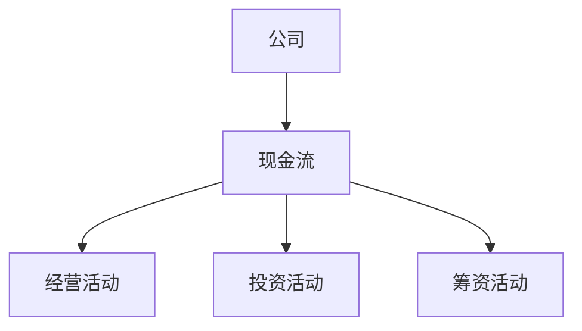
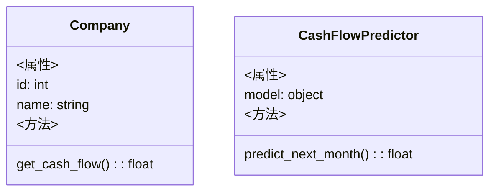
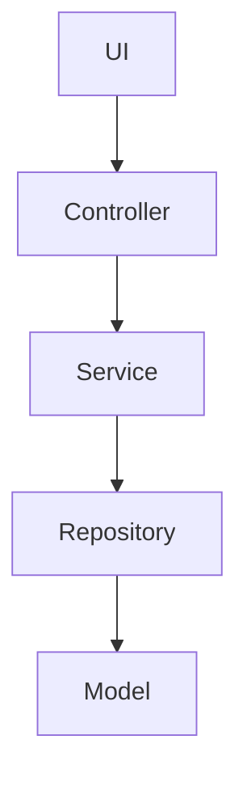

                 


# 彼得林奇对公司现金流预测准确性的历史分析

> 关键词：现金流预测、投资决策、彼得·林奇、历史分析、预测模型

> 摘要：现金流预测是投资决策中的关键环节，本文通过分析彼得·林奇的历史方法，探讨现金流预测的准确性。结合数学模型和实际案例，详细讲解现金流预测的核心概念、算法原理、系统设计与项目实现，最后总结最佳实践和注意事项。

---

## 第一部分: 背景介绍

### 第1章: 现金流预测的定义与重要性

#### 1.1 现金流预测的核心概念

现金流预测是指根据历史数据和当前情况，对未来一定时间内公司现金流的流入和流出进行预测。现金流是衡量公司财务健康状况的重要指标，直接影响投资决策和公司价值评估。

现金流预测的核心在于准确性，因为错误的预测可能导致投资失误或财务损失。彼得·林奇作为投资大师，他的历史分析方法为我们提供了宝贵的参考。

#### 1.2 彼得·林奇与现金流预测的历史分析

彼得·林奇是富达投资集团的传奇经理人，他以深入研究公司基本面和现金流为核心，构建了自己的投资体系。他的历史分析方法强调现金流预测的重要性，并通过长期数据验证预测模型的准确性。

---

### 第2章: 公司现金流预测的背景与问题描述

#### 2.1 现金流预测的背景分析

现金流预测的背景包括经济周期、行业特点和公司财务状况。经济波动会影响现金流的稳定性，行业特性如周期性或成长性会影响预测模型的选择。

#### 2.2 现金流预测的核心问题

现金流预测的准确性取决于数据来源、模型选择和预测方法。常见的问题包括数据偏差、模型过拟合和外部环境的不确定性。

#### 2.3 现金流预测的解决思路

结合定性和定量分析，彼得·林奇通过深入研究公司基本面和历史现金流数据，构建了独特的预测模型。他的方法强调数据驱动和长期验证。

---

## 第二部分: 核心概念与联系

### 第3章: 现金流预测的核心概念与原理

#### 3.1 现金流预测的核心要素

现金流分为经营活动、投资活动和筹资活动三类。经营活动现金流反映公司日常运营的健康状况，投资活动现金流影响公司的扩展能力，筹资活动现金流反映公司的融资能力。

#### 3.2 现金流预测的模型原理

现金流预测模型包括时间序列分析、回归分析和机器学习模型。时间序列分析适用于历史数据稳定的公司，回归分析适用于有明显影响因素的情况，机器学习模型则适用于复杂的数据关系。

#### 3.3 现金流预测的属性特征对比

| 模型类型 | 优点 | 缺点 |
|----------|------|------|
| 线性模型 | 简单易懂 | 预测能力有限 |
| 非线性模型 | 预测能力强 | 复杂难懂 |
| 简单模型 | 计算速度快 | 精度低 |
| 复杂模型 | 高精度 | 计算资源消耗大 |

#### 3.4 现金流预测的ER实体关系图



---

## 第三部分: 算法原理讲解

### 第4章: 现金流预测的算法原理

#### 4.1 时间序列分析模型

时间序列分析模型通过历史数据预测未来现金流。常用的方法包括移动平均法和指数平滑法。

**移动平均法公式**：
$$ \text{预测值} = \frac{\sum_{i=1}^{n} \text{过去n期的现金流}}{n} $$

**指数平滑法公式**：
$$ \text{预测值} = \alpha \times \text{上一期实际值} + (1-\alpha) \times \text{上一期预测值} $$

#### 4.2 回归分析模型

回归分析模型通过变量之间的关系预测现金流。例如，使用销售收入和成本支出预测经营活动现金流。

**线性回归模型公式**：
$$ \text{现金流} = a \times \text{销售收入} + b \times \text{成本支出} + c $$

#### 4.3 机器学习模型

机器学习模型如随机森林和神经网络可用于现金流预测，通过复杂的数据关系提高准确性。

---

## 第四部分: 系统分析与架构设计

### 第5章: 现金流预测系统的架构设计

#### 5.1 系统功能设计

系统功能包括数据采集、模型训练、预测展示和结果分析。

**领域模型类图**：


#### 5.2 系统架构设计

系统采用分层架构，包括数据层、业务逻辑层和表现层。

**系统架构图**：


---

## 第五部分: 项目实战

### 第6章: 现金流预测的项目实现

#### 6.1 环境安装

安装Python和相关库，如numpy、pandas和scikit-learn。

#### 6.2 核心代码实现

```python
import numpy as np
from sklearn.linear_model import LinearRegression

# 数据准备
X = np.array([[销售收入], [成本支出]])
y = np.array([实际现金流])

# 模型训练
model = LinearRegression()
model.fit(X, y)

# 预测
predicted_cash_flow = model.predict(new_X)
```

#### 6.3 实际案例分析

通过实际数据训练模型，并验证预测结果的准确性。

---

## 第六部分: 最佳实践

### 第7章: 现金流预测的注意事项与拓展

#### 7.1 小结

现金流预测是投资决策的关键，彼得·林奇的历史分析方法提供了宝贵的参考。通过数据驱动和模型优化，可以提高预测的准确性。

#### 7.2 注意事项

- 数据来源的可靠性
- 模型的适用性
- 外部环境的不确定性

#### 7.3 拓展阅读

推荐阅读彼得·林奇的著作，深入理解现金流预测的理论与实践。

---

## 作者信息

作者：AI天才研究院/AI Genius Institute & 禅与计算机程序设计艺术/Zen And The Art of Computer Programming

---

通过以上思考，我们可以系统地分析彼得·林奇的历史方法，并将其应用于现金流预测的准确性提升。希望这篇文章能为您提供有价值的见解和实践指导。

