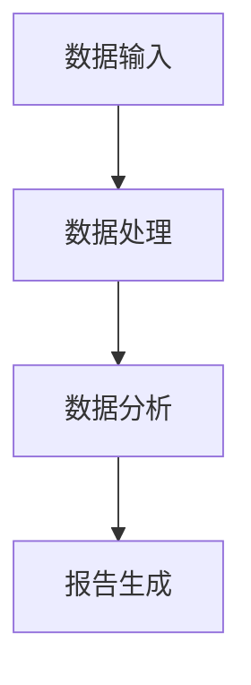

                 


# 彼得·林奇对公司现金转化周期的看法

> 关键词：现金转化周期，彼得·林奇，现金流管理，库存管理，应收账款，应付账款，企业价值

> 摘要：本文深入探讨了投资大师彼得·林奇对公司现金转化周期（CCC）的看法。通过分析CCC的关键组成部分，包括库存、应收账款和应付账款，本文揭示了如何通过优化这些部分来提升企业的现金流管理效率。文章结合了理论分析、系统架构设计和项目实战，详细解读了彼得·林奇的投资策略及其对企业的实际应用。

---

## 第一部分：引言

### 第1章：彼得·林奇的投资理念概述

#### 1.1 投资大师彼得·林奇的简介

彼得·林奇（Peter Lynch）是全球最著名的投资专家之一，以其在富达投资管理公司的长期任职中表现出色而闻名。他强调基本面分析和长期投资，认为企业的财务健康状况是投资成功的关键。林奇的策略不仅关注企业的盈利能力，还特别注重现金流管理，尤其是现金转化周期（CCC）在评估企业价值中的重要性。

#### 1.2 现金流管理的重要性

现金流是企业的生命线，直接影响企业的生存和发展。有效的现金流管理能够确保企业正常运营，抓住市场机会，并在经济衰退期间保持稳定。彼得·林奇在其投资策略中，将现金流视为评估企业健康的重要指标，尤其是通过现金转化周期来衡量企业将现金投入转化为收益的能力。

---

## 第二部分：现金转化周期的核心概念

### 第2章：现金转化周期的定义与计算

#### 2.1 现金转化周期的定义

现金转化周期（Cash Conversion Cycle，CCC）是指企业将现金投入转化为现金收入所需的时间。它反映了企业在经营过程中管理流动资产和应付账款的能力，是衡量企业流动资金效率的重要指标。

#### 2.2 现金转化周期的计算公式

CCC的计算公式如下：

$$ CCC = \left( \frac{COGS}{库存周转率} \right) + \left( \frac{应收账款}{应收账款周转率} \right) - \left( \frac{应付账款}{应付账款周转率} \right) $$

其中，COGS表示营业成本，库存周转率、应收账款周转率和应付账款周转率分别表示库存、应收账款和应付账款的流动性。

#### 2.3 影响现金转化周期的因素

- **库存周转率**：库存周转率越高，企业将库存转化为现金的时间越短。
- **应收账款周转率**：应收账款周转率越高，企业回收资金的速度越快。
- **应付账款周转率**：应付账款周转率越高，企业利用供应商信用的能力越强。

---

### 第3章：现金转化周期与企业价值的关系

#### 3.1 现金转化周期对企业价值的影响

现金转化周期越短，企业能够更快地将投入转化为收益，从而提高资金使用效率。这不仅降低了企业的财务风险，还可能提高企业的市场价值。

#### 3.2 现金转化周期与企业财务健康状况的关联

一个短的现金转化周期通常意味着企业具有更强的流动资金管理能力和更高的运营效率。这在彼得·林奇的投资分析中是一个重要的考量因素。

---

## 第三部分：现金转化周期的关键组成部分

### 第4章：库存管理

#### 4.1 库存管理的重要性

库存是现金转化周期中最重要的组成部分之一。高效的库存管理能够缩短库存周转天数，从而缩短整体的现金转化周期。

#### 4.2 库存管理策略

- **ABC分类法**：根据库存的价值和重要性进行分类，优化库存持有策略。
- **安全库存**：保持一定的安全库存以应对突发需求或供应链中断。

#### 4.3 库存周转率的计算与优化

库存周转率 = (COGS) / 平均库存

优化库存周转率的方法包括减少库存持有量、提高销售预测准确性以及优化供应链管理。

---

### 第5章：应收账款管理

#### 5.1 应收账款管理的重要性

应收账款是企业流动资产的重要组成部分。高效的应收账款管理能够加快资金回收速度，缩短现金转化周期。

#### 5.2 应收账款周转率的计算与优化

应收账款周转率 = 销售收入 / 平均应收账款

优化应收账款周转率的方法包括建立严格的信用政策、加强应收账款催收以及选择信用良好的客户。

---

### 第6章：应付账款管理

#### 6.1 应付账款管理的重要性

应付账款是企业流动负债的重要组成部分。有效的应付账款管理能够延长企业的应付账款周转天数，从而优化现金流。

#### 6.2 应付账款周转率的计算与优化

应付账款周转率 = 采购成本 / 平均应付账款

优化应付账款周转率的方法包括与供应商建立良好的信用关系、合理利用信用期限以及优化采购流程。

---

## 第四部分：彼得·林奇的现金转化周期分析方法

### 第7章：现金流预测与管理

#### 7.1 现金流预测的重要性

现金流预测是企业财务管理的重要组成部分。通过预测现金流，企业可以更好地规划资金使用，优化现金转化周期。

#### 7.2 现金流管理策略

- **现金储备**：保持一定的现金储备以应对突发事件。
- **现金流匹配**：确保现金流与企业的需求相匹配，避免现金流缺口。

---

## 第五部分：系统架构与项目实战

### 第8章：系统架构设计

#### 8.1 现金流管理系统设计

- **数据输入模块**：收集企业相关的财务数据。
- **数据处理模块**：计算库存、应收账款和应付账款的周转率。
- **数据分析模块**：计算现金转化周期并进行优化建议。
- **报告生成模块**：生成现金流管理报告。

#### 8.2 系统架构图

以下是一个现金流管理系统的架构图：



---

### 第9章：项目实战

#### 9.1 环境安装

安装Python和必要的库（如pandas、numpy）。

#### 9.2 核心实现代码

以下是一个计算现金转化周期的Python代码示例：

```python
import pandas as pd

# 假设数据存储在Excel文件中
df = pd.read_excel('financial_data.xlsx')

# 计算库存周转率
inventory_turnover = df['COGS'] / df['average_inventory']

# 计算应收账款周转率
receivables_turnover = df['revenue'] / df['average_receivables']

# 计算应付账款周转率
payables_turnover = df['COGS'] / df['average_payables']

# 计算现金转化周期
ccc = (inventory_turnover + receivables_turnover) - payables_turnover

print(ccc)
```

---

## 第六部分：结论与建议

### 第10章：结论

彼得·林奇在其投资策略中高度重视现金转化周期，认为它是评估企业财务健康状况的重要指标。通过优化库存、应收账款和应付账款的管理，企业可以显著缩短现金转化周期，提高现金流效率。

### 第11章：投资建议

1. **关注现金流管理**：投资者应关注企业的现金流状况，尤其是现金转化周期。
2. **优化流动资产与负债管理**：企业应通过优化库存、应收账款和应付账款管理来缩短现金转化周期。
3. **定期财务审查**：企业应定期审查财务状况，确保现金流管理的有效性。

---

## 作者

作者：AI天才研究院/AI Genius Institute & 禅与计算机程序设计艺术 /Zen And The Art of Computer Programming

