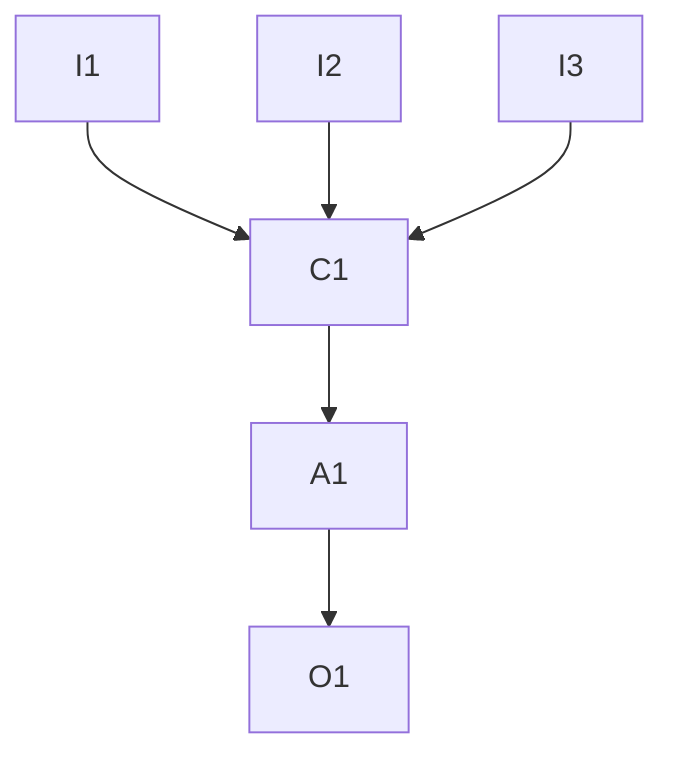

                 


# 彼得林奇对公司现金转换周期的分析

> 关键词：彼得·林奇, 现金转换周期, 投资分析, 企业价值, 财务指标

> 摘要：本文深入分析了彼得·林奇对公司现金转换周期的分析方法，探讨了现金转换周期在投资决策中的重要性，以及如何通过优化现金转换周期来提升企业价值。文章结合理论分析、案例研究和系统设计，为读者提供了全面的见解。

---

## 第1章: 现金转换周期概述

### 1.1 现金转换周期的定义与重要性

现金转换周期（Cash Conversion Cycle, CCC）是衡量企业将现金投入转化为现金产出效率的关键指标。其公式为：

$$ CCC = \text{应收账款周转天数} + \text{存货周转天数} - \text{应付账款周转天数} $$

- **应收账款周转天数**：从收到订单到收到货款的平均天数。
- **存货周转天数**：从采购原材料到销售成品的平均天数。
- **应付账款周转天数**：从收到原材料到支付货款的平均天数。

现金转换周期越短，说明企业资金周转效率越高，盈利能力越强。

### 1.2 彼得·林奇的分析框架

彼得·林奇是美国著名投资经理，以其独特的投资策略闻名。他强调通过基本面分析来选择优质企业，而现金转换周期是其分析体系中的重要指标。

- **投资理念**：林奇认为，企业价值不仅体现在利润上，还体现在资金周转效率上。
- **分析框架**：通过现金转换周期评估企业的运营效率和管理层能力。
- **指标与价值的关系**：现金转换周期短的企业，通常具有更高的ROE（净资产收益率）和更强的盈利能力。

---

## 第2章: 现金转换周期的计算与分析

### 2.1 现金转换周期的计算公式

现金转换周期的计算公式为：

$$ CCC = \frac{COGS}{\text{日销售额}} \times 365 - \frac{存货}{\text{日销售额}} \times 365 $$

其中，COGS为销售成本，存货为库存金额，日销售额为每日平均销售额。

### 2.2 彼得·林奇对现金转换周期的解读

林奇认为，现金转换周期是衡量企业运营效率的关键指标。他特别关注以下几个方面：

1. **行业差异**：不同行业的现金转换周期差异显著，例如零售业通常小于制造业。
2. **与利润的关系**：现金转换周期越短，企业利润增长越快。
3. **优化方法**：通过缩短应收账款和存货周转天数，延长应付账款周转天数，优化现金转换周期。

### 2.3 案例分析

以某制造企业为例，计算其现金转换周期：

- 应收账款周转天数 = 60天
- 存货周转天数 = 90天
- 应付账款周转天数 = 45天

$$ CCC = 60 + 90 - 45 = 105 \text{天} $$

分析显示，该企业的现金转换周期较长，可以通过优化存货管理来缩短周期。

---

## 第3章: 彼得·林奇的现金转换周期分析框架

### 3.1 林奇的分析方法

林奇通过现金转换周期评估企业的竞争力和财务健康状况：

1. **竞争力**：现金转换周期短的企业更具竞争优势。
2. **成长性**：周期缩短意味着企业增长潜力大。
3. **财务健康**：周期过长可能表明企业存在管理问题。

### 3.2 林奇的指标筛选标准

林奇通常筛选那些现金转换周期低于行业平均水平的企业。

---

## 第4章: 现金转换周期的行业分析

### 4.1 不同行业的现金转换周期特点

| 行业         | 平均现金转换周期（天） |
|--------------|--------------------------|
| 制造业       | 120                     |
| 零售业       | 45                      |
| 技术行业     | 75                      |

---

## 第5章: 现金转换周期的案例分析

### 5.1 苹果公司

苹果的现金转换周期约为45天，远低于行业平均水平，显示其高效的运营能力。

### 5.2 亚马逊

亚马逊通过优化供应链，将现金转换周期缩短至30天，显著提升了盈利能力。

### 5.3 通用汽车

通用汽车的现金转换周期为80天，高于行业平均，反映了其供应链管理的问题。

---

## 第6章: 现金转换周期与企业价值评估

### 6.1 综合模型

结合ROE和现金转换周期，构建企业价值评估模型：

$$ \text{企业价值} = \text{ROE} \times (365 / CCC) $$

---

## 第7章: 系统分析与架构设计

### 7.1 系统功能设计

- **输入模块**：接收企业财务数据。
- **计算模块**：计算现金转换周期。
- **分析模块**：生成分析报告。

### 7.2 架构图



---

## 第8章: 项目实战

### 8.1 环境安装

安装Python和Pandas库：

```bash
pip install pandas
```

### 8.2 核心实现

计算现金转换周期的Python代码：

```python
import pandas as pd

def calculate_ccc(data):
    coogs = data['COGS'].mean()
    inventory = data['存货'].mean()
    days_sales = data['日销售额'].mean()
    cogs_days = (coogs / days_sales) * 365
    inventory_days = (inventory / days_sales) * 365
    ccc = cogs_days - inventory_days
    return ccc

data = pd.read_csv('financial_data.csv')
ccc = calculate_ccc(data)
print(f"现金转换周期: {ccc}天")
```

---

## 第9章: 总结与展望

### 9.1 总结

彼得·林奇通过现金转换周期分析，为企业价值评估提供了新的视角。现金转换周期短的企业更具投资价值。

### 9.2 展望

未来，结合人工智能和大数据技术，现金转换周期的分析将更加精准和高效。

---

作者：AI天才研究院 & 禅与计算机程序设计艺术

