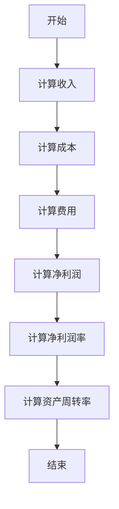
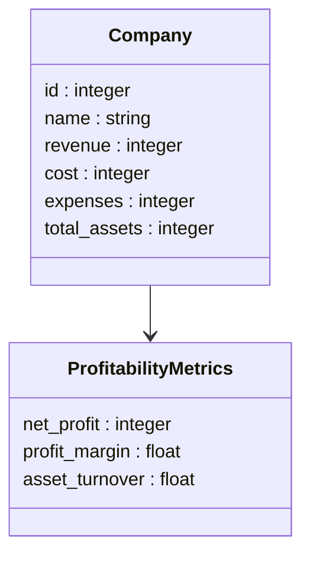
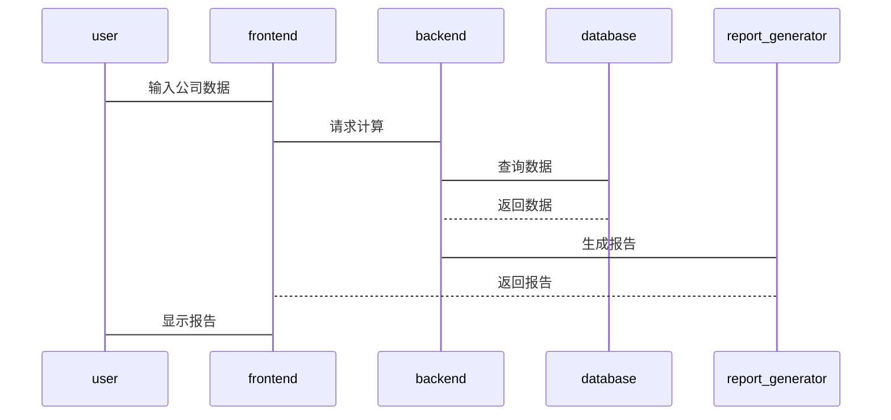

                 


# 彼得林奇对公司盈利质量的深度分析

## 关键词：
- 彼得·林奇
- 盈利质量
- 财务分析
- 投资策略
- 企业估值

## 摘要：
彼得·林奇是全球著名投资专家，以其对公司盈利质量的深度分析闻名。本文将从盈利质量的核心概念出发，结合林奇的分析方法，详细探讨盈利质量的衡量标准、影响因素及实际应用。通过案例分析和工具方法的介绍，帮助读者掌握盈利质量分析的精髓，从而做出更明智的投资决策。

---

# 第一章: 引言

## 1.1 彼得·林奇与盈利质量分析
### 1.1.1 彼得·林奇的背景介绍
彼得·林奇（Peter Lynch）是全球最著名的职业股票投资人之一，以其在富达投资管理公司的卓越表现而闻名。他强调对公司基本面的深入研究，尤其是盈利能力，是投资决策的核心。

### 1.1.2 林奇的投资理念与方法
林奇认为，投资成功的秘诀在于对公司盈利质量的深刻理解。他注重分析公司的财务报表，尤其是收入、利润和利润率等关键指标，以判断公司的盈利能力和成长潜力。

## 1.2 盈利质量分析的核心概念
### 1.2.1 盈利质量的定义与内涵
盈利质量是指公司在一定时期内实现的利润与收入的匹配程度，反映了公司盈利的可持续性和稳定性。

### 1.2.2 盈利质量分析的目的与意义
通过盈利质量分析，投资者可以评估公司的盈利能力是否健康，是否具备持续增长的潜力。

## 1.3 本书的结构与目标
### 1.3.1 本书的主要内容概述
本书将从盈利质量的定义、衡量标准、影响因素等方面展开，结合彼得·林奇的分析方法，深入探讨如何进行盈利质量分析。

### 1.3.2 目标读者与学习方法
目标读者包括投资者、企业管理人员及对财务分析感兴趣的专业人士。读者可以通过本书掌握盈利质量分析的方法，并在实际操作中加以应用。

---

# 第二章: 盈利质量分析的背景与问题背景

## 2.1 盈利质量分析的背景介绍
### 2.1.1 当前企业盈利质量的挑战
在经济波动和市场竞争加剧的背景下，企业盈利质量面临诸多挑战，如成本上升、收入下降等。

### 2.1.2 盈利质量分析的重要性
盈利能力是企业生存和发展的关键，也是投资者评估公司价值的重要指标。

## 2.2 盈利质量分析的核心问题
### 2.2.1 企业盈利质量的关键影响因素
收入增长、成本控制、资产周转率、利润率等都是影响盈利质量的重要因素。

### 2.2.2 盈利质量分析的边界与外延
盈利质量分析不仅关注财务指标，还包括对公司管理、行业环境等因素的综合考量。

## 2.3 盈利质量分析的核心要素
### 2.3.1 盈利质量的核心概念结构
盈利质量分析的核心要素包括收入、利润、利润率、资产周转率等。

### 2.3.2 核心要素的特征对比表格
下表对比了核心要素的特征：

| 要素     | 特征               |
|----------|--------------------|
| 收入     | 反映企业销售能力   |
| 利润     | 反映企业盈利能力   |
| 利润率   | 反映利润与收入的比例|
| 资产周转率| 反映资产使用效率   |

### 2.3.3 ER实体关系图架构的 Mermaid 流程图
```mermaid
erDiagram
    company {
        id : integer
        name : string
        revenue : integer
        profit : integer
        profit_margin : float
        asset_turnover : float
    }
    company --> companyFinancialMetrics
```

---

# 第三章: 盈利质量分析的核心概念与联系

## 3.1 核心概念的原理与应用
### 3.1.1 盈利质量的核心概念原理
盈利质量分析的核心在于通过财务指标评估公司的盈利能力，进而判断其投资价值。

### 3.1.2 核心概念的属性特征对比表格
下表对比了核心概念的属性特征：

| 指标         | 定义               | 计算公式                   | 示例               |
|--------------|--------------------|---------------------------|--------------------|
| 净利润       | 稀释后的净利润     | 净利润 = 收入 - 成本 - 费用 | 净利润 = 100万 - 60万 - 20万 = 20万 |
| 净利润率     | 净利润与收入的比值 | 净利润率 = 净利润 / 收入   | 净利润率 = 20万 / 100万 = 20% |
| 资产周转率   | 资产与收入的比值   | 资产周转率 = 收入 / 总资产 | 资产周转率 = 100万 / 500万 = 20% |

### 3.1.3 ER实体关系图架构的 Mermaid 流程图
```mermaid
erDiagram
    company [
        id : integer
        name : string
        revenue : integer
        profit : integer
        profit_margin : float
        asset_turnover : float
    ]
    company --> companyFinancialMetrics
```

## 3.2 核心概念之间的联系
### 3.2.1 核心概念之间的关系分析
收入、利润、利润率和资产周转率之间相互关联，共同构成盈利质量分析的完整体系。

### 3.2.2 核心概念的相互作用与影响
收入增长可以提升资产周转率，同时影响利润率；成本控制可以提高利润率，进而影响净利润。

## 3.3 核心概念的数学模型与公式
### 3.3.1 盈利质量分析的数学模型
$$ \text{净利润} = \text{收入} - \text{成本} - \text{费用} $$

### 3.3.2 相关公式与公式推导
$$ \text{净利润率} = \frac{\text{净利润}}{\text{收入}} $$
$$ \text{资产周转率} = \frac{\text{收入}}{\text{总资产}} $$

### 3.3.3 举例说明与实际应用
例如，某公司收入为100万，成本为60万，费用为20万，总资产为500万。计算其净利润、净利润率和资产周转率：
$$ \text{净利润} = 100万 - 60万 - 20万 = 20万 $$
$$ \text{净利润率} = \frac{20万}{100万} = 20\% $$
$$ \text{资产周转率} = \frac{100万}{500万} = 20\% $$

---

# 第四章: 盈利质量分析的算法原理讲解

## 4.1 算法原理的 Mermaid 流程图


## 4.2 算法原理的 Python 源代码
```python
def calculate_profitability(revenue, cost, expenses, total_assets):
    net_profit = revenue - cost - expenses
    profit_margin = net_profit / revenue
    asset_turnover = revenue / total_assets
    return net_profit, profit_margin, asset_turnover

# 示例
revenue = 1000000
cost = 600000
expenses = 200000
total_assets = 5000000

net_profit, profit_margin, asset_turnover = calculate_profitability(revenue, cost, expenses, total_assets)
print(f"净利润: {net_profit}")
print(f"净利润率: {profit_margin:.2f}%")
print(f"资产周转率: {asset_turnover:.2f}%")
```

---

# 第五章: 盈利质量分析的系统分析与架构设计方案

## 5.1 问题场景介绍
为了分析公司的盈利质量，我们需要构建一个系统，整合财务数据，计算关键指标，并生成分析报告。

## 5.2 项目介绍
本项目旨在开发一个盈利质量分析系统，帮助投资者快速评估公司的盈利能力。

## 5.3 系统功能设计
### 5.3.1 领域模型 Mermaid 类图


## 5.4 系统架构设计
### 5.4.1 系统架构 Mermaid 图


## 5.5 系统接口设计
### 5.5.1 系统接口设计
用户输入公司数据，系统计算并返回盈利质量指标。

## 5.6 系统交互 Mermaid 序列图


---

# 第六章: 盈利质量分析的项目实战

## 6.1 环境安装
需要安装Python和相关库（如Pandas、Matplotlib）。

## 6.2 系统核心实现源代码
```python
import pandas as pd
import matplotlib.pyplot as plt

def calculate_profitability(revenue, cost, expenses, total_assets):
    net_profit = revenue - cost - expenses
    profit_margin = net_profit / revenue
    asset_turnover = revenue / total_assets
    return net_profit, profit_margin, asset_turnover

def visualize_profitability(company_data):
    company_data.plot(kind='bar')
    plt.title('Profitability Analysis')
    plt.xlabel('Company')
    plt.ylabel('Value')
    plt.show()

# 示例数据
data = {
    '公司': ['A', 'B', 'C'],
    '收入': [1000000, 1200000, 900000],
    '成本': [600000, 700000, 500000],
    '费用': [200000, 250000, 150000],
    '总资产': [5000000, 6000000, 4500000]
}

df = pd.DataFrame(data)
df['净利润'] = df['收入'] - df['成本'] - df['费用']
df['净利润率'] = df['净利润'] / df['收入']
df['资产周转率'] = df['收入'] / df['总资产']

visualize_profitability(df[['净利润', '净利润率', '资产周转率']])
```

---

# 第七章: 盈利质量分析的总结与展望

## 7.1 本书的总结
通过本书的学习，读者可以掌握盈利质量分析的核心方法，并在实际投资中加以应用。

## 7.2 未来展望
随着大数据和人工智能的发展，盈利质量分析将更加智能化和精准化。

## 7.3 最佳实践 Tips
- 定期更新财务数据，保持分析的时效性。
- 结合行业趋势，全面评估公司的盈利质量。
- 多实践，通过实际案例巩固分析能力。

---

# 作者：AI天才研究院 & 禅与计算机程序设计艺术

通过本书，我们深入探讨了彼得·林奇对公司盈利质量的分析方法，结合实际案例和工具，帮助读者掌握盈利质量分析的核心技巧。希望本书能为投资者和企业管理者提供有价值的参考。

