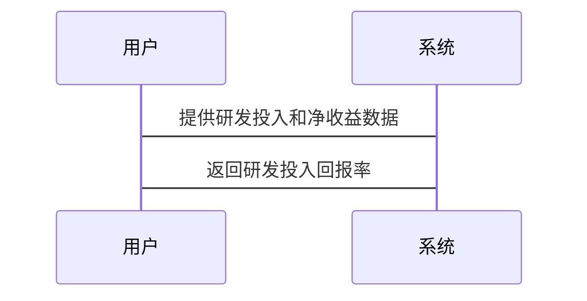

                 


# 彼得林奇对公司研发投入回报率的分析

> 关键词：彼得林奇，研发投入，回报率，算法原理，系统分析，项目实战

> 摘要：本文通过分析彼得·林奇对公司研发投入回报率的重视，探讨了研发投入回报率的定义、计算方法及其对企业价值的影响。结合实际案例和数学模型，详细讲解了如何利用彼得林奇的分析框架来评估和优化公司的研发投入策略，提供了系统化的解决方案和实战指导。

---

## 第1章：背景介绍

### 1.1 研发投入回报率的定义与重要性
研发投入回报率（Return on Research and Development，简称RORD）是衡量公司研发投入与所产生的经济收益之间关系的重要指标。它反映了企业在研发领域的投资效率，是评估公司技术创新能力和长期发展潜力的关键指标。

#### 1.1.1 研发投入的定义
研发投入是指公司在研发活动中投入的资金、时间和资源。主要包括以下几个方面：
- 研发人员的工资和福利
- 研发设备的购置和维护费用
- 研发项目的材料和试验费用
- 知识产权申请和维护费用

#### 1.1.2 研发投入回报率的定义
研发投入回报率是指公司在一定时期内，通过研发投入所获得的净收益与研发投入的比值。公式为：
$$\text{RORD} = \frac{\text{净收益}}{\text{研发投入}}$$

#### 1.1.3 研发投入回报率的重要性
- **反映投资效率**：高回报率意味着公司每投入一单位研发资金所获得的收益更高。
- **评估技术创新能力**：研发投入回报率是衡量公司技术创新能力的重要指标。
- **影响企业价值**：高研发投入回报率通常意味着公司具有更强的市场竞争力和盈利能力，从而提高企业价值。

### 1.2 彼得林奇的分析方法
彼得·林奇是美国著名投资经理人，以其独特的选股方法闻名。他特别关注公司的研发投入和回报率，认为这是衡量公司成长性和投资价值的重要指标。

#### 1.2.1 彼得林奇的分析框架
彼得林奇的分析框架主要关注以下几个方面：
- **研发投入的合理性**：公司是否在研发领域进行了合理的投资。
- **研发投入的回报率**：研发投入是否带来了相应的收益。
- **研发团队的能力**：研发团队的专业性和创新能力。

#### 1.2.2 彼得林奇对研发投入的重视
彼得林奇认为，研发投入是公司未来增长的核心驱动力。他倾向于投资那些在技术研发上有持续投入，并且能够将研发投入转化为实际收益的公司。

#### 1.2.3 彼得林奇分析方法的核心要素
- **关注研发投入的长期效应**：彼得林奇认为，研发投入的回报可能不是立竿见影，但长期来看，高质量的研发投入能够为公司带来持续的收益。
- **注重研发团队的稳定性**：稳定的研发团队是公司持续创新的基础。
- **关注研发投入的回报周期**：彼得林奇认为，过短的回报周期可能意味着公司缺乏技术创新，而过长的回报周期则可能意味着公司投入了过多资源而未能及时见效。

---

## 第2章：核心概念与联系

### 2.1 研发投入的类型与特征
研发投入可以分为以下几种类型：
- **基础研究**：旨在探索未知领域，推动科学技术的理论进步。
- **应用研究**：旨在解决实际问题，推动技术的实际应用。
- **产品开发**：旨在开发具体产品或改进现有产品。

#### 2.1.1 研发投入的主要类型
| 类型 | 描述 | 特点 |
|------|------|------|
| 基础研究 | 探索未知领域，推动理论进步 | 投入周期长，不确定性高 |
| 应用研究 | 解决实际问题，推动技术应用 | 投入周期较短，见效较快 |
| 产品开发 | 开发具体产品或改进现有产品 | 投入与产品生命周期紧密相关 |

#### 2.1.2 各类研发投入的特征对比
- **基础研究**：投入周期长，不确定性高，回报率难以预测。
- **应用研究**：投入周期较短，见效较快，回报率相对较高。
- **产品开发**：投入与产品生命周期密切相关，回报率取决于产品市场表现。

#### 2.1.3 研发投入与企业绩效的关系
研发投入与企业绩效之间存在正相关关系。高研发投入通常意味着公司具有更强的技术创新能力，从而能够获得更高的市场份额和利润率。

### 2.2 彼得林奇分析框架的ER实体关系图
```mermaid
er
  actor: 投资者
  company: 公司
  investment: 投资
  return: 回报
  relation( actor, investment, "进行" )
  relation( investment, company, "用于" )
  relation( company, return, "产生" )
```

---

## 第3章：算法原理讲解

### 3.1 研发投入回报率的计算方法
#### 3.1.1 计算公式
$$\text{RORD} = \frac{\text{净收益}}{\text{研发投入}}$$

#### 3.1.2 计算步骤
1. 确定公司在一定时期内的研发投入总额。
2. 计算公司在同一时期内的净收益。
3. 将净收益除以研发投入总额，得到研发投入回报率。

#### 3.1.3 案例分析
假设某公司在过去一年中的研发投入为1000万元，净收益为5000万元，则其研发投入回报率为：
$$\text{RORD} = \frac{5000}{1000} = 5$$

---

## 第4章：数学模型与实例分析

### 4.1 研发投入回报率的数学模型
#### 4.1.1 基本公式
$$\text{RORD} = \frac{\text{净收益}}{\text{研发投入}}$$

#### 4.1.2 模型构建
假设公司A和公司B在相同的时间内投入了相同的研发资金，但公司A的净收益为2000万元，公司B的净收益为1000万元，则公司A的研发投入回报率为2，公司B的研发投入回报率为1。

#### 4.1.3 实例分析
- **公司A**：研发投入为1000万元，净收益为2000万元，RORD为2。
- **公司B**：研发投入为1000万元，净收益为1000万元，RORD为1。

#### 4.1.4 模型优缺点
- **优点**：计算简单，易于理解和应用。
- **缺点**：未能考虑研发投入的时间周期和风险因素。

---

## 第5章：系统分析与架构设计

### 5.1 问题场景介绍
为了更好地分析公司的研发投入回报率，我们需要构建一个系统化的分析框架，包括数据收集、分析方法、指标体系和工具选择。

### 5.2 系统功能设计
#### 5.2.1 领域模型
```mermaid
classDiagram
    class 公司 {
        投入资金
        净收益
        研发投入回报率
    }
    class 研发团队 {
        研发人员数量
        研发效率
    }
    company -> 研发团队 : 雇佣
```

#### 5.2.2 系统架构设计


### 5.3 系统接口设计
- **输入接口**：接受公司的研发投入和净收益数据。
- **输出接口**：生成研发投入回报率的计算结果。

### 5.4 系统交互设计


---

## 第6章：项目实战

### 6.1 环境配置
- **工具选择**：使用Python进行数据分析，使用Jupyter Notebook进行可视化。
- **数据来源**：从公司财务报表中获取研发投入和净收益数据。

### 6.2 核心实现源代码
```python
import pandas as pd

# 读取数据
data = pd.read_csv('research.csv')

# 计算研发投入回报率
data['RORD'] = data['净收益'] / data['研发投入']

# 输出结果
print(data[['公司', '研发投入', '净收益', 'RORD']])
```

### 6.3 代码应用解读与分析
- **数据读取**：使用Pandas读取CSV文件中的数据。
- **计算RORD**：通过公式计算每家公司的研发投入回报率。
- **结果输出**：展示公司名称、研发投入、净收益和RORD。

### 6.4 实际案例分析
以某科技公司为例，假设其研发投入为2000万元，净收益为4000万元，则其RORD为2。

### 6.5 项目小结
通过Python代码实现研发投入回报率的计算，能够快速、准确地评估公司的研发效率和投资回报。

---

## 第7章：最佳实践与小结

### 7.1 最佳实践
- **定期评估**：建议企业定期评估研发投入回报率，及时调整研发策略。
- **关注周期**：考虑到研发投入的回报周期，企业应合理规划研发投入的时间和规模。
- **数据驱动**：利用数据分析工具和方法，提高研发投入回报率的计算和评估效率。

### 7.2 小结
彼得林奇对研发投入回报率的分析为我们提供了重要的启示。通过科学的计算方法和系统化的分析框架，我们可以更好地评估公司的研发效率和投资回报，从而做出更明智的投资决策。

---

## 作者：AI天才研究院/AI Genius Institute & 禅与计算机程序设计艺术 /Zen And The Art of Computer Programming

