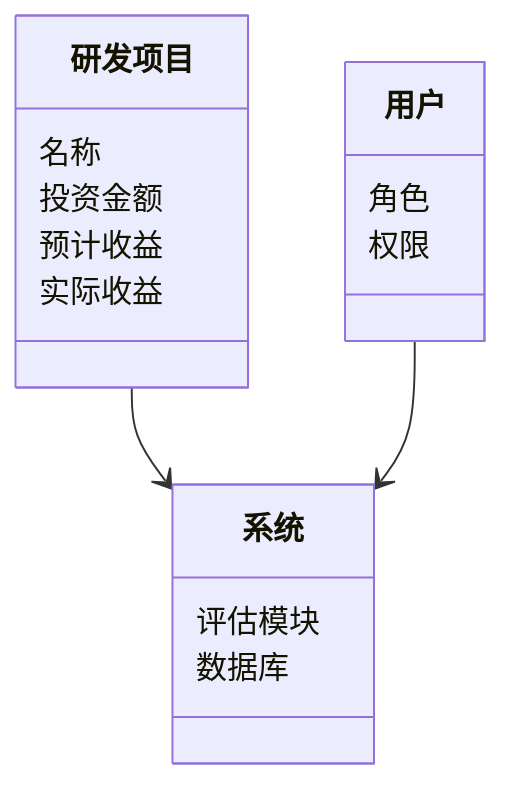
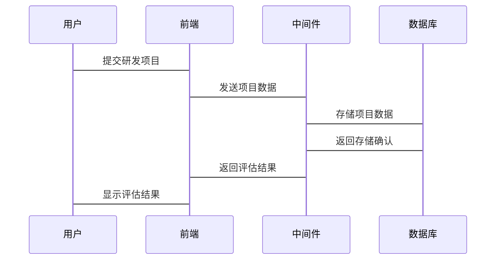

                 


# 彼得林奇对公司研发投入的评估方法

## 关键词
- 彼得林奇
- 研发投入评估
- 投资回报率
- 净现值
- 内部收益率

## 摘要
彼得林奇作为全球著名投资专家，提出了许多独特的公司研发投入评估方法。本文将从背景介绍、核心概念、评估模型、实战案例等方面，系统阐述彼得林奇的评估方法，并结合实际案例分析其应用。通过本文，读者可以全面了解如何从财务和市场角度评估公司研发投入的价值，从而做出更明智的投资决策。

---

## 第一部分: 彼得林奇对公司研发投入评估的核心思想

### 第1章: 研发投入评估的背景与重要性

#### 1.1 研发投入的基本概念
##### 1.1.1 研发投入的定义与范围
研发投入是指企业在研究与开发活动中投入的资金、资源和时间。这些投入主要用于开发新产品、改进现有产品或技术升级。研发投入的范围包括基础研究、应用研究和产品开发三个阶段。

##### 1.1.2 研发投入在企业中的地位与作用
研发投入是企业创新的核心驱动力。通过研发投入，企业可以提升技术水平、增强市场竞争力、创造新的利润增长点。在高科技行业，研发投入更是企业长期发展的基石。

##### 1.1.3 研发投入对股东价值的影响
研发投入直接影响企业的未来收益能力。通过合理的研发投入，企业可以实现更高的市场份额和利润率，从而提升股东价值。

---

#### 1.2 彼得林奇投资理念的核心要点
##### 1.2.1 彼得林奇的长期投资策略
彼得林奇以长期投资著称，他注重企业内在价值的评估。他认为，优秀的企业应该具备稳定的财务状况、强大的研发能力和持续的市场增长潜力。

##### 1.2.2 彼得林奇对研发投入的关注点
彼得林奇认为，企业的研发投入是衡量其发展潜力的重要指标。他关注研发投入的效率，即投入是否能够转化为实际的收益增长。

##### 1.2.3 研发投入评估与企业价值的关系
通过评估企业的研发投入，投资者可以更好地判断企业的未来盈利能力。高效的研发投入能够为企业带来竞争优势，从而提升企业价值。

---

### 第2章: 研发投入评估的目的与方法

#### 2.1 研发投入评估的基本目标
##### 2.1.1 评估研发投入的经济价值
通过评估研发投入的经济价值，投资者可以判断企业是否能够通过研发投入实现收益增长。

##### 2.1.2 识别高价值的研发项目
通过评估，投资者可以识别出那些具有高增长潜力的研发项目，从而做出更明智的投资决策。

##### 2.1.3 优化企业研发资源分配
通过评估，企业可以优化研发资源的分配，确保有限的资金投入到最具有回报的项目中。

---

#### 2.2 研发投入评估的主要方法
##### 2.2.1 财务指标法
通过分析企业的财务报表，评估研发投入的效率和效果。常用的财务指标包括研发投入占收入的比例、研发投入回报率等。

##### 2.2.2 市场价值法
通过分析企业的市场表现，评估研发投入的市场价值。例如，通过比较企业的市盈率、市净率等指标，判断研发投入对股价的影响。

##### 2.2.3 综合评估法
综合考虑企业的财务表现和市场表现，进行全面的评估。这种方法能够更全面地反映研发投入对企业价值的影响。

---

### 第3章: 彼得林奇研发投入评估的核心要素

#### 3.1 研发投入的财务表现
##### 3.1.1 研发支出的资本化与费用化
在财务报表中，研发支出可以分为资本化和费用化两类。资本化支出是指能够为企业未来带来经济利益的支出，而费用化支出则是当期直接计入损益的支出。

##### 3.1.2 研发投入与未来收益的关系
通过分析研发投入与未来收益的关系，可以评估研发投入的经济效益。例如，通过净现值（NPV）模型，计算研发投入的未来收益是否能够覆盖当前的投资。

##### 3.1.3 研发投入的周期性分析
研发投入具有周期性，通常与企业的经营周期和行业周期密切相关。通过周期性分析，可以更好地预测研发投入的效果。

---

#### 3.2 研发投入的市场表现
##### 3.2.1 研发成果的市场转化能力
企业的研发投入最终需要转化为市场价值。通过分析研发成果的市场转化能力，可以评估研发投入的实际效果。

##### 3.2.2 竞争对手的研发投入分析
通过分析竞争对手的研发投入，可以更好地判断行业竞争态势。如果竞争对手的研发投入较高，说明行业竞争激烈，企业的研发投入需要更具针对性。

##### 3.2.3 市场对研发投入的估值影响
市场对研发投入的估值影响直接体现在股价上。如果市场认为企业的研发投入具有较高的增长潜力，股价通常会相应上涨。

---

### 第4章: 彼得林奇研发投入评估的核心模型与工具

#### 4.1 研发投入评估的主要模型
##### 4.1.1 净现值（NPV）模型
净现值是指未来现金流的现值与初始投资的差额。通过NPV模型，可以评估研发投入的经济效益。

$$ NPV = \sum_{t=1}^{n} \frac{CF_t}{(1 + r)^t} - I $$

其中，$CF_t$ 是第$t$年的现金流，$r$是贴现率，$I$是初始投资。

##### 4.1.2 内部收益率（IRR）模型
内部收益率是指使净现值为零的贴现率。通过IRR模型，可以评估研发项目的回报率。

$$ IRR = r \text{ 满足 } NPV = 0 $$

##### 4.1.3 现值指数（PV Index）模型
现值指数是指未来现金流的现值与初始投资的比值。通过PV指数模型，可以评估研发项目的投资效率。

$$ PV \text{ Index} = \frac{\sum_{t=1}^{n} \frac{CF_t}{(1 + r)^t}}{I} $$

---

#### 4.2 研发投入评估的工具与方法
##### 4.2.1 财务指标分析工具
常用的财务指标包括研发投入占收入的比例、研发投入回报率、研发周期等。

##### 4.2.2 投资回报率（ROI）分析
通过计算研发投入的投资回报率，可以评估研发项目的经济效益。

$$ ROI = \frac{\text{净利润}}{\text{初始投资}} \times 100\% $$

##### 4.2.3 战略性研发评估框架
通过构建战略性研发评估框架，可以全面评估研发项目的战略价值和经济价值。

---

### 第5章: 彼得林奇研发投入评估的实战案例分析

#### 5.1 案例一：高科技企业的研发投入评估
##### 5.1.1 案例背景与分析目标
某高科技企业计划投入10亿元用于人工智能研发。我们需要评估这笔投入的经济效益和市场价值。

##### 5.1.2 评估方法与步骤
1. 计算净现值（NPV）：假设未来5年的现金流分别为2亿、3亿、4亿、5亿、6亿，贴现率为10%。
2. 计算内部收益率（IRR）。
3. 分析市场对研发投入的估值影响。

##### 5.1.3 评估结果与启示
通过计算，净现值为正，内部收益率超过行业平均水平，说明该项目具有较高的投资价值。

---

## 第二部分: 系统分析与架构设计方案

### 第6章: 系统分析与架构设计

#### 6.1 问题场景介绍
企业需要构建一个研发项目评估系统，用于评估多个研发项目的经济效益和市场价值。

#### 6.2 系统功能设计
##### 6.2.1 领域模型（Mermaid类图）


##### 6.2.2 系统架构设计（Mermaid架构图）


##### 6.2.3 系统接口设计和交互（Mermaid序列图）


---

## 第三部分: 项目实战

### 第7章: 项目实战

#### 7.1 环境安装
需要安装Python、数据库和相关开发工具。

#### 7.2 系统核心实现源代码
以下是Python代码示例：
```python
def calculate_npv(cash_flows, discount_rate):
    npv = sum(cf / (1 + discount_rate) ** t for t, cf in enumerate(cash_flows))
    return npv

def calculate_irr(cash_flows):
    from scipy finance import irr
    return irr(cash_flows)

cash_flows = [-100, 20, 30, 40, 50]
discount_rate = 0.1
print("NPV:", calculate_npv(cash_flows, discount_rate))
print("IRR:", calculate_irr(cash_flows))
```

#### 7.3 代码应用解读与分析
以上代码展示了如何计算净现值和内部收益率。通过输入现金流和贴现率，可以计算出研发项目的经济效益。

#### 7.4 实际案例分析和详细讲解剖析
以某高科技企业的案例为例，分析如何通过代码计算研发项目的NPV和IRR。

#### 7.5 项目小结
通过实战分析，读者可以掌握如何利用Python代码进行研发投入评估。

---

## 第四部分: 最佳实践、小结、注意事项和拓展阅读

### 第8章: 最佳实践与小结

#### 8.1 小结
通过本文的分析，读者可以全面了解彼得林奇的公司研发投入评估方法。从背景介绍到实战分析，再到系统设计，我们详细探讨了如何评估研发投入的价值。

#### 8.2 注意事项
在实际应用中，需要注意数据的准确性和模型的适用性。同时，要结合企业的实际情况，灵活调整评估方法。

#### 8.3 拓展阅读
建议读者进一步阅读彼得林奇的其他著作，深入理解他的投资理念。

---

## 作者信息

作者：AI天才研究院/AI Genius Institute & 禅与计算机程序设计艺术/Zen And The Art of Computer Programming

---

通过以上结构和内容，读者可以系统地学习彼得林奇的公司研发投入评估方法，并能够将其应用到实际投资和管理中。

