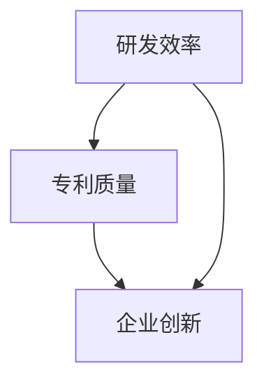
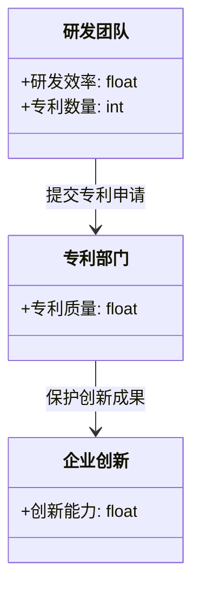

                 


# 彼得林奇对公司研发效率与专利质量关系的分析

## 关键词：研发效率、专利质量、彼得·林奇、企业创新、投资分析

## 摘要：本文从彼得·林奇的投资分析视角，探讨研发效率与专利质量之间的关系，分析两者如何共同影响企业的创新能力和市场竞争力。通过理论分析、数学建模和案例研究，提出平衡研发效率与专利质量的策略，为企业提供实践指导。

---

# 第一部分: 研发效率与专利质量的背景介绍

## 第1章: 研发效率的定义与衡量标准

### 1.1 研发效率的定义

#### 1.1.1 研发效率的核心概念

研发效率是指企业在一定时间内将资源转化为创新成果的能力，包括时间、成本和人力资源的优化利用。

#### 1.1.2 研发效率的衡量指标

- 研发周期：从创意到产品的平均时间
- 成本效率：单位产品或技术的研发成本
- 产出效率：单位时间内产生的专利数量或技术成果

#### 1.1.3 研发效率与企业竞争力的关系

研发效率高意味着企业能够更快地推出新产品，抢占市场，提升竞争力。

---

## 第2章: 专利质量的定义与评估标准

### 2.1 专利质量的定义

#### 2.1.1 专利质量的核心要素

- 技术创新性：专利是否具有首创性
- 实用性：专利是否能实际应用
- 稳定性：专利是否具备法律上的稳定性

#### 2.1.2 专利质量的评估维度

- 技术复杂度
- 市场影响力
- 法律保护力度

#### 2.1.3 专利质量与企业创新的关系

高质量的专利能够保护企业的创新成果，防止竞争对手模仿，增强市场地位。

---

## 第3章: 研发效率与专利质量的关系概述

### 3.1 研发效率与专利质量的相互作用

#### 3.1.1 研发效率对专利质量的影响

- 高效研发能够更快地将技术转化为高质量的专利
- 低效研发可能导致专利数量多但质量不高

#### 3.1.2 专利质量对研发效率的反作用

- 高质量专利需要更多的时间和资源投入，可能降低短期研发效率
- 通过高质量专利积累的技术优势，能够提升长期的研发效率

#### 3.1.3 两者关系的动态平衡

研发效率和专利质量之间存在权衡，企业需要根据自身战略选择合适的平衡点。

---

# 第二部分: 核心概念与联系

## 第4章: 研发效率与专利质量的核心概念

### 4.1 研发效率与专利质量的核心要素对比

| 属性 | 研发效率 | 专利质量 |
|------|----------|-----------|
| 核心目标 | 提升创新速度 | 保护创新成果 |
| 衡量标准 | 研发周期、成本 | 技术创新性、实用性 |

---

## 第5章: 研发效率与专利质量的关系分析

### 5.1 研发效率与专利质量的关系模型



---

# 第三部分: 算法原理讲解

## 第6章: 研发效率与专利质量的关系模型

### 6.1 数学模型

研发效率与专利质量的关系可以用以下公式表示：

$$ Q = aE + b $$

其中：
- $Q$ 表示专利质量
- $E$ 表示研发效率
- $a$ 表示研发效率对专利质量的影响系数
- $b$ 表示基础专利质量

---

## 第7章: 算法实现与案例分析

### 7.1 算法实现

```python
def calculate_quality(efficiency, a=0.8, b=0.2):
    return a * efficiency + b

# 示例
efficiency = 0.9
quality = calculate_quality(efficiency)
print(f"专利质量：{quality}")
```

---

## 第8章: 系统分析与架构设计方案

### 8.1 问题场景介绍

企业希望在提高研发效率的同时，确保专利质量，以实现可持续的创新。

### 8.2 系统功能设计



---

## 第9章: 项目实战

### 9.1 案例分析

以某科技公司为例，分析其研发效率与专利质量的关系，提出优化建议。

---

## 第10章: 总结与展望

### 10.1 总结

研发效率与专利质量是企业创新的双轮驱动，需要在效率与质量之间找到平衡点。

### 10.2 注意事项

- 避免只追求研发速度，忽视专利质量
- 定期评估研发效率与专利质量的平衡状态

### 10.3 拓展阅读

- 彼得·林奇的投资哲学
- 专利管理的最佳实践

---

作者：AI天才研究院 & 禅与计算机程序设计艺术

