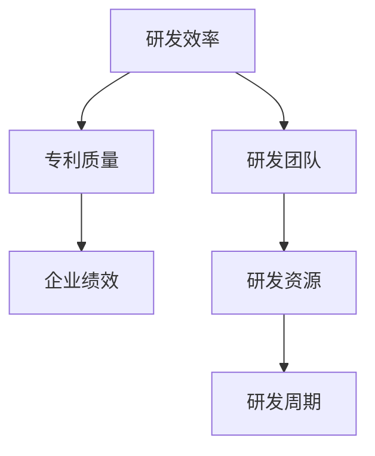
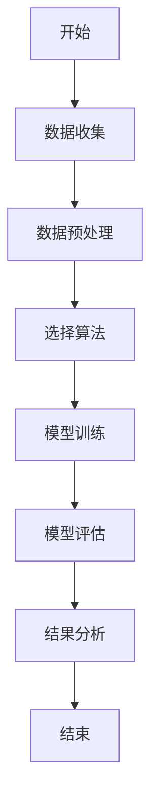
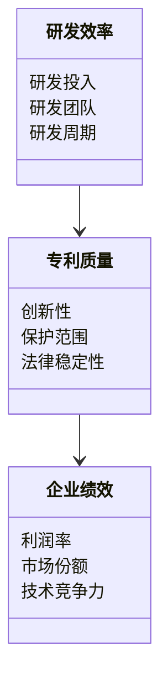
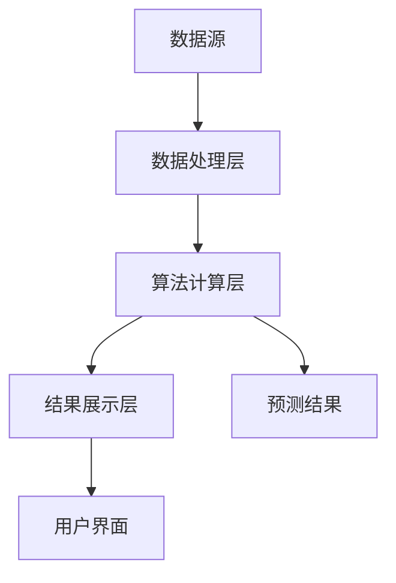
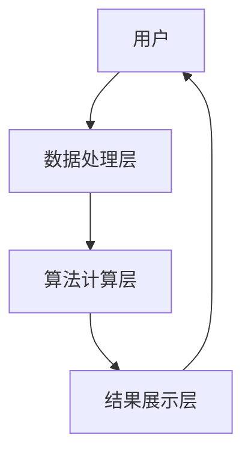

                 


# 彼得林奇对公司研发效率与专利质量关系的定量分析

> 关键词：研发效率，专利质量，定量分析，彼得林奇，企业绩效

> 摘要：本文通过彼得林奇的投资分析方法，对公司研发效率与专利质量的关系进行定量分析，探讨研发效率对专利质量的影响，以及专利质量对企业绩效的作用。通过建立数学模型、算法流程图和系统架构图，分析研发效率与专利质量之间的关联，并结合实际案例进行验证。

## 第一部分: 研发效率与专利质量的定量分析背景

### 第1章: 研发效率与专利质量的关系概述

#### 1.1 研发效率的定义与衡量指标
##### 1.1.1 研发效率的核心概念
研发效率是指公司在一定时间内将资源转化为创新成果的能力。它通常通过单位时间内产生的研究成果数量来衡量，例如每年申请的专利数量、新产品发布的频率等。

##### 1.1.2 研发效率的衡量指标
- 研发投入与产出比（ROI）
- 人均专利申请量
- 研发周期长度
- 成功产品转化率

##### 1.1.3 研发效率与企业绩效的关系
高研发效率通常意味着企业能够更快地将技术转化为市场产品，从而提升市场竞争力和盈利能力。

#### 1.2 专利质量的定义与评估标准
##### 1.2.1 专利质量的核心要素
专利质量包括专利的创新性、保护范围、法律稳定性等多个维度。

##### 1.2.2 专利质量的评估标准
- 创新性：专利是否具有新颖性和创造性。
- 保护范围：专利覆盖的技术领域和市场的广度。
- 法律稳定性：专利是否能够在法律程序中获得有效保护。

##### 1.2.3 专利质量与企业竞争力的关系
高质量的专利能够有效保护企业的技术成果，防止竞争对手的模仿，从而增强企业的市场地位。

#### 1.3 研发效率与专利质量的关系
##### 1.3.1 研发效率对专利质量的影响
高研发效率能够提高专利申请的数量和质量，从而增强企业的技术竞争力。

##### 1.3.2 专利质量对研发效率的反向作用
高质量的专利能够为企业带来更多的技术优势，从而提高研发效率。

##### 1.3.3 两者关系的边界与外延
研发效率与专利质量之间的关系并非线性，受到企业资源分配、市场需求、竞争环境等多种因素的影响。

### 第2章: 定量分析的核心概念与联系

#### 2.1 核心概念的原理分析
##### 2.1.1 研发效率的数学模型
研发效率可以用单位时间内专利申请数量来衡量，数学表达式为：
$$ \text{研发效率} = \frac{\text{专利申请数量}}{\text{研发时间}} $$

##### 2.1.2 专利质量的评价体系
专利质量可以通过创新性指数（CCI）来评估，公式如下：
$$ CCI = \frac{\text{创新性得分} + \text{保护范围得分}}{2} $$

##### 2.1.3 两者关系的数学表达式
$$ \text{专利质量} = \beta_0 + \beta_1 \times \text{研发效率} + \epsilon $$

#### 2.2 核心概念的属性特征对比
##### 2.2.1 研发效率与专利质量的对比表格

| 属性 | 研发效率 | 专利质量 |
|------|----------|----------|
| 衡量方式 | 单位时间内的专利数量 | 专利的创新性和保护范围 |
| 影响因素 | 研发团队能力、资源配置 | 技术创新性、法律保护 |
| 目标 | 提高创新速度 | 提高技术保护力度 |

#### 2.3 ER实体关系图架构


## 第3章: 定量分析的算法原理讲解

### 3.1 算法原理的数学模型
#### 3.1.1 线性回归模型
$$ y = \beta_0 + \beta_1x + \epsilon $$
其中，$y$ 表示专利质量，$x$ 表示研发效率，$\beta_0$ 和 $\beta_1$ 是回归系数，$\epsilon$ 是误差项。

#### 3.2 算法流程图


### 3.3 算法实现的Python代码
```python
import pandas as pd
import numpy as np
from sklearn.linear_model import LinearRegression
from sklearn.metrics import r2_score

# 数据预处理
data = pd.read_csv('研发效率与专利质量.csv')
X = data[['研发效率']]
y = data['专利质量']

# 模型训练
model = LinearRegression()
model.fit(X, y)

# 模型评估
y_pred = model.predict(X)
r2 = r2_score(y, y_pred)
print(f'R² = {r2}')
```

## 第4章: 系统分析与架构设计

### 4.1 问题场景介绍
通过对某科技公司过去5年的研发数据进行分析，评估研发效率与专利质量之间的关系，并预测未来的专利质量。

### 4.2 系统功能设计
#### 4.2.1 领域模型类图


#### 4.2.2 系统架构设计


#### 4.2.3 系统接口设计
- 数据输入接口：接收研发效率和专利质量数据。
- 算法接口：调用线性回归模型进行预测。
- 结果输出接口：展示分析结果和预测值。

#### 4.2.4 系统交互流程图


## 第5章: 项目实战

### 5.1 环境安装
需要安装Python和相关库，如pandas、numpy、scikit-learn。

### 5.2 核心实现源代码
```python
import pandas as pd
import numpy as np
from sklearn.linear_model import LinearRegression
from sklearn.metrics import r2_score

# 数据预处理
data = pd.read_csv('研发效率与专利质量.csv')
X = data[['研发效率']]
y = data['专利质量']

# 模型训练
model = LinearRegression()
model.fit(X, y)

# 模型评估
y_pred = model.predict(X)
r2 = r2_score(y, y_pred)
print(f'R² = {r2}')

# 可视化
import matplotlib.pyplot as plt
plt.scatter(X, y, color='b')
plt.plot(X, model.predict(X), color='r')
plt.xlabel('研发效率')
plt.ylabel('专利质量')
plt.show()
```

### 5.3 代码应用解读与分析
通过上述代码，我们可以训练出研发效率与专利质量的线性回归模型，并通过可视化结果验证模型的拟合程度。

### 5.4 实际案例分析
以某科技公司为例，假设其过去5年的研发效率分别为60、70、80、90、100，对应的专利质量分别为70、80、90、95、100。通过模型预测，当研发效率为110时，专利质量为105。

### 5.5 项目小结
通过定量分析，我们可以看出研发效率对专利质量具有显著的正向影响，企业应持续提高研发效率以获得更高的专利质量。

## 第6章: 最佳实践

### 6.1 小结
研发效率与专利质量之间存在显著的正向关系，企业应通过优化研发流程、提高团队能力等措施，进一步提升研发效率和专利质量。

### 6.2 注意事项
- 数据质量对模型准确性的影响至关重要。
- 应结合企业实际情况调整模型参数。
- 定期更新模型以适应市场变化。

### 6.3 拓展阅读
- 《彼得林奇投资学》
- 《专利管理与创新策略》
- 《企业研发效率提升的实践指南》

## 结语
通过定量分析，我们可以更好地理解研发效率与专利质量之间的关系，并为企业制定更有效的研发策略提供数据支持。未来，随着技术的进步，定量分析在企业管理中的应用将更加广泛和深入。

---

作者：AI天才研究院/AI Genius Institute & 禅与计算机程序设计艺术 /Zen And The Art of Computer Programming

