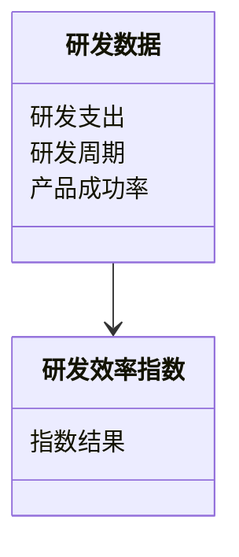

                 


# 彼得林奇对公司研发效率的评估方法

## 关键词：
- 彼得·林奇
- 研发效率
- 投资评估
- 算法原理
- 项目实战

## 摘要：
本文深入探讨了彼得·林奇的公司研发效率评估方法，从背景、核心概念到算法原理、系统架构，再到项目实战，全面解析如何应用这些方法提升企业研发效率。文章结合理论与实践，提供详细的数学模型和代码实现，帮助读者理解和应用林奇的评估体系。

---

## 第一部分：研发效率评估的重要性

### 第1章：研发效率评估的重要性

#### 1.1 研发效率与企业竞争力
- 研发效率是企业核心竞争力的关键因素。
- 林奇从投资者角度关注研发效率，认为高效率的企业更具投资价值。

#### 1.2 彼得·林奇的投资者视角
- 林奇作为投资专家，强调企业研发效率对长期增长的影响。
- 他通过评估研发效率来判断企业的投资潜力。

---

### 第2章：研发效率评估的核心指标

#### 2.1 研发支出与研发投入
- 研发支出占总收入比例的计算方法。
- 研发支出的周期性分析对企业评估的影响。

#### 2.2 研发周期与产品成功率
- 研发周期的定义和影响因素。
- 产品成功率与研发周期的正相关关系。

#### 2.3 研发团队效率
- 团队规模与效率的平衡点。
- 人均研发产出的计算方法。

---

### 第3章：彼得·林奇评估方法的核心要素

#### 3.1 林奇评估模型的构成
- 模型的输入变量包括研发支出、周期和团队效率。
- 输出结果是研发效率指数。

#### 3.2 模型的数学表达式
- 研发效率指数公式：$$研发效率指数 = \frac{研发产出}{研发投入}$$
- 研发产出公式：$$研发产出 = 产品成功率 \times 研发周期$$

#### 3.3 模型的对比分析
- 对比不同评估方法的优缺点。
- 林奇模型的独特之处在于结合了投入与产出。

---

## 第二部分：算法原理

### 第4章：彼得·林奇模型的算法原理

#### 4.1 算法概述
- 林奇模型通过收集研发数据，计算效率指数，分析结果。

#### 4.2 算法步骤
1. 收集研发支出、周期和团队效率数据。
2. 计算研发产出。
3. 计算研发效率指数。
4. 分析结果并给出评估。

#### 4.3 算法流程图
```mermaid
graph TD
    A[开始] -> B[收集数据]
    B -> C[计算研发产出]
    C -> D[计算效率指数]
    D -> E[分析结果]
    E -> F[结束]
```

---

### 第5章：数学模型与公式

#### 5.1 核心公式
- $$研发效率指数 = \frac{研发产出}{研发投入}$$
- $$研发产出 = 产品成功率 \times 研发周期$$

#### 5.2 公式推导
- 通过实际案例推导公式，展示计算过程。

#### 5.3 举例说明
- 假设公司A研发投入100万，产出200万，效率指数为2。

---

## 第三部分：系统分析与架构设计

### 第6章：系统分析

#### 6.1 问题场景
- 林奇模型如何应用于实际企业系统中？

#### 6.2 领域模型


---

### 第7章：系统架构设计

#### 7.1 架构图


#### 7.2 接口设计
- 数据输入接口和结果输出接口的设计。

---

## 第四部分：项目实战

### 第8章：项目实战

#### 8.1 环境安装
- 安装Python和必要的库。

#### 8.2 核心代码实现
```python
def calculate_research_efficiency(research_cost, product_success_rate, research_period):
    research_output = product_success_rate * research_period
    efficiency_index = research_output / research_cost
    return efficiency_index

# 示例
research_cost = 100
product_success_rate = 0.8
research_period = 12

result = calculate_research_efficiency(research_cost, product_success_rate, research_period)
print(f"研发效率指数为：{result}")
```

#### 8.3 案例分析
- 分析实际案例，展示计算过程和结果。

---

## 第五部分：总结与展望

### 第9章：总结与展望

#### 9.1 核心内容总结
- 林奇评估方法的关键点和实际应用价值。

#### 9.2 应用注意事项
- 数据准确性的重要性，模型的局限性。

#### 9.3 拓展阅读
- 推荐相关书籍和资源，进一步深入学习。

---

## 作者：AI天才研究院 & 禅与计算机程序设计艺术

