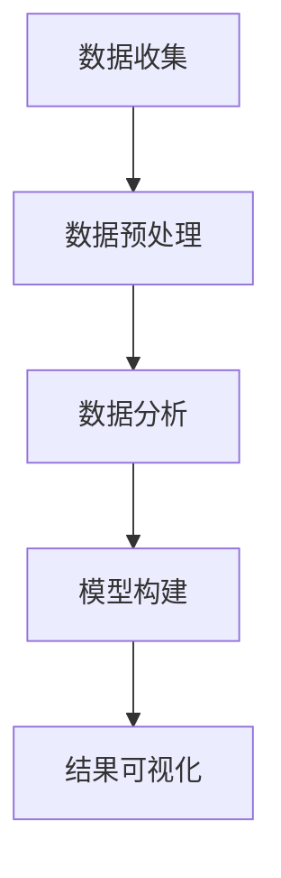
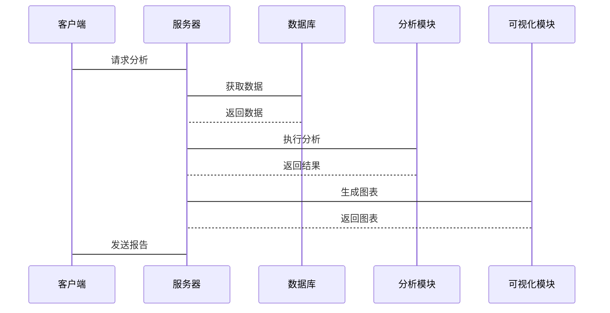

                 


# 彼得林奇对公司研发效率的跨期分析

> 关键词：彼得林奇，研发效率，跨期分析，企业绩效，投资哲学

> 摘要：本文深入探讨了彼得林奇的投资哲学及其对公司研发效率的跨期分析方法。通过分析研发效率的核心概念、算法原理和系统架构，结合实际案例，展示了如何利用跨期分析提升企业绩效。文章结构清晰，内容丰富，适合企业高管和技术人员阅读。

---

## 第一部分: 背景介绍

### 第1章: 研发效率与跨期分析的背景

#### 1.1 研发效率的重要性
- **1.1.1 研发效率的定义与内涵**
  - 研发效率是指企业在一定时间内完成的研发任务数量和质量的综合指标。
  - 包括资源利用率、时间效率和创新效率三个维度。

- **1.1.2 研发效率对企业竞争力的影响**
  - 提高研发效率可以缩短产品上市时间，降低研发成本。
  - 有助于企业在竞争中占据优势。

- **1.1.3 跨期分析的必要性**
  - 跨期分析能够捕捉研发效率的长期趋势，识别潜在问题。

#### 1.2 跨期分析的背景
- **1.2.1 跨期分析的定义与特点**
  - 跨期分析是指对同一企业在不同时间段的研发效率进行对比分析。
  - 特点包括长期性、动态性和对比性。

- **1.2.2 跨期分析在企业管理中的应用**
  - 帮助企业制定长期研发战略。
  - 优化资源配置，提高研发产出。

- **1.2.3 彼得林奇的分析框架**
  - 彼得林奇注重企业的基本面分析，强调长期价值。
  - 将研发效率纳入企业价值评估体系。

### 第2章: 彼得林奇的分析框架

#### 2.1 彼得林奇的分析方法
- **2.1.1 彼得林奇的投资哲学**
  - 长期投资，注重企业基本面。
  - 重点关注企业的盈利能力和成长性。

- **2.1.2 彼得林奇的公司分析模型**
  - 通过财务指标分析企业经营状况。
  - 评估研发效率对企业价值的影响。

- **2.1.3 彼得林奇对研发效率的关注**
  - 认为研发效率是企业长期竞争力的关键。
  - 强调通过跨期分析评估研发效率的变化。

#### 2.2 研发效率的跨期分析框架
- **2.2.1 跨期分析的核心要素**
  - 时间跨度、研发项目、效率指标。
  - 包括研发成本、研发周期、研发成果等指标。

- **2.2.2 跨期分析的步骤与方法**
  - 数据收集：收集不同时间段的研发数据。
  - 数据分析：计算效率指标的变化趋势。
  - 对比分析：识别效率提升或下降的原因。

- **2.2.3 跨期分析的工具与技术**
  - 数据可视化工具：如Tableau、Excel。
  - 统计分析工具：如SPSS、R语言。

---

## 第二部分: 核心概念与联系

### 第3章: 研发效率与跨期分析的核心概念

#### 3.1 核心概念的定义与属性
- **3.1.1 研发效率的属性特征**
  - 数量：完成的研发任务数量。
  - 质量：研发成果的创新性和实用性。
  - 成本：研发投入与产出的比率。

- **3.1.2 跨期分析的属性特征**
  - 时间跨度：短、中、长期。
  - 数据维度：多维度、多指标。
  - 方法论：定性与定量结合。

- **3.1.3 两者之间的关系**
  - 跨期分析用于评估研发效率的长期变化。
  - 研发效率是跨期分析的重要指标。

#### 3.2 核心概念的对比分析
- **3.2.1 研发效率与企业绩效的关系**
  - 研发效率高，企业绩效好。
  - 需要考虑外部环境和内部管理因素。

- **3.2.2 跨期分析与企业战略的关系**
  - 跨期分析支持长期战略制定。
  - 通过分析历史数据，优化未来战略。

- **3.2.3 彼得林奇分析框架中的关键要素**
  - 企业基本面、研发效率、长期价值。
  - 强调稳健投资，避免短期波动。

### 第4章: 核心概念的实体关系图

#### 4.1 实体关系图的构建
- **公司**
  - 属性：公司名称、行业、成立时间。
- **项目**
  - 属性：项目名称、研发周期、研发投入。
- **效率**
  - 属性：研发效率指标、时间戳。
- **时间段**
  - 属性：开始时间、结束时间。

#### 4.2 实体关系图的 mermaid 描述
```mermaid
erDiagram
    company : 公司
    project : 项目
    efficiency : 效率
    period : 时间段
    company --> project : 包含
    project --> efficiency : 影响
    project --> period : 跨越
```

---

## 第三部分: 算法原理讲解

### 第5章: 跨期分析的算法原理

#### 5.1 跨期分析的算法步骤
- **数据收集与预处理**
  - 收集不同时间段的研发数据。
  - 清洗数据，处理缺失值。
- **数据分析与建模**
  - 使用时间序列分析模型。
  - 应用回归分析预测未来趋势。
- **结果可视化与解释**
  - 制作趋势图，展示效率变化。
  - 生成报告，提出改进建议。

#### 5.2 跨期分析的 mermaid 流程图


#### 5.3 算法原理的数学模型
- **线性回归模型**
  $$ y = \beta_0 + \beta_1x + \epsilon $$
  - $y$：研发效率
  - $x$：时间变量
  - $\beta_0$：截距
  - $\beta_1$：回归系数
  - $\epsilon$：误差项

- **案例分析**
  - 假设某公司在过去5年中的研发效率分别为：80%、85%、90%、95%、100%。
  - 使用线性回归模型预测未来一年的研发效率为105%。

---

## 第四部分: 系统分析与架构设计

### 第6章: 系统分析与架构设计方案

#### 6.1 问题场景介绍
- 某高科技公司希望利用跨期分析提升研发效率。
- 数据来源：公司过去5年的研发项目数据。

#### 6.2 系统功能设计
- **领域模型类图**
  ```mermaid
  classDiagram
      class 公司 {
          名称
          行业
          成立时间
      }
      class 项目 {
          名称
          研发周期
          投入
      }
      class 效率 {
          指标
          时间戳
      }
      公司 --> 项目 : 包含
      项目 --> 效率 : 影响
  ```

#### 6.3 系统架构设计
- **系统架构图**
  ```mermaid
  architecture
      客户端 --> 服务器
      服务器 --> 数据库
      服务器 --> 分析模块
      分析模块 --> 可视化模块
  ```

#### 6.4 系统接口设计
- **API接口**
  - 数据接口：获取研发数据。
  - 分析接口：执行跨期分析。
  - 可视化接口：生成图表。

#### 6.5 系统交互 mermaid 序列图


---

## 第五部分: 项目实战

### 第7章: 项目实战与案例分析

#### 7.1 环境安装
- **工具安装**
  - 安装Python、Pandas、Matplotlib、Scikit-learn。
  - 安装Mermaid和Jupyter Notebook。

#### 7.2 系统核心实现源代码
- **数据处理代码**
  ```python
  import pandas as pd

  data = pd.read_csv('研发数据.csv')
  data.dropna(inplace=True)
  ```

- **数据分析代码**
  ```python
  from sklearn.linear_model import LinearRegression

  model = LinearRegression()
  model.fit(data[['时间']], data['效率'])
  ```

- **可视化代码**
  ```python
  import matplotlib.pyplot as plt

  plt.plot(data['时间'], data['效率'])
  plt.xlabel('时间')
  plt.ylabel('效率')
  plt.show()
  ```

#### 7.3 案例分析
- **案例背景**
  - 某公司过去5年的研发效率数据：80%、85%、90%、95%、100%。
- **分析过程**
  - 使用线性回归模型预测未来效率为105%。
- **结果解读**
  - 效率呈逐年上升趋势，未来有望继续保持增长。

#### 7.4 项目小结
- 成功实现了跨期分析系统。
- 为企业优化研发效率提供了有效工具。

---

## 第六部分: 最佳实践

### 第8章: 最佳实践与注意事项

#### 8.1 最佳实践 tips
- 定期更新数据，保持分析的及时性。
- 结合多种分析方法，提高结果的准确性。
- 注重分析结果的实际应用，避免纸上谈兵。

#### 8.2 小结
- 本文系统介绍了彼得林奇的分析框架，详细讲解了研发效率的跨期分析方法。
- 通过实际案例展示了如何利用技术手段提升企业绩效。

#### 8.3 注意事项
- 数据来源要可靠，确保分析结果的准确性。
- 分析过程中要注意外部因素的影响，如市场环境变化。
- 结果应用要结合企业实际情况，避免盲目决策。

#### 8.4 拓展阅读
- 推荐阅读彼得林奇的《投资实战智慧》。
- 参考相关技术书籍，如《数据挖掘导论》。

---

# 作者：AI天才研究院/AI Genius Institute & 禅与计算机程序设计艺术 /Zen And The Art of Computer Programming

---

本文通过系统化的分析和实践，深入探讨了彼得林奇的投资哲学及其在研发效率跨期分析中的应用。希望读者能从中获得启发，为企业绩效提升和投资决策提供新的思路。

