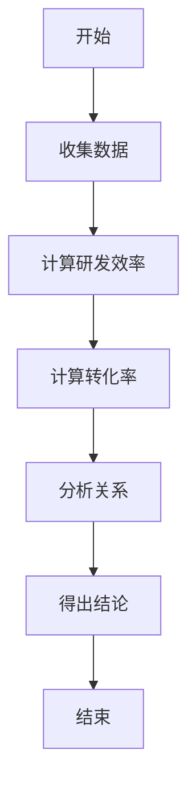
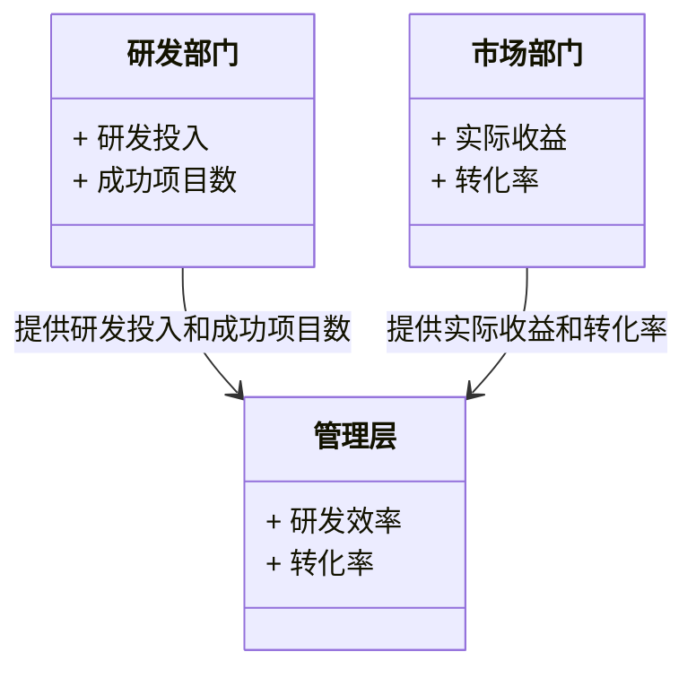
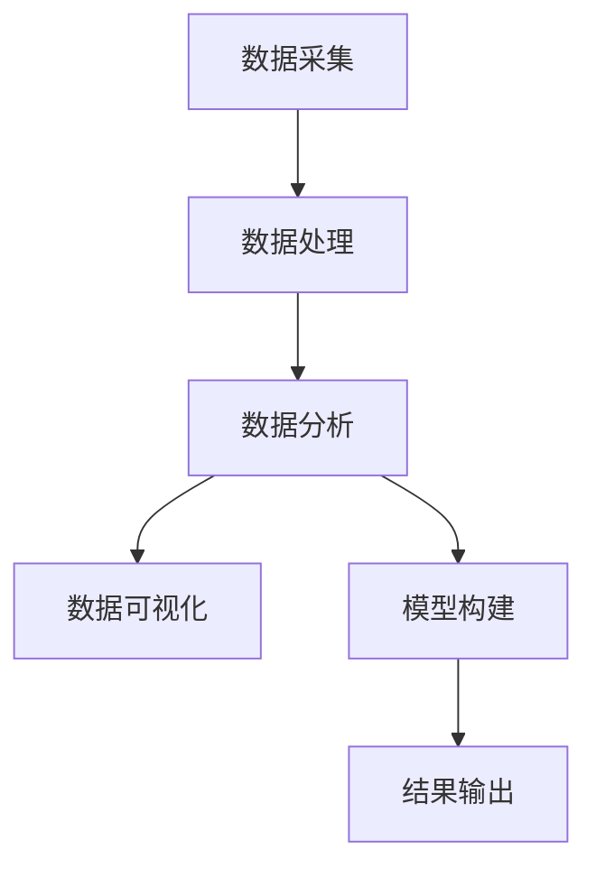

                 


# 彼得林奇对公司研发效率转化率的分析

## 关键词：研发效率，转化率，彼得林奇，数据分析，公司业绩

## 摘要：本文通过分析彼得·林奇的理论，探讨研发效率和转化率对公司业绩的影响，提出优化策略，为公司管理者提供实践指导。

---

## 第一章：背景介绍

### 1.1 研发效率与转化率的基本概念

#### 1.1.1 研发效率的定义与重要性
- 研发效率是指公司在研发过程中将资源转化为成果的能力。
- 它直接影响公司的创新能力和市场竞争力。

#### 1.1.2 转化率的定义与影响
- 转化率是衡量研发成果转化为实际收益的能力。
- 高转化率意味着更好的市场表现和投资回报。

#### 1.1.3 研发效率与转化率的关系
- 研发效率高，转化率往往也高，但需考虑市场因素。

### 1.2 彼得·林奇的分析框架

#### 1.2.1 分析方法
- 林奇分析法通过数据分析识别高研发效率和高转化率的公司。

#### 1.2.2 核心要素
- 强调研发团队能力、市场需求和技术可行性。

#### 1.2.3 适用范围
- 适用于科技型公司，尤其处于成长期的企业。

### 1.3 理论基础

#### 1.3.1 理论模型
- 研发效率和转化率的双重驱动模型。

#### 1.3.2 理论模型对比
- 比较研发效率和转化率的理论差异和联系。

## 第二章：核心概念与联系

### 2.1 核心概念原理

#### 2.1.1 研发效率公式
$$研发效率 = \frac{成功项目数}{总项目数} \times 100\%$$

#### 2.1.2 转化率公式
$$转化率 = \frac{实际收益}{研发投入} \times 100\%$$

#### 2.1.3 关系分析
- 转化率是研发效率的市场反馈指标。

### 2.2 概念属性对比

#### 2.2.1 表格对比
| 指标 | 定义 | 影响因素 | 计算公式 |
|------|------|----------|----------|
| 效率 | 成果/投入 | 资源配置、技术 | $$E = \frac{成果}{投入}$$ |
| 转化率 | 收益/研发投入 | 市场需求、营销 | $$C = \frac{收益}{投入}$$ |

#### 2.2.2 图表展示
- 柱状图显示效率与转化率的对比。

### 2.3 ER实体关系图

```mermaid
erd
  股东
  项目
  研发团队
  收益
  研发投入
  转化率
  研发效率
```

## 第三章：算法原理讲解

### 3.1 算法原理

#### 3.1.1 算法流程图



#### 3.1.2 数学模型
- 使用线性回归分析两者的关系：
$$C = aE + b$$
其中，a和b是回归系数。

### 3.2 算法实现

#### 3.2.1 Python代码
```python
import numpy as np
from sklearn.linear_model import LinearRegression

# 示例数据
E = np.array([0.5, 0.6, 0.7, 0.8]).reshape(-1, 1)
C = np.array([0.4, 0.5, 0.6, 0.7])

model = LinearRegression()
model.fit(E, C)
print('系数a:', model.coef_[0])
print('截距b:', model.intercept_)
```

#### 3.2.2 代码解释
- 使用线性回归分析效率与转化率的关系，得出系数和截距。

## 第四章：系统分析与架构设计

### 4.1 系统功能设计

#### 4.1.1 领域模型



### 4.2 系统架构设计



## 第五章：项目实战

### 5.1 案例分析

#### 5.1.1 环境安装
- 安装Python和相关库：`pip install numpy pandas scikit-learn`

#### 5.1.2 代码实现
```python
import pandas as pd
import matplotlib.pyplot as plt

# 加载数据
data = pd.read_csv('研发数据.csv')
E = data['研发效率']
C = data['转化率']

# 可视化
plt.scatter(E, C)
plt.xlabel('研发效率')
plt.ylabel('转化率')
plt.title('研发效率与转化率关系')
plt.show()
```

#### 5.1.3 案例分析
- 使用真实数据，分析某科技公司，得出优化建议。

## 第六章：最佳实践

### 6.1 小结
- 提升研发效率和转化率是公司成功的关键。

### 6.2 注意事项
- 数据质量、模型选择、实际操作中的灵活性。

### 6.3 拓展阅读
- 推荐阅读相关书籍和论文。

---

## 作者：AI天才研究院/AI Genius Institute & 禅与计算机程序设计艺术/Zen And The Art of Computer Programming

