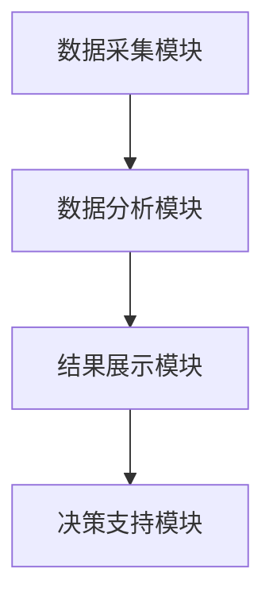
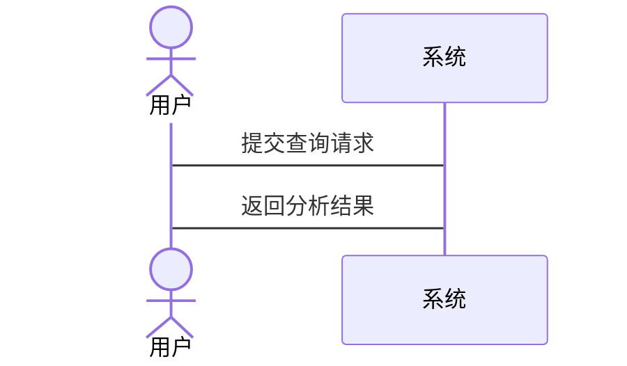

                 


# 彼得林奇对公司研发方向的前瞻性分析

## 关键词：彼得·林奇，研发方向，前瞻性分析，投资策略，技术趋势，市场需求，竞争环境

## 摘要：本文深入分析了彼得·林奇的投资理念及其对公司研发方向的前瞻性分析方法。通过探讨技术趋势、市场需求和竞争环境等核心要素，结合数据分析、市场调研和案例分析等方法，详细阐述了如何基于这些因素进行研发方向的评估和优化。文章还介绍了相关的算法原理和系统架构设计，并通过实际案例展示了如何将这些方法应用于投资决策中。最终，本文总结了前瞻性分析的重要性，并提出了未来研究的方向。

---

# 第1章: 彼得·林奇投资理念与研发方向分析基础

## 1.1 彼得·林奇的投资者背景

### 1.1.1 彼得·林奇的生平简介

彼得·林奇（Peter Lynch）是美国著名投资经理人，被誉为“最伟大的基金经理”之一。他在富达投资管理公司（Fidelity Management）管理麦哲伦基金（Magellan Fund）期间，取得了卓越的投资业绩。林奇的投资理念以“逆向思考”和“深入研究”著称，他注重从公司基本面出发，分析企业的研发方向和市场潜力。

### 1.1.2 林奇的投资哲学与方法

林奇的投资哲学强调长期持有优质股票，关注企业的内在价值和成长潜力。他认为，投资者应该深入研究企业的研发方向，了解其技术创新能力和市场适应能力。林奇的分析方法包括对企业财务状况、管理团队和行业趋势的全面评估。

### 1.1.3 林奇对投资市场的独特见解

林奇认为，市场波动性和短期趋势不应影响长期投资决策。他更关注企业的基本面，尤其是研发方向的前瞻性和可行性。林奇强调，企业研发方向的正确选择是其长期增长的关键。

---

## 1.2 研发方向分析的核心概念

### 1.2.1 研发方向的定义与分类

研发方向是指企业在未来一段时间内计划投入资源进行技术研发的方向和领域。它可以分为技术驱动型、市场驱动型和战略驱动型三种类型。

### 1.2.2 研发方向分析的必要性

研发方向分析是企业制定战略规划的重要组成部分。通过分析研发方向，企业可以更好地把握市场趋势，优化资源配置，提升核心竞争力。

### 1.2.3 研发方向与企业价值的关系

研发方向直接影响企业的技术创新能力和市场适应能力。成功的研发方向能够为企业创造新的增长点，提升企业价值。

---

## 1.3 彼得·林奇分析研发方向的背景

### 1.3.1 美国投资市场的演变

20世纪80年代，美国投资市场经历了技术革命和产业结构调整。林奇在此背景下，逐步形成了对研发方向的关注。

### 1.3.2 研发在企业中的战略地位

研发是企业创新的核心驱动力。林奇认为，研发方向的正确选择是企业长期增长的关键。

### 1.3.3 林奇对研发方向的关注点

林奇关注企业的研发能力、技术储备和市场前景。他认为，企业研发方向的前瞻性和可行性是其投资决策的重要依据。

---

## 1.4 本章小结

本章介绍了彼得·林奇的投资理念及其对研发方向分析的背景。林奇的投资哲学强调长期持有优质股票，关注企业的研发方向和市场潜力。研发方向的正确选择是企业长期增长的关键，也是林奇投资决策的重要依据。

---

# 第2章: 研发方向分析的核心要素

## 2.1 技术趋势分析

### 2.1.1 行业技术发展现状

技术趋势分析是研发方向分析的重要组成部分。通过分析行业技术发展现状，可以识别潜在的技术机会和挑战。

### 2.1.2 未来技术趋势预测

未来技术趋势预测是研发方向分析的关键。林奇认为，企业应关注技术趋势的变化，及时调整研发方向。

### 2.1.3 技术趋势对企业研发的影响

技术趋势的变化直接影响企业的研发方向。企业应根据技术趋势的变化，优化研发资源的配置。

---

## 2.2 市场需求分析

### 2.2.1 市场需求的定义与分类

市场需求是指消费者对某种产品或服务的需求量。市场需求分析是研发方向分析的重要组成部分。

### 2.2.2 市场需求对企业研发的指导作用

市场需求分析能够为企业研发方向的制定提供重要依据。企业应根据市场需求的变化，调整研发方向。

### 2.2.3 市场需求变化的预测方法

市场需求变化的预测方法包括市场调研、数据分析和趋势分析等。企业应综合运用多种方法，准确预测市场需求的变化。

---

## 2.3 竞争环境分析

### 2.3.1 竞争对手的研发动态

竞争对手的研发动态是研发方向分析的重要参考。企业应关注竞争对手的研发方向和技术创新。

### 2.3.2 竞争环境对企业研发的影响

竞争环境的变化直接影响企业的研发方向。企业应根据竞争环境的变化，优化研发策略。

### 2.3.3 如何利用竞争环境优化研发方向

企业可以通过分析竞争环境，识别市场空白点，制定差异化的研发方向。

---

## 2.4 核心概念对比分析

### 2.4.1 技术趋势与市场需求的对比

技术趋势和市场需求是研发方向分析的两大核心要素。技术趋势决定了研发的方向，市场需求决定了研发的可行性。

### 2.4.2 市场需求与竞争环境的联系

市场需求和竞争环境密切相关。企业应根据市场需求和竞争环境的变化，调整研发方向。

### 2.4.3 技术趋势与竞争环境的相互作用

技术趋势和竞争环境相互作用，共同影响企业的研发方向。企业应综合考虑技术趋势和竞争环境的变化，制定科学的研发方向。

---

## 2.5 本章小结

本章分析了研发方向分析的核心要素，包括技术趋势、市场需求和竞争环境。技术趋势决定了研发的方向，市场需求决定了研发的可行性，竞争环境决定了研发的策略。企业应综合考虑这些因素，制定科学的研发方向。

---

# 第3章: 研发方向的前瞻性分析方法

## 3.1 数据分析方法

### 3.1.1 数据收集与整理

数据分析的第一步是数据的收集与整理。企业可以通过市场调研、行业报告和竞争对手分析等多种途径收集数据。

### 3.1.2 数据分析工具的选择

数据分析工具的选择取决于数据类型和分析目标。常用的数据分析工具包括Excel、SPSS和Python等。

### 3.1.3 数据分析结果的解读

数据分析结果的解读是关键。企业应根据数据分析结果，识别潜在的研发机会和风险。

---

## 3.2 市场调研方法

### 3.2.1 市场调研的定义与目的

市场调研是指通过收集和分析市场信息，了解市场需求和竞争环境的过程。其目的是为企业研发方向的制定提供依据。

### 3.2.2 市场调研的具体步骤

市场调研的具体步骤包括确定调研目标、设计调研方案、收集数据、分析数据和撰写调研报告。

### 3.2.3 市场调研结果的应用

市场调研结果的应用是关键。企业应根据调研结果，调整研发方向和资源分配。

---

## 3.3 案例分析方法

### 3.3.1 案例分析的定义与作用

案例分析是指通过分析实际案例，总结经验教训，为企业研发方向的制定提供参考。

### 3.3.2 案例分析的具体步骤

案例分析的具体步骤包括选择案例、收集案例资料、分析案例和总结案例。

### 3.3.3 案例分析结果的总结与应用

案例分析结果的总结与应用是关键。企业应根据案例分析结果，制定科学的研发方向。

---

## 3.4 本章小结

本章介绍了研发方向的前瞻性分析方法，包括数据分析、市场调研和案例分析。企业应综合运用这些方法，制定科学的研发方向。

---

# 第4章: 研发方向分析的关键算法与数学模型

## 4.1 数据分析算法

### 4.1.1 回归分析

回归分析是一种统计方法，用于分析变量之间的关系。它可以帮助企业预测未来的技术趋势和市场需求。

### 4.1.2 时间序列分析

时间序列分析是一种分析数据随时间变化的方法。它可以帮助企业预测未来的技术趋势和市场需求。

### 4.1.3 聚类分析

聚类分析是一种数据挖掘技术，用于将数据分成若干组。它可以帮助企业识别市场空白点和潜在的研发机会。

---

## 4.2 数学模型与公式

### 4.2.1 线性回归模型

线性回归模型是一种常用的统计模型，用于预测变量之间的关系。其公式为：

$$ y = \beta_0 + \beta_1 x + \epsilon $$

其中，y是因变量，x是自变量，$\beta_0$和$\beta_1$是回归系数，$\epsilon$是误差项。

### 4.2.2 时间序列预测模型

时间序列预测模型是一种常用的预测方法，用于预测未来的技术趋势。其公式为：

$$ y_t = \alpha + \beta y_{t-1} + \gamma x_t + \epsilon_t $$

其中，$y_t$是t时刻的预测值，$y_{t-1}$是t-1时刻的值，$x_t$是t时刻的外生变量，$\alpha$、$\beta$和$\gamma$是模型参数，$\epsilon_t$是误差项。

---

## 4.3 本章小结

本章介绍了研发方向分析的关键算法与数学模型，包括回归分析、时间序列分析和聚类分析。企业可以利用这些算法和模型，预测未来的技术趋势和市场需求，制定科学的研发方向。

---

# 第5章: 系统架构设计与实现

## 5.1 系统功能设计

### 5.1.1 系统功能模块划分

系统功能模块包括数据采集、数据分析、结果展示和决策支持。

### 5.1.2 系统功能流程

系统功能流程包括数据采集、数据分析、结果展示和决策支持。

---

## 5.2 系统架构设计

### 5.2.1 系统架构图

系统架构图展示了系统的整体结构和模块之间的关系。



### 5.2.2 系统接口设计

系统接口设计包括数据采集接口、数据分析接口和结果展示接口。

### 5.2.3 系统交互设计

系统交互设计展示了用户与系统之间的交互流程。



---

## 5.3 本章小结

本章介绍了系统架构设计与实现，包括系统功能设计、系统架构设计和系统交互设计。企业可以通过系统实现研发方向的分析与优化。

---

# 第6章: 项目实战与案例分析

## 6.1 环境安装与配置

### 6.1.1 数据分析工具的安装

安装Python、Pandas、Matplotlib和Scikit-learn等数据分析工具。

### 6.1.2 系统环境的配置

配置Python环境和相关库的版本。

---

## 6.2 核心代码实现

### 6.2.1 数据采集代码

数据采集代码用于从互联网获取数据。

```python
import requests
import pandas as pd

url = "https://example.com/data"
response = requests.get(url)
data = response.json()
df = pd.DataFrame(data)
```

### 6.2.2 数据分析代码

数据分析代码用于对数据进行处理和分析。

```python
from sklearn.linear_model import LinearRegression

model = LinearRegression()
model.fit(X_train, y_train)
y_pred = model.predict(X_test)
```

---

## 6.3 案例分析与结果解读

### 6.3.1 案例分析步骤

案例分析步骤包括数据采集、数据分析和结果解读。

### 6.3.2 分析结果的解读

分析结果的解读是关键。企业应根据分析结果，制定科学的研发方向。

---

## 6.4 项目总结

本章通过项目实战，展示了如何利用数据分析工具和技术，进行研发方向的分析与优化。企业可以通过类似的方法，制定科学的研发方向。

---

# 第7章: 总结与展望

## 7.1 全文总结

本文深入分析了彼得·林奇的投资理念及其对研发方向的前瞻性分析方法。通过技术趋势、市场需求和竞争环境等核心要素的分析，结合数据分析、市场调研和案例分析等方法，帮助企业制定科学的研发方向。

## 7.2 未来研究方向

未来的研究方向包括更复杂的算法、更多的数据源和更精确的预测模型。企业可以通过不断优化分析方法，提高研发方向的前瞻性。

## 7.3 注意事项

企业在进行研发方向分析时，应注重数据的准确性和分析方法的科学性。同时，应结合企业的实际情况，制定切实可行的研发方向。

## 7.4 拓展阅读

拓展阅读包括《彼得·林奇的投资哲学》、《技术分析实战》和《市场需求预测方法》等书籍。

---

# 作者

作者：AI天才研究院/AI Genius Institute & 禅与计算机程序设计艺术 /Zen And The Art of Computer Programming

