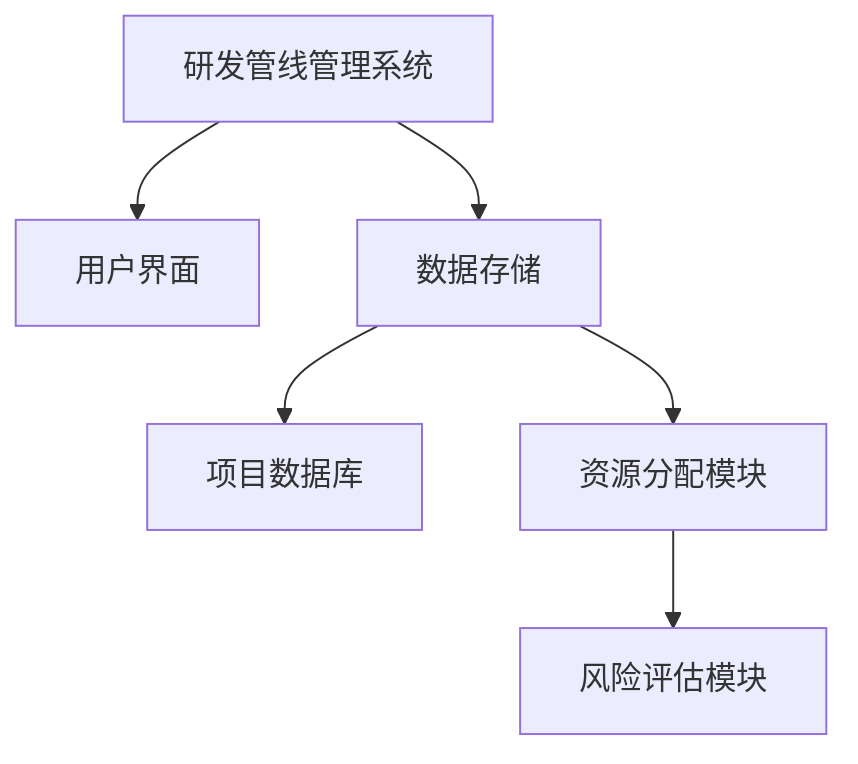

                 


# 彼得林奇对公司研发管线质量的评估

---

## 关键词：
研发管线质量、彼得林奇、投资模型、技术创新、企业价值、风险管理

---

## 摘要：
本文深入探讨了彼得林奇对公司研发管线质量的评估方法，从其投资哲学出发，分析了研发管线质量评估的核心概念、数学模型、系统架构及实战案例。通过详细阐述彼得林奇的评估流程与方法，本文为投资者和企业管理者提供了科学的评估框架，以实现企业价值的最大化。

---

## 第一部分: 彼得林奇对公司研发管线质量的评估概述

## 第1章: 研发管线质量评估的背景与重要性

### 1.1 研发管线质量评估的核心概念

#### 1.1.1 研发管线的定义与组成
研发管线是企业在研发过程中的项目集合，包括从早期概念到商业化产品的各个阶段。每个项目在研发管线中都有其独特的生命周期和价值特征。

#### 1.1.2 研发管线质量评估的必要性
研发管线质量评估是企业战略决策的重要依据，直接关系到企业的技术创新能力和市场竞争力。高质量的研发管线能够确保企业在竞争激烈的市场中保持优势。

#### 1.1.3 彼得林奇的评估方法简介
彼得林奇通过多年的投资经验，总结出了一套独特的研发管线质量评估方法，强调对研发团队能力、技术创新和资源分配的综合评估。

### 1.2 彼得林奇的背景与投资哲学

#### 1.2.1 彼得林奇的个人经历与成就
彼得林奇是美国著名投资经理人，以其在富达投资的辉煌业绩闻名。他的投资哲学强调长期价值和深度研究，尤其关注企业的基本面和管理层能力。

#### 1.2.2 彼得林奇的投资哲学与风格
彼得林奇注重企业的基本面分析，强调对管理层能力和研发能力的深入评估。他认为，高质量的研发管线是企业持续增长的关键。

#### 1.2.3 彼得林奇对研发管线的重视
彼得林奇认为，研发管线是企业的核心资产之一。通过评估研发管线的质量，投资者可以更准确地判断企业的未来潜力。

---

## 第2章: 研发管线质量评估的核心概念与模型

### 2.1 研发管线质量评估的定义与维度

#### 2.1.1 研发管线质量的定义
研发管线质量是指企业在研发过程中的项目集合的整体价值和潜力。它包括项目的创新性、可行性、盈利能力和市场竞争力等多个维度。

#### 2.1.2 研发管线质量的评估维度
- **项目阶段**：项目的当前阶段（如概念阶段、开发阶段、商业化阶段）。
- **技术创新**：项目的创新程度和核心技术的竞争力。
- **研发团队能力**：团队的经验、能力和稳定性。
- **资源分配**：企业的研发预算和资源分配的合理性。
- **市场潜力**：项目的市场前景和潜在收益。

#### 2.1.3 研发管线质量与企业价值的关系
研发管线质量直接影响企业的技术创新能力和市场竞争力，进而影响企业的长期价值。

### 2.2 彼得林奇评估模型的核心要素

#### 2.2.1 产品生命周期与研发阶段
彼得林奇强调对产品生命周期的分析，认为不同阶段的项目在研发管线中的价值和风险各不相同。

#### 2.2.2 研发团队的能力与经验
彼得林奇认为，研发团队的能力和经验是决定项目成功的关键因素。他特别关注团队的稳定性和技术专长。

#### 2.2.3 研发投入与资源分配
彼得林奇强调合理分配研发资源，确保关键项目获得足够的支持。他建议企业根据项目的潜力和风险进行差异化投资。

#### 2.2.4 技术创新与市场竞争
彼得林奇注重项目的创新性和市场竞争力，认为只有具备独特技术优势的项目才能在激烈的市场竞争中脱颖而出。

---

## 第3章: 研发管线质量评估的流程与方法

### 3.1 评估流程的步骤与框架

#### 3.1.1 确定评估目标与范围
明确评估的目标和范围，确定需要评估的项目和阶段。

#### 3.1.2 收集数据与信息
收集研发管线中的各项数据，包括项目进度、研发投入、团队能力等。

#### 3.1.3 分析与评估
对收集的数据进行分析，评估每个项目的质量和潜在价值。

#### 3.1.4 优化与改进
根据评估结果，优化研发资源分配，调整项目优先级。

### 3.2 彼得林奇评估方法的具体步骤

#### 3.2.1 研发管线的初步筛选
根据项目的基本信息和初步评估结果，筛选出具有潜力的项目。

#### 3.2.2 关键指标的量化评估
使用数学模型对项目的创新性、可行性和市场潜力进行量化评估。

#### 3.2.3 风险与机会的平衡
分析项目的风险和机会，确保在评估中充分考虑这些因素。

#### 3.2.4 评估结果的应用
将评估结果应用于企业的战略决策，优化研发管线的管理。

---

## 第4章: 研发管线质量评估的数学模型与公式

### 4.1 评估模型的数学基础

#### 4.1.1 研发管线质量指数的计算公式
$$ Q = \frac{\sum_{i=1}^{n} w_i \cdot S_i}{\sum_{i=1}^{n} w_i} $$
其中，\( Q \) 表示研发管线质量指数，\( w_i \) 表示第 \( i \) 个评估维度的权重，\( S_i \) 表示第 \( i \) 个维度的评分。

#### 4.1.2 权重分配的依据与方法
权重分配应根据项目的实际情况进行调整，确保每个维度的重要性得到充分体现。

### 4.2 评估模型的权重分配

#### 4.2.1 权重分配的依据
权重分配应基于项目的创新性、可行性和市场潜力等因素。

#### 4.2.2 常用权重分配公式
$$ w_i = \frac{1}{N} \cdot \sum_{j=1}^{N} f_j(i) $$
其中，\( f_j(i) \) 表示第 \( j \) 个专家对第 \( i \) 个维度的评分。

---

## 第5章: 研发管线质量评估的系统分析与架构设计

### 5.1 系统功能设计

#### 5.1.1 研发管线管理系统
一个研发管线管理系统需要具备项目管理、资源分配和风险评估等功能。

### 5.2 系统架构设计

#### 5.2.1 系统架构图
以下是研发管线管理系统的架构图：



### 5.3 系统接口设计

#### 5.3.1 系统接口
系统需要提供标准接口，支持与其他系统的集成，如企业资源计划（ERP）系统。

### 5.4 系统交互设计

#### 5.4.1 交互流程
用户通过界面输入项目信息，系统进行评估并生成报告。

---

## 第6章: 研发管线质量评估的项目实战

### 6.1 项目环境安装

#### 6.1.1 系统要求
安装Python 3.8及以上版本，安装相关依赖库（如Pandas、NumPy）。

### 6.2 核心代码实现

#### 6.2.1 评估函数
```python
def calculate_quality_index(projects):
    weights = [0.4, 0.3, 0.2, 0.1]
    dimensions = ['innovation', 'feasibility', 'market_potential', 'risk']
    quality_index = {}
    for project in projects:
        scores = {}
        for i in range(len(dimensions)):
            scores[dimensions[i]] = project[i]
        weighted_sum = sum(weights[i] * scores[dimensions[i]] for i in range(len(weights)))
        total_weight = sum(weights)
        qi = weighted_sum / total_weight
        quality_index[project['name']] = qi
    return quality_index
```

#### 6.2.2 应用解读
通过上述代码，我们可以对每个项目进行质量指数计算，评估其潜在价值和风险。

### 6.3 实际案例分析

#### 6.3.1 案例分析
以某科技公司为例，评估其研发管线中的两个项目，计算其质量指数，得出最优投资方案。

---

## 第7章: 研发管线质量评估的最佳实践与小结

### 7.1 最佳实践

#### 7.1.1 定期评估
定期对研发管线进行评估，确保及时发现和解决问题。

#### 7.1.2 数据驱动决策
利用数据分析工具和数学模型，提高评估的准确性和科学性。

#### 7.1.3 团队协作
加强团队协作，确保评估过程中的信息共享和资源整合。

### 7.2 小结

研发管线质量评估是企业战略管理的重要组成部分。通过彼得林奇的评估方法，企业可以更好地优化研发资源，提升技术创新能力，实现可持续发展。

---

## 作者：AI天才研究院/AI Genius Institute & 禅与计算机程序设计艺术 /Zen And The Art of Computer Programming

---

以上是关于《彼得林奇对公司研发管线质量的评估》的完整目录和内容概述。如需进一步扩展或补充，请随时告知！

