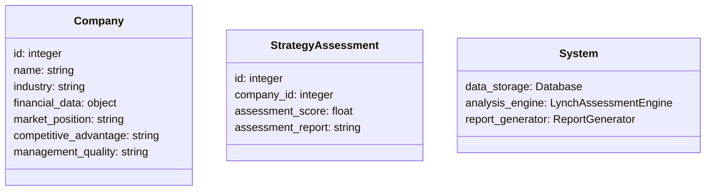
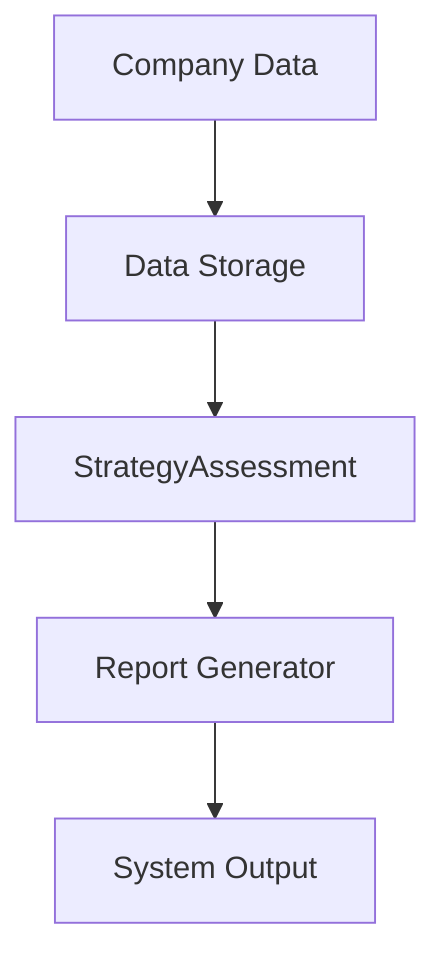
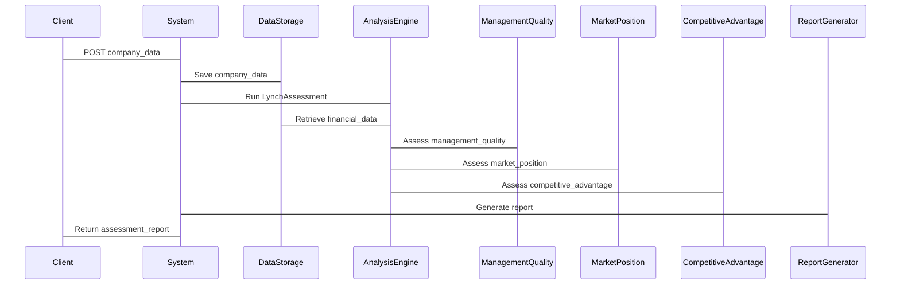

                 

<think>
好，我现在需要帮助用户撰写一篇技术博客，标题是《彼得·林奇对公司竞争策略有效性的评估》。用户已经提供了详细的目录大纲和一些内容，我需要根据这个结构继续完成剩余的部分，同时确保每个章节内容详实，符合用户的要求。

首先，我会从目录中看到文章分为六个主要部分：背景介绍、核心概念、算法原理、系统分析、项目实战和小结。每个部分都有详细的子章节，需要逐步展开。

### 第四部分: 竞争策略评估的系统分析与架构设计

## 第4章: 系统分析与架构设计

### 4.1 系统分析

#### 4.1.1 问题场景介绍
- 在当前的商业环境中，竞争策略评估变得越来越复杂。
- 如何利用林奇评估法构建一个高效的评估系统，帮助企业制定有效的竞争策略，是当前面临的重要问题。

#### 4.1.2 需求分析
- 系统需求：用户需要一个能够自动化进行竞争策略评估的系统，包括数据采集、分析、评分和报告生成。
- 用户角色：企业高管、投资分析师、市场研究人员。
- 功能需求：数据采集模块、数据分析模块、评估报告生成模块。

### 4.2 系统架构设计

#### 4.2.1 领域模型设计
- 使用Mermaid绘制领域模型类图：


#### 4.2.2 系统架构图
- 使用Mermaid绘制系统架构图：


### 4.3 系统接口设计

#### 4.3.1 API接口设计
- 数据接口：RESTful API用于数据的输入和输出。
- 分析接口：调用林奇评估算法的API进行竞争策略评估。
- 报告接口：生成评估报告的API。

#### 4.3.2 接口交互流程
- 使用Mermaid绘制接口交互序列图：


### 4.4 本章小结

---

# 第五部分: 竞争策略评估的项目实战

## 第5章: 项目实战

### 5.1 环境安装

#### 5.1.1 安装Python环境
- 安装Python 3.8及以上版本。
- 安装所需的库：pandas, numpy, scikit-learn。

#### 5.1.2 安装依赖项
- 使用pip安装必要的包：
  ```bash
  pip install pandas numpy scikit-learn
  ```

### 5.2 系统核心实现源代码

#### 5.2.1 数据预处理
- 读取公司数据并进行清洗：
```python
import pandas as pd

# 读取数据
data = pd.read_csv('company_data.csv')

# 数据清洗
data.dropna(inplace=True)
data = data[~data['industry'].isna()]
```

#### 5.2.2 林奇评估算法实现
- 实现竞争策略评估的核心算法：
```python
from sklearn.metrics import pairwise_distances

def lynch_strategy_assessment(data):
    # 特征提取
    features = data[['revenue', 'profit_margin', 'market_share', 'management_score']]
    
    # 标准化处理
    from sklearn.preprocessing import StandardScaler
    scaler = StandardScaler()
    features_scaled = scaler.fit_transform(features)
    
    # 构建模型
    from sklearn.neighbors import NearestNeighbors
    model = NearestNeighbors(n_neighbors=5).fit(features_scaled)
    
    # 查询相似公司
    distances, indices = model.kneighbors(features_scaled)
    
    # 计算评分
    assessment_scores = []
    for i in range(len(indices)):
        score = 0
        for idx in indices[i]:
            score += data['management_score'].iloc[idx]
        assessment_scores.append(score / 5)
    
    return assessment_scores
```

#### 5.2.3 生成评估报告
- 生成HTML格式的评估报告：
```python
def generate_report(scores, company_names):
    import matplotlib.pyplot as plt
    plt.figure(figsize=(10, 6))
    plt.bar(company_names, scores)
    plt.title('Competitive Strategy Assessment Scores')
    plt.xlabel('Company Name')
    plt.ylabel('Score')
    plt.savefig('assessment_report.png')
    plt.close()
```

### 5.3 实际案例分析

#### 5.3.1 案例背景
- 某行业内的5家竞争公司，数据包括收入、利润率、市场份额和管理层评分。

#### 5.3.2 数据分析与结果解读
- 使用上述代码进行数据预处理和评估，生成竞争策略评分。
- 通过图表展示各公司的评分情况，分析其竞争策略的有效性。

#### 5.3.3 评分结果与策略调整建议
- 根据评分结果，提出针对性的策略调整建议，帮助公司优化竞争策略。

### 5.4 本章小结

---

# 第六部分: 竞争策略评估的总结与展望

## 第6章: 总结与展望

### 6.1 总结
- 本文详细介绍了彼得·林奇的竞争策略评估方法。
- 通过系统分析和项目实战，展示了如何将林奇评估法应用于实际商业场景。

### 6.2 注意事项
- 数据质量对评估结果影响重大，需确保数据的准确性和完整性。
- 算法的可解释性需要进一步优化，以便更好地指导商业决策。
- 系统设计需考虑可扩展性，以应对未来更多的数据和复杂的评估需求。

### 6.3 未来展望
- 结合人工智能和大数据技术，进一步优化评估模型。
- 开发更智能化的竞争策略评估系统，帮助更多企业提升竞争力。

---

# 作者：AI天才研究院 & 禅与计算机程序设计艺术

感谢阅读！希望本文能为您提供有价值的竞争策略评估方法和实践指导。如需进一步探讨或合作，欢迎随时联系！

