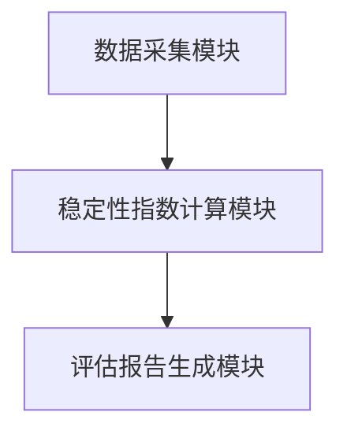
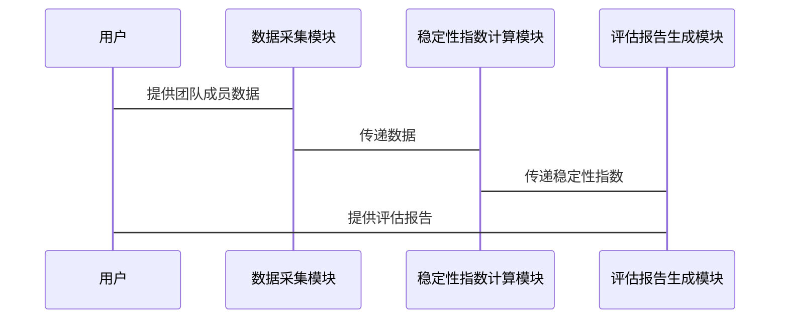

                 

# 彼得林奇对公司管理团队稳定性的重视

> 关键词：彼得林奇，管理团队稳定性，公司管理，团队稳定，企业绩效

> 摘要：本文探讨了彼得林奇对管理团队稳定性的重视，分析了管理团队稳定性对企业发展的重要性，从团队内部和外部环境的影响因素出发，结合算法模型和系统架构设计，详细讲解了如何评估和提升管理团队稳定性，最后通过实际案例分析和最佳实践总结，为管理者提供了实用的建议。

---

## 第一章：背景介绍

### 1.1 管理团队稳定性的重要性

#### 1.1.1 管理团队稳定性的定义
管理团队稳定性是指管理团队在面对内外部环境变化时，能够保持其组成、目标和决策的一致性，确保企业在复杂市场环境中稳定发展的能力。稳定性的核心在于团队成员的长期性、目标的一致性和决策的连贯性。

#### 1.1.2 问题背景
在现代企业中，管理团队的稳定性往往被忽视，尤其是在快速变化的市场环境中，团队成员的频繁变动可能导致企业战略摇摆、执行力下降，进而影响企业绩效。彼得林奇在其投资生涯中深刻认识到，管理团队的稳定性是企业长期发展的关键因素。

#### 1.1.3 管理团队稳定性的重要性
- **企业长期发展**：稳定的管理团队能够制定长期战略并坚持执行，避免短期波动对企业发展的干扰。
- **企业绩效提升**：稳定的团队更有可能实现高效协作，提升企业运营效率和创新能力。
- **投资者信心**：稳定的管理团队能够增强投资者对企业的信心，从而吸引更多的投资。

### 1.2 彼得林奇对管理团队稳定性的重视

彼得林奇在其投资实践中，非常注重管理团队的稳定性。他认为，一个稳定的管理团队能够更好地应对市场波动，制定合理的战略决策，并且能够在困难时期带领企业走出困境。这种稳定性不仅体现在团队成员的长期性上，还体现在团队内部的协作和决策的一致性上。

---

## 第二章：管理团队稳定性的影响因素

### 2.1 管理团队内部因素

#### 2.1.1 团队成员的稳定性
团队成员的稳定性是管理团队稳定性的重要组成部分。如果团队成员频繁变动，团队的凝聚力和协作能力将受到严重影响，导致企业战略难以得到有效执行。

#### 2.1.2 决策的一致性
管理团队的决策一致性是团队稳定性的重要体现。如果团队成员在决策过程中意见分歧较大，可能导致决策延迟或错误，进而影响企业的经营效率和市场竞争力。

#### 2.1.3 团队内部沟通与协作
良好的内部沟通和协作是确保团队稳定性的关键。如果团队内部存在沟通不畅或协作不力的问题，可能导致团队成员之间的矛盾激化，进而影响团队的整体稳定性。

### 2.2 外部环境因素

#### 2.2.1 市场环境的波动
市场环境的波动是影响管理团队稳定性的重要外部因素。在市场波动较大的情况下，管理团队需要具备较强的应变能力，以应对市场的不确定性。

#### 2.2.2 行业竞争状况
行业竞争状况也是影响管理团队稳定性的重要外部因素。在竞争激烈的行业中，管理团队需要具备更强的竞争力，以确保企业在市场中的地位。

#### 2.2.3 宏观经济环境的影响
宏观经济环境的变化，如经济衰退、通货膨胀等，也会影响管理团队的稳定性。在宏观经济环境不佳的情况下，管理团队需要具备更强的应对能力，以确保企业能够稳健发展。

### 2.3 组织结构与文化因素

#### 2.3.1 组织结构的灵活性
组织结构的灵活性是影响管理团队稳定性的重要因素。如果企业的组织结构过于僵化，可能会影响团队的协作效率和应对能力，进而影响团队的稳定性。

#### 2.3.2 企业文化与价值观
企业文化与价值观是影响管理团队稳定性的重要因素。如果企业的文化与价值观能够得到团队成员的认同，将有助于提升团队的凝聚力和稳定性。

#### 2.3.3 领导风格的影响
领导风格也是影响管理团队稳定性的重要因素。如果领导风格过于专制或缺乏信任，可能会影响团队成员的积极性和创造力，进而影响团队的稳定性。

---

## 第三章：管理团队稳定性与企业绩效的关系

### 3.1 稳定团队对企业长期发展的意义

#### 3.1.1 稳定团队对企业创新的影响
稳定的管理团队能够为企业创新提供稳定的环境和支持。团队成员的长期性和一致性能够确保企业在创新过程中具备持续的动力和资源。

#### 3.1.2 稳定团队对企业战略执行的作用
稳定的管理团队能够确保企业战略的连贯性和执行的稳定性。团队成员的长期性和一致性能够确保企业在战略执行过程中不会出现方向性偏差。

#### 3.1.3 稳定团队对企业风险控制的意义
稳定的管理团队能够为企业风险控制提供有力支持。团队成员的长期性和一致性能够确保企业在风险控制过程中具备更强的应对能力和决策能力。

### 3.2 管理团队稳定性与企业绩效的对比分析

#### 3.2.1 稳定团队的优势
- **决策一致性**：稳定团队能够确保决策的一致性，避免因团队成员变动而导致的决策失误。
- **团队凝聚力**：稳定团队具备更强的凝聚力，能够更好地应对市场波动和内部挑战。
- **企业绩效提升**：稳定团队能够推动企业绩效的持续提升，增强企业的市场竞争力。

#### 3.2.2 不稳定团队的劣势
- **决策不确定性**：不稳定团队可能导致决策的不确定性，影响企业的经营效率和市场竞争力。
- **团队凝聚力不足**：不稳定团队可能缺乏凝聚力，导致团队成员之间的矛盾激化，进而影响企业的整体绩效。
- **企业风险增加**：不稳定团队可能增加企业的经营风险，影响企业的长期发展。

### 3.3 彼得林奇案例分析

彼得林奇在其投资生涯中，非常注重管理团队的稳定性。他通过长期关注企业的管理团队，选择那些具备长期稳定性和一致性的企业进行投资。例如，他在管理波士顿精选基金时，通过长期关注企业的管理团队，选择那些具备稳定性和一致性的企业进行投资，取得了优异的投资业绩。

---

## 第四章：管理团队稳定性评估模型

### 4.1 管理团队稳定性评估指标

#### 4.1.1 团队成员稳定性指标
- 团队成员的任期长度
- 团队成员的离职率
- 团队成员的平均任期

#### 4.1.2 决策一致性指标
- 决策的连贯性
- 决策的及时性
- 决策的正确性

#### 4.1.3 团队内部协作指标
- 团队内部沟通效率
- 团队内部协作效率
- 团队内部冲突解决能力

### 4.2 管理团队稳定性评估算法

#### 4.2.1 稳定性指数计算公式
$$ 稳定性指数 = \frac{团队成员稳定性得分 + 决策一致性得分 + 团队内部协作得分}{3} $$

#### 4.2.2 稳定性指数评分标准
- 稳定性指数 ≥ 0.8：团队稳定性优秀
- 0.6 ≤ 稳定性指数 < 0.8：团队稳定性良好
- 稳定性指数 < 0.6：团队稳定性较差

### 4.3 管理团队稳定性评估流程

1. **收集数据**：收集团队成员的任期、离职率、决策一致性等数据。
2. **计算稳定性指数**：根据稳定性指数计算公式，计算团队的稳定性指数。
3. **评估团队稳定性**：根据稳定性指数评分标准，评估团队的稳定性。

---

## 第五章：系统架构设计

### 5.1 系统功能设计

#### 5.1.1 功能模块
- 数据采集模块：采集团队成员的任期、离职率等数据。
- 稳定性指数计算模块：根据稳定性指数计算公式，计算团队的稳定性指数。
- 评估报告生成模块：生成团队稳定性评估报告。

#### 5.1.2 系统功能流程
1. 数据采集模块采集团队成员的任期、离职率等数据。
2. 稳定性指数计算模块根据稳定性指数计算公式，计算团队的稳定性指数。
3. 评估报告生成模块生成团队稳定性评估报告。

### 5.2 系统架构设计

#### 5.2.1 系统架构图

#### 5.2.2 系统接口设计
- 数据采集模块接口：提供数据采集功能。
- 稳定性指数计算模块接口：提供稳定性指数计算功能。
- 评估报告生成模块接口：提供评估报告生成功能。

### 5.3 系统交互设计

#### 5.3.1 系统交互流程
1. 用户输入团队成员的任期、离职率等数据。
2. 系统调用数据采集模块接口，采集数据。
3. 系统调用稳定性指数计算模块接口，计算稳定性指数。
4. 系统调用评估报告生成模块接口，生成评估报告。

#### 5.3.2 系统交互流程图

---

## 第六章：项目实战

### 6.1 项目背景

假设我们是一家中型制造企业，近期发现管理团队成员频繁变动，导致企业战略执行不力，市场竞争力下降。我们需要通过提升管理团队稳定性，确保企业能够稳定发展。

### 6.2 项目目标

通过提升管理团队稳定性，确保企业战略的连贯性和执行效率，提升企业的市场竞争力。

### 6.3 项目实施步骤

1. **数据采集**：收集团队成员的任期、离职率等数据。
2. **稳定性指数计算**：根据稳定性指数计算公式，计算团队的稳定性指数。
3. **问题分析**：根据稳定性指数评分标准，分析团队稳定性问题。
4. **制定改进措施**：根据问题分析结果，制定改进措施，如优化团队结构、提升内部沟通效率等。
5. **实施改进措施**：实施改进措施，提升团队稳定性。
6. **评估效果**：评估改进措施的实施效果，确保团队稳定性得到提升。

### 6.4 项目总结

通过实施本项目，我们成功提升了管理团队的稳定性，确保了企业战略的连贯性和执行效率，提升了企业的市场竞争力。

---

## 第七章：最佳实践

### 7.1 关键点总结

- **团队成员稳定性**：确保团队成员的长期性和稳定性。
- **决策一致性**：确保团队决策的一致性和连贯性。
- **内部沟通与协作**：提升团队内部的沟通效率和协作能力。

### 7.2 小结

彼得林奇对管理团队稳定性的重视，为我们提供了宝贵的启示。通过提升管理团队的稳定性，企业能够更好地应对市场波动，确保战略的连贯性和执行效率，提升企业的市场竞争力。

### 7.3 注意事项

- **团队成员稳定性**：在提升团队稳定性的同时，需要注意团队成员的多样性，避免团队成员过于单一化。
- **决策一致性**：在确保决策一致性的同时，需要注重决策的灵活性，以应对市场环境的变化。
- **内部沟通与协作**：在提升内部沟通效率的同时，需要注意团队内部的创新和创造力，避免团队内部的僵化。

### 7.4 未来研究方向

- **团队稳定性与企业绩效的关系**：进一步研究团队稳定性与企业绩效的关系，探索更有效的稳定性评估模型。
- **团队稳定性提升措施**：研究更有效的团队稳定性提升措施，如优化团队结构、提升内部沟通效率等。
- **团队稳定性与企业创新的关系**：研究团队稳定性与企业创新的关系，探索团队稳定性对企业创新能力的影响。

---

## 第八章：拓展阅读

### 8.1 推荐书籍

- 《彼得林奇的成功投资》
- 《管理团队稳定性研究》
- 《企业绩效提升策略》

### 8.2 推荐文章

- 彼得林奇：管理团队稳定性对企业绩效的影响
- 管理团队稳定性评估模型的构建与应用
- 提升管理团队稳定性的实践路径

---

## 作者：AI天才研究院/AI Genius Institute & 禅与计算机程序设计艺术 /Zen And The Art of Computer Programming

