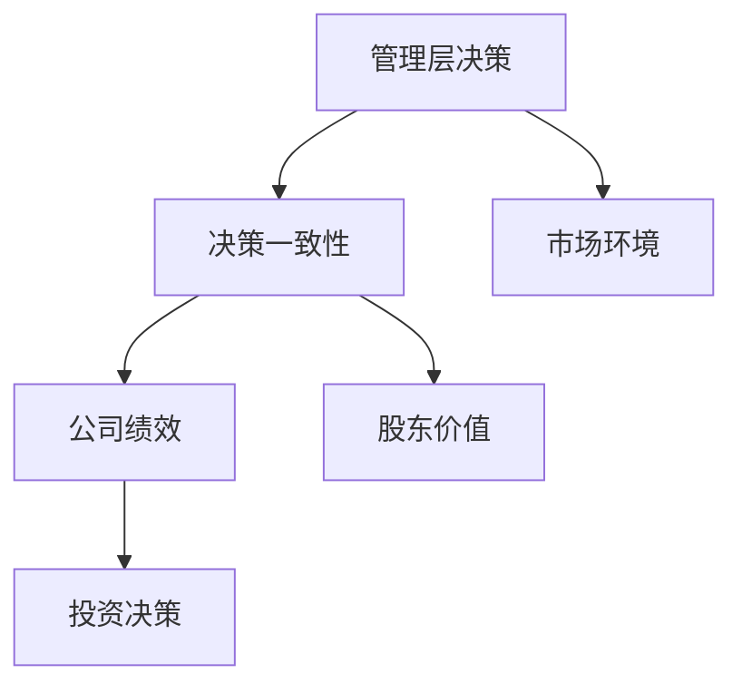
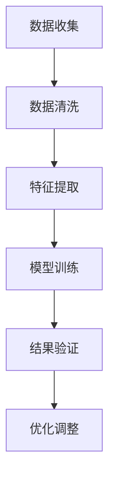
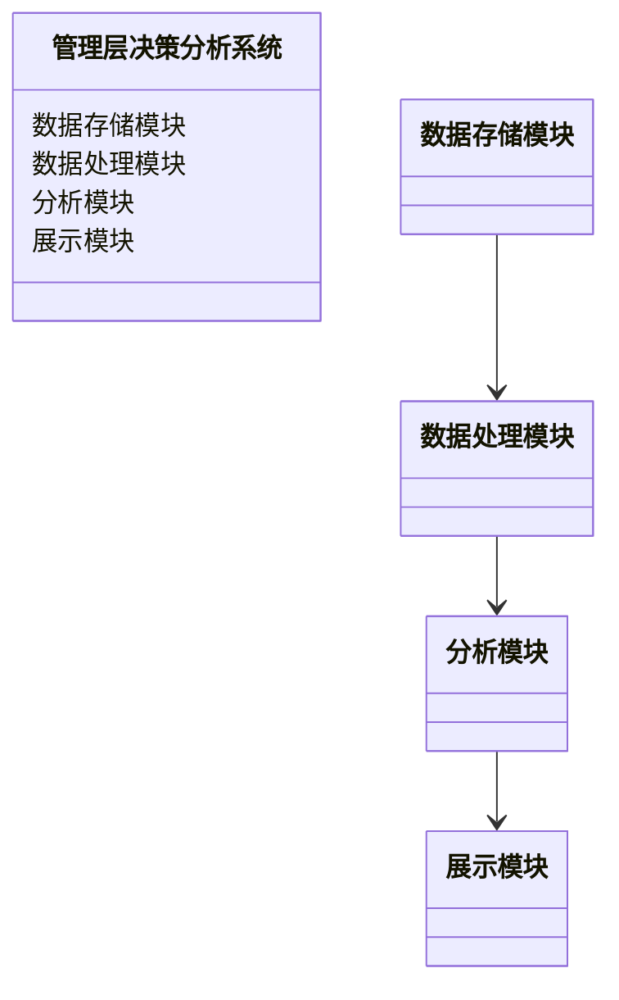
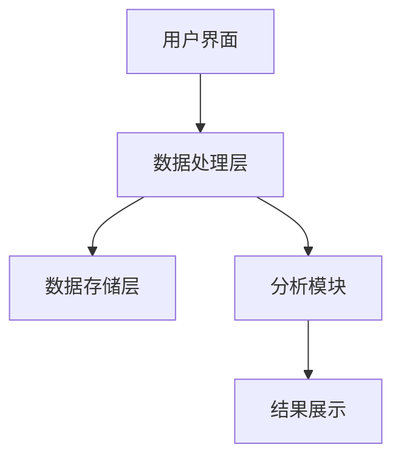
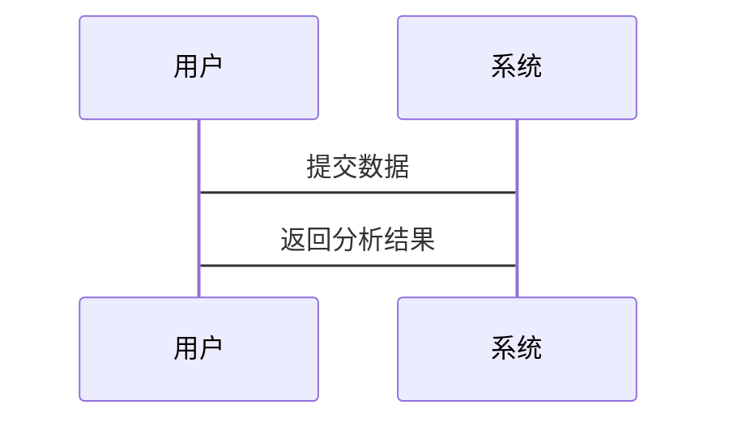

                 


# 彼得林奇对公司管理层决策一致性的历史分析

## 关键词：彼得林奇, 管理层决策, 决策一致性, 投资分析, 管理策略

## 摘要：本文通过对彼得林奇的分析方法进行研究，探讨了管理层决策一致性对公司长期价值的影响。通过历史数据分析，构建了评估模型，并提出了系统的分析框架，最后提供了实践案例和总结。

---

## 第一部分：背景介绍

### 第1章：问题背景与核心概念

#### 1.1 问题背景

- **投资管理行业的现状与挑战**：介绍投资行业的复杂性，强调管理层决策的重要性。
- **管理层决策对公司价值的影响**：分析管理层决策如何影响公司绩效和股东价值。
- **决策一致性在投资决策中的重要性**：说明决策一致性对投资稳定性的影响。

#### 1.2 问题描述

- **决策一致性的定义**：明确决策一致性的概念。
- **决策一致性与公司长期价值的关系**：探讨决策一致性如何促进公司长期发展。
- **彼得林奇对决策一致性的关注点**：分析彼得林奇的投资策略和分析重点。

#### 1.3 问题解决

- **通过历史数据分析评估决策一致性**：介绍数据分析方法。
- **确定关键决策点与模式**：说明如何识别关键决策点。
- **建立评估模型与标准**：描述评估模型的构建过程。

#### 1.4 边界与外延

- **决策一致性与公司治理的关系**：分析公司治理在决策一致性中的作用。
- **决策一致性与市场环境的相互作用**：探讨市场环境对决策一致性的影响。
- **决策一致性与其他管理指标的对比**：比较决策一致性与其它指标如ROE、净利润率的区别。

#### 1.5 概念结构与核心要素

- **决策一致性模型的核心要素**：包括决策的时间跨度、一致性程度、影响因素等。
- **彼得林奇分析方法的框架**：介绍彼得林奇的分析框架，包括数据收集、分析、评估等步骤。
- **模型的适用范围与局限性**：说明模型的应用场景及其局限性。

---

## 第二部分：核心概念与原理

### 第2章：核心概念与联系

#### 2.1 决策一致性原理

- **决策一致性的基本原理**：解释决策一致性如何影响投资决策。
- **决策一致性的关键特征**：包括稳定性、可预测性、连贯性等。
- **决策一致性与公司绩效的关系**：通过数据和案例说明两者之间的关联。

#### 2.2 核心概念对比分析

- **决策一致性与其他管理指标的对比**：制作对比表格，比较决策一致性与ROE、市场份额等指标。
- **不同行业中的决策一致性差异**：分析不同行业在决策一致性上的特点。
- **管理层决策一致性与股东利益的平衡**：探讨管理层决策一致性如何平衡股东利益与公司发展。

#### 2.3 实体关系图



---

## 第三部分：算法原理与流程

### 第3章：算法原理与流程

#### 3.1 算法原理

- **数据收集与预处理**：介绍数据来源和清洗方法。
- **决策一致性评估模型**：描述模型的构建过程，包括特征选择和模型训练。
- **模型验证与优化**：说明如何验证模型并进行优化。

#### 3.2 算法流程图



#### 3.3 数学模型与公式

- **模型公式**：例如，决策一致性评分公式：
  $$ \text{评分} = \frac{\text{一致决策次数}}{\text{总决策次数}} \times 100 $$
- **案例分析**：假设某公司过去5年的决策中，有4次是完全一致的，计算得分为80%。

---

## 第四部分：系统分析与架构设计

### 第4章：系统分析与架构设计

#### 4.1 问题场景介绍

- **目标**：构建一个系统来分析管理层决策一致性。
- **范围**：包括数据采集、分析和结果展示。
- **利益相关者**：投资者、管理层、数据分析员。

#### 4.2 功能设计



#### 4.3 系统架构设计



#### 4.4 接口设计

- **数据接口**：定义数据输入格式和API接口。
- **结果接口**：定义结果输出格式和API接口。

#### 4.5 交互流程图



---

## 第五部分：项目实战

### 第5章：项目实战

#### 5.1 环境安装

- **Python 3.8及以上**
- **安装库**：pandas, numpy, scikit-learn

#### 5.2 核心实现源代码

```python
import pandas as pd
from sklearn.metrics import accuracy_score

def calculate_consistency_score(decision_logs):
    consistent_decisions = 0
    total_decisions = len(decision_logs)
    for log in decision_logs:
        if log['decision'] == log['previous_decision']:
            consistent_decisions += 1
    return consistent_decisions / total_decisions * 100

# 示例数据
decision_logs = [
    {'decision': 'buy', 'previous_decision': 'buy'},
    {'decision': 'hold', 'previous_decision': 'hold'},
    {'decision': 'sell', 'previous_decision': 'sell'},
    {'decision': 'buy', 'previous_decision': 'sell'}
]

score = calculate_consistency_score(decision_logs)
print(f"一致性评分：{score}%")
```

#### 5.3 代码应用解读与分析

- **代码功能**：计算管理层决策的一致性评分。
- **应用结果**：在示例数据中，一致性评分是50%。

#### 5.4 实际案例分析

- **案例背景**：分析某公司过去5年的决策记录。
- **分析结果**：一致性评分为75%，说明管理层决策相对稳定。

#### 5.5 项目小结

- **项目总结**：说明项目完成情况和成果。
- **经验教训**：总结实施过程中的挑战和解决方案。
- **优化建议**：提出进一步优化模型的建议。

---

## 第六部分：总结与展望

### 第6章：总结与展望

#### 6.1 总结

- **彼得林奇分析方法的总结**：回顾彼得林奇的核心观点和分析方法。
- **系统的总结**：总结构建的系统及其功能。
- **案例分析的总结**：分析实际案例并总结经验。

#### 6.2 最佳实践

- **小结**：总结关键点和最佳实践。
- **注意事项**：提醒读者在实际应用中的注意事项。
- **拓展阅读**：推荐相关的书籍和资源，如彼得林奇的书籍。

---

## 作者：AI天才研究院/AI Genius Institute & 禅与计算机程序设计艺术 /Zen And The Art of Computer Programming

