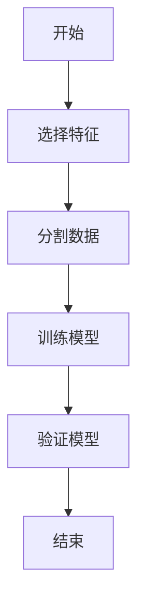

                 


# 彼得林奇对公司管理层决策一致性的历史数据分析

---

## 关键词：彼得林奇、管理层决策一致性、历史数据分析、决策树模型、时间序列分析

---

## 摘要

本文以彼得·林奇的投资理念为基础，结合历史数据分析的方法，探讨如何量化和评估公司管理层决策的一致性。通过分析管理层在不同时间点的决策模式，本文提出了一套基于时间序列分析和决策树模型的方法，帮助投资者更好地理解公司管理层的行为特征，从而做出更明智的投资决策。文章还通过具体案例展示了如何利用Python代码进行数据分析，并结合ER图和数学模型，详细阐述了决策一致性分析的理论基础和实践应用。

---

## 第一部分：背景与概述

### 第1章：管理层决策一致性概述

#### 1.1 什么是管理层决策一致性

管理层决策一致性是指公司在不同时间点上，管理层在决策过程中表现出的一致性特征。这种一致性可以通过数据分析的方法进行量化和评估。具体来说，它包括以下几个方面：

- **时间跨度**：管理层在不同时间段内的决策是否保持一致。
- **决策类型**：战略决策与操作决策的一致性。
- **决策结果**：决策结果是否符合既定目标和模式。

#### 1.2 彼得·林奇与管理层决策分析

彼得·林奇是美国著名的基金经理，以其成功的投资策略和对管理层决策的深刻理解而闻名。他认为，分析管理层的决策一致性是评估公司长期表现的重要因素之一。林奇通过长期观察和数据分析，发现那些决策一致的公司往往具有更高的投资价值。

#### 1.3 数据分析在决策一致性评估中的作用

数据分析在决策一致性评估中的作用不可忽视。通过对公司历史数据的分析，可以识别管理层决策的模式和趋势。例如，可以通过时间序列分析来检测决策的周期性，或者通过决策树模型来分类不同的决策类型。

---

## 第二部分：核心概念与理论框架

### 第2章：决策一致性分析的核心概念

#### 2.1 决策一致性的属性特征

决策一致性分析的核心概念包括以下几个属性特征：

- **时间性**：决策是否在特定时间段内保持一致。
- **类型性**：决策类型（战略 vs 操作）的一致性。
- **结果性**：决策结果是否符合预期。

#### 2.2 决策一致性与其他概念的对比

在决策一致性分析中，需要将决策一致性与其他相关概念进行对比，以便更好地理解其独特性。例如：

- **决策一致性与决策质量**：决策一致性关注的是决策的模式和稳定性，而决策质量关注的是决策的正确性和效果。
- **决策一致性与决策风格**：决策风格指的是管理层在决策过程中的偏好和倾向，而决策一致性关注的是决策的稳定性和持续性。

#### 2.3 决策一致性分析的ER实体关系图

以下是一个简单的ER实体关系图，展示了决策一致性分析的核心实体及其关系：

```mermaid
erDiagram
    company {
        id
        name
        industry
    }
    decision {
        id
        type
        timestamp
    }
    consistency_analysis {
        id
        score
        company_id
        decision_id
    }
    company --> decision : 发起
    company --> consistency_analysis : 关联
    decision --> consistency_analysis : 分析
```

---

## 第三部分：数据分析方法与算法

### 第3章：决策一致性分析的算法原理

#### 3.1 时间序列分析方法

时间序列分析是一种常用的数据分析方法，用于研究随时间变化的数据序列。以下是时间序列分析的基本步骤：

1. **数据预处理**：检查数据的完整性、异常值和缺失值。
2. **趋势分析**：识别数据中的趋势，例如线性趋势或非线性趋势。
3. **周期性分析**：检测数据中的周期性模式。
4. **预测与验证**：基于历史数据预测未来趋势，并验证预测结果。

时间序列分析的数学模型可以表示为：

$$ y_t = \alpha + \beta t + \epsilon_t $$

其中，\( y_t \) 是观测值，\( \alpha \) 是截距，\( \beta \) 是斜率，\( \epsilon_t \) 是误差项。

#### 3.2 决策树模型在一致性分析中的应用

决策树模型是一种基于树状结构的分类和回归方法。在决策一致性分析中，决策树可以用来分类不同的决策类型，并识别影响决策一致性的关键因素。以下是决策树模型的基本流程：

1. **数据分割**：将数据分成训练集和测试集。
2. **特征选择**：选择对决策一致性影响最大的特征。
3. **模型训练**：使用训练数据构建决策树。
4. **模型验证**：使用测试数据验证模型的准确性。

以下是一个简单的决策树模型流程图：



---

## 第四部分：系统分析与架构设计

### 第4章：决策一致性分析系统的架构设计

#### 4.1 项目介绍

决策一致性分析系统是一个基于历史数据分析的决策支持系统，旨在帮助投资者评估公司管理层的决策一致性。系统的主要功能包括数据采集、数据分析、结果展示和预测报告生成。

#### 4.2 系统功能设计

以下是系统的主要功能模块：

- **数据采集模块**：从数据库或外部数据源获取公司历史数据。
- **数据分析模块**：包括时间序列分析和决策树模型的实现。
- **结果展示模块**：以图表形式展示分析结果。
- **预测报告模块**：生成基于分析结果的预测报告。

#### 4.3 系统架构设计

以下是系统的架构图：


---

## 第五部分：项目实战与案例分析

### 第5章：决策一致性分析的项目实战

#### 5.1 环境安装

在进行数据分析之前，需要安装以下环境：

- **Python**：用于数据分析和建模。
- **Pandas**：用于数据处理。
- **Scikit-learn**：用于机器学习算法。
- **Matplotlib**：用于数据可视化。

#### 5.2 核心实现

以下是决策一致性分析的核心代码实现：

```python
import pandas as pd
from sklearn.tree import DecisionTreeClassifier
from sklearn.metrics import accuracy_score

# 数据加载
data = pd.read_csv('decision_data.csv')

# 特征与目标分离
X = data.drop('consistency_score', axis=1)
y = data['consistency_score']

# 模型训练
model = DecisionTreeClassifier()
model.fit(X, y)

# 模型预测
y_pred = model.predict(X)

# 模型评估
print("准确率：", accuracy_score(y, y_pred))
```

#### 5.3 数据分析与结果解读

通过上述代码，我们可以得到模型的准确率，从而评估管理层决策一致性的高低。例如，如果准确率为85%，则说明模型能够较好地识别决策一致性的模式。

#### 5.4 案例分析

以某公司为例，通过分析其历史决策数据，我们可以识别其决策模式，并评估其一致性。例如，如果发现公司在过去三年内，每年的资本支出决策都保持一致，则可以认为其决策一致性较高。

---

## 第六部分：最佳实践与总结

### 第6章：最佳实践与总结

#### 6.1 最佳实践

在进行决策一致性分析时，需要注意以下几点：

- **数据质量**：确保数据的完整性和准确性。
- **模型选择**：根据具体问题选择合适的算法。
- **结果解读**：结合业务背景解读分析结果。

#### 6.2 小结

本文通过彼得·林奇的投资理念，结合历史数据分析的方法，探讨了如何量化和评估公司管理层决策的一致性。通过时间序列分析和决策树模型的实现，我们能够更好地理解管理层的决策模式，并为投资决策提供有力支持。

#### 6.3 注意事项

在实际应用中，需要注意以下几点：

- 数据分析结果仅供参考，不能完全依赖模型。
- 需要结合公司实际情况进行综合判断。
- 模型需要定期更新和优化。

#### 6.4 拓展阅读

- 《彼得·林奇的成功投资法则》
- 《时间序列分析与应用》
- 《决策树模型的实现与优化》

---

## 作者：AI天才研究院/AI Genius Institute & 禅与计算机程序设计艺术 /Zen And The Art of Computer Programming

---

通过以上内容，我们详细探讨了彼得·林奇对公司管理层决策一致性的历史数据分析方法，并通过具体案例展示了如何利用数据分析技术进行评估和预测。希望本文能够为投资者和数据分析师提供有价值的参考。

