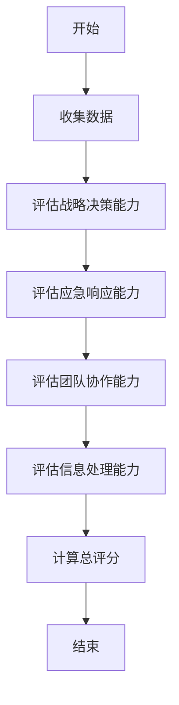
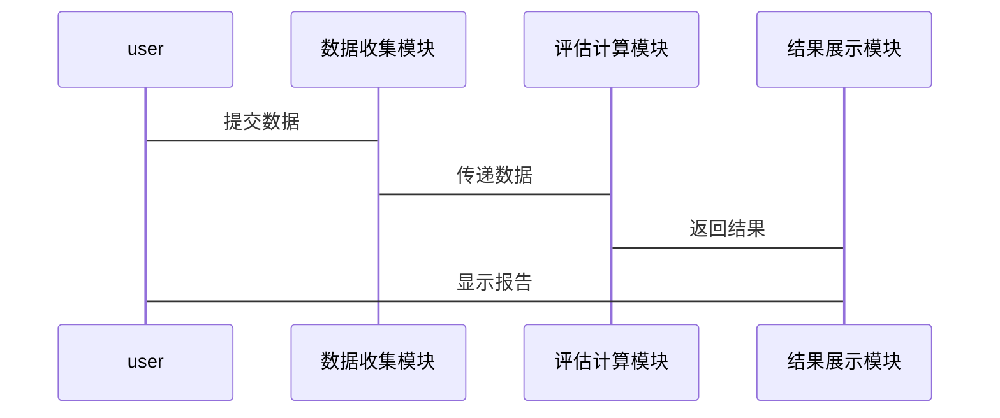

                 


# 彼得林奇对公司管理层危机处理能力的评估

> 关键词：危机处理能力，彼得·林奇，企业管理，评估方法，系统架构，算法原理

> 摘要：本文从背景介绍、核心概念、算法原理、系统架构设计、项目实战等方面详细探讨了彼得·林奇对公司管理层危机处理能力的评估方法。通过分析危机处理能力的重要性、核心要素及其与相关概念的联系，结合具体的数学模型和流程图，阐述了彼得·林奇评估方法的算法原理。同时，通过系统架构设计和项目实战，展示了该方法的实际应用价值和实现步骤，为企业的危机管理提供了有效的参考和指导。

---

## 第1章: 背景介绍

### 1.1 危机处理能力的重要性

#### 1.1.1 危机处理能力的核心概念
危机处理能力是指企业在面对突发事件或危机时，能够迅速识别、评估、应对和解决的能力。这种能力直接影响企业的生存、声誉和发展。

#### 1.1.2 危机处理能力的关键特征
- **快速响应**：在危机发生时，能够迅速采取行动。
- **决策能力**：在复杂情况下做出合理决策。
- **团队协作**：各部门协同合作，共同应对危机。
- **信息处理**：有效收集、分析和利用信息。

#### 1.1.3 危机处理能力的边界与外延
危机处理能力不仅包括应对危机的具体行动，还包括预防和恢复的策略。

### 1.2 彼得·林奇的背景与方法论

#### 1.2.1 彼得·林奇的个人经历
彼得·林奇是著名投资家，曾任富达麦哲伦基金经理，以其卓越的投资业绩闻名。

#### 1.2.2 彼得·林奇的危机处理方法
林奇在投资管理中强调对危机的敏感性和应对策略，其方法注重快速反应和团队协作。

#### 1.2.3 彼得·林奇方法的适用性
林奇的评估方法适用于企业危机管理，特别是中高层管理者的能力评估。

---

## 第2章: 公司管理层危机处理能力的评估背景

### 2.1 当前企业面临的危机类型

#### 2.1.1 市场危机
如行业竞争加剧、市场萎缩等。

#### 2.1.2 经营危机
如财务亏损、管理混乱等。

#### 2.1.3 信誉危机
如负面新闻、客户信任度下降等。

#### 2.1.4 法律与合规危机
如法律诉讼、合规问题等。

### 2.2 危机处理能力在企业管理中的作用

#### 2.2.1 危机处理能力与企业生存
危机处理能力直接关系到企业的生死存亡。

#### 2.2.2 危机处理能力与企业声誉
良好的危机处理能力有助于维护企业声誉。

#### 2.2.3 危机处理能力与长期发展
危机处理能力影响企业的长期战略规划和执行。

### 2.3 彼得·林奇评估方法的提出

#### 2.3.1 问题背景
企业危机频发，需要系统化的评估方法。

#### 2.3.2 问题描述
现有评估方法缺乏系统性和可操作性。

#### 2.3.3 问题解决思路
借鉴林奇的投资方法，构建危机处理能力评估体系。

---

## 第3章: 危机处理能力的核心要素

### 3.1 危机处理能力的构成要素

#### 3.1.1 战略决策能力
管理层在危机中的决策质量。

#### 3.1.2 应急响应能力
企业应对危机的速度和效率。

#### 3.1.3 团队协作能力
各部门之间的协作效果。

#### 3.1.4 信息处理能力
信息的收集、分析和利用能力。

### 3.2 核心概念的属性对比

| 危机处理能力 | 危机预防能力 | 危机恢复能力 | 危机预警能力 |
|----------------|----------------|----------------|----------------|
| 应对措施       | 预防措施       | 恢复措施       | 监测措施       |
| 后置性         | 前置性         | 补偿性         | 预测性         |
| 反应性         | 主动性         | 修复性         | 警觉性         |

### 3.3 ER实体关系图架构

```mermaid
erDiagram
    crisishandling :危机处理能力
    {
    crisishandling --> strategic_decision :战略决策能力
    crisishandling --> emergency_response :应急响应能力
    crisishandling --> team_collaboration :团队协作能力
    crisishandling --> info_processing :信息处理能力
    }
```

---

## 第4章: 彼得·林奇评估方法的算法原理

### 4.1 算法原理概述

#### 4.1.1 算法的核心思想
通过多维度评估，量化危机处理能力。

#### 4.1.2 算法的输入与输出
输入：企业危机处理数据；输出：评估结果。

#### 4.1.3 算法的步骤分解
1. 收集数据。
2. 评估各要素。
3. 计算总评分。

### 4.2 算法的数学模型与公式

#### 4.2.1 危机处理能力评分公式
$$
\text{总评分} = 0.4 \times S + 0.3 \times E + 0.2 \times T + 0.1 \times I
$$

其中，S为战略决策评分，E为应急响应评分，T为团队协作评分，I为信息处理评分。

#### 4.2.2 评分权重分配公式
$$
\text{权重} = \{0.4, 0.3, 0.2, 0.1\}
$$

#### 4.2.3 总评分计算公式
$$
\text{总评分} = \sum (\text{评分} \times \text{权重})
$$

### 4.3 算法的流程图



---

## 第5章: 算法的实现与优化

### 5.1 算法的实现步骤

#### 5.1.1 数据收集与处理
收集危机处理相关的数据，清洗和预处理。

#### 5.1.2 评估各要素
根据评分标准，评估各要素。

#### 5.1.3 计算总评分
使用数学模型计算总评分。

### 5.2 算法的优化

#### 5.2.1 动态调整权重
根据实际情况调整权重。

#### 5.2.2 引入机器学习
使用机器学习模型提升评估精度。

---

## 第6章: 系统分析与架构设计

### 6.1 问题场景介绍

#### 6.1.1 项目介绍
构建一个危机处理能力评估系统。

#### 6.1.2 系统功能设计
- 数据收集模块。
- 评估计算模块。
- 结果展示模块。

### 6.2 系统架构设计


### 6.3 系统接口设计

#### 6.3.1 数据接口
- 输入：企业危机数据。
- 输出：评估结果。

#### 6.3.2 用户接口
- 输入：用户需求。
- 输出：可视化报告。

### 6.4 系统交互设计



---

## 第7章: 项目实战

### 7.1 环境安装

#### 7.1.1 系统环境
- 操作系统：Linux。
- 开发工具：Python、Mermaid。

### 7.2 系统核心实现源代码

#### 7.2.1 数据处理代码
```python
def process_data(data):
    # 数据清洗和预处理
    pass
```

#### 7.2.2 评估计算代码
```python
def calculate_score(data):
    s = data['strategic_decision']
    e = data['emergency_response']
    t = data['team_collaboration']
    i = data['info_processing']
    return 0.4*s + 0.3*e + 0.2*t + 0.1*i
```

### 7.3 案例分析

#### 7.3.1 案例背景
某公司面临市场危机。

#### 7.3.2 评估过程
评估战略决策、应急响应等能力。

#### 7.3.3 结果分析
总评分：75分，需改进。

---

## 第8章: 总结与最佳实践

### 8.1 小结

- 彼得·林奇的评估方法提供了系统化的解决方案。
- 通过算法和系统设计，提升了评估的科学性和可操作性。

### 8.2 注意事项

- 数据的准确性和完整性。
- 权重的合理调整。
- 系统的维护和更新。

### 8.3 拓展阅读

- 推荐相关书籍和文献。

---

## 作者

作者：AI天才研究院/AI Genius Institute & 禅与计算机程序设计艺术/Zen And The Art of Computer Programming

---

感谢您的阅读，希望这篇文章能为您提供有价值的参考和启发！

