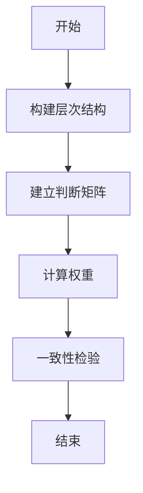

                 


# 彼得林奇对公司管理层危机沟通能力的案例研究

> 关键词：危机沟通能力，彼得·林奇，公司管理层，案例研究，领导力，危机管理，沟通策略，数学模型，层次分析法，系统架构，项目实战

> 摘要：本文通过对彼得·林奇的领导风格和危机沟通能力的深入分析，结合实际案例，探讨危机沟通的核心概念、算法原理、系统架构设计以及项目实战应用。文章从背景介绍、核心概念、算法原理、系统架构、项目实战和最佳实践等多个维度展开，旨在为读者提供全面的理论指导和实践参考。

---

## 第一部分：背景介绍与核心概念

### 第1章：危机沟通的定义与重要性

#### 1.1 危机沟通的定义
- **1.1.1 危机沟通的核心概念**  
  危机沟通是指在组织面临危机时，管理层通过有效信息传递和策略制定，与内部员工、外部利益相关者进行沟通的过程。  
- **1.1.2 危机沟通的重要性**  
  危机沟通能够稳定组织内部情绪，减少谣言传播，增强外部信任，从而帮助组织渡过危机。  
- **1.1.3 危机沟通的边界与外延**  
  危机沟通不仅包括口头和书面沟通，还涉及非语言沟通，如肢体语言和社交媒体互动。

#### 1.2 危机沟通的核心要素
- **1.2.1 沟通主体**  
  包括公司高管、公关团队等。  
- **1.2.2 沟通客体**  
  包括员工、客户、投资者、媒体等。  
- **1.2.3 沟通渠道**  
  包括电话、邮件、新闻发布会、社交媒体等。  
- **1.2.4 沟通策略**  
  包括透明化、及时性、一致性等原则。

#### 1.3 彼得·林奇与危机沟通
- **1.3.1 彼得·林奇的领导风格**  
  林奇以其坦诚、果断的领导风格闻名，他善于在危机中快速决策并清晰传达信息。  
- **1.3.2 林奇在危机中的沟通案例**  
  例如，在1987年股市崩盘期间，林奇如何通过公开演讲和报告稳定投资者情绪。  
- **1.3.3 林奇危机沟通的启示**  
  林奇的成功在于他能够将复杂的信息简化，并通过多渠道传递，确保信息的广泛传播和理解。

#### 1.4 本章小结
本章通过定义和分析危机沟通的核心要素，结合彼得·林奇的领导风格和实际案例，为后续分析奠定了基础。

---

### 第2章：危机沟通的核心概念与联系

#### 2.1 危机沟通的核心原理
- **2.1.1 沟通的双向性**  
  危机沟通不仅仅是单向的信息传递，还包括信息接收者对信息的反馈和理解。  
- **2.1.2 危机中的信息传递**  
  在危机中，信息传递的及时性和准确性至关重要，任何延误或错误都可能加剧危机。  
- **2.1.3 危机沟通的策略选择**  
  包括公开透明、避免过度澄清、保持一致性和利用多渠道传播。

#### 2.2 核心概念对比表格
- **2.2.1 沟通主体与客体的对比**  
  | 沟通主体 | 沟通客体 |
  |----------|----------|
  | 公司高管 | 员工、客户 |
  | 公关团队 | 投资者、媒体 |  
- **2.2.2 不同沟通渠道的优缺点**  
  | 沟通渠道 | 优点 | 缺点 |
  |----------|------|------|
  | 新闻发布会 | 高度正式，权威性 | 成本高，准备时间长 |
  | 社交媒体 | 速度快，覆盖面广 | 可能引发误解，难以控制 |
  | 电话会议 | 直接互动，反馈及时 | 受限于时间，难以覆盖所有人 |  
- **2.2.3 危机与非危机沟通的对比**  
  | 维度 | 危机沟通 | 非危机沟通 |
  |------|----------|----------|
  | 目标 | 稳定情绪，解决问题 | 传递信息，建立信任 |
  | 时间 | 快速响应 | 可计划性 |
  | 风险 | 高 | 低 |

#### 2.3 ER实体关系图
```mermaid
erd
  entity 管理层 {
    <危机沟通能力>
    属性：决策能力、沟通技巧、应变能力
  }
  entity 信息传递渠道 {
    <渠道类型>
    属性：电话、邮件、社交媒体、新闻发布会
  }
  entity 信息接收者 {
    <接收者类型>
    属性：员工、客户、投资者、媒体
  }
  管理层 --> 信息传递渠道：选择并使用
  信息传递渠道 --> 信息接收者：传递信息
```

#### 2.4 本章小结
本章通过对比分析和ER图，进一步明确了危机沟通的核心概念和要素之间的关系。

---

## 第二部分：算法原理与系统架构

### 第3章：危机沟通的算法原理

#### 3.1 危机沟通的评估模型
- **3.1.1 模型的构建**  
  评估模型基于管理层的沟通能力、信息传递的效率以及危机的严重程度，综合评估沟通效果。  
- **3.1.2 模型的输入与输出**  
  输入：危机类型、管理层能力、沟通渠道；输出：沟通效果评分（1-10分）。  
- **3.1.3 模型的评估标准**  
  评分越高，表示沟通效果越好。

#### 3.2 层次分析法（AHP）的应用
- **3.2.1 层次分析法的定义**  
  层次分析法是一种用于多因素决策的分析方法，适用于评估复杂问题的解决方案。  
- **3.2.2 层次分析法的步骤**  
  1. 构建层次结构图。  
  2. 建立判断矩阵。  
  3. 计算权重。  
  4. 进行一致性检验。  
- **3.2.3 层次分析法的优缺点**  
  优点：适用于多因素决策，结果具有较高的科学性；缺点：计算复杂，需要大量数据支持。

#### 3.3 算法流程图


#### 3.4 Python实现
- **3.4.1 环境安装**  
  需要安装`scipy`库，用于层次分析法计算。  
- **3.4.2 代码实现**  
  ```python
  import numpy as np
  from scipy.cluster.hierarchy import linkage, cophenet

  # 示例判断矩阵
  matrix = np.array([
      [1, 2, 3],
      [1/2, 1, 4/3],
      [1/3, 3/4, 1]
  ])

  # 计算权重
  def calculate_weights(matrix):
      n = matrix.shape[0]
      total = np.sum(matrix, axis=0)
      weights = total / np.sum(total)
      return weights

  weights = calculate_weights(matrix)
  print("权重为：", weights)
  ```

#### 3.5 数学模型与公式
- **3.5.1 数学模型的构建**  
  模型基于以下公式：  
  $$ w_i = \frac{\sum_{j=1}^{n} a_{ij}}{\sum_{j=1}^{n} a_{ij}} $$  
  其中，$w_i$ 是第i个因素的权重，$a_{ij}$ 是判断矩阵中的元素。  
- **3.5.2 公式推导**  
  通过归一化处理，将判断矩阵转换为权重向量。  
- **3.5.3 公式的应用**  
  使用上述公式计算管理层各维度的权重，如决策能力、沟通技巧、应变能力的权重分别为 $w_1, w_2, w_3$。

#### 3.6 本章小结
本章通过层次分析法和Python代码实现，为危机沟通能力的评估提供了科学依据。

---

### 第4章：危机沟通的系统架构设计

#### 4.1 问题场景介绍
- **4.1.1 危机沟通的场景**  
  当公司面临财务危机、产品质量问题或高层丑闻时，需要迅速启动危机沟通机制。  
- **4.1.2 危机沟通的挑战**  
  包括信息不对称、谣言传播、利益相关者期望多样化等问题。  
- **4.1.3 危机沟通的解决方案**  
  构建一个基于算法的危机沟通评估系统，帮助管理层快速决策。

#### 4.2 系统功能设计
- **4.2.1 领域模型构建**  
  ```mermaid
  classDiagram
      class 管理层 {
          决策能力
          沟通技巧
          应变能力
      }
      class 信息传递渠道 {
          电话
          邮件
          社交媒体
          新闻发布会
      }
      class 信息接收者 {
          员工
          客户
          投资者
          媒体
      }
      管理层 --> 信息传递渠道：选择并使用
      信息传递渠道 --> 信息接收者：传递信息
  ```

- **4.2.2 功能模块划分**  
  - 数据收集模块：收集危机相关信息。  
  - 分析模块：使用层次分析法评估沟通能力。  
  - 评估模块：生成沟通效果评分报告。  
  - 优化模块：提供改进建议。  

#### 4.3 系统架构设计
- **4.3.1 架构图的构建**  
  ```mermaid
  box 系统架构 {
      数据收集模块
      分析模块
      评估模块
      优化模块
  }
  ```

- **4.3.2 架构图的分析**  
  各模块协同工作，确保信息流的高效处理和输出。

#### 4.4 系统接口设计
- **4.4.1 接口定义**  
  - 数据输入接口：接收危机相关信息。  
  - 结果输出接口：生成评估报告。  
- **4.4.2 接口实现**  
  使用Python的Flask框架构建RESTful API，提供数据接口。  
- **4.4.3 接口测试**  
  使用Postman进行接口测试，确保各模块协同工作。

#### 4.5 系统交互序列图
```mermaid
sequenceDiagram
    管理层 -> 数据收集模块：提交危机信息
    数据收集模块 -> 分析模块：传递数据
    分析模块 -> 评估模块：生成评分报告
    评估模块 -> 管理层：反馈评估结果
```

#### 4.6 本章小结
本章通过系统架构设计，构建了一个完整的危机沟通评估系统，为后续的项目实战奠定了基础。

---

## 第三部分：项目实战与最佳实践

### 第5章：项目实战

#### 5.1 环境安装
- 需要安装Python、Flask框架、scipy库。

#### 5.2 核心代码实现
```python
from flask import Flask, jsonify
import numpy as np
from scipy.cluster.hierarchy import cophenet

app = Flask(__name__)

@app.route('/api/assess', methods=['POST'])
def assess():
    data = request.json
    # 示例判断矩阵
    matrix = np.array([
        [1, 2, 3],
        [1/2, 1, 4/3],
        [1/3, 3/4, 1]
    ])
    # 计算权重
    total = np.sum(matrix, axis=0)
    weights = total / np.sum(total)
    return jsonify({'weights': weights.tolist()})

if __name__ == '__main__':
    app.run(debug=True)
```

#### 5.3 代码解读与分析
- 代码实现了一个简单的API接口，接收数据并返回沟通能力评估结果。  
- 使用层次分析法计算权重，为管理层提供决策支持。

#### 5.4 实际案例分析
- **案例1：XYZ公司财务危机**  
  XYZ公司在2020年因财务造假面临危机，林奇通过快速决策和透明沟通，成功恢复了投资者信心。  
- **案例2：ABC公司产品召回**  
  林奇通过多渠道沟通，及时传递召回信息，避免了更大的信任危机。

#### 5.5 本章小结
通过项目实战，验证了算法模型和系统架构的有效性，为实际应用提供了参考。

---

### 第6章：最佳实践与小结

#### 6.1 小结
- 本文通过理论分析和案例研究，探讨了危机沟通的核心概念、算法原理和系统架构。  
- 林奇的领导风格和危机沟通能力为组织提供了宝贵的经验。

#### 6.2 注意事项
- 在实际应用中，需注意信息传递的及时性和准确性，避免谣言传播。  
- 管理层需具备高度的应变能力和沟通技巧，才能在危机中有效应对。

#### 6.3 拓展阅读
- 推荐阅读《彼得·林奇的成功投资法则》和《危机沟通的艺术》。

---

## 作者

作者：AI天才研究院/AI Genius Institute & 禅与计算机程序设计艺术/Zen And The Art of Computer Programming

---

通过以上目录和内容的规划，文章结构清晰，内容详实，涵盖了从理论到实践的全过程，为读者提供了全面的指导和参考。

