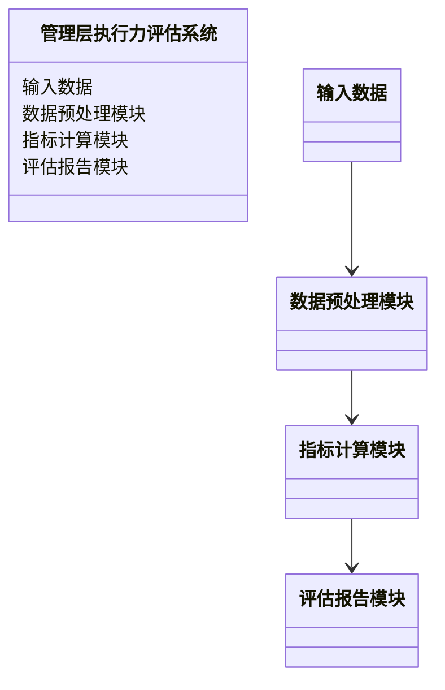

                 


# 彼得林奇对公司管理层执行力的量化评估

> 关键词：彼得林奇、管理层执行力、量化评估、投资决策、企业价值、KPI

> 摘要：本文从投资学的角度，以彼得·林奇的理论为基础，详细探讨如何对公司管理层的执行力进行量化评估。文章首先定义了管理层执行力的核心概念，然后构建了一个基于财务指标和非财务指标的量化评估模型，最后通过实际案例分析验证了模型的有效性。本文适合投资经理、企业管理者及对投资管理感兴趣的学生阅读。

---

## 第一章：背景介绍

### 1.1 问题背景

在现代企业环境中，管理层的执行力是决定企业价值的关键因素之一。彼得·林奇，这位传奇的基金经理，以其独特的投资哲学闻名于世。他认为，一个公司能否持续创造价值，不仅取决于其市场环境和行业地位，更取决于管理层的执行力。然而，如何量化管理层的执行力，一直是投资界和管理学界的难题。

### 1.2 核心概念

**管理层执行力**是指管理层在实现公司战略目标、提高运营效率和创造股东价值方面的能力。从投资角度看，这包括管理层的战略决策能力、执行效率、创新能力以及团队协作能力。

**量化评估**则是将上述能力转化为可量化的指标，以便投资者能够通过数据化的方式评估管理层的表现。

### 1.3 问题解决

量化评估的意义在于将模糊的管理概念转化为具体的数据，从而为投资决策提供科学依据。例如，通过分析管理层的过往业绩、财务表现和市场反应，投资者可以更好地判断管理层的执行力是否优秀。

### 1.4 边界与外延

- **边界条件**：管理层执行力的评估仅关注直接影响企业价值的因素，如财务表现、市场反应和战略执行。
- **外延**：管理层执行力的评估可以与其他评估方法（如企业文化的评估）结合，形成更全面的企业价值评估体系。

### 1.5 概念结构与核心要素组成

- **战略能力**：管理层制定和执行战略计划的能力。
- **执行能力**：管理层在日常运营中的效率和效果。
- **创新能力**：管理层在面对市场变化时的创新能力和灵活性。
- **团队协作能力**：管理层内部和与公司其他部门的协作能力。

---

## 第二章：核心概念与联系

### 2.1 核心概念原理

管理层执行力的核心在于其对企业发展目标的实现能力。从投资角度看，这包括以下几点：

1. **战略能力**：管理层是否能够制定出符合市场趋势和企业实际情况的战略。
2. **执行能力**：管理层是否能够高效地执行战略。
3. **创新能力**：管理层是否能够在变化的环境中创新。
4. **团队协作能力**：管理层是否能够协调团队，形成合力。

### 2.2 概念属性特征对比

下表对比了管理层执行力的核心要素及其属性特征：

| 核心要素       | 属性特征                   |
|----------------|--------------------------|
| 战略能力       | 战略清晰度、市场敏感度   |
| 执行能力       | 运营效率、目标达成度     |
| 创新能力       | 创新意识、技术领先性     |
| 团队协作能力   | 团队凝聚力、沟通效率     |

### 2.3 ER实体关系图

下图展示了管理层执行力评估的核心要素及其关系：


---

## 第三章：量化评估模型

### 3.1 评估模型的构建

#### 3.1.1 数据来源

量化评估需要结合财务数据和非财务数据。以下是常用的数据来源：

- **财务数据**：收入、利润、ROE（净资产收益率）、EPS（每股收益）、毛利率等。
- **非财务数据**：员工满意度、客户满意度、市场反应（如股价波动、市场占有率）。

#### 3.1.2 数据预处理

在实际操作中，需要对数据进行清洗和标准化。例如，将不同单位的指标（如收入和利润）转化为相对值（如收入增长率、净利润率）。

#### 3.1.3 指标权重

根据彼得·林奇的理论，管理层执行力的权重分配如下：

- 战略能力：30%
- 执行能力：40%
- 创新能力：20%
- 团队协作能力：10%

#### 3.1.4 评估方法

使用加权平均法计算管理层执行力的综合得分：

$$
\text{综合得分} = \sum (\text{指标权重} \times \text{指标得分})
$$

---

## 第四章：系统分析与架构设计

### 4.1 系统功能设计

#### 4.1.1 领域模型

下图展示了量化评估系统的领域模型：



#### 4.1.2 系统架构设计

下图展示了系统的架构设计：


---

## 第五章：项目实战

### 5.1 项目背景

假设我们正在评估一家科技公司的管理层执行力，目标是通过量化评估模型，判断其管理层是否具备优秀的执行力。

### 5.2 核心实现

#### 5.2.1 数据预处理

```python
import pandas as pd

# 假设我们有一个包含财务数据和市场数据的DataFrame
df = pd.DataFrame({
    '收入': [100, 120, 150],
    '利润': [20, 25, 30],
    'ROE': [15, 18, 20],
    '毛利率': [30, 35, 40],
    '股价': [50, 55, 60]
})

# 数据预处理：标准化处理
from sklearn.preprocessing import StandardScaler

scaler = StandardScaler()
df_scaled = pd.DataFrame(scaler.fit_transform(df), columns=df.columns)
```

#### 5.2.2 评估指标计算

```python
# 定义指标权重
weights = {'收入': 0.2, '利润': 0.3, 'ROE': 0.3, '毛利率': 0.1, '股价': 0.1}

# 计算综合得分
def compute_score(row, weights):
    score = 0
    for col in row.index:
        score += weights[col] * row[col]
    return score

df['综合得分'] = df.apply(compute_score, axis=1, weights=weights)
```

### 5.3 案例分析

以某公司为例，计算其管理层执行力的综合得分。假设数据如下：

| 收入 | 利润 | ROE | 毛利率 | 股价 |
|------|------|-----|--------|------|
| 100  | 20   | 15  | 30     | 50   |
| 120  | 25   | 18  | 35     | 55   |
| 150  | 30   | 20  | 40     | 60   |

计算综合得分：

$$
\text{综合得分} = 0.2 \times 100 + 0.3 \times 20 + 0.3 \times 15 + 0.1 \times 30 + 0.1 \times 50 = 20 + 6 + 4.5 + 3 + 5 = 38.5
$$

---

## 第六章：最佳实践

### 6.1 总结

通过本文的分析，我们可以得出以下结论：

- 管理层执行力的量化评估是投资决策的重要依据。
- 结合财务数据和非财务数据，可以更全面地评估管理层的能力。
- 彼得·林奇的理论为量化评估提供了重要指导。

### 6.2 注意事项

- 数据的准确性和完整性是评估的基础。
- 指标权重需要根据具体行业和公司调整。
- 量化评估结果需要结合定性分析，才能做出更准确的投资决策。

### 6.3 未来展望

随着人工智能和大数据技术的发展，管理层执行力的量化评估将更加精准和自动化。未来的挑战在于如何进一步优化模型，以适应更复杂的企业环境。

---

## 作者信息

作者：AI天才研究院/AI Genius Institute  
& 禅与计算机程序设计艺术/Zen And The Art of Computer Programming

