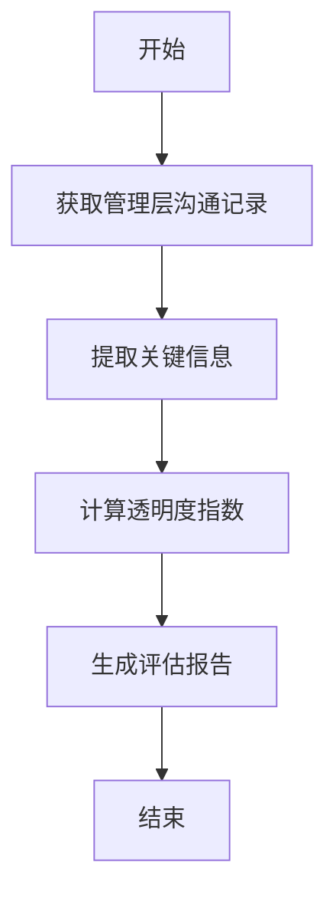
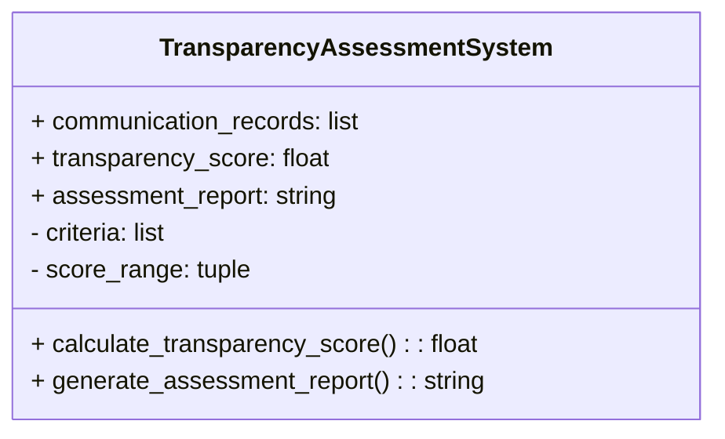
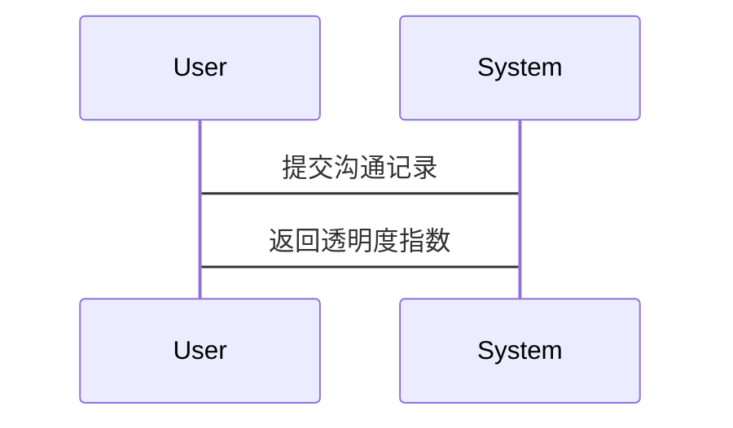

                 


# 彼得·林奇对公司管理层沟通透明度的评估

> 关键词：彼得·林奇，管理层沟通，透明度评估，投资者决策，企业价值

> 摘要：本文探讨了彼得·林奇对公司管理层沟通透明度的评估方法，分析了透明度对投资者决策的影响，结合实际案例和数学模型，详细阐述了如何通过透明度评估优化企业价值。

---

## 第一部分：引言

### 1.1 背景介绍

#### 1.1.1 问题背景：管理层沟通透明度的重要性
在现代投资领域，管理层的沟通透明度是投资者评估企业价值的关键因素之一。透明的沟通能够帮助投资者了解企业的经营状况、战略规划和潜在风险，从而做出更明智的投资决策。彼得·林奇作为一位著名投资专家，曾强调管理层与投资者之间的有效沟通是企业长期成功的重要基石。

#### 1.1.2 问题描述：彼得·林奇的投资理念与沟通透明度的关系
彼得·林奇在其投资生涯中，始终坚持以基本面分析为核心，而管理层的沟通透明度是其基本面分析的重要组成部分。他认为，透明的沟通不仅能够增强投资者对企业的信任，还能够提升企业的市场形象和投资者信心。

#### 1.1.3 问题解决：如何评估管理层的沟通透明度
为了量化管理层的沟通透明度，我们需要建立一套科学的评估体系，从管理层的沟通频率、信息的完整性和及时性等方面进行分析，从而为投资者提供有价值的参考。

#### 1.1.4 边界与外延：沟通透明度的定义与范围
沟通透明度是指管理层在与投资者、股东和其他利益相关者进行沟通时，所提供信息的全面性、准确性和及时性。其外延包括公司公告、财务报告、管理层会议记录等。

#### 1.1.5 概念结构与核心要素组成：透明度、管理层、投资者决策的关系
透明度是连接管理层与投资者的桥梁，直接影响投资者对企业的信任度和投资决策。透明度越高，投资者越容易做出准确的估值，从而提升企业的市场价值。

---

## 第二部分：核心概念与联系

### 2.1 核心概念原理

#### 2.1.1 管理层沟通透明度的定义与特征
管理层沟通透明度是指企业在与投资者和其他利益相关者进行沟通时，所提供信息的全面性、准确性和及时性。其主要特征包括：
- **全面性**：涵盖企业经营的各个方面。
- **准确性**：信息真实可靠。
- **及时性**：信息更新及时。

#### 2.1.2 透明度与企业价值的关系
透明度高的企业更容易获得投资者的信任，从而在资本市场上获得更好的估值。同时，透明的沟通也有助于企业发现潜在问题，及时调整经营策略。

#### 2.1.3 彼得·林奇投资理念的核心要素
林奇的投资理念强调对企业基本面的深入分析，包括财务状况、管理层能力、市场地位等。其中，管理层的沟通透明度是其评估企业的重要指标之一。

### 2.2 核心概念对比表

#### 表2.1：透明度与企业价值的对比分析

| 透明度特征 | 高透明度企业 | 低透明度企业 |
|------------|--------------|--------------|
| 信息全面性 | 高            | 低            |
| 投资者信任 | 高            | 低            |
| 市场估值    | 高            | 低            |

### 2.3 ER实体关系图

#### 图2.1：管理层-投资者-透明度的实体关系图

```mermaid
erDiagram
    manager[管理层] {
        id: int
        communication: string
        transparency_level: int
    }
    investor[投资者] {
        id: int
        trust_level: int
        investment_decision: string
    }
    transparency[透明度] {
        id: int
        criteria: string
        score: int
    }
    manager --> transparency : 提供信息
    transparency --> investor : 影响决策
```

---

## 第三部分：算法原理讲解

### 3.1 透明度评估算法原理

#### 3.1.1 算法流程图

#### 图3.1：透明度评估算法流程图



#### 3.1.2 数学模型与公式

##### 公式3.1：透明度指数计算公式

$$ T = \frac{S}{N} \times 100 $$

其中，\( T \) 为透明度指数，\( S \) 为透明度事件数量，\( N \) 为总事件数量。

---

## 第四部分：系统分析与架构设计方案

### 4.1 问题场景介绍

#### 4.1.1 投资者如何通过管理层沟通透明度评估企业价值
投资者可以通过分析企业的公告、财务报告和管理层会议记录，评估管理层的沟通透明度，从而做出更准确的投资决策。

#### 4.1.2 企业如何优化管理层沟通透明度
企业可以通过定期发布财务报告、召开投资者会议、建立透明的沟通渠道等方式，优化管理层的沟通透明度。

### 4.2 项目介绍

#### 4.2.1 透明度评估系统的目标与范围
目标：开发一套透明度评估系统，帮助投资者和企业量化管理层的沟通透明度。
范围：包括信息收集、分析和评估报告生成。

#### 4.2.2 系统功能设计：领域模型

#### 图4.1：透明度评估系统领域模型类图



### 4.3 系统架构设计

#### 图4.2：透明度评估系统架构图


### 4.4 系统接口设计

#### 4.4.1 API接口设计

- **接口名称**：`calculate_transparency_score`
- **输入参数**：`communication_records`（字符串列表）
- **输出参数**：`transparency_score`（浮点数）

#### 4.4.2 数据接口规范

- 数据格式：JSON
- 数据存储：MySQL数据库

### 4.5 系统交互设计

#### 图4.3：透明度评估系统交互序列图



---

## 第五部分：案例分析与实战

### 5.1 案例分析

#### 5.1.1 案例背景介绍
以某科技公司为例，分析其管理层沟通透明度的评估过程。

#### 5.1.2 透明度评估指标与数据来源
- 指标：信息全面性、准确性和及时性
- 数据来源：公司公告、财务报告、管理层会议记录

#### 5.1.3 透明度指数计算与结果分析
根据公式计算透明度指数，分析结果对企业价值的影响。

### 5.2 项目实战

#### 5.2.1 环境安装
- 安装Python和相关库（如Pandas、NumPy）

#### 5.2.2 系统核心实现源代码

```python
def calculate_transparency_score(records):
    criteria = ['全面性', '准确性', '及时性']
    scores = []
    for record in records:
        score = 0
        for c in criteria:
            if c in record:
                score += 1
        scores.append(score)
    transparency_score = sum(scores) / len(scores)
    return transparency_score

# 示例数据
records = [
    "财务报告准确，信息全面",
    "管理层会议记录及时发布",
    "公告信息不完整"
]
print(calculate_transparency_score(records))
```

#### 5.2.3 代码应用解读与分析
解释代码的功能和实现逻辑，分析其在实际应用中的表现。

### 5.3 案例分析与详细讲解

#### 5.3.1 案例分析：某科技公司
分析该公司管理层的沟通透明度，计算透明度指数，评估其对企业价值的影响。

#### 5.3.2 详细讲解：透明度指数的应用
说明透明度指数在投资决策中的具体应用，如何帮助企业优化沟通策略。

---

## 第六部分：总结与展望

### 6.1 最佳实践 tips

- **投资者**：定期评估企业的透明度指数，做出更明智的投资决策。
- **企业**：优化管理层的沟通策略，提升透明度指数，增强市场信任。

### 6.2 小结

本文详细探讨了彼得·林奇对公司管理层沟通透明度的评估方法，结合实际案例和数学模型，分析了透明度对投资者决策和企业价值的影响。通过建立透明度评估系统，投资者和企业可以更科学地评估和优化沟通透明度。

### 6.3 注意事项

- 透明度评估需要结合企业的实际情况，不可一刀切。
- 数据来源和评估指标的选择应根据行业特点进行调整。

### 6.4 拓展阅读

- 彼得·林奇的其他投资理念
- 透明度评估的其他应用场景

---

## 结语

彼得·林奇的沟通透明度评估方法为我们提供了一个科学的视角，帮助投资者和企业更好地理解管理层的沟通策略。通过本文的分析，我们希望读者能够掌握透明度评估的核心思想，并将其应用到实际投资和企业管理中。

---

作者：AI天才研究院/AI Genius Institute & 禅与计算机程序设计艺术 /Zen And The Art of Computer Programming

