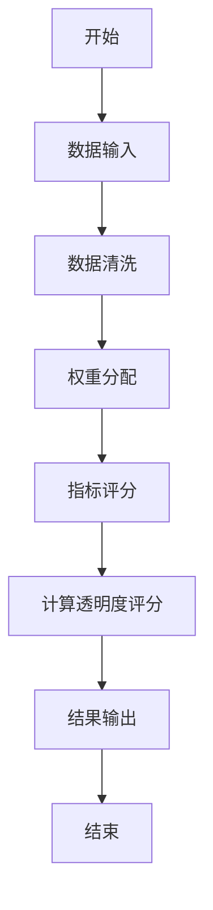
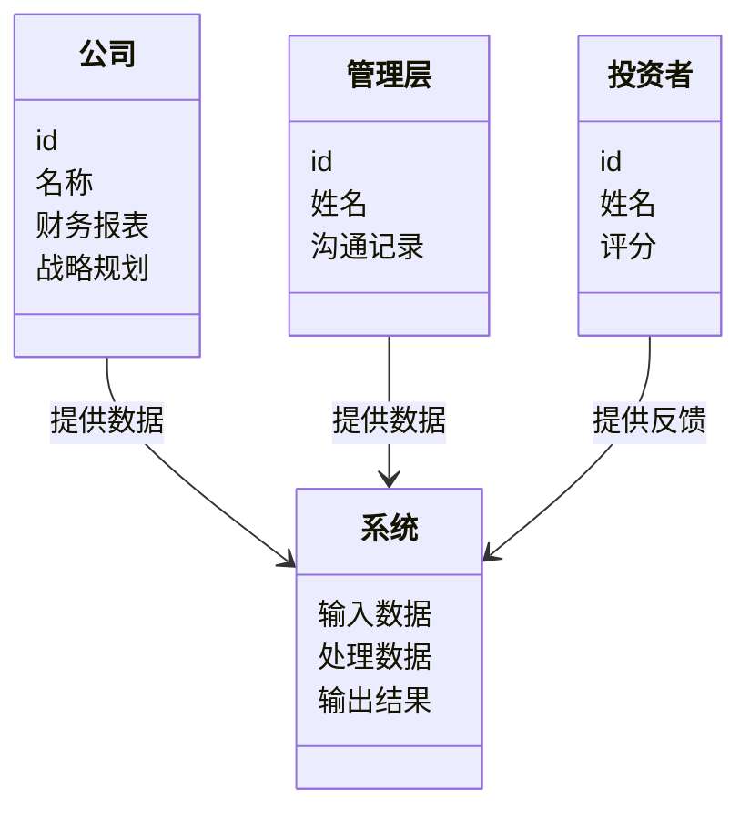
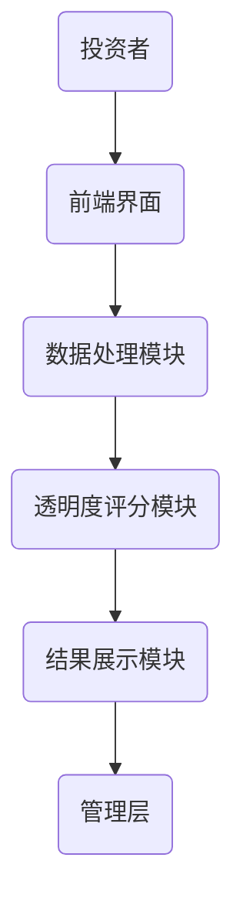
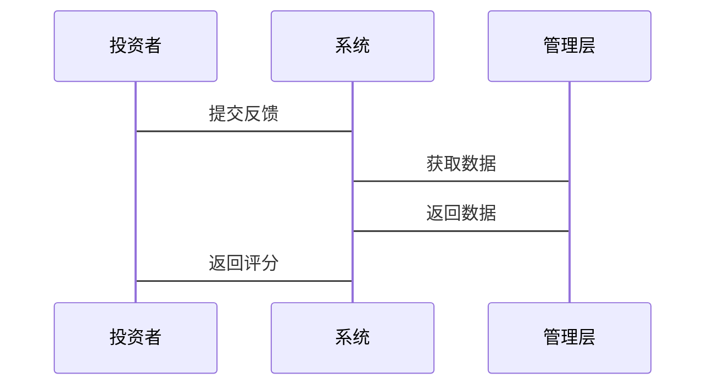

                 


# 彼得林奇对公司管理层沟通透明度的量化评估方法

> 关键词：彼得林奇，沟通透明度，量化评估，公司治理，投资决策，信息不对称

> 摘要：本文深入探讨了彼得林奇对公司管理层沟通透明度的量化评估方法，从理论基础到实际应用，系统性地分析了如何通过量化方法评估公司管理层的沟通透明度。文章结合了数学模型、算法实现和实际案例，为投资者和公司治理提供了实用的参考。

---

# 第一部分: 背景介绍

## 第1章: 沟通透明度的定义与重要性

### 1.1 沟通透明度的核心概念

#### 1.1.1 沟通透明度的定义
沟通透明度是指公司在与其利益相关者（如投资者、员工、客户等）进行信息交流时，所表现出的开放性、真实性和及时性。它是公司治理和企业信任的重要组成部分。

#### 1.1.2 沟通透明度的重要性
- 对投资者而言，透明度是评估公司价值和风险的重要依据。
- 对公司而言，透明度高的沟通能够提升企业声誉和投资者信任。
- 对管理层而言，透明度高的沟通有助于避免信息不对称引发的潜在风险。

#### 1.1.3 沟通透明度的边界与外延
- 边界：透明度并非要求公司公开所有信息，而是要在合法合规的前提下，公开与决策相关的关键信息。
- 外延：透明度不仅包括财务信息，还涉及战略规划、风险管理、公司治理等多个方面。

### 1.2 彼得林奇的背景与投资理念

#### 1.2.1 彼得林奇的投资者身份
彼得林奇是美国著名的投资专家，曾任富达投资的基金经理，以其长期优异的投资业绩闻名。他的投资理念强调对公司基本面的深入研究和对管理层的信任。

#### 1.2.2 彼得林奇的投资哲学
- 长期投资：彼得林奇主张长期投资，而非短期投机。
- 基本面分析：他注重对公司财务状况、管理层能力和行业前景的分析。
- 透明度的重要性：他认为，公司管理层的透明度是评估公司治理和投资价值的重要指标。

#### 1.2.3 彼得林奇与公司治理的关系
彼得林奇不仅是一位投资者，也是公司治理的积极参与者。他通过与公司管理层的互动，观察其沟通风格和透明度，从而做出投资决策。

### 1.3 问题背景与现状分析

#### 1.3.1 现有公司治理中的沟通问题
- 信息不对称：管理层与投资者之间的信息获取不平等。
- 沟通不透明：公司不愿公开关键信息，导致投资者难以评估公司价值。
- 沟通渠道有限：公司缺乏有效的沟通渠道，投资者难以获取及时信息。

#### 1.3.2 沟通透明度的缺失原因
- 管理层动机：管理层可能出于自身利益，隐藏负面信息。
- 制度缺陷：公司治理制度不完善，缺乏透明度的强制要求。
- 文化因素：企业内部文化不鼓励透明沟通。

---

# 第二部分: 核心概念与联系

## 第2章: 沟通透明度的维度与属性

### 2.1 沟通透明度的维度分析

#### 2.1.1 时间维度
- 及时性：公司是否能够及时公开信息。
- 前瞻性：公司是否能够提供未来的战略规划和风险提示。

#### 2.1.2 内容维度
- 信息完整性：公司公开的信息是否全面。
- 信息准确性：公司公开的信息是否真实可靠。

#### 2.1.3 对象维度
- 投资者：公司是否向投资者公开关键信息。
- 员工：公司是否与员工保持透明沟通。
- 客户：公司是否向客户公开产品和服务信息。

### 2.2 沟通透明度的属性特征对比

#### 2.2.1 表格对比
以下是一个对比表格，展示了沟通透明度与其他相关概念的异同：

| 概念        | 定义                                   | 与透明度的关系 |
|-------------|--------------------------------------|----------------|
| 信息不对称    | 信息在交易双方之间的不平等分配        | 导致透明度不足 |
| 信息完整性    | 公开信息的全面性                     | 透明度的核心要素 |
| 信息准确性    | 公开信息的正确性                     | 透明度的关键指标 |

#### 2.2.2 ER实体关系图
以下是一个简单的ER图，展示了公司、管理层和投资者之间的关系：

```mermaid
entity 公司 {
    id
    名称
}

entity 管理层 {
    id
    姓名
}

entity 投资者 {
    id
    姓名
}

关系 沟通透明度 {
    公司 -> 管理层: 管理
    管理层 -> 投资者: 沟通
}
```

---

# 第三部分: 算法原理讲解

## 第3章: 沟通透明度量化评估模型

### 3.1 模型构建原理

#### 3.1.1 数据输入
- 公司公开信息：包括财务报表、战略规划、管理层沟通记录等。
- 投资者反馈：投资者对管理层沟通的满意度评分。
- 行业基准：同行业其他公司的透明度评分。

#### 3.1.2 模型处理
- 数据清洗：去除无效数据，填补缺失值。
- 权重分配：根据透明度的关键性，分配不同权重。
- 指标评分：对每个透明度维度进行评分。

#### 3.1.3 结果输出
- 透明度综合评分：通过加权计算得出最终评分。
- 透明度排名：根据评分对公司在同行业中的排名进行排序。

### 3.2 模型的数学表达

#### 3.2.1 透明度评分公式
$$
透明度评分 = \sum_{i=1}^{n} w_i \cdot x_i
$$
其中，$w_i$ 为第 $i$ 个指标的权重，$x_i$ 为第 $i$ 个指标的评分。

#### 3.2.2 透明度排名公式
$$
排名 = \frac{\sum_{j=1}^{m} r_j}{m}
$$
其中，$r_j$ 为第 $j$ 家公司的透明度评分，$m$ 为公司总数。

### 3.3 模型流程图



## 第4章: 算法实现与代码解读

### 4.1 Python代码实现

#### 4.1.1 数据清洗与预处理

```python
import pandas as pd

# 读取数据
data = pd.read_csv('transparency_data.csv')

# 去除缺失值
data.dropna(inplace=True)

# 填补缺失值
data = data.fillna(0)
```

#### 4.1.2 权重分配与评分计算

```python
# 定义权重
weights = {
    '财务透明度': 0.4,
    '战略规划透明度': 0.3,
    '管理层沟通': 0.2,
    '员工反馈': 0.1
}

# 计算透明度评分
def calculate_transparency_score(criteria_scores, weights):
    return sum(w * score for w, score in zip(weights.values(), criteria_scores))

# 示例数据
criteria_scores = [0.8, 0.7, 0.6, 0.5]
score = calculate_transparency_score(criteria_scores, weights)
print(f"透明度评分：{score}")
```

---

# 第四部分: 系统分析与架构设计

## 第5章: 系统分析与架构设计

### 5.1 问题场景介绍

#### 5.1.1 问题场景
- 投资者希望评估公司管理层的沟通透明度。
- 公司希望提升自身透明度，增强投资者信任。

### 5.2 系统功能设计

#### 5.2.1 领域模型



### 5.3 系统架构设计

#### 5.3.1 架构图



### 5.4 系统接口设计

#### 5.4.1 接口定义
- 输入接口：公司公开信息、投资者反馈。
- 输出接口：透明度评分、透明度排名。

#### 5.4.2 交互流程图



---

# 第五部分: 项目实战

## 第6章: 项目实战

### 6.1 环境安装

#### 6.1.1 安装Python

```bash
python --version
pip install pandas
pip install mermaid
```

### 6.2 核心代码实现

#### 6.2.1 代码实现

```python
import pandas as pd

# 读取数据
data = pd.read_csv('transparency_data.csv')

# 数据清洗
data.dropna(inplace=True)

# 权重分配
weights = {
    '财务透明度': 0.4,
    '战略规划透明度': 0.3,
    '管理层沟通': 0.2,
    '员工反馈': 0.1
}

# 计算透明度评分
def calculate_transparency_score(criteria_scores, weights):
    return sum(w * score for w, score in zip(weights.values(), criteria_scores))

# 示例计算
criteria_scores = [0.8, 0.7, 0.6, 0.5]
score = calculate_transparency_score(criteria_scores, weights)
print(f"透明度评分：{score}")
```

---

# 第六部分: 总结与展望

## 第7章: 总结与展望

### 7.1 最佳实践与小结

#### 7.1.1 最佳实践
- 定期评估透明度，及时调整沟通策略。
- 提供多渠道的沟通方式，确保信息传递的及时性。
- 建立透明度评估机制，量化公司治理的改进效果。

#### 7.1.2 小结
彼得林奇的透明度量化评估方法为投资者和公司治理提供了重要的工具。通过数学模型和算法实现，能够客观评估公司管理层的沟通透明度，从而做出更明智的投资决策。

### 7.2 注意事项与建议

#### 7.2.1 注意事项
- 数据的准确性和完整性是评估的基础。
- 模型的权重分配需要根据实际情况调整。
- 要注意信息的合法合规性，避免侵犯隐私。

#### 7.2.2 拓展阅读
- 《投资之道》：彼得林奇的 investing哲学。
- 《公司治理与透明度》：深入探讨公司治理的理论与实践。

---

# 作者：AI天才研究院 & 禅与计算机程序设计艺术

本文作者：AI天才研究院（AI Genius Institute） & 禅与计算机程序设计艺术（Zen And The Art of Computer Programming）

---

以上是文章的完整目录大纲和详细内容，涵盖了从理论到实践的各个方面，结合了技术实现和实际案例，为读者提供了全面的指导和实用的工具。

