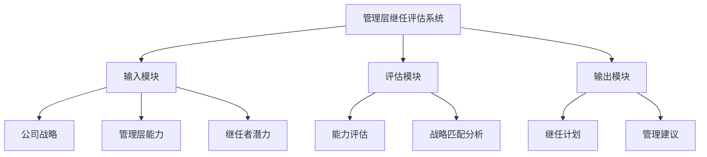
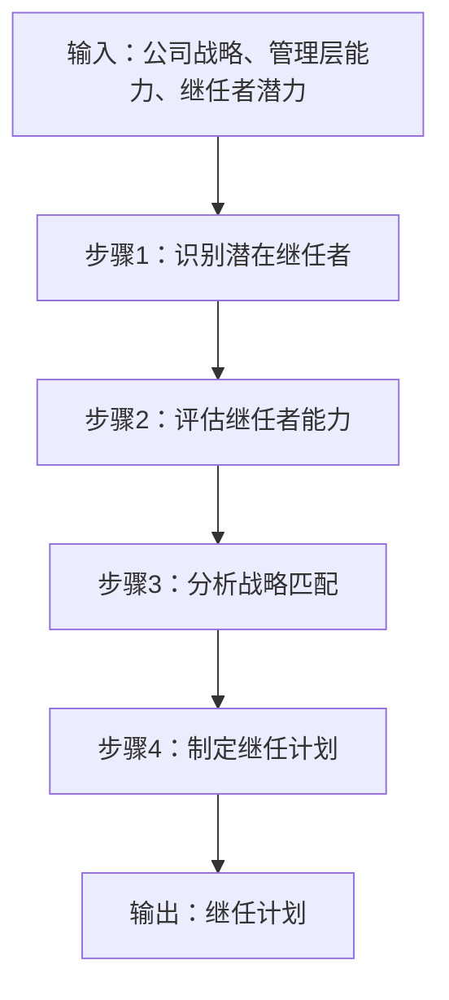

                 


# 彼得林奇对公司管理层继任计划的评估

> 关键词：彼得林奇，管理层继任，公司治理，领导力评估，投资策略

> 摘要：本文深入分析了彼得林奇在评估公司管理层继任计划时的核心思想和方法。通过介绍管理层继任计划的背景、核心概念、评估方法、系统架构设计、项目实战以及数学模型，本文详细阐述了彼得林奇如何通过科学的方法和系统化的分析来评估管理层继任的有效性。文章结合实际案例和最佳实践，为读者提供了全面的视角和深刻的见解。

---

## 第1章: 公司管理层继任计划的背景与重要性

### 1.1 公司治理与管理层继任的概述

#### 1.1.1 公司治理的基本概念
公司治理是确保公司有效运作和股东利益最大化的制度安排。它涉及董事会、管理层、股东和其他利益相关者的权利和责任分配。有效的公司治理能够确保管理层的决策符合公司战略目标，并为股东创造长期价值。

#### 1.1.2 管理层继任计划的重要性
管理层继任计划是公司治理的重要组成部分。一个成功的继任计划能够确保公司在管理层更替时保持稳定，避免因领导层空缺或能力不足而导致的经营中断或战略偏差。彼得林奇在其投资策略中非常重视管理层的稳定性，认为一个有计划的继任计划是公司长期成功的关键因素。

#### 1.1.3 彼得林奇投资理念与管理层评估的核心思想
彼得林奇是美国著名的基金经理，以其在富达投资管理公司的长期投资业绩而闻名。他认为，成功的投资不仅取决于公司的财务表现，还取决于管理层的能力和决策。在评估管理层继任计划时，彼得林奇关注以下几个方面：
- 管理层的能力和经验
- 继任计划的透明度和可执行性
- 管理层对公司长期战略的承诺

### 1.2 管理层继任计划的背景分析

#### 1.2.1 管理层更替的常见原因
管理层更替可能由多种因素引起，包括：
- 管理层退休或离职
- 公司战略调整
- 业绩不佳导致管理层更换
- 外部竞争导致的管理层变动

#### 1.2.2 管理层继任对公司价值的影响
管理层继任的成功与否直接影响公司的运营和股价表现。一个失败的继任计划可能导致公司战略混乱、员工士气低落，甚至引发股价下跌。相反，一个成功的继任计划能够增强投资者信心，提升公司竞争力。

#### 1.2.3 彼得林奇对管理层继任的关注点
彼得林奇在评估管理层继任计划时，重点关注以下几个方面：
- 管理层的能力和经验
- 继任计划的透明度和可执行性
- 管理层对公司长期战略的承诺

---

## 第2章: 管理层继任计划的核心概念与联系

### 2.1 管理层继任计划的核心要素

#### 2.1.1 管理层能力评估
管理层的能力是继任计划的核心要素。彼得林奇认为，管理层的能力包括战略思维、决策能力和团队管理能力。在评估继任者时，需要综合考虑其专业背景、行业经验以及领导能力。

#### 2.1.2 公司战略与继任计划的关联
公司战略是继任计划的重要依据。管理层继任计划需要与公司的发展战略保持一致，确保新任管理者能够继续执行公司战略，并在必要时进行调整。

#### 2.1.3 继任计划的实施步骤
继任计划的实施步骤通常包括以下几个阶段：
1. 识别潜在的继任者
2. 对继任者进行能力评估
3. 制定继任计划
4. 实施继任计划
5. 监控和调整继任计划

### 2.2 核心概念对比分析

#### 2.2.1 继任计划与公司治理的关系
公司治理是继任计划的框架，而继任计划是公司治理的重要组成部分。有效的继任计划能够提升公司治理的透明度和稳定性，从而增强投资者信心。

#### 2.2.2 继任计划与企业战略的对比
继任计划与企业战略密切相关。企业战略决定了管理层的角色和责任，而继任计划则确保管理层的能力和经验能够支持公司战略的实现。

#### 2.2.3 继任计划与管理层能力的对比
继任计划的核心是管理层的能力，但继任计划不仅仅是能力评估，还包括实施步骤和监控机制。管理层能力是继任计划的重要组成部分，但继任计划的整体实施需要考虑更多的因素。

---

## 第3章: 管理层继任计划的评估方法

### 3.1 评估方法的分类与选择

#### 3.1.1 基于能力的评估方法
基于能力的评估方法主要关注继任者的能力和经验。这种方法通常包括面试、能力测试和业绩评估等步骤。

#### 3.1.2 基于战略匹配的评估方法
基于战略匹配的评估方法关注继任者的能力是否与公司战略匹配。这种方法通常包括战略分析和岗位匹配评估。

#### 3.1.3 综合评估法
综合评估法结合了能力和战略匹配的评估方法，是一种更为全面的评估方法。这种方法能够综合考虑继任者的多种因素，确保继任计划的有效性。

### 3.2 彼得林奇的评估模型

#### 3.2.1 模型的基本结构
彼得林奇的评估模型包括以下几个步骤：
1. 确定公司战略和目标
2. 识别潜在的继任者
3. 评估继任者的能力和经验
4. 制定继任计划
5. 监控和调整继任计划

#### 3.2.2 模型的输入与输出
- 输入：公司战略、管理层能力、继任者潜力
- 输出：继任计划、管理建议

#### 3.2.3 模型的验证与优化
彼得林奇的评估模型需要通过实际案例验证，并根据反馈不断优化。验证过程包括对继任者的能力和实际表现进行对比分析，优化过程包括对模型的参数调整和流程优化。

---

## 第4章: 管理层继任计划的系统分析与架构设计

### 4.1 系统分析

#### 4.1.1 问题场景介绍
本章将分析如何利用系统化的方法评估管理层继任计划。通过构建一个评估系统，可以更高效地识别潜在的继任者，并制定有效的继任计划。

#### 4.1.2 项目介绍
本项目旨在设计一个基于彼得林奇评估模型的系统，用于评估公司管理层继任计划。

#### 4.1.3 系统功能设计（领域模型）
系统功能包括：
- 继任者识别
- 能力评估
- 战略匹配分析
- 继任计划制定
- 监控与调整

### 4.2 系统架构设计

#### 4.2.1 系统架构图


#### 4.2.2 接口设计
系统接口包括：
- 输入接口：公司战略、管理层能力、继任者潜力
- 输出接口：继任计划、管理建议

#### 4.2.3 交互设计
系统交互包括：
1. 用户输入公司战略
2. 系统识别潜在的继任者
3. 用户输入管理层能力和继任者潜力
4. 系统进行能力评估和战略匹配分析
5. 系统输出继任计划和管理建议

---

## 第5章: 管理层继任计划的项目实战

### 5.1 环境安装与配置

#### 5.1.1 系统环境要求
- 操作系统：Windows 10 或更高版本
- 开发工具：Python 3.8 或更高版本
- 其他工具：Jupyter Notebook, Mermaid

#### 5.1.2 工具安装与配置
- 安装Python和必要的库（如numpy, pandas）
- 安装Jupyter Notebook
- 安装Mermaid插件

### 5.2 核心实现

#### 5.2.1 代码实现
```python
def peter_lynch_assessment(company_strategy, management_skills, successor_potential):
    # 继任者识别
    potential_successors = identify_successors(management_skills, successor_potential)
    
    # 能力评估
    skills_assessment = assess_skills(potential_successors)
    
    # 战略匹配分析
    strategy_alignment = analyze_strategy_alignment(company_strategy, skills_assessment)
    
    # 继任计划制定
    succession_plan = create_succession_plan(strategy_alignment)
    
    return succession_plan

def identify_successors(management_skills, successor_potential):
    # 简单实现：选择技能和潜力最高的继任者
    return potential_successors = sorted(zip(management_skills, successor_potential), key=lambda x: (x[0], x[1]), reverse=True)
```

#### 5.2.2 代码解读与分析
上述代码实现了彼得林奇评估模型的核心功能。`identify_successors`函数用于识别潜在的继任者，`assess_skills`函数用于评估继任者的能力，`analyze_strategy_alignment`函数用于分析继任者与公司战略的匹配程度，`create_succession_plan`函数用于制定继任计划。

### 5.3 实际案例分析

#### 5.3.1 案例背景介绍
假设一家公司面临CEO退休的问题，需要制定CEO继任计划。公司战略是扩大市场份额，管理层能力包括战略规划和团队管理，继任者潜力包括行业经验和领导能力。

#### 5.3.2 案例分析与解读
1. 识别潜在的继任者：通过评估管理层能力和继任者潜力，识别出两名潜在的继任者。
2. 能力评估：评估继任者的能力是否符合公司战略需求。
3. 战略匹配分析：分析继任者的能力是否与公司战略匹配。
4. 制定继任计划：根据评估结果，制定继任计划。

#### 5.3.3 案例总结与启示
通过实际案例分析，可以验证彼得林奇评估模型的有效性。继任计划的制定需要结合公司战略和管理层能力，确保公司长期稳定发展。

---

## 第6章: 管理层继任计划的数学模型与算法原理

### 6.1 算法原理

#### 6.1.1 算法流程图


#### 6.1.2 算法实现步骤
1. 输入公司战略、管理层能力、继任者潜力。
2. 识别潜在的继任者。
3. 评估继任者的能力。
4. 分析继任者与公司战略的匹配程度。
5. 制定继任计划。

### 6.2 数学模型与公式

#### 6.2.1 继任计划评估的数学模型
$$ \text{继任计划评估} = \sum_{i=1}^{n} w_i \cdot x_i $$
其中，$w_i$是评估维度的权重，$x_i$是评估维度的得分。

#### 6.2.2 相关公式推导
假设评估维度包括能力（权重0.6）和战略匹配（权重0.4），则：
$$ \text{继任计划评估} = 0.6 \cdot \text{能力得分} + 0.4 \cdot \text{战略匹配得分} $$

#### 6.2.3 公式应用实例
假设继任者的能力得分为80，战略匹配得分为90，则：
$$ \text{继任计划评估} = 0.6 \cdot 80 + 0.4 \cdot 90 = 48 + 36 = 84 $$

---

## 第7章: 最佳实践与小结

### 7.1 最佳实践

#### 7.1.1 评估过程中的注意事项
- 确保评估过程的透明和公正
- 综合考虑继任者的多种因素
- 定期监控和调整继任计划

#### 7.1.2 继任计划实施的关键点
- 确保继任计划与公司战略一致
- 重视继任者的潜力和能力
- 建立有效的监控机制

#### 7.1.3 长期监控与优化建议
- 定期评估继任计划的执行情况
- 根据公司战略调整继任计划
- 优化评估模型和方法

### 7.2 小结

#### 7.2.1 本书的核心内容回顾
本文深入分析了彼得林奇在评估公司管理层继任计划时的核心思想和方法。通过介绍管理层继任计划的背景、核心概念、评估方法、系统架构设计、项目实战以及数学模型，本文详细阐述了彼得林奇如何通过科学的方法和系统化的分析来评估管理层继任的有效性。

#### 7.2.2 未来研究方向与拓展阅读
未来的研究可以进一步探讨如何将彼得林奇的评估模型应用于不同行业和公司规模，以及如何利用大数据和人工智能技术优化继任计划的评估过程。

---

作者：AI天才研究院/AI Genius Institute & 禅与计算机程序设计艺术 /Zen And The Art of Computer Programming

