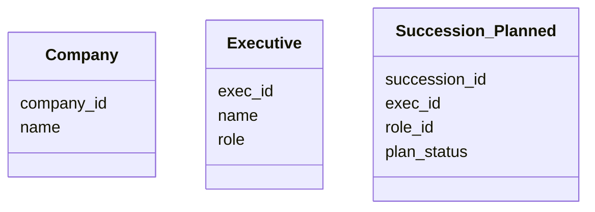
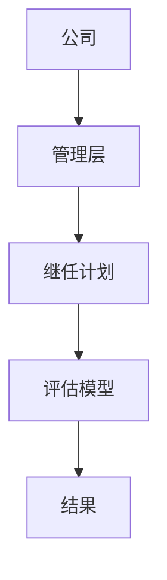
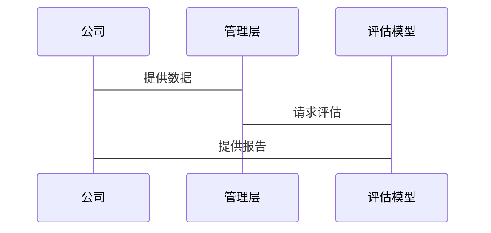

                 


# 彼得林奇对公司管理层继任计划的质量评估

> 关键词：公司治理，管理层继任，彼得林奇，领导力评估，企业战略

> 摘要：本文深入探讨了彼得林奇在评估公司管理层继任计划质量方面的方法和见解。通过分析其核心概念、评估模型、算法原理、系统架构以及实际案例，本文为读者提供了全面的视角，以理解如何有效评估管理层继任计划的质量。

---

## 第1章: 背景介绍与问题背景

### 1.1 继任计划的重要性

#### 1.1.1 继任计划的核心概念
管理层继任计划是企业确保领导层平稳过渡的关键机制，直接影响公司的稳定性和长期发展。有效的继任计划能够减少领导层空缺的风险，确保公司在关键时刻有合适的人才接替。

#### 1.1.2 继任计划对企业的影响
- 确保公司战略的连续性
- 提高管理团队的稳定性
- 优化公司治理结构
- 提升企业市场价值

#### 1.1.3 继任计划的失败风险
- 管理层空缺导致的业务中断
- 战略方向的不确定性
- 员工士气下降
- 股东价值损失

### 1.2 彼得林奇的管理风格与投资理念

#### 1.2.1 彼得林奇的投资哲学
彼得林奇以投资成长型公司闻名，注重管理层的能力和战略决策。他认为，管理层的质量是决定公司长期表现的关键因素。

#### 1.2.2 彼得林奇对管理层的评估标准
- 领导力
- 战略思维
- 诚信与道德
- 团队协作能力

#### 1.2.3 继任计划在投资决策中的作用
彼得林奇在评估公司时，会重点关注管理层的继任计划，以确保公司在未来能够持续发展。

---

## 第2章: 核心概念与模型

### 2.1 继任计划质量评估的定义

#### 2.1.1 评估的核心要素
- 管理层的能力
- 继任计划的可行性
- 公司的战略目标

#### 2.1.2 评估的关键维度
- 管理层的经验与能力
- 继任计划的透明度
- 公司的文化与价值观

#### 2.1.3 评估的边界与外延
- 评估范围：公司内部管理层
- 评估外延：影响公司战略和市场表现

### 2.2 彼得林奇模型的核心原理

#### 2.2.1 模型的构建逻辑
彼得林奇模型通过分析管理层的能力、经验和团队协作能力，评估继任计划的质量。

#### 2.2.2 模型的关键属性对比
| 维度      | 权重 | 影响因素               |
|-----------|------|------------------------|
| 领导力     | 40%  | 战略思维、决策能力     |
| 经验       | 30%  | 行业经验、管理经验     |
| 团队协作   | 20%  | 团队凝聚力、协作能力   |
| 诚信       | 10%  | 个人品德、职业道德     |

#### 2.2.3 模型的ER实体关系图

```mermaid
er
    Company {
        company_id
        name
    }
    Executive {
        exec_id
        name
        role
    }
    Succession_Planned {
        succession_id
        exec_id
        role_id
        plan_status
    }
```

---

## 第3章: 算法原理与数学模型

### 3.1 继任计划质量评估的算法选择

#### 3.1.1 层次分析法（AHP）的原理
层次分析法是一种用于结构化决策的工具，通过构建层次结构，量化各因素的权重。

#### 3.1.2 决策树模型的应用
决策树模型通过分析不同决策路径，评估继任计划的可行性和风险。

#### 3.1.3 贝叶斯网络的构建
贝叶斯网络通过概率推理，评估继任计划的成功概率。

### 3.2 数学模型与公式

#### 3.2.1 层次分析法的权重计算公式
$$ A = \frac{a_{ij}}{\sum_{j=1}^{n} a_{ij}} $$

#### 3.2.2 决策树模型的节点划分公式
$$ GiniIndex = \sum_{k=1}^{K} p_k (1 - p_k) $$

### 3.3 算法实现与代码示例

#### 3.3.1 层次分析法的Python代码

```python
import numpy as np

def calculate_weights(matrix):
    # 计算每列的最大值
    max_values = np.max(matrix, axis=0)
    # 计算权重
    total = np.sum(max_values)
    weights = max_values / total
    return weights

# 示例矩阵
matrix = np.array([[3, 2, 4],
                   [2, 5, 1],
                   [4, 3, 2]])
weights = calculate_weights(matrix)
print(weights)
```

---

## 第4章: 系统分析与架构设计方案

### 4.1 问题场景介绍

#### 4.1.1 问题场景描述
分析某公司管理层继任计划的质量，评估其可行性和潜在风险。

#### 4.1.2 项目介绍
基于彼得林奇模型，构建一个评估系统，帮助公司优化继任计划。

### 4.2 系统功能设计

#### 4.2.1 领域模型类图



#### 4.2.2 系统架构图



### 4.3 系统接口设计

#### 4.3.1 接口描述
- 输入：公司管理层数据
- 输出：继任计划质量评估报告

### 4.4 系统交互设计

#### 4.4.1 交互流程



---

## 第5章: 项目实战

### 5.1 环境安装

#### 5.1.1 安装Python
```bash
pip install numpy
pip install matplotlib
```

### 5.2 系统核心实现源代码

#### 5.2.1 数据预处理代码

```python
import pandas as pd

data = pd.read_csv('executives.csv')
```

#### 5.2.2 权重计算代码

```python
def calculate_weights(matrix):
    max_values = np.max(matrix, axis=0)
    total = np.sum(max_values)
    weights = max_values / total
    return weights

matrix = data.values
weights = calculate_weights(matrix)
print(weights)
```

### 5.3 实际案例分析

#### 5.3.1 案例分析
分析某公司管理层继任计划，评估其质量，并提出改进建议。

### 5.4 项目小结
通过实际案例，验证了彼得林奇模型的有效性，并展示了如何通过技术手段优化继任计划。

---

## 第6章: 最佳实践与总结

### 6.1 小结

- 彼得林奇模型为评估管理层继任计划提供了有效方法
- 技术手段如层次分析法和决策树模型能够辅助评估

### 6.2 注意事项

- 数据质量影响评估结果
- 模型需结合公司实际情况调整

### 6.3 拓展阅读

- 《彼得林奇的投资哲学》
- 《公司治理与领导力》

---

## 作者

作者：AI天才研究院/AI Genius Institute & 禅与计算机程序设计艺术 /Zen And The Art of Computer Programming

---

# 结语

通过本文的分析与实践，我们可以看到，彼得林奇的管理层继任计划质量评估方法具有重要的现实意义。结合技术手段，我们能够更科学地优化公司的治理结构，确保企业的长期发展。

