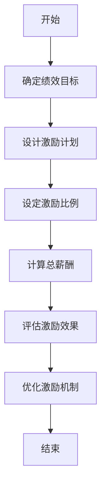
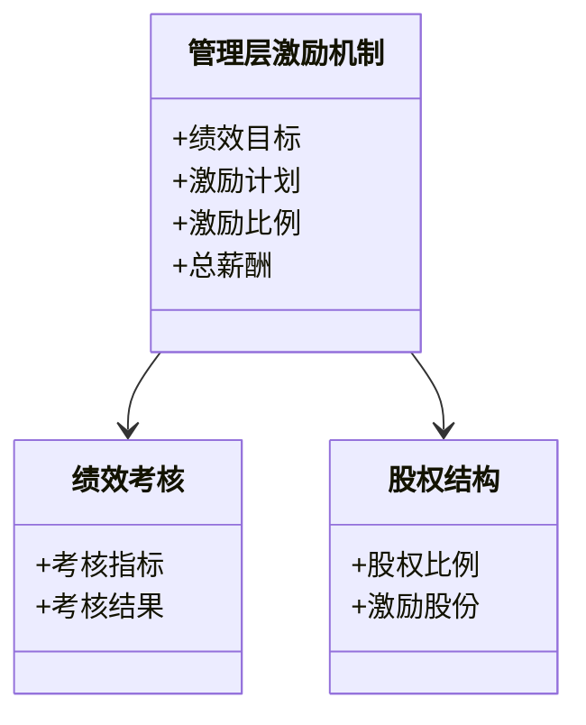
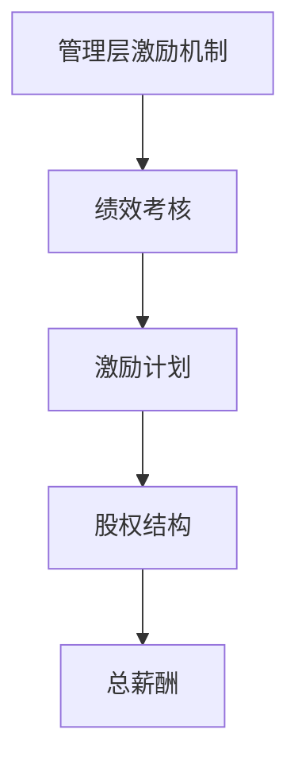
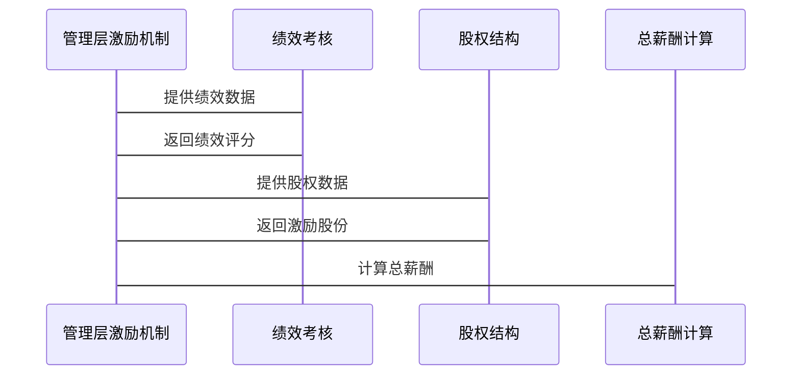

                 


# 彼得林奇对公司管理层薪酬结构的分析

> **关键词**：彼得·林奇，管理层薪酬结构，激励机制，股东价值，公司治理，数学模型

> **摘要**：本文从投资者的角度分析彼得·林奇对公司管理层薪酬结构的见解，探讨如何设计合理的激励机制以平衡短期与长期利益，优化股权激励机制，提升公司绩效和股东价值。

---

## 第一部分：背景介绍与核心概念

### 第1章：管理层薪酬结构的背景与问题背景

#### 1.1 问题背景

- **1.1.1 管理层薪酬结构的重要性**  
  管理层的薪酬结构直接影响公司高管的行为动机和决策，进而影响公司绩效和股东价值。设计合理的薪酬结构是公司治理的重要环节。

- **1.1.2 管理层薪酬与公司绩效的关系**  
  管理层的薪酬与其绩效挂钩，能够激励高管追求公司长期价值的最大化。然而，过度短期化的薪酬结构可能导致短期行为，损害股东利益。

- **1.1.3 股东与管理层的利益冲突**  
  股东希望管理层追求长期价值，而管理层可能更关注短期业绩和自身利益。如何平衡这两者是薪酬结构设计的核心挑战。

#### 1.2 问题描述

- **1.2.1 管理层薪酬结构的现状**  
  目前许多公司的薪酬结构过于短期化，导致管理层过度关注短期业绩，忽视长期发展。

- **1.2.2 管理层薪酬结构的不合理之处**  
  过高的现金激励可能导致管理层短视行为，而股权激励不足则无法有效绑定高管与股东的利益。

- **1.2.3 管理层薪酬结构对公司治理的影响**  
  合理的薪酬结构能够促进高管与股东的利益一致，提升公司治理效率；而设计不合理的薪酬结构可能导致公司治理失效。

#### 1.3 问题解决

- **1.3.1 设计合理的管理层薪酬结构**  
  通过平衡短期激励与长期激励，确保高管的行为与公司长期价值最大化相一致。

- **1.3.2 平衡短期与长期激励**  
  设计合理的薪酬结构，既要激励高管短期绩效，又要绑定高管长期利益。

- **1.3.3 优化股权激励机制**  
  通过股权激励，将高管的个人利益与股东利益绑定，实现利益一致。

#### 1.4 边界与外延

- **1.4.1 管理层薪酬结构的边界**  
  薪酬结构设计需要考虑行业特点、公司规模、发展阶段等因素。

- **1.4.2 管理层薪酬结构的外延**  
  薪酬结构设计不仅涉及股权激励和现金激励，还包括绩效考核、激励计划的执行等。

- **1.4.3 管理层薪酬结构与其他公司治理机制的关系**  
  薪酬结构设计需要与其他公司治理机制（如董事会治理、股权结构等）相结合，才能发挥最大效用。

#### 1.5 核心要素组成

- **1.5.1 管理层薪酬结构的核心要素**  
  包括现金激励（如基本工资、奖金）、股权激励（如股票期权、限制性股票）、绩效激励（如绩效奖金、股票增值权）等。

- **1.5.2 管理层薪酬结构的组成部分**  
  短期激励（如奖金、绩效奖）、长期激励（如股票期权）、其他福利（如年薪、医疗保险等）。

- **1.5.3 管理层薪酬结构的相互关系**  
  短期激励与长期激励需要合理搭配，现金激励与股权激励需要相互补充。

---

## 第二部分：核心概念与联系

### 第2章：核心概念原理

#### 2.1 管理层激励机制的原理

- **2.1.1 激励机制的基本原理**  
  激励机制通过奖励高管的优秀表现，激发其积极性和创造力，从而实现公司目标。

- **2.1.2 管理层激励机制的分类**  
  短期激励（如奖金、绩效奖）和长期激励（如股票期权、限制性股票）。

- **2.1.3 管理层激励机制的作用**  
  激励高管追求公司长期价值，增强高管与股东的利益一致性。

#### 2.2 管理层激励机制与股东价值的关系

- **2.2.1 短期激励与长期激励的对比**  
  短期激励关注当前绩效，长期激励关注未来价值。两者需要合理搭配，才能实现公司可持续发展。

- **2.2.2 管理层激励机制对股东价值的影响**  
  合理的激励机制能够提升公司绩效，增加股东价值；而设计不合理的激励机制可能导致短期行为，损害股东利益。

- **2.2.3 管理层激励机制与公司绩效的关系**  
  激励机制设计合理，能够提升公司绩效；激励机制设计不合理，可能导致公司绩效下降。

#### 2.3 管理层激励机制的数学模型

- **2.3.1 管理层激励机制的数学表达**  
  设定一个激励函数，将高管的绩效与薪酬挂钩。例如：
  $$ S = a \cdot P + b \cdot L $$
  其中，$S$ 是总薪酬，$P$ 是绩效，$L$ 是长期激励部分，$a$ 和 $b$ 是权重系数。

- **2.3.2 管理层激励机制的公式推导**  
  通过优化激励函数，找到最优激励比例，使得高管的行为与公司目标一致。例如：
  $$ \text{最大化 } S = aP + bL $$
  在约束条件下：
  $$ P = f(L) $$
  其中，$f(L)$ 是绩效与长期激励的关系函数。

- **2.3.3 管理层激励机制的实例分析**  
  以某公司为例，假设绩效目标为 $P = 100$，长期激励目标为 $L = 50$，权重系数 $a = 0.6$，$b = 0.4$。则总薪酬为：
  $$ S = 0.6 \times 100 + 0.4 \times 50 = 60 + 20 = 80 $$

### 第3章：核心概念对比分析

#### 3.1 管理层激励机制的属性特征对比

| 属性 | 短期激励 | 长期激励 | 综合激励 |
|------|----------|----------|----------|
| 时间跨度 | 短期（如季度、年度） | 长期（如3-5年） | 综合（短期+长期） |
| 形式 | 现金奖励、绩效奖 | 股票期权、限制性股票 | 综合激励计划 |
| 目标 | 提高短期绩效 | 提高长期绩效 | 综合提升绩效 |
| 优点 | 快速激励效果 | 长期绑定利益 | 综合性强 |
| 缺点 | 可能导致短期行为 | 可能缺乏灵活性 | 复杂性较高 |

#### 3.2 管理层激励机制的ER实体关系图

```mermaid
er
  %% 管理层激励机制的ER实体关系图
  管理层激励机制
  -----------
  短期激励
  -----------
  长期激励
  -----------
  绩效考核
  -----------
  股东
  -----------
  股权结构
  -----------
  现金激励
  -----------
  股票期权
  -----------
  限制性股票
```

---

## 第三部分：算法原理讲解

### 第4章：管理层激励机制的算法原理

#### 4.1 管理层激励机制的算法流程



#### 4.2 管理层激励机制的数学模型

- **数学模型的建立**  
  设定一个激励函数，将高管的绩效与薪酬挂钩。例如：
  $$ S = aP + bL $$
  其中，$S$ 是总薪酬，$P$ 是绩效，$L$ 是长期激励部分，$a$ 和 $b$ 是权重系数。

- **数学模型的求解**  
  通过优化激励函数，找到最优激励比例，使得高管的行为与公司目标一致。例如：
  $$ \text{最大化 } S = aP + bL $$
  在约束条件下：
  $$ P = f(L) $$
  其中，$f(L)$ 是绩效与长期激励的关系函数。

- **数学模型的验证**  
  通过实际案例验证模型的有效性。例如，假设某公司绩效目标为 $P = 100$，长期激励目标为 $L = 50$，权重系数 $a = 0.6$，$b = 0.4$。则总薪酬为：
  $$ S = 0.6 \times 100 + 0.4 \times 50 = 80 $$

#### 4.3 管理层激励机制的代码实现

- **算法的Python实现**  
  下面是一个简单的激励机制模拟代码：

```python
# 管理层激励机制模拟代码

def calculate_compensation(performance, long_term):
    a = 0.6
    b = 0.4
    return a * performance + b * long_term

# 示例计算
performance = 100
long_term = 50
compensation = calculate_compensation(performance, long_term)
print(f"总薪酬为：{compensation}")
```

---

## 第四部分：系统分析与架构设计方案

### 第5章：系统分析与架构设计

#### 5.1 问题场景介绍

- **问题场景1**：公司现有的薪酬结构过于短期化，导致高管短视行为。
- **问题场景2**：股权激励不足，高管与股东利益不一致。

#### 5.2 系统功能设计



#### 5.3 系统架构设计



#### 5.4 系统接口设计

- **接口1**：绩效考核接口，输入绩效数据，输出绩效评分。
- **接口2**：股权结构接口，输入股权数据，输出激励股份。

#### 5.5 系统交互设计



---

## 第五部分：项目实战

### 第6章：项目实战

#### 6.1 环境安装

- 安装Python和相关库（如numpy、pandas、matplotlib）。

#### 6.2 系统核心实现源代码

```python
# 管理层激励机制核心实现代码

import numpy as np
import pandas as pd

def calculate_compensation(performance, long_term):
    a = 0.6
    b = 0.4
    return a * performance + b * long_term

# 示例数据
performance_data = np.array([100, 90, 80, 70, 60])
long_term_data = np.array([50, 40, 30, 20, 10])

# 计算总薪酬
compensation_data = calculate_compensation(performance_data, long_term_data)

# 数据分析
df = pd.DataFrame({
    '绩效': performance_data,
    '长期激励': long_term_data,
    '总薪酬': compensation_data
})

print(df)
```

#### 6.3 代码应用解读与分析

- 通过上述代码，我们可以看到绩效与长期激励对总薪酬的影响。绩效越高，总薪酬越高；长期激励比例越大，总薪酬也越高。

#### 6.4 案例分析和详细讲解剖析

- **案例分析1**：微软的股权激励计划。
- **案例分析2**：通用电气的绩效激励机制。

#### 6.5 项目小结

- 通过项目实战，我们可以看到理论在实际中的应用，以及如何通过代码实现激励机制的模拟和优化。

---

## 第六部分：最佳实践与总结

### 第7章：最佳实践与总结

#### 7.1 最佳实践 tips

- 合理设计激励机制，平衡短期与长期激励。
- 定期评估和优化激励机制，确保其有效性。
- 结合公司实际情况，制定个性化的激励计划。

#### 7.2 小结

- 本文从背景介绍、核心概念、算法原理、系统设计和项目实战等多个方面，详细分析了彼得·林奇对公司管理层薪酬结构的见解，提出了优化激励机制的具体方法。

#### 7.3 注意事项

- 设计激励机制时，需考虑公司实际情况和行业特点。
- 定期评估激励机制的效果，并及时调整。
- 确保激励机制的透明性和公平性。

#### 7.4 拓展阅读

- 彼得·林奇的《投资之道》。
- 公司治理相关的书籍和文献。

---

**作者：AI天才研究院/AI Genius Institute & 禅与计算机程序设计艺术/Zen And The Art of Computer Programming**

