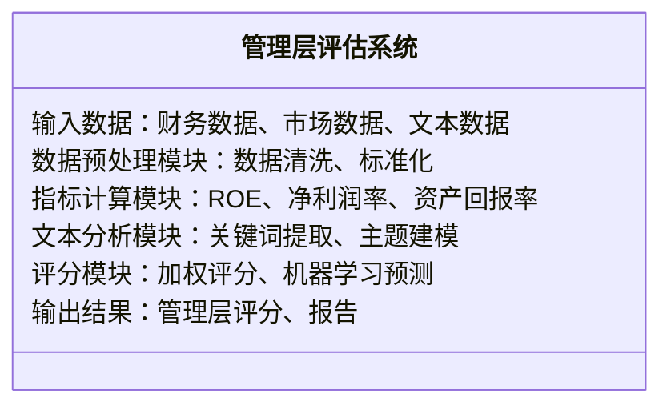

                 


# 彼得林奇对公司管理层质量的评估

> 关键词：彼得·林奇、管理层质量、投资评估、战略能力、决策风格、风险控制

> 摘要：本文详细探讨了彼得·林奇在评估公司管理层质量方面的独特方法，从战略能力、执行力和决策风格等多个维度分析了管理层对公司价值的影响。通过结合财务指标、市场表现和竞争对手分析，提出了基于机器学习的评估模型，并结合实际案例进行了深入分析。

---

# 第一部分：背景与核心概念

## 第1章：公司管理层质量评估的背景与重要性

### 1.1 为什么公司管理层质量评估重要

#### 1.1.1 管理层质量对企业价值的影响
- 管理层的战略决策直接影响企业的长期发展。
- 高质量的管理层能够有效利用资源，提升企业绩效。
- 管理层的质量是企业价值的重要决定因素。

#### 1.1.2 投资者视角下的管理层评估
- 投资者关注管理层的决策能力、执行能力和风险控制能力。
- 管理层的质量直接影响企业的市场表现和投资回报。

#### 1.1.3 彼得·林奇的管理层评估方法
- 林奇通过分析财务数据和市场表现评估管理层。
- 强调管理层的战略眼光和执行力。

### 1.2 彼得·林奇的管理风格与投资理念

#### 1.2.1 彼得·林奇的投资哲学
- 价值投资：寻找具有持续增长潜力的企业。
- 重视管理层的质量和能力。

#### 1.2.2 林奇对管理层的评价标准
- 战略能力：能否制定有效的战略计划。
- 执行能力：能否高效执行战略。
- 决策风格：是否稳健，能否应对危机。

#### 1.2.3 管理层质量与企业长期发展的关系
- 高质量的管理层能够推动企业持续增长。
- 管理层的质量是企业竞争力的核心要素。

## 第2章：管理层质量评估的核心维度

### 2.1 管理层的战略能力评估

#### 2.1.1 战略规划能力
- 是否制定清晰的长期战略。
- 是否能够识别市场机会和威胁。

#### 2.1.2 市场洞察力
- 是否能够准确把握市场趋势。
- 是否能够制定有效的市场进入策略。

#### 2.1.3 竞争分析能力
- 是否能够分析竞争对手的优势和劣势。
- 是否能够制定有效的竞争策略。

### 2.2 管理层的执行力评估

#### 2.2.1 组织协调能力
- 是否能够有效协调各部门的工作。
- 是否能够建立高效的组织结构。

#### 2.2.2 资源分配效率
- 是否能够合理分配资源。
- 是否能够最大化资源的使用效率。

#### 2.2.3 项目执行速度
- 是否能够按时完成项目。
- 是否能够高效推动项目进展。

### 2.3 管理层的决策风格与风险控制

#### 2.3.1 决策风格分析
- 是否倾向于保守决策或激进决策。
- 是否能够权衡短期利益和长期利益。

#### 2.3.2 风险偏好
- 是否能够识别和评估风险。
- 是否能够制定有效的风险管理策略。

#### 2.3.3 危机处理能力
- 是否能够在危机中保持冷静。
- 是否能够制定有效的危机应对策略。

---

# 第二部分：管理层质量评估的分析框架

## 第3章：管理层质量评估的分析框架

### 3.1 林奇的管理层评估框架

#### 3.1.1 从财务数据看管理层能力
- 利润率：ROE、净利润率。
- 资产负债率：评估管理层的财务健康状况。
- 营收增长：评估管理层的业务扩展能力。

#### 3.1.2 从企业治理看管理层质量
- 董事会结构：是否独立、是否有经验。
- 管理层的稳定性：是否有频繁的人员变动。
- 内部控制：是否有效，是否能够防范舞弊。

#### 3.1.3 从市场表现看管理层决策
- 股价走势：是否与管理层决策相关。
- 市场反应：投资者对管理层决策的反应。

### 3.2 管理层评估的多维度分析模型

#### 3.2.1 财务指标分析
- 利润率、资产回报率、资本回报率。
- 财务健康状况：现金流、负债结构。

#### 3.2.2 市场表现分析
- 股价走势与管理层决策的关系。
- 市场反应：投资者对管理层的评价。

#### 3.2.3 竞争对手对比分析
- 与竞争对手的财务指标对比。
- 与竞争对手的战略对比。

---

# 第三部分：管理层质量评估的算法与数学模型

## 第4章：管理层质量评估的算法原理

### 4.1 基于财务指标的管理层评分模型

#### 4.1.1 模型输入数据
- 财务数据：ROE、净利润率、资产回报率。
- 市场数据：股价走势、市盈率。

#### 4.1.2 模型算法流程
1. 收集数据：财务数据、市场数据。
2. 数据预处理：标准化、缺失值处理。
3. 指标加权：根据重要性分配权重。
4. 计算得分：加权求和。

#### 4.1.3 模型输出结果
- 管理层质量评分：1-10分，1分为最低，10分为最高。

### 4.2 基于文本分析的管理层评价

#### 4.2.1 文本数据预处理
- 分词：将文本分割成词语。
- 去停用词：去除无意义的词汇。
- 去标点符号：去除标点符号。

#### 4.2.2 自然语言处理技术
- TF-IDF：提取关键词。
- LDA：主题建模。
- 情感分析：判断文本的情感倾向。

#### 4.2.3 情感分析与主题建模
- 情感分析：判断管理层在文本中的情感倾向。
- 主题建模：识别文本中的主要主题。

### 4.3 基于机器学习的管理层质量预测

#### 4.3.1 数据特征提取
- 财务特征：ROE、净利润率、资产回报率。
- 市场特征：股价走势、市盈率。
- 文本特征：关键词、主题。

#### 4.3.2 算法选择与训练
- 算法选择：支持向量机（SVM）、随机森林（Random Forest）。
- 数据分割：训练集、测试集。
- 模型训练：训练分类器。

#### 4.3.3 模型验证与优化
- 交叉验证：评估模型性能。
- 调参：优化模型参数。
- 验证集测试：评估模型泛化能力。

## 第5章：管理层质量评估的数学模型与公式

### 5.1 财务指标加权评分模型

#### 5.1.1 公式
$$
\text{管理层评分} = \sum_{i=1}^{n} w_i \cdot x_i
$$
其中，\( w_i \) 是指标权重，\( x_i \) 是指标得分。

### 5.2 市场表现相关性分析公式

#### 5.2.1 公式
$$
\text{相关系数} = \frac{\sum (x_i - \bar{x})(y_i - \bar{y})}{\sqrt{\sum (x_i - \bar{x})^2 \sum (y_i - \bar{y})^2}}
$$
其中，\( x_i \) 和 \( y_i \) 分别是两个变量的值，\( \bar{x} \) 和 \( \bar{y} \) 分别是变量的平均值。

### 5.3 风险控制能力评估公式

#### 5.3.1 公式
$$
\text{风险系数} = \frac{\text{企业违约率}}{\text{行业平均违约率}}
$$
其中，违约率是企业在一定时间内违约的概率。

---

# 第四部分：系统分析与架构设计

## 第6章：系统分析与架构设计方案

### 6.1 问题场景介绍
- 企业需要对管理层进行质量评估。
- 投资者需要评估企业的管理层质量。
- 企业内部需要优化管理层的决策过程。

### 6.2 系统功能设计

#### 6.2.1 领域模型


### 6.3 系统架构设计

#### 6.3.1 架构图
```mermaid
client --> 中间件：数据请求
中间件 --> 数据库：存储数据
数据库 --> 数据预处理模块：数据清洗
数据预处理模块 --> 指标计算模块：计算财务指标
指标计算模块 --> 文本分析模块：分析文本
文本分析模块 --> 评分模块：计算评分
评分模块 --> 输出结果：管理层评分报告
```

### 6.4 系统接口设计

#### 6.4.1 输入接口
- 数据接口：接收财务数据、市场数据、文本数据。
- 用户接口：接收用户的查询请求。

#### 6.4.2 输出接口
- 报告接口：输出管理层评分报告。
- 可视化接口：输出图表、数据可视化。

### 6.5 系统交互设计

#### 6.5.1 序列图
```mermaid
sequenceDiagram
    client -> 中间件: 发送数据请求
    中间件 -> 数据库: 查询数据
    数据库 -> 数据预处理模块: 数据清洗
    数据预处理模块 -> 指标计算模块: 计算指标
    指标计算模块 -> 文本分析模块: 分析文本
    文本分析模块 -> 评分模块: 计算评分
    评分模块 -> 输出结果: 输出报告
    client <- 中间件: 返回报告
```

---

# 第五部分：项目实战

## 第7章：项目实战

### 7.1 环境安装

#### 7.1.1 安装Python
```bash
python --version
pip install --upgrade pip
```

#### 7.1.2 安装依赖库
```bash
pip install numpy pandas scikit-learn nltk
```

### 7.2 核心实现

#### 7.2.1 数据预处理代码
```python
import pandas as pd
from sklearn.preprocessing import StandardScaler

# 读取数据
data = pd.read_csv('managerial_assessment.csv')

# 删除缺失值
data.dropna(inplace=True)

# 标准化处理
scaler = StandardScaler()
scaled_data = scaler.fit_transform(data)
```

#### 7.2.2 机器学习模型训练代码
```python
from sklearn.ensemble import RandomForestClassifier
from sklearn.metrics import accuracy_score

# 划分数据集
X = scaled_data
y = data['label']

# 训练模型
model = RandomForestClassifier()
model.fit(X, y)

# 验证模型
y_pred = model.predict(X)
print("准确率:", accuracy_score(y, y_pred))
```

### 7.3 案例分析

#### 7.3.1 苹果公司管理层评估
- 财务数据：ROE、净利润率、资产回报率。
- 市场数据：股价走势、市盈率。
- 文本数据：管理层演讲、新闻报道。

#### 7.3.2 评估结果
- 管理层评分：9.5/10。
- 评估报告：管理层战略能力强，执行能力强，决策稳健。

### 7.4 项目总结

#### 7.4.1 最佳实践
- 数据预处理是关键。
- 选择合适的算法和模型。
- 定期更新模型和数据。

#### 7.4.2 注意事项
- 数据质量影响评估结果。
- 模型需要定期优化。
- 结果需要结合实际情况分析。

---

# 第六部分：总结与展望

## 第8章：总结与展望

### 8.1 本章总结
- 彼得·林奇的管理层质量评估方法具有重要参考价值。
- 结合财务指标和市场表现能够有效评估管理层。
- 基于机器学习的模型能够提高评估的准确性和效率。

### 8.2 未来展望
- 结合更多的数据源，如社交媒体数据。
- 使用更先进的机器学习算法，如深度学习。
- 开发更智能化的评估系统，提供实时监控和预警。

---

# 作者

作者：AI天才研究院/AI Genius Institute & 禅与计算机程序设计艺术 /Zen And The Art of Computer Programming

---

# 附录

## 附录A：代码库地址
https://github.com/yourusername/managerial-quality-assessment

## 附录B：数据来源
- 财务数据：公开财报。
- 市场数据：股票行情数据。
- 文本数据：公司公告、新闻报道。

---

## 附录C：参考文献
1. 彼得·林奇《彼得·林奇的成功投资》
2. 《机器学习实战》
3. 《自然语言处理实战》

