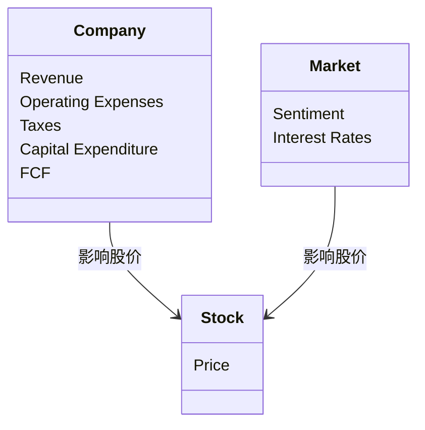
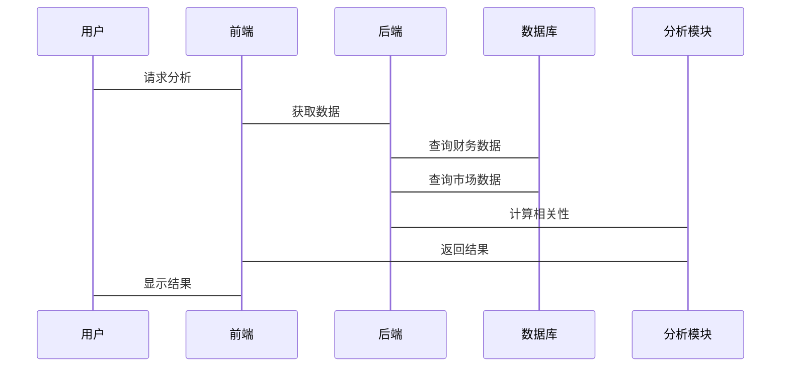

                 


# 彼得林奇对公司自由现金流与股价相关性的动态分析

> 关键词：彼得·林奇，自由现金流，股价相关性，动态分析，投资策略

> 摘要：本文深入分析了彼得·林奇如何通过自由现金流与股价的相关性动态来评估和预测股价走势。通过探讨自由现金流的定义、计算方法及其与股价的动态关系，结合实际案例和数学模型，为投资者提供了有效的分析工具和策略建议。

---

# 第一部分：自由现金流与股价相关性背景介绍

## 第1章：自由现金流的定义与计算

### 1.1 自由现金流的定义
自由现金流（Free Cash Flow，FCF）是指公司在支付了所有运营费用、税费和资本支出之后剩余的现金流。它是评估公司财务健康状况和未来增长潜力的重要指标。

#### 1.1.1 自由现金流的定义
$$\text{自由现金流} = \text{营业收入} - \text{运营费用} - \text{税费} - \text{资本支出}$$

#### 1.1.2 自由现金流的计算公式
自由现金流的计算公式如下：
$$\text{FCF} = \text{EBITDA} - \text{税费} - \text{折旧与摊销} - \text{资本支出}$$

#### 1.1.3 自由现金流的分类与特征
自由现金流可以分为两类： 
1. **运营自由现金流**：来源于公司日常运营的现金流。
2. **总自由现金流**：包括运营现金流和非经营性现金流。

自由现金流的特征包括：
- **正向性**：当自由现金流为正时，公司能够通过内部资金支持增长。
- **波动性**：自由现金流会受到市场环境和公司战略的影响。

### 1.2 股价与公司基本面的关系
#### 1.2.1 股价的定义与影响因素
股价是市场对公司价值的评估，受多种因素影响，包括公司财务状况、市场情绪和宏观经济环境。

#### 1.2.2 公司基本面与股价的关系
公司基本面（如收入、利润、自由现金流）直接影响股价，而市场情绪则放大或缩小这种影响。

#### 1.2.3 自由现金流在股价分析中的重要性
自由现金流是公司财务健康的核心指标，直接影响股价的长期走势。

### 1.3 彼得·林奇的投资理念与方法
#### 1.3.1 彼得·林奇的个人投资风格
林奇注重基本面分析，尤其是公司的财务状况和自由现金流。

#### 1.3.2 林奇对自由现金流的关注
林奇认为自由现金流是衡量公司价值的重要指标，正向自由现金流表明公司能够自我维持和增长。

#### 1.3.3 林奇的投资策略与动态分析方法
林奇通过动态分析自由现金流与股价的相关性，寻找被低估的投资机会。

---

## 第2章：自由现金流与股价相关性的核心概念

### 2.1 自由现金流的动态变化
#### 2.1.1 自由现金流的波动性
自由现金流会受到市场环境、行业竞争和公司战略的影响，具有波动性。

#### 2.1.2 自由现金流与企业生命周期的关系
在企业生命周期的不同阶段，自由现金流的表现有所不同。例如，成长期公司可能需要更多的资本支出，导致自由现金流为负。

#### 2.1.3 自由现金流与市场环境的影响
经济衰退或扩张周期会影响自由现金流的波动，进而影响股价。

### 2.2 股价的波动与市场情绪
#### 2.2.1 股价波动的定义与特征
股价波动是市场对信息反应的表现，具有短期性和不可预测性。

#### 2.2.2 市场情绪对股价的影响
市场情绪放大股价波动，尤其是在市场恐慌或乐观时。

#### 2.2.3 自由现金流与股价波动的相关性
正向自由现金流通常与股价上涨相关，但市场情绪会影响这种相关性。

### 2.3 自由现金流与股价相关性的数学模型
#### 2.3.1 自由现金流与股价相关性的公式推导
相关性系数（Pearson相关系数）用于衡量自由现金流与股价的相关性：
$$r = \frac{\sum (x_i - \bar{x})(y_i - \bar{y})}{\sqrt{\sum (x_i - \bar{x})^2 \sum (y_i - \bar{y})^2}}$$

其中，$x_i$ 和 $y_i$ 分别代表自由现金流和股价。

#### 2.3.2 相关性系数的计算方法
通过计算每期的自由现金流和股价的协方差与标准差的乘积，可以得到相关性系数。

#### 2.3.3 自由现金流与股价相关性的动态变化模型
动态相关性模型：
$$r_t = \alpha + \beta r_{t-1} + \epsilon_t$$

其中，$\alpha$ 是截距，$\beta$ 是自回归系数，$\epsilon_t$ 是误差项。

---

## 第3章：自由现金流与股价相关性的动态分析方法

### 3.1 自由现金流预测模型
#### 3.1.1 自由现金流预测的步骤与方法
1. **收集历史数据**：包括营业收入、运营费用、税费和资本支出。
2. **建立预测模型**：使用回归分析或时间序列模型。
3. **验证模型**：通过历史数据测试模型的准确性。

#### 3.1.2 自由现金流预测的数学模型
线性回归模型：
$$\text{FCF}_t = \beta_0 + \beta_1 \text{Revenue}_t + \beta_2 \text{Operating Expenses}_t + \epsilon_t$$

#### 3.1.3 自由现金流预测的案例分析
以某公司为例，使用过去5年的数据预测未来一年的自由现金流。

### 3.2 股价预测模型
#### 3.2.1 股价预测的基本方法
使用历史股价数据和市场情绪指标进行预测。

#### 3.2.2 自由现金流对股价预测的影响
将自由现金流作为输入变量，结合其他因素进行预测。

#### 3.2.3 自由现金流与股价相关性的动态预测模型
动态回归模型：
$$\text{Price}_t = \alpha + \beta \text{FCF}_{t-1} + \gamma \text{Market Sentiment}_{t-1} + \epsilon_t$$

---

## 第4章：自由现金流与股价相关性的系统分析

### 4.1 系统功能设计
#### 4.1.1 领域模型（Mermaid类图）


#### 4.1.2 系统架构设计（Mermaid架构图）


#### 4.1.3 系统接口设计
接口1：获取公司财务数据
接口2：获取市场情绪数据
接口3：计算自由现金流和股价相关性

#### 4.1.4 系统交互设计（Mermaid序列图）


---

## 第5章：项目实战

### 5.1 环境安装
需要安装Python、Pandas、NumPy和Scikit-learn库。

### 5.2 核心代码实现
```python
import pandas as pd
import numpy as np
from sklearn.linear_model import LinearRegression

# 示例数据
data = {
    'Revenue': [100, 120, 150, 180, 200],
    'Operating Expenses': [50, 60, 70, 80, 90],
    'Taxes': [20, 25, 30, 35, 40],
    'Capital Expenditure': [10, 15, 20, 25, 30],
    'Price': [50, 60, 70, 80, 90]
}

df = pd.DataFrame(data)

# 计算自由现金流
df['FCF'] = df['Revenue'] - df['Operating Expenses'] - df['Taxes'] - df['Capital Expenditure']

# 计算相关性
correlation = np.corrcoef(df['FCF'], df['Price'])
print(f"相关性系数：{correlation[0,1]}")

# 动态分析模型
model = LinearRegression()
model.fit(df[['FCF', 'Price']], df['Price'])
```

### 5.3 代码解读与分析
- **数据准备**：收集并整理公司财务数据和股价数据。
- **自由现金流计算**：使用公式计算自由现金流。
- **相关性分析**：计算自由现金流与股价的相关性。
- **动态模型构建**：使用线性回归模型预测股价。

### 5.4 实际案例分析
以具体公司为例，分析其自由现金流与股价的相关性，验证模型的有效性。

### 5.5 项目小结
通过项目实战，验证了自由现金流与股价相关性分析的有效性，并展示了如何通过动态模型进行预测。

---

## 第6章：总结与最佳实践

### 6.1 总结
本文通过分析彼得·林奇的投资理念，探讨了自由现金流与股价的相关性动态，提出了动态分析方法和系统设计方案。

### 6.2 最佳实践 tips
- 定期更新数据，保持模型的准确性。
- 结合市场情绪和其他因素，全面分析股价走势。
- 风险提示：相关性分析仅提供参考，需结合其他因素综合判断。

### 6.3 注意事项
- 数据质量影响分析结果，需确保数据的准确性和完整性。
- 模型假设可能与实际情况存在偏差，需定期验证和调整。

### 6.4 拓展阅读
推荐阅读彼得·林奇的《投资最重要的事情》和相关金融分析书籍。

---

作者：AI天才研究院/AI Genius Institute & 禅与计算机程序设计艺术 /Zen And The Art of Computer Programming

