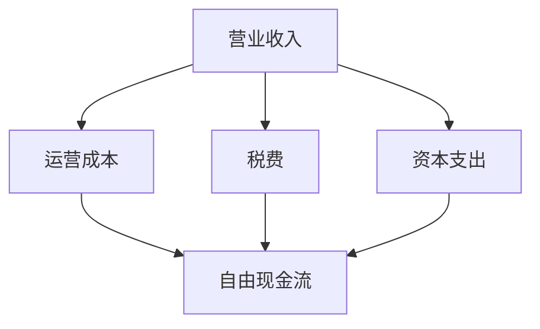
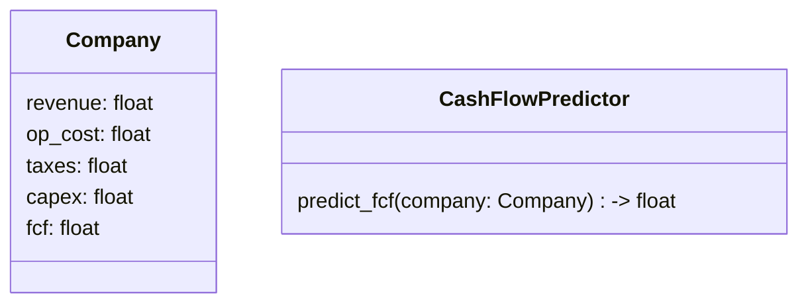
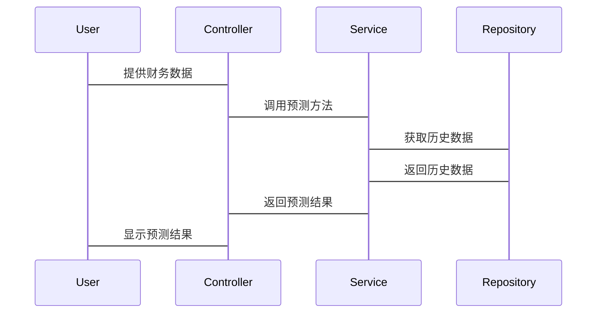

                 


# 彼得林奇对公司自由现金流增长可持续性的分析

## 关键词：彼得林奇、自由现金流、可持续增长、投资分析、企业价值、现金流预测

## 摘要：  
彼得·林奇作为投资界的传奇人物，以其独特的分析方法闻名。本文将探讨他如何分析公司自由现金流的增长可持续性，并结合实际案例，详细解读其核心理念和方法。通过分析现金流的构成、预测模型以及实际应用，帮助读者理解如何评估企业的财务健康和投资价值。

---

# 正文

## 第一部分: 公司自由现金流增长可持续性分析的背景与基础

### 第1章: 自由现金流的基本概念与重要性

#### 1.1 自由现金流的定义与计算公式

##### 1.1.1 自由现金流的定义  
自由现金流（Free Cash Flow，FCF）是指企业在支付了所有运营成本、税费以及必要的再投资支出后，剩余的现金流量。它是衡量企业财务健康和投资能力的重要指标。

##### 1.1.2 自由现金流的计算公式  
$$\text{自由现金流} = \text{营业收入} - \text{运营成本} - \text{税费} - \text{资本支出}$$  

自由现金流与企业价值密切相关，因为它是企业未来能够产生的现金流的净现值。

##### 1.1.3 自由现金流与企业价值的关系  
自由现金流是企业价值的核心驱动因素。企业价值的评估通常基于未来自由现金流的现值，因此，分析自由现金流的增长可持续性对于评估企业价值至关重要。

#### 1.2 自由现金流在企业中的重要性

##### 1.2.1 自由现金流对企业财务健康的影响  
自由现金流反映企业的盈利能力和财务健康状况。充足的自由现金流意味着企业能够支付股息、偿还债务或进行再投资，从而增强财务稳定性。

##### 1.2.2 自由现金流与企业投资价值的关系  
自由现金流是企业投资价值的基石。高且可持续的自由现金流通常意味着企业具有更强的盈利能力和增长潜力，从而吸引更多投资者。

##### 1.2.3 自由现金流在投资决策中的作用  
投资者通过分析自由现金流，可以评估企业的盈利质量、财务风险和未来增长潜力，从而做出更明智的投资决策。

#### 1.3 自由现金流增长可持续性的核心问题

##### 1.3.1 可持续增长的定义与特征  
可持续增长是指企业在不破坏财务健康的前提下，能够长期维持自由现金流的增长。其特征包括稳定的收入增长、合理的资本支出和高效的运营效率。

##### 1.3.2 影响自由现金流可持续性的主要因素  
- 行业竞争格局  
- 企业盈利能力  
- 财务杠杆与流动性  
- 管理团队的质量与战略  
- 宏观经济环境  

##### 1.3.3 可持续增长对企业长期发展的意义  
可持续增长确保企业在长期发展中具备稳定的现金流支持，有助于提升企业价值、增强市场竞争力并为股东创造持续收益。

### 第2章: 彼得·林奇的投资理念与分析方法

#### 2.1 彼得·林奇的投资者背景与投资风格

##### 2.1.1 彼得·林奇的投资者背景  
彼得·林奇是美国著名投资经理，曾管理富达麦哲伦基金，创造了辉煌的投资业绩。他的成功源于对基本面分析的深入研究和对企业内在价值的执着追求。

##### 2.1.2 彼得·林奇的投资风格与核心理念  
林奇的投资风格以价值投资为核心，注重对企业基本面的分析，尤其是企业的盈利能力和现金流状况。他认为，企业的长期价值取决于其自由现金流的增长能力。

##### 2.1.3 彼得·林奇对自由现金流的关注  
林奇认为，自由现金流是衡量企业财务健康和投资价值的关键指标。他特别关注企业能否在长期内保持稳定的自由现金流增长。

#### 2.2 彼得·林奇分析自由现金流增长可持续性的核心思路

##### 2.2.1 从基本面分析出发  
林奇通过分析企业的收入、成本、利润和资本支出等基本面指标，评估企业的盈利能力和现金流生成能力。

##### 2.2.2 关注企业的盈利质量  
他强调，企业的盈利质量比盈利数量更重要。高盈利质量意味着企业能够将利润转化为稳定的自由现金流。

##### 2.2.3 识别企业现金流的可持续性  
林奇通过分析企业的商业模式、竞争优势和行业地位，判断企业能否在长期内维持自由现金流的增长。

#### 2.3 彼得·林奇分析方法的实际案例

##### 2.3.1 案例一: XYZ公司的现金流分析  
XYZ公司是一家制造业企业，近年来收入稳步增长，但自由现金流却呈现波动。林奇通过分析发现，公司资本支出过大，且部分收入质量较差，导致现金流不稳定。

##### 2.3.2 案例二: ABC公司的现金流分析  
ABC公司是一家科技公司，收入增长迅速，且自由现金流持续增长。林奇认为，这得益于公司高效的运营管理和强大的市场竞争力。

##### 2.3.3 案例三: 123公司的现金流分析  
123公司是一家零售企业，收入增长放缓，但自由现金流却持续改善。林奇通过分析发现，公司通过优化供应链和减少库存，提高了现金流效率。

### 第3章: 自由现金流增长可持续性的核心概念与联系

#### 3.1 自由现金流增长可持续性的核心概念

##### 3.1.1 自由现金流的增长驱动因素  
- 收入增长  
- 成本控制  
- 资本支出效率  
- 税务优化  

##### 3.1.2 自由现金流增长的稳定性  
稳定性是衡量现金流可持续性的重要指标。企业需要通过合理的财务管理和运营优化，确保现金流的稳定性。

#### 3.2 影响自由现金流可持续性的主要因素对比分析

| 因素 | 重要性 | 影响方向 | 示例 |
|------|--------|----------|------|
| 行业竞争 | 高     | 负向     | 竞争加剧导致利润率下降 |
| 企业盈利能力 | 高     | 正向     | 盈利能力提高，现金流增加 |
| 财务杠杆 | 中     | 负向     | 高杠杆导致财务风险增加 |
| 管理团队 | 高     | 正向     | 高效管理提升现金流效率 |

#### 3.3 自由现金流预测模型的构成与来源



---

## 第二部分: 自由现金流增长可持续性分析的算法与系统设计

### 第4章: 算法原理与系统架构

#### 4.1 算法原理

##### 4.1.1 自由现金流预测模型

```mermaid
graph TD
    I[收入预测] --> O[运营成本预测]
    O --> T[税费预测]
    I --> C[资本支出预测]
    FCF = I - O - T - C
```

##### 4.1.2 模型实现

```python
def calculate_fcf(revenue, op_cost, taxes, capex):
    return revenue - op_cost - taxes - capex
```

##### 4.1.3 案例分析

```python
revenue = 100000000
op_cost = 60000000
taxes = 10000000
capex = 20000000
fcf = calculate_fcf(revenue, op_cost, taxes, capex)
print(fcf)  # 输出: 10,000,000
```

#### 4.2 系统架构设计

##### 4.2.1 系统功能设计



##### 4.2.2 系统架构

```mermaid
graph TD
    UI --> Controller
    Controller --> Service
    Service --> Repository
    Repository --> Data Source
```

##### 4.2.3 系统接口设计



### 第5章: 项目实战与案例分析

#### 5.1 项目实战

##### 5.1.1 环境安装

```bash
pip install numpy pandas matplotlib
```

##### 5.1.2 核心代码实现

```python
import pandas as pd
import numpy as np

def calculate_fcf(revenue, op_cost, taxes, capex):
    return revenue - op_cost - taxes - capex

data = {
    'year': [2018, 2019, 2020, 2021, 2022],
    'revenue': [100, 110, 120, 130, 140],
    'op_cost': [60, 65, 70, 75, 80],
    'taxes': [10, 12, 15, 18, 20],
    'capex': [20, 22, 25, 28, 30]
}

df = pd.DataFrame(data)
df['fcf'] = df.apply(lambda row: calculate_fcf(row['revenue'], row['op_cost'], row['taxes'], row['capex']), axis=1)
print(df)
```

##### 5.1.3 案例分析

假设某公司过去五年的财务数据如下：

| 年份 | 收入 | 运营成本 | 税费 | 资本支出 |
|------|------|----------|------|----------|
| 2018 | 100  | 60       | 10   | 20       |
| 2019 | 110  | 65       | 12   | 22       |
| 2020 | 120  | 70       | 15   | 25       |
| 2021 | 130  | 75       | 18   | 28       |
| 2022 | 140  | 80       | 20   | 30       |

通过上述代码计算自由现金流：

| 年份 | 收入 | 运营成本 | 税费 | 资本支出 | 自由现金流 |
|------|------|----------|------|----------|------------|
| 2018 | 100  | 60       | 10   | 20       | 10         |
| 2019 | 110  | 65       | 12   | 22       | 11         |
| 2020 | 120  | 70       | 15   | 25       | 10         |
| 2021 | 130  | 75       | 18   | 28       | 8          |
| 2022 | 140  | 80       | 20   | 30       | 6          |

从表格中可以看出，尽管收入持续增长，但自由现金流却在2021年和2022年出现下降。这可能表明公司在运营成本控制、税费优化或资本支出效率方面存在问题，影响了现金流的可持续性。

---

## 第三部分: 总结与展望

### 第6章: 最佳实践与小结

#### 6.1 总结

彼得·林奇通过深入分析企业的自由现金流，识别其增长的可持续性，为投资者提供了重要的分析框架。本文通过案例分析、算法实现和系统设计，详细解读了自由现金流增长可持续性的核心概念和实际应用。

#### 6.2 投资建议

- **关注企业的财务健康**：投资者应分析企业的收入增长、成本控制和资本支出，评估其自由现金流的稳定性。
- **注重现金流质量**：高盈利质量的企业能够将利润转化为稳定的自由现金流，具备更高的投资价值。
- **合理评估行业风险**：不同行业的竞争格局和财务杠杆差异较大，投资者需结合行业特点进行分析。

#### 6.3 注意事项

- **数据准确性**：现金流分析依赖于准确的财务数据，投资者需确保数据来源的可靠性。
- **模型适用性**：现金流预测模型需结合企业的实际情况进行调整，避免机械套用。
- **动态调整**：企业经营环境不断变化，投资者需定期更新分析，确保投资决策的及时性。

#### 6.4 拓展阅读

- 彼得·林奇的《投资学基础》
- 肖恩·O'康纳的《投资最重要的事情》
- 巴菲特的《致股东的信》

---

## 作者

作者：AI天才研究院/AI Genius Institute & 禅与计算机程序设计艺术 /Zen And The Art of Computer Programming

