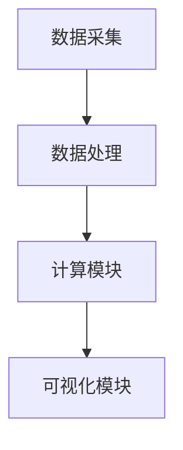

                 


# 彼得林奇对公司自由现金流转换率的分析

## 关键词：自由现金流，转换率，彼得林奇，投资分析，财务指标

## 摘要：本文深入分析了彼得林奇在投资分析中对公司自由现金流转换率的关注，探讨了该指标的定义、计算方法及其在投资决策中的应用。通过数学模型、系统架构和实际案例的分析，本文揭示了自由现金流转换率在评估企业财务健康状况和投资价值中的重要性，并提供了详细的计算步骤和实践指导。

---

## 第一部分: 引言

### 第1章: 为什么关注自由现金流转换率？

#### 1.1 投资中的关键指标
##### 1.1.1 自由现金流的基本概念
自由现金流（Free Cash Flow, FCF）是企业在扣除所有运营和资本支出后的剩余现金流量，反映了企业实际产生的现金收益能力。与净利润不同，自由现金流不受会计假设的影响，更能体现企业的财务健康状况。

##### 1.1.2 转换率的定义与重要性
自由现金流转换率（FCF Conversion Rate）是自由现金流与企业收入的比率，公式为：
$$FCF\ Conversion\ Rate = \frac{FCF}{收入}$$
该指标衡量了企业将收入转化为现金的能力，是评估企业盈利能力的重要指标。彼得林奇认为，高转换率表明企业能够高效地将收入转化为现金，从而支持持续的股息支付和业务扩展。

##### 1.1.3 彼得林奇的投资策略概述
彼得林奇以长期价值投资闻名，他注重企业的基本面分析，尤其是现金流和收益质量。他认为，自由现金流转换率是衡量企业财务健康和投资价值的关键指标。

---

### 第2章: 自由现金流转换率的核心概念

#### 2.1 自由现金流与净利润的区别
##### 2.1.1 净利润的局限性
净利润是利润表中的核心指标，但其受到会计估计和假设的影响，无法完全反映企业的实际现金状况。例如，折旧和无形资产摊销等非现金项目会影响净利润，但不影响实际现金流。

##### 2.1.2 自由现金流的计算公式
$$FCF = 经营活动现金流 - 资本支出$$
经营活动现金流来自企业的日常运营，资本支出用于购买或维护资产。自由现金流是企业在偿还债务、支付股息或进一步投资前的剩余现金。

##### 2.1.3 对比表格
| 指标 | 自由现金流 | 净利润 |
|------|-------------|--------|
| 定义 | 经营活动现金流 - 资本支出 | 收入 - 成本 - 税费 |
| 优势 | 反映实际现金状况 | 衡量整体盈利能力 |
| 局限性 | 不考虑未来的收益 | 易受会计估计影响 |

#### 2.2 转换率的数学模型
##### 2.2.1 自由现金流转换率的公式推导
$$FCF\ Conversion\ Rate = \frac{FCF}{收入}$$
其中，$FCF = \text{经营活动现金流} - \text{资本支出}$，收入为企业在一定时期内的总收入。

##### 2.2.2 核心概念的ER实体关系图
```mermaid
er
  title 实体关系图
  company(CID, 陈姓, 绩效, 股价)
  financial_data(FID, FCF, 收入)
  metrics(MID, FCF_Conversion_Rate)
  company --> financial_data: 记录
  financial_data --> metrics: 计算
```

---

## 第二部分: 算法原理与数学模型

### 第3章: 自由现金流转换率的计算方法

#### 3.1 算法原理
##### 3.1.1 自由现金流的计算步骤
1. 收集企业财务报表中的经营活动现金流和资本支出数据。
2. 计算自由现金流：$FCF = \text{经营活动现金流} - \text{资本支出}$。
3. 计算转换率：$FCF\ Conversion\ Rate = \frac{FCF}{收入}$。

##### 3.1.2 转换率的计算流程
1. 确定企业的收入、经营活动现金流和资本支出。
2. 使用公式计算自由现金流。
3. 将自由现金流除以收入，得到转换率。

#### 3.2 数学模型与公式
##### 3.2.1 自由现金流公式
$$FCF = \text{经营活动现金流} - \text{资本支出}$$

##### 3.2.2 转换率公式
$$FCF\ Conversion\ Rate = \frac{FCF}{收入}$$

##### 3.2.3 案例分析
假设某公司2022年的经营活动现金流为$1000万，资本支出为$500万，收入为$2000万。则：
$$FCF = 1000 - 500 = 500 \text{万}$$
$$FCF\ Conversion\ Rate = \frac{500}{2000} = 0.25$$
即25%的转换率，表明该企业将收入转化为现金的能力较强。

---

## 第三部分: 系统分析与架构设计

### 第4章: 自由现金流转换率分析系统

#### 4.1 系统功能设计
##### 4.1.1 数据采集模块
从财务报表中提取经营活动现金流、资本支出和收入数据。

##### 4.1.2 计算模块
根据公式计算自由现金流和转换率。

##### 4.1.3 可视化模块
将结果以图表形式展示，便于分析。

#### 4.2 系统架构设计
##### 4.2.1 分层架构图


##### 4.2.2 模块之间的交互关系
数据采集模块获取数据后，传递给数据处理模块，进行清洗和转换，然后传递给计算模块计算转换率，最后传递给可视化模块生成图表。

#### 4.3 系统接口设计
##### 4.3.1 数据接口规范
- 输入：JSON格式的财务数据。
- 输出：计算结果和图表。

##### 4.3.2 用户界面设计
- 输入：公司名称和年份。
- 输出：自由现金流转换率的计算结果和可视化图表。

---

## 第四部分: 项目实战

### 第5章: 项目实战

#### 5.1 环境安装
需要安装Python和相关库（如Pandas、Matplotlib）。

#### 5.2 核心实现代码
```python
import pandas as pd
import matplotlib.pyplot as plt

# 数据输入
data = {
    '公司': ['公司A', '公司B', '公司C'],
    '经营活动现金流': [1000, 1500, 2000],
    '资本支出': [500, 600, 700],
    '收入': [2000, 2500, 3000]
}

df = pd.DataFrame(data)

# 计算自由现金流和转换率
df['FCF'] = df['经营活动现金流'] - df['资本支出']
df['转换率'] = df['FCF'] / df['收入']

# 可视化
plt.figure(figsize=(10, 6))
plt.bar(df['公司'], df['转换率'])
plt.title('自由现金流转换率')
plt.ylabel('转换率')
plt.show()
```

#### 5.3 代码应用解读
上述代码展示了如何使用Python计算自由现金流转换率并生成可视化图表。通过输入财务数据，计算每个公司的转换率，并用柱状图展示结果。

#### 5.4 案例分析
以某公司为例，分析其自由现金流转换率的变化趋势，评估其财务健康状况和投资价值。

---

## 第五部分: 总结

### 5.1 最佳实践 Tips
- 定期计算自由现金流转换率，评估企业的财务健康状况。
- 结合其他财务指标，全面分析企业的投资价值。

### 5.2 小结
本文详细介绍了彼得林奇对公司自由现金流转换率的分析方法，从概念、计算到系统设计和项目实战，为读者提供了全面的指导。

### 5.3 注意事项
- 确保财务数据的准确性和完整性。
- 结合企业的行业特点和市场环境进行分析。

### 5.4 拓展阅读
建议进一步学习彼得林奇的其他投资策略，以及如何将自由现金流转换率与其他财务指标结合使用。

---

## 作者：AI天才研究院/AI Genius Institute & 禅与计算机程序设计艺术 /Zen And The Art of Computer Programming

