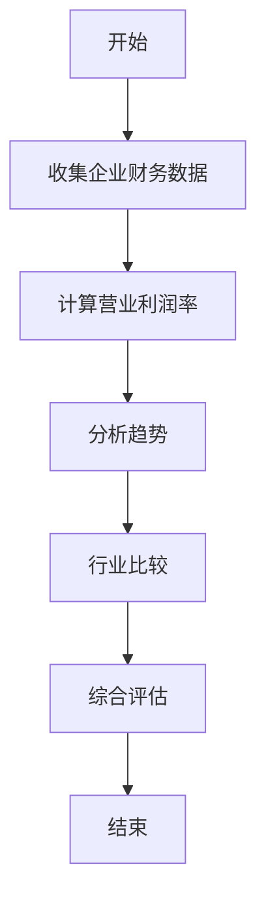
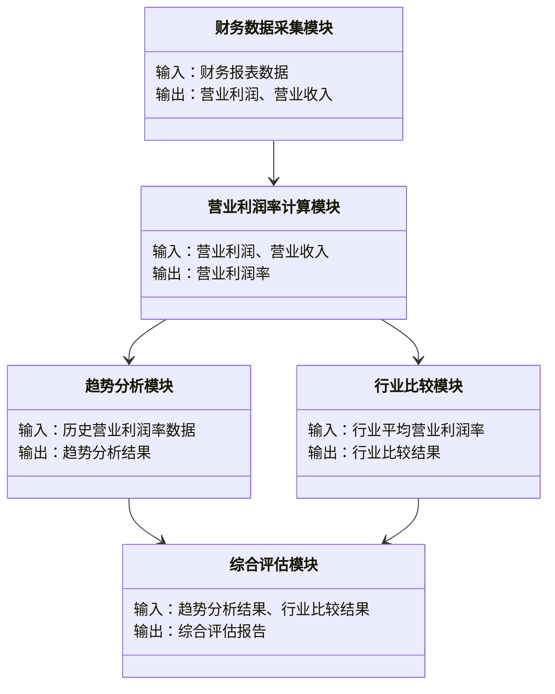

                 


# 彼得林奇对公司营业利润率趋势的分析

> 关键词：彼得·林奇，营业利润率，趋势分析，财务分析，投资策略

> 摘要：本文详细探讨了彼得·林奇如何分析公司营业利润率的趋势，从其投资理念到具体的分析方法，再到实际案例分析，深入剖析了营业利润率对企业价值和投资决策的影响。通过本文，读者可以掌握如何利用营业利润率的趋势分析来评估公司的盈利能力和投资潜力。

---

## 第一部分：彼得林奇投资理念与分析框架

### 第1章：彼得林奇投资理念概述

#### 1.1 彼得·林奇的投资理念
- **1.1.1 投资的定义与核心目标**
  - 投资不仅仅是购买股票，更是一种长期的价值创造过程。
  - 核心目标是通过分析企业的基本面，找到那些具有持续盈利能力且估值合理的公司。

- **1.1.2 彼得·林奇的投资风格与特点**
  - 价值投资与成长投资的结合。
  - 强调对企业基本面的深入研究，尤其是盈利能力。
  - 长期持有优质股票，避免频繁交易。

- **1.1.3 彼得·林奇的成功案例与经验总结**
  - 通过投资优秀的企业，如强生公司、可口可乐，取得了卓越的业绩。
  - 总结：成功的投资需要对企业有深刻的理解，尤其是其盈利能力。

#### 1.2 公司营业利润率的基本概念
- **1.2.1 营业利润率的定义与计算公式**
  - 营业利润率 = 营业利润 / 营业收入 × 100%
  - 营业利润是企业在扣除运营成本和税费后的利润。

- **1.2.2 营业利润率的重要性与影响因素**
  - 反映了企业在日常经营中的盈利能力。
  - 影响因素包括成本控制、产品定价、市场需求等。

- **1.2.3 营业利润率与企业价值的关系**
  - 高营业利润率通常意味着企业有更强的盈利能力和竞争优势。
  - 通过比较同行业公司的营业利润率，可以评估企业的相对价值。

### 第2章：彼得林奇的分析框架

#### 2.1 财务报表分析的基础知识
- **2.1.1 财务报表的构成与作用**
  - 资产负债表、利润表、现金流量表是财务报表的三大核心部分。
  - 利润表反映了企业的收入和利润情况，是分析营业利润率的核心依据。

- **2.1.2 收入、成本与利润的关系**
  - 收入是企业从销售产品或服务中获得的总收入。
  - 成本是企业为获得收入所发生的直接费用。
  - 利润是收入减去成本后的剩余部分。

- **2.1.3 营业利润率在财务报表中的位置**
  - 营业利润率反映在利润表中，是衡量企业盈利能力的重要指标。

#### 2.2 彼得林奇的营业利润率分析方法
- **2.2.1 营业利润率的趋势分析**
  - 通过分析过去几年的营业利润率变化趋势，评估企业的盈利能力是否稳定或改善。
  - 如果营业利润率逐年上升，表明企业在成本控制或收入增长方面表现良好。

- **2.2.2 行业比较分析**
  - 将企业的营业利润率与同行业其他公司进行比较，了解其在行业中的相对地位。
  - 如果企业的营业利润率显著高于行业平均水平，说明其在行业内具有竞争优势。

- **2.2.3 财务比率分析**
  - 结合其他财务比率（如净利率、毛利率）进行综合分析，评估企业的整体财务健康状况。

### 第3章：营业利润率的数学模型与公式

#### 3.1 营业利润率的计算公式
- **3.1.1 营业利润率的定义公式**
  $$ \text{营业利润率} = \frac{\text{营业利润}}{\text{营业收入}} \times 100\% $$

- **3.1.2 营业利润率与净利润率的区别**
  - 净利润 = 营业利润 - 税费 - 利息支出
  - 净利润反映的是企业整体的盈利能力，而营业利润反映的是企业日常经营的效率。

- **3.1.3 营业利润率与毛利率的对比**
  - 毛利率 = （营业收入 - 营业成本）/ 营业收入 × 100%
  - 毛利率关注的是成本控制，而营业利润率关注的是整体盈利能力。

---

## 第二部分：算法原理与系统分析

### 第4章：彼得林奇营业利润率分析的算法原理

#### 4.1 营业利润率分析算法的流程图


#### 4.2 营业利润率分析的Python实现
```python
def calculate_operating_profit_margin(operating_profit, revenue):
    return (operating_profit / revenue) * 100

# 示例数据
operating_profit = 100  # 单位：万元
revenue = 500            # 单位：万元

# 计算营业利润率
profit_margin = calculate_operating_profit_margin(operating_profit, revenue)
print(f"营业利润率为：{profit_margin}%")
```

#### 4.3 数学模型与公式
- 营业利润率的数学模型：
  $$ \text{OPM} = \frac{\text{OP}}{\text{R}} \times 100\% $$
  其中，OP 表示营业利润，R 表示营业收入。

---

## 第三部分：系统分析与架构设计

### 第5章：营业利润率分析系统的架构设计

#### 5.1 系统功能设计


#### 5.2 系统架构设计


---

## 第四部分：项目实战与最佳实践

### 第6章：项目实战

#### 6.1 环境安装
- 安装Python和必要的数据处理库（Pandas、NumPy）。
- 安装可视化工具（Matplotlib或Seaborn）。

#### 6.2 核心代码实现
```python
import pandas as pd
import matplotlib.pyplot as plt

# 假设我们有一个包含历史营业利润率数据的DataFrame
data = {
    '年份': [2018, 2019, 2020, 2021, 2022],
    '营业利润率': [15, 16, 14, 18, 20]
}
df = pd.DataFrame(data)

# 绘制趋势图
plt.figure(figsize=(10, 6))
plt.plot(df['年份'], df['营业利润率'], 'b-', marker='o')
plt.title('营业利润率趋势图')
plt.xlabel('年份')
plt.ylabel('营业利润率（%）')
plt.grid(True)
plt.show()
```

#### 6.3 案例分析
- 某公司过去5年的营业利润率分别为15%、16%、14%、18%、20%。
- 趋势显示，营业利润率逐年上升，表明企业盈利能力增强。

### 第7章：最佳实践

#### 7.1 小结
- 营业利润率是衡量企业盈利能力的重要指标。
- 彼得·林奇通过分析营业利润率的趋势和行业比较，识别出具有投资价值的企业。

#### 7.2 注意事项
- 数据的准确性和完整性是分析的基础。
- 营业利润率只是众多财务指标之一，需要结合其他指标综合分析。

#### 7.3 拓展阅读
- 《彼得·林奇的选股法则》
- 《财务报表分析与股票投资》

---

## 第五部分：总结

### 作者：AI天才研究院/AI Genius Institute & 禅与计算机程序设计艺术 /Zen And The Art of Computer Programming

通过本文的详细分析，读者可以深入理解彼得·林奇如何利用营业利润率的趋势分析来评估企业的投资价值。从理论到实践，从分析到系统设计，本文为读者提供了一个全面的视角，帮助他们在投资决策中更好地应用这一方法。

--- 

（注：以上为文章的目录结构和部分内容示例，实际文章需要根据上述结构进行详细撰写。）

