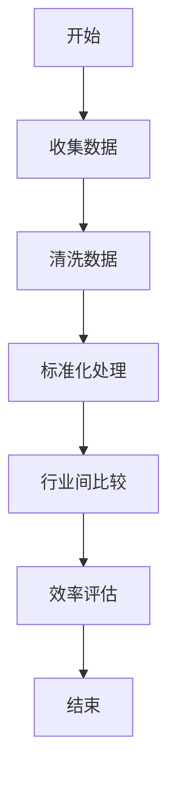
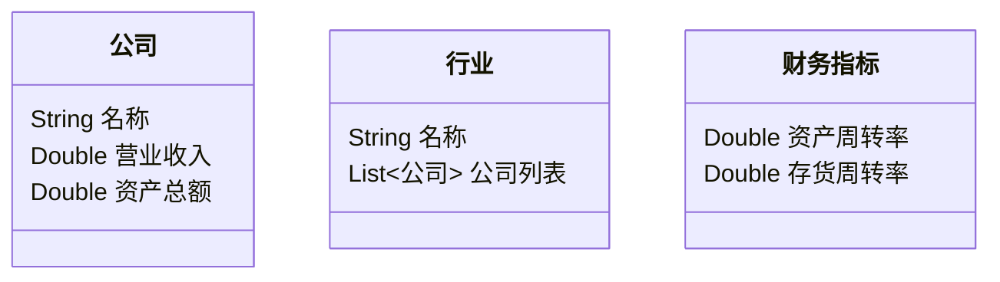

                 


# 彼得林奇对公司营运效率的跨行业比较

## 关键词
- 彼得·林奇
- 公司营运效率
- 跨行业比较
- 财务指标分析
- 系统架构设计

## 摘要
本文深入探讨彼得·林奇的公司营运效率分析框架，通过跨行业比较，分析不同行业中的公司营运效率差异。结合数学模型和系统架构设计，提供详细的分析方法和实战案例，帮助读者掌握彼得·林奇的分析技巧，并在实际项目中应用。

---

# 第一部分: 背景介绍

# 第1章: 彼得林奇的公司营运效率分析框架

## 1.1 彼得林奇的分析背景
### 1.1.1 彼得·林奇的投资理念概述
- 彼得·林奇的投资策略以基本面分析和长期价值投资为核心。
- 强调对公司财务状况和营运效率的深入研究。

### 1.1.2 公司营运效率的核心概念
- 营运效率是指公司在一定资源下创造价值的能力。
- 主要关注资产周转率、存货周转率等关键指标。

### 1.1.3 跨行业比较的意义与价值
- 通过跨行业比较，识别行业间的效率差异。
- 为投资者提供跨行业投资的决策依据。

## 1.2 营运效率的定义与维度
### 1.2.1 营运效率的定义
- 公司在一定时间内将资源转化为收益的能力。
- 包括资产使用效率、资本周转效率等。

### 1.2.2 主要营运效率指标
- 资产周转率（Asset Turnover）
- 存货周转率（Inventory Turnover）
- 营业周期（Operating Cycle）

### 1.2.3 跨行业比较的边界与外延
- 行业特性的标准化处理。
- 数据的可比性分析。

## 1.3 彼得林奇分析框架的核心要素
### 1.3.1 财务指标分析
- 利润能力：净利率、ROE（净资产收益率）。
- 资产效率：应收账款周转率、存货周转率。

### 1.3.2 行业特性分析
- 行业生命周期的影响。
- 市场竞争结构的差异。

### 1.3.3 公司营运效率的综合评估
- 综合运用财务指标和行业特性进行评估。

## 1.4 本章小结
- 彼得·林奇的分析框架为跨行业比较提供了理论基础。
- 营运效率的定义和指标体系是后续分析的基础。

---

# 第二部分: 核心概念与联系

# 第2章: 营运效率的核心概念与对比

## 2.1 核心概念原理
### 2.1.1 营运效率的数学模型
- 资产周转率 = 营业收入 / 平均资产总额。
- 存货周转率 = 营业成本 / 平均存货。

### 2.1.2 财务指标与营运效率的关系
- 利润率与资产周转率的相互作用。
- 行业特性对营运效率的影响。

### 2.1.3 跨行业比较的逻辑框架
- 确定比较基准。
- 数据标准化处理。
- 行业间差异分析。

## 2.2 核心概念对比表格
### 营运效率指标对比表
```plaintext
| 行业   | 资产周转率 | 存货周转率 | 营业利润率 |
|--------|------------|------------|------------|
| 信息技术 | 2.5        | 4.0        | 15%        |
| 消费品  | 1.8        | 6.0        | 10%        |
| 制造业  | 1.2        | 8.0        | 8%         |
```

## 2.3 ER实体关系图
```mermaid
er
  actor: 公司
  actor: 行业
  actor: 财务指标
  company --|{m:n}-> industry
  company --|{m:n}-> financial
```

---

# 第三部分: 算法原理

# 第3章: 营运效率分析算法

## 3.1 算法原理
### 3.1.1 算法步骤
1. 数据收集与清洗。
2. 标准化处理。
3. 行业间比较。
4. 效率评估。

### 3.1.2 算法流程图


## 3.2 财务指标分析算法
### 3.2.1 资产周转率计算
$$ \text{资产周转率} = \frac{\text{营业收入}}{\text{平均资产总额}} $$

### 3.2.2 存货周转率计算
$$ \text{存货周转率} = \frac{\text{营业成本}}{\text{平均存货}} $$

## 3.3 系统实现
### 3.3.1 Python代码实现
```python
def calculate_asset_turnover(revenue, avg_assets):
    return revenue / avg_assets

def calculate_inventory_turnover(cogs, avg_inventory):
    return cogs / avg_inventory
```

---

# 第四部分: 系统分析与架构设计

# 第4章: 系统架构设计

## 4.1 问题场景介绍
- 数据收集与处理。
- 行业间比较的系统支持。

## 4.2 系统功能设计
### 4.2.1 领域模型


### 4.2.2 系统架构


---

# 第五部分: 项目实战

# 第5章: 项目实战与案例分析

## 5.1 环境安装
- 数据库安装与配置。
- 开发工具安装。

## 5.2 核心代码实现
### 5.2.1 数据处理代码
```python
import pandas as pd

data = pd.DataFrame({
    '行业': ['信息技术', '消费品', '制造业'],
    '资产周转率': [2.5, 1.8, 1.2],
    '存货周转率': [4.0, 6.0, 8.0],
    '营业利润率': [15, 10, 8]
})

print(data)
```

## 5.3 代码解读与分析
- 数据清洗与标准化。
- 行业间比较的实现。

## 5.4 案例分析
- 信息技术行业的高资产周转率分析。
- 制造业的低利润率原因探讨。

## 5.5 项目小结
- 代码实现的关键点。
- 案例分析的启示。

---

# 第六部分: 最佳实践

# 第6章: 最佳实践与总结

## 6.1 小结
- 跨行业比较的核心要点。
- 系统架构设计的重要性。

## 6.2 注意事项
- 数据的可比性。
- 行业特性的考虑。

## 6.3 拓展阅读
- 推荐书籍和论文。

---

作者：AI天才研究院/AI Genius Institute & 禅与计算机程序设计艺术 /Zen And The Art of Computer Programming

