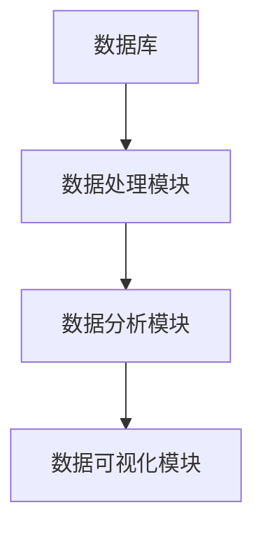

                 


# 彼得林奇对公司营运资本管理效率的看法

> 关键词：彼得·林奇，营运资本管理，管理效率，财务分析，企业价值

> 摘要：本文深入探讨了彼得·林奇对公司营运资本管理效率的看法，从核心概念、算法原理到系统分析，再到项目实战，全面分析了如何通过高效管理营运资本来提升企业价值。通过详细讲解和实际案例，本文为读者提供了从理论到实践的完整视角。

---

# 第一部分：彼得林奇对公司营运资本管理效率的背景介绍

## 第1章：公司营运资本管理效率的基本概念

### 1.1 营运资本管理效率的定义

#### 1.1.1 营运资本的基本概念

营运资本是企业在日常经营活动中使用的资金，包括流动资产和流动负债。流动资产主要包括现金、应收账款、存货等，而流动负债则包括应付账款、短期借款等。营运资本的管理效率直接影响企业的资金周转和 profitability。

#### 1.1.2 营运资本管理效率的定义与范围

营运资本管理效率是指企业在一定时间内，将营运资本转化为业务成果的效率。它衡量了企业如何有效地利用流动资产和流动负债来支持日常运营，并优化资金使用效率。

#### 1.1.3 营运资本管理效率的重要性

高效管理营运资本可以帮助企业减少资金占用，降低财务风险，提高流动性，并增强企业的整体竞争力。此外，营运资本管理效率也是投资者评估企业财务健康状况的重要指标之一。

### 1.2 彼得·林奇的背景与投资理念

#### 1.2.1 彼得·林奇的生平简介

彼得·林奇是美国著名的投资专家，曾任富达麦哲伦基金经理，以长期优异的投资业绩闻名。他主张通过深入分析公司的基本面，包括财务状况、行业地位和管理层能力，来选择投资标的。

#### 1.2.2 林奇的投资哲学与方法

林奇强调长期投资和价值投资，主张选择具有强大竞争优势和良好管理的企业。他认为，企业的财务健康状况，特别是营运资本管理效率，是评估企业价值的重要因素。

#### 1.2.3 林奇对财务分析的重视

林奇在其投资分析中，特别关注企业的财务报表，尤其是流动资产和流动负债的管理情况。他认为，营运资本管理效率是企业能否持续发展和创造价值的关键因素。

### 1.3 营运资本管理效率与企业价值的关系

#### 1.3.1 营运资本管理效率对企业价值的影响

高效的营运资本管理可以降低企业的财务成本，提高资金周转率，从而增强企业的盈利能力和市场竞争力。这不仅有助于提升企业价值，还能为投资者带来更高的回报。

#### 1.3.2 林奇视角下的企业价值评估

在林奇看来，企业价值不仅体现在盈利能力上，还体现在其财务健康状况和管理效率上。他特别关注企业的营运资本周转率，认为这是衡量企业运营效率的重要指标。

#### 1.3.3 营运资本管理效率的边界与外延

营运资本管理效率的提升并非没有边界。企业需要在优化营运资本使用和控制财务风险之间找到平衡。此外，营运资本管理效率的外延还包括企业供应链管理、库存管理和现金流管理等多个方面。

---

## 第2章：营运资本管理效率的核心要素

### 2.1 营运资本管理效率的核心要素分析

#### 2.1.1 流动资产与流动负债的构成

流动资产包括现金、应收账款、存货等，流动负债包括应付账款、短期借款等。两者的差额即为营运资本。

#### 2.1.2 存货周转率与应收账款周转率

存货周转率 = 营业成本 / 平均存货

应收账款周转率 = 营业收入 / 平均应收账款

#### 2.1.3 营运资本周转率的计算公式

营运资本周转率 = 营业收入 / 平均营运资本

### 2.2 彼得·林奇的核心分析框架

#### 2.2.1 林奇的财务分析方法

林奇通过分析企业的财务报表，重点关注流动资产和流动负债的周转率，评估企业的营运资本管理效率。

#### 2.2.2 林奇对营运资本管理效率的评价标准

林奇认为，营运资本周转率越高，企业的管理效率越高，企业的价值也越大。

#### 2.2.3 林奇分析框架的优劣势对比

优势：注重企业实际运营效率，能够准确反映企业的财务健康状况。

劣势：可能忽视企业的长期发展潜力，仅关注短期财务指标。

### 2.3 核心要素的ER实体关系图

```mermaid
er
actor: 投资者
actor --> 营运资本管理效率
actor --> 财务报表
actor --> 营运资本周转率
```

---

## 第3章：营运资本管理效率的算法原理

### 3.1 营运资本管理效率的计算公式

#### 3.1.1 营运资本周转率的计算公式

$$ \text{营运资本周转率} = \frac{\text{营业收入}}{\text{营运资本}} $$

#### 3.1.2 其他相关指标的计算

$$ \text{存货周转率} = \frac{\text{营业成本}}{\text{平均存货}} $$

$$ \text{应收账款周转率} = \frac{\text{营业收入}}{\text{平均应收账款}} $$

### 3.2 算法原理的数学模型

$$ \text{营运资本管理效率} = \frac{\text{营业收入}}{\text{营运资本}} $$

### 3.3 算法原理的详细讲解与举例说明

#### 3.3.1 公式中的各个变量含义

- 营业收入：企业在一定时期内通过销售产品或服务所获得的收入。
- 营运资本：企业在一定时期内用于支持日常运营的流动资产减去流动负债的差额。

#### 3.3.2 公式的实际应用案例

假设某企业2022年的营业收入为1000万元，平均营运资本为500万元，那么营运资本周转率为2次。

$$ \text{营运资本周转率} = \frac{1000}{500} = 2 $$

#### 3.3.3 公式的局限性与改进方向

- 局限性：营运资本周转率仅反映了企业的资金周转情况，不能全面反映企业的财务健康状况。
- 改进方向：结合其他财务指标，如存货周转率和应收账款周转率，进行综合评估。

---

## 第4章：系统分析与架构设计方案

### 4.1 系统分析

#### 4.1.1 问题场景介绍

企业希望通过优化营运资本管理效率，提高资金周转率，降低财务成本，增强市场竞争力。

#### 4.1.2 项目介绍

本项目旨在通过分析企业的财务数据，优化营运资本管理效率，提高企业价值。

### 4.2 系统架构设计

#### 4.2.1 系统功能设计

- 数据采集与处理：收集企业的财务数据，包括流动资产和流动负债。
- 数据分析：计算营运资本周转率、存货周转率和应收账款周转率。
- 数据可视化：通过图表展示分析结果，帮助管理层做出决策。

#### 4.2.2 系统架构图



### 4.3 系统交互设计

#### 4.3.1 系统交互流程

1. 用户输入财务数据。
2. 数据处理模块对数据进行清洗和转换。
3. 数据分析模块计算各项周转率。
4. 数据可视化模块生成图表，供用户查看。

#### 4.3.2 系统交互图

```mermaid
sequenceDiagram
actor: 用户
participant 数据库
participant 数据处理模块
participant 数据分析模块
participant 数据可视化模块
actor -> 数据库: 提交财务数据
数据库 --> 数据处理模块: 数据清洗和转换
数据处理模块 --> 数据分析模块: 计算周转率
数据分析模块 --> 数据可视化模块: 生成图表
数据可视化模块 --> actor: 显示图表
```

---

## 第5章：项目实战

### 5.1 环境安装

安装Python和相关数据分析库，如Pandas、Matplotlib等。

### 5.2 系统核心实现源代码

```python
import pandas as pd
import matplotlib.pyplot as plt

# 数据读取
data = pd.read_csv('financial_data.csv')

# 数据处理
data['营运资本周转率'] = data['营业收入'] / data['营运资本']

# 数据可视化
plt.plot(data['日期'], data['营运资本周转率'])
plt.title('营运资本周转率趋势图')
plt.xlabel('日期')
plt.ylabel('周转率')
plt.show()
```

### 5.3 代码应用解读与分析

上述代码读取财务数据，计算营运资本周转率，并生成趋势图。通过可视化，用户可以直观地看到营运资本周转率的变化趋势，从而做出相应的管理决策。

### 5.4 实际案例分析

以某制造企业为例，分析其营运资本管理效率，并提出优化建议。

### 5.5 项目小结

通过本项目，我们学会了如何利用数据分析工具优化营运资本管理效率，为企业的价值提升提供了有力支持。

---

## 第6章：最佳实践与小结

### 6.1 最佳实践 tips

- 定期监控营运资本周转率，及时发现问题。
- 优化存货管理和应收账款管理，降低资金占用。
- 结合企业实际情况，制定合理的营运资本管理策略。

### 6.2 小结

本文从背景介绍、核心概念、算法原理到系统分析，再到项目实战，全面探讨了彼得·林奇对公司营运资本管理效率的看法。通过理论与实践的结合，为读者提供了从理论到实践的完整视角。

### 6.3 注意事项

在实际应用中，需要注意数据的准确性和完整性，避免因数据问题导致分析结果偏差。

### 6.4 拓展阅读

建议读者进一步阅读彼得·林奇的相关著作，深入了解他的投资哲学和财务分析方法。

---

## 作者：AI天才研究院/AI Genius Institute & 禅与计算机程序设计艺术 /Zen And The Art of Computer Programming

---

这篇文章系统地探讨了彼得·林奇对公司营运资本管理效率的看法，从理论到实践，为读者提供了全面的视角。通过详细讲解和实际案例，帮助读者更好地理解和应用这些概念。

