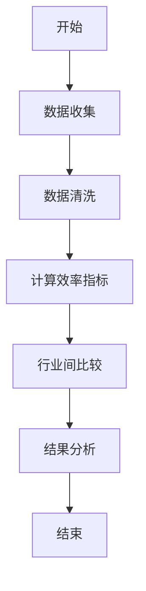
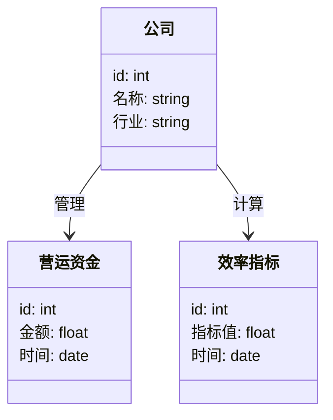
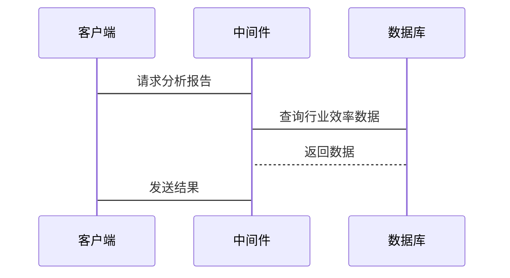

                 


# 彼得林奇对公司营运资金管理效率的跨行业比较

**关键词**：彼得林奇，营运资金管理，效率分析，跨行业比较，投资策略

**摘要**：本文基于彼得林奇的投资理念，系统地分析了不同行业在营运资金管理效率方面的差异，并通过跨行业的比较，提出了优化企业营运资金管理的策略。通过详细阐述背景、核心概念、算法原理、系统架构及项目实战，为投资者和企业管理者提供了实用的指导和启示。

---

## 第1章：背景介绍

### 1.1 彼得林奇与投资分析概述

#### 1.1.1 彼得林奇的背景与投资理念
- 彼得·林奇是美国著名投资经理人，以其独特的投资策略和对基本面分析的重视而闻名。
- 他的投资理念强调长期价值，注重企业的基本面分析，尤其是企业的营运资金管理效率。

#### 1.1.2 营运资金管理效率的定义与重要性
- 营运资金管理效率是指企业在日常运营中对流动资产（如现金、应收账款、存货）和流动负债的管理能力。
- 高效的营运资金管理可以提高企业的流动性，降低财务风险，增强盈利能力。

#### 1.1.3 跨行业比较的必要性与研究意义
- 不同行业的企业由于业务模式、市场环境和客户需求的不同，营运资金管理效率的侧重点和表现差异显著。
- 通过跨行业的比较，可以发现行业间的最佳实践，为企业的优化管理提供参考。

---

## 第2章：核心概念与联系

### 2.1 核心概念原理

#### 2.1.1 营运资金管理效率的数学模型
$$ \text{营运资金管理效率} = \frac{\text{流动资产}}{\text{流动负债}} $$

#### 2.1.2 行业间差异的分析框架
- 行业特性对营运资金管理效率的影响：
  - 制造业：存货和应收账款占比较高。
  - 零售业：现金流需求大，应收账款周转快。
  - 信息技术业：研发投入高，营运资金需求多样化。

### 2.2 概念属性特征对比表格

| 行业         | 营运资金管理效率关键指标 | 关键影响因素 |
|--------------|---------------------------|--------------|
| 制造业       | 存货周转率、应收账款周转率 | 供应链管理   |
| 零售业       | 现金流净额、应收账款周转率 | 销售季节性   |
| 信息技术业   | 研发投入资金、现金流预测   | 技术研发周期 |

### 2.3 ER实体关系图架构
```mermaid
er
    entity(公司) {
        id
        名称
        行业
    }
    entity(营运资金) {
        id
        金额
        时间
    }
    entity(效率指标) {
        id
        指标值
        时间
    }
    company --> 营运资金: 管理
    company --> 效率指标: 计算
```

---

## 第3章：算法原理讲解

### 3.1 算法原理概述

#### 3.1.1 数据分析方法
- 使用回归分析评估营运资金管理效率与企业绩效的关系：
$$ y = \beta_0 + \beta_1x + \epsilon $$
  - 其中，\( y \) 是企业绩效指标，\( x \) 是营运资金管理效率。

#### 3.1.2 行业间差异分析的数学模型
- 使用聚类分析将企业按营运资金管理效率分组：
$$ \text{聚类中心} = \text{各行业的平均效率值} $$

### 3.2 算法mermaid流程图


### 3.3 Python源代码实现

```python
import pandas as pd

# 数据收集与清洗
data = pd.read_csv('operating_funds.csv')
data_clean = data.dropna()

# 计算效率指标
data_clean['效率指标'] = data_clean['营运资金'] / data_clean['收入']

# 行业间比较
industry_groups = data_clean.groupby('行业')['效率指标'].mean()
print(industry_groups)
```

---

## 第4章：系统分析与架构设计方案

### 4.1 问题场景介绍

#### 4.1.1 营运资金管理效率分析的背景
- 企业面临市场竞争加剧，营运资金管理效率成为核心竞争力之一。
- 不同行业对营运资金的需求和管理方式差异显著。

### 4.2 系统功能设计

#### 4.2.1 领域模型类图


### 4.3 系统架构设计

#### 4.3.1 系统架构图


### 4.4 接口和交互设计

#### 4.4.1 系统交互序列图


---

## 第5章：项目实战

### 5.1 案例分析

#### 5.1.1 案例背景
- 某制造企业营运资金管理效率低下，希望通过跨行业比较找到优化方法。

#### 5.1.2 环境安装说明
- 安装Python、Pandas、Mermaid工具。

#### 5.1.3 核心代码实现
```python
import pandas as pd

# 数据加载与清洗
data = pd.read_csv('manufacturing.csv')
data_clean = data.dropna()

# 行业间比较
industry_groups = data_clean.groupby('行业')['效率指标'].mean()
print("行业间效率对比结果：", industry_groups)
```

#### 5.1.4 案例解读与分析
- 制造业的存货周转率低于行业平均水平，建议优化供应链管理。

---

## 第6章：最佳实践与注意事项

### 6.1 提示与建议

#### 6.1.1 投资者的注意事项
- 关注企业的营运资金管理效率，尤其是现金流和应收账款周转率。
- 结合行业特点，制定差异化投资策略。

#### 6.1.2 企业的最佳实践
- 定期评估营运资金管理效率，优化资源配置。
- 引入数据分析工具，提高管理效率。

### 6.2 小结
通过跨行业的比较分析，可以发现企业营运资金管理的优缺点，并制定针对性的优化策略。

### 6.3 注意事项
- 数据分析结果需结合企业实际业务场景进行解读。
- 定期更新数据，确保分析结果的时效性。

### 6.4 拓展阅读
- 《彼得·林奇的投资哲学》
- 《企业财务报表分析》

---

## 第7章：附录与参考文献

### 7.1 数据来源与工具说明
- 数据来源：公开企业财报数据。
- 工具：Python、Pandas、Mermaid。

### 7.2 相关文献
- 彼得·林奇著，《彼得·林奇的投资哲学》。
- Smith, J. (2020). 《企业财务报表分析》。

---

**作者：AI天才研究院/AI Genius Institute & 禅与计算机程序设计艺术/Zen And The Art of Computer Programming**

