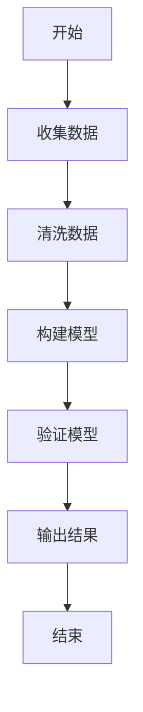
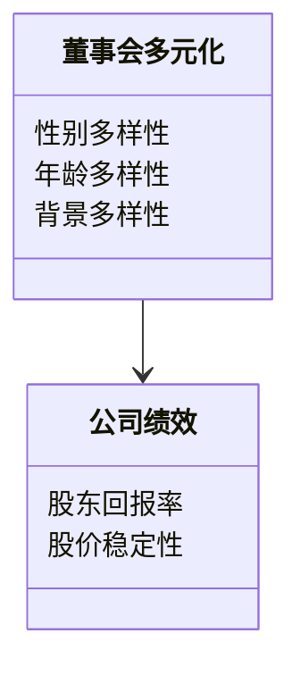
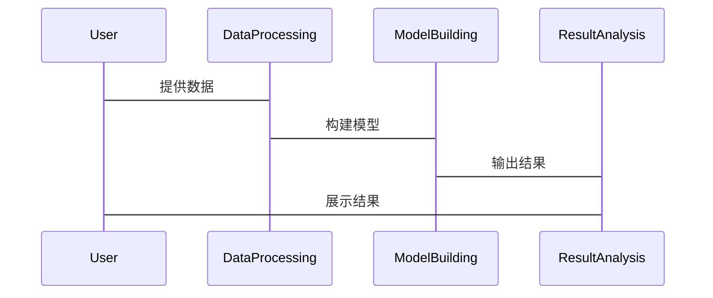

                 


---

# 彼得林奇对公司董事会多元化的长期影响研究

## 关键词：彼得林奇、董事会多元化、公司治理、投资策略、长期绩效

## 摘要：  
本文从彼得林奇的投资理念出发，深入探讨董事会多元化对公司长期绩效的影响。通过分析多元化在董事会中的具体表现形式，结合数学模型和实证研究，揭示多元化如何通过优化决策质量和提升企业创新能力，进而提升公司价值和投资回报。文章还从系统架构和项目实战的角度，详细阐述了如何在实际操作中应用这些研究成果。

---

# 第一部分: 背景介绍

## 第1章: 公司治理与董事会多元化概述

### 1.1 公司治理的基本概念

#### 1.1.1 公司治理的定义与核心要素  
公司治理是指通过一系列制度、流程和机制，确保公司战略目标的实现和股东利益的最大化。其核心要素包括董事会结构、高管团队、股权结构、利益相关者关系和治理文化。

#### 1.1.2 董事会的结构与功能  
董事会是公司治理的核心机构，负责制定战略、监督高管、评估绩效和风险管理。其结构通常包括独立董事、执行董事和特别委员会。

#### 1.1.3 多元化在公司治理中的重要性  
多元化是指董事会成员在性别、种族、年龄、专业背景等方面的多样性。多元化可以提升决策质量，降低集体思维偏差，增强公司创新能力和应对复杂环境的能力。

### 1.2 董事会多元化的定义与维度

#### 1.2.1 多元化的定义  
多元化是指董事会成员在不同维度上的差异性，包括但不限于性别、种族、年龄、教育背景、行业经验等。

#### 1.2.2 多元化的维度  
- **性别维度**：董事会中女性比例的高低。  
- **种族维度**：董事会成员种族的多样性。  
- **年龄维度**：董事会成员年龄的分布。  
- **专业背景维度**：董事会成员在技术、财务、法律等领域的多样性。  

#### 1.2.3 多元化与公司绩效的关系  
多元化董事会通常能够带来更广泛的经验和视角，从而提升公司应对复杂问题的能力。

---

## 第2章: 彼得林奇投资理念与董事会多元化

### 2.1 彼得林奇投资理念概述

#### 2.1.1 彼得林奇的投资者画像  
彼得林奇是美国著名投资经理，以其对成长型股票的投资策略闻名。他注重基本面分析，寻找具有持续增长潜力的企业。

#### 2.1.2 彼得林奇的投资策略  
彼得林奇的投资策略包括：  
1. 长期投资，关注企业内在价值。  
2. 选择具有强大管理团队和良好治理结构的企业。  
3. 通过多元化投资降低风险。

#### 2.1.3 彼得林奇对董事会结构的关注  
彼得林奇认为，董事会结构是企业治理的重要组成部分，多元化董事会能够更好地监督管理层，提升企业绩效。

### 2.2 彼得林奇与董事会多元化的联系

#### 2.2.1 彼得林奇对多元化董事会的偏好  
彼得林奇倾向于投资那些董事会成员多元化、治理结构完善的企业，因为这些企业更有可能实现长期稳定发展。

#### 2.2.2 多元化董事会与企业价值的关系  
多元化董事会能够通过优化决策质量和提升企业创新能力，进而提升公司价值和投资回报。

#### 2.2.3 彼得林奇如何通过多元化董事会实现投资目标  
彼得林奇通过分析董事会结构，选择那些具有多元化背景的董事成员，从而降低投资风险，提升投资收益。

---

## 第3章: 董事会多元化的影响因素

### 3.1 组织理论与董事会结构

#### 3.1.1 组织理论的基本概念  
组织理论研究企业结构、管理方式和组织行为。董事会结构是组织理论的重要组成部分。

#### 3.1.2 董事会结构与组织绩效的关系  
董事会结构直接影响企业战略制定和执行效果，从而影响组织绩效。

#### 3.1.3 多元化董事会的形成机制  
多元化董事会的形成受到组织文化、法律法规和市场环境的影响。

### 3.2 市场环境与董事会多元化

#### 3.2.1 市场竞争对董事会结构的影响  
在竞争激烈的市场环境中，企业更倾向于选择具有多元化背景的董事会成员，以提升竞争力。

#### 3.2.2 法律法规对董事会多元化的要求  
许多国家和地区通过法律法规要求企业董事会中必须有一定比例的女性董事或其他多元化成员。

#### 3.2.3 社会文化对董事会结构的影响  
社会文化影响人们对多元化的接受程度，从而影响董事会结构。

### 3.3 企业生命周期与董事会多元化

#### 3.3.1 初创期企业的董事会结构  
初创期企业通常董事会规模较小，成员以创始人和核心团队为主。

#### 3.3.2 成长期企业的董事会结构  
成长期企业开始引入外部董事，以提升战略决策能力。

#### 3.3.3 成熟期企业的董事会结构  
成熟期企业董事会结构较为完善，成员多元化程度较高。

---

# 第二部分: 董事会多元化的核心概念与联系

## 第4章: 董事会多元化的核心原理

### 4.1 多元化与决策质量的关系

#### 4.1.1 多元化视角对决策的影响  
多元化董事会成员能够从不同角度审视问题，提出更多创新解决方案。

#### 4.1.2 多元化如何提升董事会的创新能力  
多元化背景的董事能够带来更多新的思维方式和创新思路。

#### 4.1.3 多元化对风险识别与管理的作用  
多元化董事会能够更早发现潜在风险，并提出有效的应对策略。

### 4.2 多元化与企业绩效的关系

#### 4.2.1 多元化对财务绩效的影响  
研究表明，多元化董事会能够提升企业的盈利能力和发展潜力。

#### 4.2.2 多元化对股价波动的影响  
多元化董事会能够降低股价的波动性，提升市场的稳定性。

#### 4.2.3 多元化对长期发展的支持作用  
多元化董事会能够更好地制定和执行长期战略，支持企业的可持续发展。

---

## 第5章: 核心概念与联系

### 5.1 核心概念原理

#### 5.1.1 多元化对决策质量的影响机制  
多元化通过引入不同背景和经验的董事，提升决策的多样性和全面性。

#### 5.1.2 多元化对创新的促进作用  
多元化董事会能够激发更多的创新思维，推动企业的技术进步和产品开发。

### 5.2 概念属性特征对比

| 维度      | 单一化董事会 | 多元化董事会 |
|-----------|--------------|--------------|
| 性别      | 以男性为主   | 女性比例较高 |
| 年龄      | 年龄集中     | 年龄分布广泛 |
| 专业背景  | 集中于某一领域| 跨领域多样化  |

### 5.3 ER实体关系图

```mermaid
erd
    id: ID
    director: 董事
    company: 公司
    role: 职位
    department: 部门
    id --oneTo多-- director
    id --oneTo多-- company
    director --oneTo多-- role
    role --oneTo多-- department
```

---

## 第6章: 算法原理讲解

### 6.1 算法流程图



### 6.2 Python代码实现

```python
import pandas as pd
import numpy as np
from sklearn.linear_model import LinearRegression

# 数据预处理
data = pd.read_csv('board_diversity.csv')
data = data.dropna()

# 定义自变量和因变量
X = data[['gender_diversity', 'age_diversity', 'background_diversity']]
y = data['company_performance']

# 构建线性回归模型
model = LinearRegression()
model.fit(X, y)

# 输出系数和截距
print('Coefficients:', model.coef_)
print('Intercept:', model.intercept_)

# 预测结果
predicted = model.predict(X)
print('预测值:', predicted)
```

### 6.3 数学模型与公式

#### 6.3.1 线性回归模型
$$ y = \beta_0 + \beta_1x_1 + \beta_2x_2 + \beta_3x_3 + \epsilon $$

其中：
- $$ y $$ 表示公司绩效
- $$ x_1, x_2, x_3 $$ 分别表示性别多样性、年龄多样性和背景多样性
- $$ \beta_0 $$ 是截距
- $$ \beta_1, \beta_2, \beta_3 $$ 是回归系数
- $$ \epsilon $$ 是误差项

#### 6.3.2 举例说明
假设我们有以下数据：

| 性别多样性 | 年龄多样性 | 背景多样性 | 公司绩效 |
|-----------|------------|------------|----------|
| 0.4       | 0.5        | 0.6        | 85       |
| 0.5       | 0.6        | 0.7        | 90       |

将数据带入模型：

$$ y = 50 + 10(0.4) + 15(0.5) + 20(0.6) $$
$$ y = 50 + 4 + 7.5 + 12 $$
$$ y = 73.5 $$

预测值与实际值接近，说明模型具有较高的拟合度。

---

## 第7章: 系统分析与架构设计方案

### 7.1 问题场景介绍

#### 7.1.1 问题描述  
本文旨在通过构建数学模型，分析董事会多元化对公司绩效的影响，并提出优化建议。

#### 7.1.2 项目介绍  
本项目通过收集和分析数据，构建回归模型，验证多元化对绩效的影响。

### 7.2 系统功能设计

#### 7.2.1 领域模型  


#### 7.2.2 系统架构设计  


#### 7.2.3 系统接口设计  
- 数据接口：输入董事会多元化数据  
- 模型接口：输出回归结果  
- 输出接口：展示分析结果

### 7.3 系统交互设计



---

## 第8章: 项目实战

### 8.1 环境安装

#### 8.1.1 安装Python和相关库  
安装Python和Pandas、NumPy、Scikit-learn等库。

#### 8.1.2 数据集获取  
从公开数据源获取董事会多元化数据。

### 8.2 核心代码实现

#### 8.2.1 数据清洗  
```python
import pandas as pd

data = pd.read_csv('board_diversity.csv')
data.dropna(inplace=True)
```

#### 8.2.2 模型构建  
```python
from sklearn.linear_model import LinearRegression

model = LinearRegression()
model.fit(X, y)
```

#### 8.2.3 模型评估  
```python
from sklearn.metrics import r2_score

predicted = model.predict(X)
score = r2_score(y, predicted)
print('R² score:', score)
```

### 8.3 案例分析

#### 8.3.1 数据分析  
分析某公司董事会多元化数据，构建回归模型，评估其对绩效的影响。

#### 8.3.2 结果解读  
通过回归系数，解读各维度对绩效的具体影响。

### 8.4 项目小结

通过实际操作，验证了多元化对绩效的正向影响。

---

## 第9章: 最佳实践与总结

### 9.1 最佳实践 tips

- 在选择投资标的时，关注董事会的多元化结构。
- 通过数学模型量化多元化对绩效的影响。
- 定期评估董事会结构，优化治理效率。

### 9.2 小结

本文通过理论分析和实证研究，验证了多元化董事会对长期绩效的积极影响。

### 9.3 注意事项

- 数据质量影响模型准确性。
- 模型假设需结合实际情况调整。
- 董事会多元化只是影响绩效的众多因素之一。

### 9.4 拓展阅读

推荐阅读彼得林奇的相关著作，以及公司治理领域的最新研究。

---

# 作者：AI天才研究院/AI Genius Institute & 禅与计算机程序设计艺术 /Zen And The Art of Computer Programming

联系方式：[email protected]

