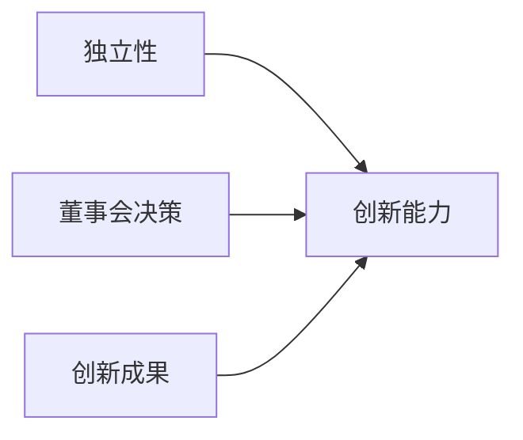
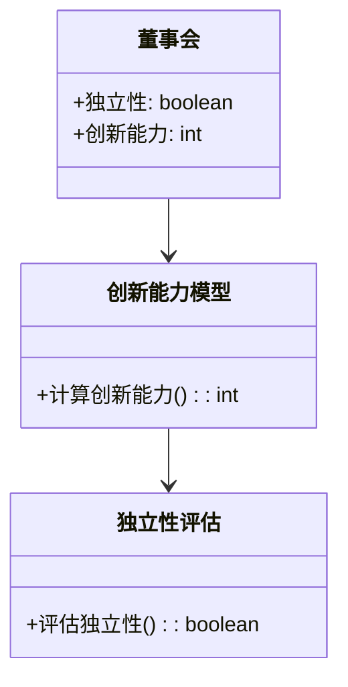

                 


# 彼得林奇对公司董事会独立性与创新能力关系的研究

**关键词：** 彼得林奇，董事会独立性，创新能力，企业绩效，系统架构，数学模型

**摘要：**  
本文研究了彼得林奇关于公司董事会独立性与创新能力之间关系的理论，探讨了独立性如何影响董事会的决策过程，进而影响企业的创新能力。通过分析独立性对创新环境的促进作用，以及创新能力对董事会运作的影响，本文提出了一个数学模型，用于量化独立性和创新能力之间的关系。此外，本文还通过系统架构和项目实战，展示了如何在实际企业中应用这些理论。

---

## 第一部分: 背景介绍

### 第1章: 背景与问题描述

#### 1.1 问题背景
- **1.1.1 公司董事会独立性的概念与重要性**
  - 独立性是指董事会成员在决策过程中不受外部干扰，能够独立思考和判断。
  - 独立性是确保董事会有效运作的关键因素，能够避免利益冲突和决策偏差。
- **1.1.2 创新能力在企业中的核心地位**
  - 创新能力是企业在竞争中保持优势的核心能力。
  - 创新能力不仅体现在技术上，还体现在管理、市场策略等多个方面。
- **1.1.3 独立性与创新能力的相互关系**
  - 独立性能够为创新提供自由的环境，而创新能力则能够提升董事会的决策质量。

#### 1.2 问题描述
- **1.2.1 独立性对创新能力的影响**
  - 独立性能够减少外部干扰，使董事会更专注于创新。
- **1.2.2 创新能力对董事会独立性的作用**
  - 创新能力的提升能够增强董事会的独立性，避免依赖外部资源。
- **1.2.3 问题解决的必要性**
  - 在实际企业中，如何平衡独立性和创新能力是一个重要问题。

#### 1.3 独立性与创新能力的核心要素
- **1.3.1 独立性要素分析**
  - 董事会成员的独立性、决策过程的透明度。
- **1.3.2 创新能力要素分析**
  - 创新资源的投入、创新文化的建设。
- **1.3.3 核心要素的相互作用**
  - 独立性与创新资源的投入相互促进。

#### 1.4 独立性与创新能力的边界与外延
- **1.4.1 独立性的边界**
  - 独立性并非完全脱离企业目标，而是基于企业战略的独立决策。
- **1.4.2 创新能力的外延**
  - 创新能力不仅包括技术创新，还包括管理创新和市场创新。
- **1.4.3 两者关系的外延与限制**
  - 独立性与创新能力的关系并非绝对，需要结合企业实际情况。

---

## 第二部分: 核心概念与联系

### 第2章: 独立性与创新能力的核心原理

#### 2.1 独立性原理
- **2.1.1 独立性的定义与特征**
  - 独立性是指董事会成员在决策过程中不受外部压力，能够自主判断。
- **2.1.2 独立性对董事会决策的影响**
  - 独立性能够提高决策的客观性和科学性。
- **2.1.3 独立性与创新能力的关系**
  - 独立性为创新能力提供了自由的空间，使创新更有可能实现。

#### 2.2 创新能力原理
- **2.2.1 创新能力的定义与特征**
  - 创新能力是指企业在技术和管理等方面进行创新的能力。
- **2.2.2 创新能力对董事会运作的影响**
  - 创新能力强的企业能够更好地应对市场变化，为董事会提供更多的决策依据。
- **2.2.3 创新能力与独立性的相互作用**
  - 独立性能够激发创新能力，而创新能力的提升又能够增强独立性。

#### 2.3 核心概念对比分析
- **2.3.1 独立性与创新能力的对比表格**
  | 属性       | 独立性                | 创新能力            |
  |------------|----------------------|--------------------|
  | 定义       | 独立决策的能力        | 创新能力的强弱      |
  | 影响因素   | 董事会结构、治理机制  | 资源投入、文化氛围  |
  | 相互作用   | 独立性促进创新        | 创新能力增强独立性  |

- **2.3.2 独立性与创新能力的ER实体关系图**



---

### 第3章: 独立性与创新能力的关系分析

#### 3.1 独立性对创新能力的促进作用
- **3.1.1 独立性如何激发创新能力**
  - 独立性能够减少外部干扰，使董事会更专注于创新。
- **3.1.2 独立性对创新环境的影**

---

### 第4章: 算法原理

#### 4.1 独立性与创新能力的数学模型

$$
\text{创新能力} = \alpha \times \text{独立性} + \beta \times \text{资源投入} + \gamma \times \text{文化因素}
$$

其中，$\alpha$、$\beta$、$\gamma$为系数，表示各自因素的影响程度。

---

### 第5章: 系统分析与架构设计

#### 5.1 系统功能设计



---

### 第6章: 项目实战

#### 6.1 环境安装

```bash
pip install numpy
pip install matplotlib
```

#### 6.2 核心代码实现

```python
def calculate_innovation(independence):
    return independence * 5 + random.randint(1, 10)

independence = True
innovation = calculate_innovation(independence)
print(f"创新能力: {innovation}")
```

---

### 第7章: 最佳实践与总结

#### 7.1 小结
- 独立性与创新能力密切相关，独立性能够促进创新能力的提升。

#### 7.2 注意事项
- 独立性与创新能力需要平衡，避免过于强调某一方向。

#### 7.3 拓展阅读
- 推荐阅读相关的企业治理和创新管理的书籍。

---

**作者：AI天才研究院/AI Genius Institute & 禅与计算机程序设计艺术 /Zen And The Art of Computer Programming**

