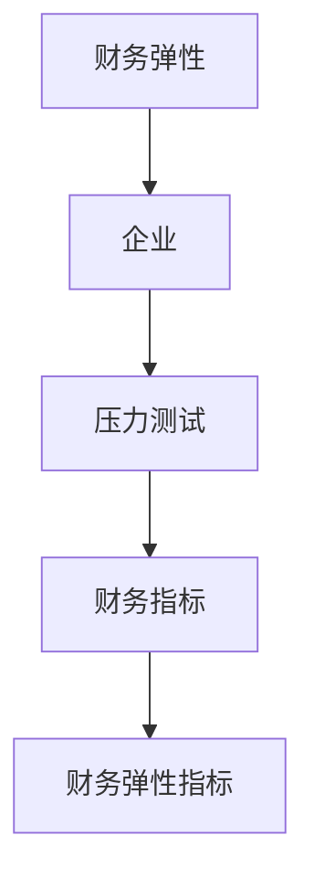
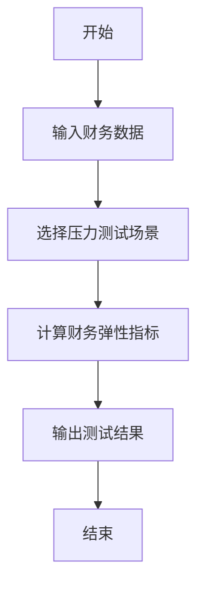
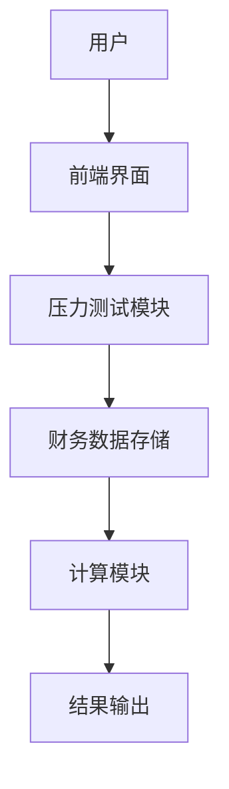

                 


# 彼得·林奇对公司财务弹性压力测试方法

## 关键词：彼得·林奇，财务弹性，压力测试，算法原理，系统架构

## 摘要：本文深入探讨了彼得·林奇提出的财务弹性概念及其在压力测试中的应用。通过对财务弹性的详细分析，结合实际案例，阐述了如何通过压力测试评估企业应对市场波动的能力。文章还详细讲解了压力测试的算法原理、系统架构设计和项目实战，为企业在复杂市场环境中保持财务稳健提供科学依据。

---

# 第一部分: 彼得·林奇与压力测试方法概述

## 第1章: 彼得·林奇与压力测试方法概述

### 1.1 彼得·林奇的背景与投资理念
#### 1.1.1 彼得·林奇的生平简介
彼得·林奇（Peter Lynch）是全球著名的投资专家，曾任富达投资集团（Fidelity Investments）的董事长。他以独特的投资理念和卓越的投资业绩闻名，提出了许多重要的投资理论，其中财务弹性是其核心概念之一。

#### 1.1.2 彼得·林奇的投资哲学
林奇认为，投资不仅是对数字的分析，更是对企业的深入了解。他强调，投资者应该关注企业的基本面，尤其是企业的财务弹性，这是企业在市场波动中保持稳健的关键。

#### 1.1.3 彼得·林奇的财务弹性理论
财务弹性是指企业在面对市场波动时，能够灵活调整财务结构，维持正常运营的能力。林奇认为，财务弹性是企业在复杂市场环境中生存和发展的关键。

---

### 1.2 压力测试方法的定义与作用
#### 1.2.1 压力测试的基本概念
压力测试是一种用于评估系统或模型在极端情况下表现的方法。在财务领域，压力测试用于评估企业在市场波动、经济衰退等极端情况下的财务状况。

#### 1.2.2 压力测试在财务分析中的作用
压力测试可以帮助企业识别潜在风险，评估财务策略的稳健性，并制定应对极端情况的预案。

#### 1.2.3 财务弹性与压力测试的关系
财务弹性是压力测试的核心指标，压力测试则是评估财务弹性的重要工具。

---

### 1.3 财务弹性与企业风险管理
#### 1.3.1 财务弹性的定义
财务弹性是指企业在面对外部环境变化时，能够调整财务结构，维持财务健康的能力。

#### 1.3.2 财务弹性与企业风险的关系
财务弹性越强，企业应对风险的能力越强。压力测试通过模拟极端情况，评估财务弹性的有效性。

#### 1.3.3 压力测试在财务弹性管理中的应用
压力测试可以帮助企业识别财务弹性中的薄弱环节，优化财务结构，提高抗风险能力。

---

### 1.4 本章小结
本章介绍了彼得·林奇的背景及其财务弹性理论，阐述了压力测试的基本概念和作用，分析了财务弹性与企业风险管理的关系。这些内容为后续章节的深入分析奠定了基础。

---

# 第二部分: 财务弹性与压力测试的核心概念

## 第2章: 财务弹性与压力测试的核心概念

### 2.1 财务弹性的核心要素
#### 2.1.1 财务弹性的关键指标
- 资产负债率
- 现金储备
- 营运能力

#### 2.1.2 财务弹性与企业运营的关系
财务弹性直接影响企业的运营能力，尤其是在市场波动时，企业能否维持正常运营。

#### 2.1.3 财务弹性与企业战略的结合
财务弹性是企业战略的重要组成部分，特别是在制定长期发展目标时，需要考虑财务弹性。

---

### 2.2 压力测试的核心原理
#### 2.2.1 压力测试的基本原理
通过模拟极端市场条件，评估企业财务状况的变化。

#### 2.2.2 压力测试的数学模型
压力测试的数学模型包括财务弹性指数公式：
$$ E = \frac{F}{S} $$
其中，$E$ 表示财务弹性指数，$F$ 表示企业未来现金流，$S$ 表示当前现金流。

#### 2.2.3 压力测试的实施步骤
1. 确定测试场景
2. 收集数据
3. 计算财务弹性指标
4. 分析结果

---

### 2.3 财务弹性与压力测试的联系
#### 2.3.1 财务弹性与压力测试的内在联系
财务弹性是压力测试的核心指标，压力测试是评估财务弹性的重要工具。

#### 2.3.2 财务弹性对压力测试的影响
财务弹性越强，压力测试的结果越稳健。

#### 2.3.3 压力测试对财务弹性的作用
压力测试可以帮助企业优化财务结构，提高财务弹性。

---

### 2.4 核心概念对比表
| 概念       | 财务弹性 | 财务刚性 | 敏感性分析 |
|------------|----------|----------|------------|
| 定义       | 企业应对变化的能力 | 企业对变化的抵抗能力 | 分析变量对结果的影响 |
| 应用场景   | 市场波动 | 稳定环境 | 优化模型     |

---

### 2.5 ER实体关系图


---

### 2.6 本章小结
本章详细分析了财务弹性和压力测试的核心概念，通过对比和图表展示，明确了两者之间的关系和作用。

---

# 第三部分: 财务弹性压力测试的算法原理

## 第3章: 财务弹性压力测试的算法原理

### 3.1 算法原理概述
#### 3.1.1 算法的基本思路
通过模拟极端市场条件，计算企业财务指标的变化，评估财务弹性。

#### 3.1.2 算法的核心步骤
1. 确定测试场景
2. 计算财务弹性指数
3. 分析结果

---

### 3.2 算法流程图


---

### 3.3 算法的数学模型
#### 3.3.1 财务弹性指数公式
$$ E = \frac{F}{S} $$

其中：
- $E$ 表示财务弹性指数
- $F$ 表示企业未来现金流
- $S$ 表示当前现金流

#### 3.3.2 压力测试场景模拟
通过假设不同的市场条件（如经济衰退、市场暴跌），计算财务弹性指数的变化。

---

### 3.4 本章小结
本章通过算法流程图和数学公式，详细阐述了压力测试的原理和实现步骤，为后续的系统设计和项目实战奠定了基础。

---

# 第四部分: 系统分析与架构设计方案

## 第4章: 系统分析与架构设计

### 4.1 问题场景介绍
企业在市场波动中面临财务风险，需要通过压力测试评估财务弹性。

---

### 4.2 系统功能设计
#### 4.2.1 领域模型（类图）


#### 4.2.2 系统架构设计（架构图）


#### 4.2.3 系统接口设计
- 用户输入：财务数据、测试场景
- 输出：财务弹性指数、测试结果

---

### 4.3 本章小结
本章通过系统分析和架构设计，展示了如何将压力测试方法应用于实际系统中。

---

# 第五部分: 项目实战

## 第5章: 项目实战

### 5.1 环境安装
需要安装Python和相关库（如numpy、pandas）。

---

### 5.2 系统核心实现源代码
```python
import numpy as np
import pandas as pd

def financial_elasticity(future_cash_flow, current_cash_flow):
    return future_cash_flow / current_cash_flow

# 示例数据
future_cash_flow = 1000000
current_cash_flow = 500000

elasticity = financial_elasticity(future_cash_flow, current_cash_flow)
print("财务弹性指数:", elasticity)
```

---

### 5.3 代码应用解读与分析
通过代码实现压力测试，计算财务弹性指数，评估企业应对市场波动的能力。

---

### 5.4 实际案例分析
以某企业为例，分析其财务弹性指数，评估其应对市场波动的能力。

---

### 5.5 本章小结
本章通过项目实战，展示了如何将压力测试方法应用于实际案例中，帮助企业优化财务结构，提高抗风险能力。

---

# 第六部分: 最佳实践

## 第6章: 最佳实践

### 6.1 小结
压力测试是评估财务弹性的重要工具，帮助企业应对市场波动。

---

### 6.2 注意事项
- 数据准确性
- 模型合理性
- 结果解释

---

### 6.3 拓展阅读
建议阅读彼得·林奇的相关著作，深入了解财务弹性理论。

---

# 作者：AI天才研究院/AI Genius Institute & 禅与计算机程序设计艺术/Zen And The Art of Computer Programming

---

感谢您的阅读！希望本文对您理解彼得·林奇的财务弹性压力测试方法有所帮助。

