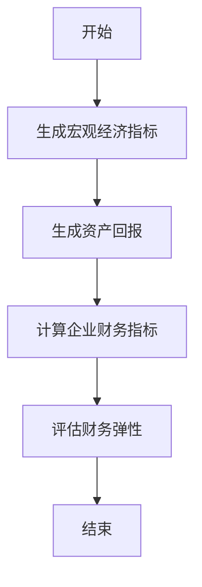
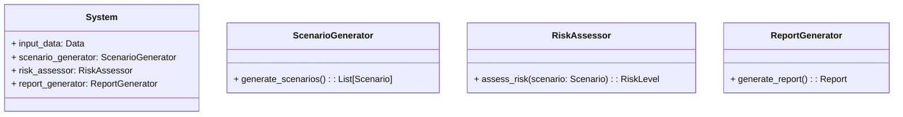

                 


# 彼得林奇对公司财务弹性的多情景压力测试方法

> 关键词：彼得林奇，多情景压力测试，财务弹性，风险管理，系统架构，Python实现

> 摘要：本文深入探讨了彼得林奇提出的多情景压力测试方法在公司财务弹性评估中的应用。通过详细分析压力测试的背景、核心概念、数学模型、系统架构及项目实战，本文为读者提供了全面理解与实施该方法的指导。文章结合理论与实践，配以图表和代码示例，帮助读者掌握如何在实际业务中应用多情景压力测试来评估和管理财务风险。

---

## 第一部分：背景介绍

### 第1章：财务弹性与压力测试的背景

#### 1.1 财务弹性的概念与重要性

财务弹性是指企业在面对外部环境变化时，能够调整其财务结构和运营策略，以维持或恢复财务健康的能力。它反映了企业在不同压力情景下的适应性和恢复能力。财务弹性的重要性体现在以下几个方面：

1. **维持企业生存**：在经济下行或市场波动时，财务弹性强的企业能够更好地应对危机，避免破产。
2. **支持业务增长**：健康的财务状况为企业提供了扩张和投资的机会。
3. **优化资本结构**：通过调整负债与 equity 的比例，企业可以降低财务风险。

#### 1.2 多情景压力测试的背景

传统压力测试通常基于单一或少数情景，难以全面评估企业在多种复杂环境下的财务状况。随着市场波动加剧，企业需要更全面的工具来评估其财务弹性。多情景压力测试通过模拟多种可能的经济和市场情景，帮助企业更好地准备应对潜在风险。

#### 1.3 彼得林奇方法的提出

彼得林奇（Peter Lych）提出了一种基于多情景压力测试的方法，用于评估企业财务弹性。这种方法结合了统计分析、情景生成和机器学习技术，能够更准确地模拟不同市场条件下的企业财务表现。

---

## 第二部分：核心概念与联系

### 第2章：多情景压力测试的核心概念

#### 2.1 多情景压力测试的原理

多情景压力测试通过生成多个可能的市场情景，评估企业在这些情景下的财务表现。其核心在于将企业财务指标（如收入、利润、现金流）与宏观经济变量（如GDP增长率、利率、通胀率）联系起来，模拟不同经济条件下的企业财务状况。

#### 2.2 核心概念的属性对比

以下是多情景压力测试中关键概念的对比表：

| 概念 | 描述 | 示例 |
|------|------|------|
| 情景生成 | 模拟不同经济条件下的市场情况 | 经济衰退、经济复苏、高通胀 |
| 财务弹性指标 | 衡量企业在不同情景下的财务健康程度 | 净利润、现金流、债务率 |
| 风险评估 | 识别潜在风险并制定应对策略 | 利润下降、现金流断裂 |

#### 2.3 ER实体关系图

以下是企业财务弹性评估的ER图：

```mermaid
erDiagram
    customer[客户] {
        id : integer
        name : string
        address : string
    }
    transaction[schema]
    purchase_order[采购订单] {
        order_id : integer
        customer_id : integer
        order_date : date
    }
    product[产品] {
        product_id : integer
        name : string
        price : decimal
    }
    supplier[供应商] {
        supplier_id : integer
        name : string
        contact : string
    }
    purchase_order -> product : 包含
    purchase_order -> customer : 属于
    product -> supplier : 由...供应
```

---

## 第三部分：算法原理讲解

### 第3章：多情景压力测试的数学模型

#### 3.1 资产回报的分布模型

资产回报的分布模型是多情景压力测试的核心。我们假设资产回报服从正态分布：

$$ R_i \sim N(\mu_i, \sigma_i^2) $$

其中，$\mu_i$ 是资产i的期望回报，$\sigma_i$ 是标准差。

#### 3.2 情景生成的算法

以下是情景生成的算法流程图：



以下是情景生成的Python代码示例：

```python
import numpy as np
import pandas as pd

# 宏观经济指标
gdp_growth = np.random.normal(2.5, 0.8, 1000)
inflation = np.random.normal(2.0, 0.5, 1000)
interest_rate = np.random.normal(5.0, 1.5, 1000)

# 生成资产回报
assets = pd.DataFrame({
    'GDP Growth': gdp_growth,
    'Inflation': inflation,
    'Interest Rate': interest_rate
})

# 计算企业财务指标
assets['Profit'] = assets['GDP Growth'] * 0.2 - assets['Inflation'] * 0.1
assets['Cash Flow'] = assets['GDP Growth'] * 0.3 + assets['Interest Rate'] * 0.2
```

#### 3.3 组合风险评估

组合风险评估是通过将多个资产的风险进行加权平均来计算整体风险。公式如下：

$$ \text{组合风险} = \sum_{i=1}^n w_i \times \sigma_i $$

其中，$w_i$ 是资产i的权重，$\sigma_i$ 是资产i的风险。

---

## 第四部分：系统分析与架构设计

### 第4章：系统分析与架构设计方案

#### 4.1 问题场景介绍

我们考虑一个中型制造企业，希望通过多情景压力测试评估其财务弹性。系统需要处理大量宏观经济数据，并模拟不同情景下的财务指标。

#### 4.2 系统功能设计

以下是系统功能设计的类图：



#### 4.3 系统架构设计

以下是系统架构设计的架构图：


---

## 第五部分：项目实战

### 第5章：项目实战

#### 5.1 环境安装

安装必要的Python库：

```bash
pip install numpy pandas matplotlib
```

#### 5.2 核心代码实现

以下是核心代码实现：

```python
import numpy as np
import pandas as pd

def generate_scenarios(n=1000):
    gdp_growth = np.random.normal(2.5, 0.8, n)
    inflation = np.random.normal(2.0, 0.5, n)
    interest_rate = np.random.normal(5.0, 1.5, n)
    return pd.DataFrame({
        'GDP Growth': gdp_growth,
        'Inflation': inflation,
        'Interest Rate': interest_rate
    })

def assess_profit(data):
    data['Profit'] = data['GDP Growth'] * 0.2 - data['Inflation'] * 0.1
    return data

# 生成情景
data = generate_scenarios(1000)
assess_profit(data)
```

#### 5.3 案例分析

分析生成的情景数据，评估企业在不同经济条件下的利润表现。

---

## 第六部分：最佳实践与小结

### 第6章：最佳实践

- **数据质量**：确保输入数据的准确性和完整性。
- **模型选择**：根据实际情况选择合适的模型和参数。
- **结果解读**：结合业务背景解读压力测试结果，制定相应的风险管理策略。

### 第7章：小结

本文详细介绍了彼得林奇的多情景压力测试方法在公司财务弹性评估中的应用。通过理论分析、算法实现和项目实战，读者可以全面掌握该方法的核心思想和实际应用。未来的研究可以进一步结合人工智能技术，提高压力测试的准确性和效率。

---

作者：AI天才研究院 & 禅与计算机程序设计艺术

