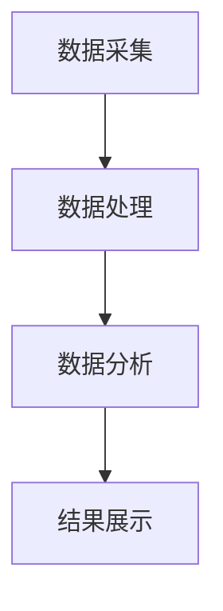

                 


# 彼得林奇对公司财务透明度的要求

## 关键词：财务透明度、彼得林奇、投资策略、公司治理、风险管理

## 摘要：  
彼得·林奇是全球著名投资家，他强调财务透明度是投资决策的核心要素。本文从定义、重要性、评估方法、提升策略等多维度深入分析财务透明度，结合实际案例和系统架构设计，探讨如何通过信息化手段提升财务透明度。文章最后提供项目实战指导，帮助读者理解和应用相关知识。

---

## 第1章: 财务透明度的背景与重要性

### 1.1 财务透明度的定义与核心概念

#### 1.1.1 财务透明度的定义  
财务透明度是指公司在财务报表、管理决策和信息披露中，以清晰、准确、及时的方式向利益相关者提供真实、完整、可验证的财务信息。其核心在于信息的可信赖性和可理解性。

#### 1.1.2 财务透明度的核心要素  
- **真实性**：财务数据必须真实反映公司财务状况。  
- **完整性**：涵盖公司所有重要财务信息。  
- **及时性**：财务信息需及时披露，避免信息滞后。  
- **可验证性**：信息需通过独立审计验证。  
- **可理解性**：信息需以简洁明了的方式呈现，便于利益相关者理解。

#### 1.1.3 财务透明度的边界与外延  
财务透明度不仅限于财务报表，还包括公司治理、内部控制、风险管理等方面。其外延涉及企业内外部信息传递的效率和效果。

---

### 1.2 彼得林奇的财务透明度观

#### 1.2.1 彼得林奇的财务透明度理念  
彼得·林奇认为，财务透明度是投资者评估公司价值的关键因素。他强调，一家公司如果财务信息不透明，投资者将难以准确评估其价值，投资决策也将面临重大风险。

#### 1.2.2 财务透明度与投资决策的关系  
财务透明度直接影响投资者对公司的信任度和投资决策。高透明度的公司更容易获得投资者的信任，从而获得更多的资金支持和市场机会。

#### 1.2.3 财务透明度在公司治理中的作用  
财务透明度是公司治理的重要组成部分。通过公开透明的财务信息，股东和管理层能够更好地监督公司运营，确保公司合规经营。

---

## 第2章: 财务透明度的核心概念与联系

### 2.1 财务透明度的核心原理

#### 2.1.1 财务透明度的内在逻辑  
财务透明度的内在逻辑在于信息的真实性和可验证性。通过透明的财务信息，利益相关者能够准确评估公司的财务状况和经营风险。

#### 2.1.2 财务透明度的关键属性特征  
- **真实性**：数据必须反映实际情况。  
- **完整性**：信息必须涵盖所有重要方面。  
- **可验证性**：信息可以通过独立审计验证。  
- **可理解性**：信息必须以清晰的方式呈现。

#### 2.1.3 财务透明度的数学模型与公式  
财务透明度可以通过以下公式进行量化评估：  
$$\text{财务透明度} = \frac{\text{真实财务信息量}}{\text{总财务信息量}} \times 100\%$$  
其中，真实财务信息量是指通过独立审计确认的财务信息量，总财务信息量是指公司实际披露的财务信息量。

### 2.2 财务透明度与相关概念的对比分析

#### 2.2.1 财务透明度与其他财务概念的对比  
| 概念       | 定义与特征                              | 关联性分析                     |
|------------|----------------------------------------|--------------------------------|
| 财务报告   | 公司财务状况的正式记录                  | 财务透明度的核心载体           |
| 企业治理   | 公司内部管理与决策机制                  | 财务透明度的重要支撑           |
| 风险管理   | 识别、评估和应对风险的策略              | 财务透明度的重要组成部分         |

#### 2.2.2 财务透明度与企业治理的关系  
企业治理是财务透明度的重要保障。通过完善的公司治理结构，可以确保财务信息的真实性和透明性。

#### 2.2.3 财务透明度与风险管理的联系  
财务透明度是风险管理的基础。只有通过透明的财务信息，才能准确评估公司的经营风险，并制定有效的风险管理策略。

---

## 第3章: 财务透明度的评估方法

### 3.1 财务透明度的定性评估

#### 3.1.1 定性评估的标准与指标  
- **信息完整性**：财务报表是否涵盖所有重要信息。  
- **信息可理解性**：财务信息是否以清晰的方式呈现。  
- **信息及时性**：财务信息是否及时披露。

#### 3.1.2 定性评估的步骤与流程  
1. 收集公司财务报表和相关信息披露。  
2. 评估财务信息的真实性和完整性。  
3. 分析公司治理结构和内部控制机制。  
4. 得出财务透明度的定性评估结果。

#### 3.1.3 定性评估的案例分析  
以某公司为例，分析其财务报表的完整性和可理解性，评估其财务透明度。

### 3.2 财务透明度的定量评估

#### 3.2.1 财务比率分析法  
常用财务比率包括：  
$$\text{流动比率} = \frac{\text{流动资产}}{\text{流动负债}}$$  
$$\text{净利润率} = \frac{\text{净利润}}{\text{营业收入}}$$  

#### 3.2.2 财务指标的计算与应用  
通过计算和分析这些财务指标，可以评估公司的财务健康状况和透明度。

#### 3.2.3 定量评估的优缺点  
- **优点**：量化评估，结果客观。  
- **缺点**：忽视定性因素，可能无法全面反映财务透明度。

---

## 第4章: 财务透明度的提升策略

### 4.1 提升财务透明度的内部策略

#### 4.1.1 内部控制系统优化  
通过建立完善的内部控制体系，确保财务信息的真实性和完整性。

#### 4.1.2 财务信息披露机制的完善  
制定透明的财务信息披露政策，确保信息及时、准确地传递给利益相关者。

#### 4.1.3 员工财务透明度意识的培养  
通过培训和教育，提高员工的财务透明度意识，确保财务信息的准确传递。

### 4.2 提升财务透明度的外部策略

#### 4.2.1 加强与投资者的沟通  
通过定期投资者会议和财报解读，增强投资者对公司的信任。

#### 4.2.2 提高财务报告的可读性  
财务报告应以简洁明了的方式呈现，便于投资者理解和分析。

#### 4.2.3 利用第三方审计机构的作用  
通过独立审计机构的审核，确保财务信息的真实性和可信赖性。

---

## 第5章: 财务透明度的系统架构与设计方案

### 5.1 财务透明度系统的功能设计

#### 5.1.1 系统功能模块划分  
- **数据采集模块**：收集公司财务数据。  
- **数据处理模块**：对数据进行清洗和处理。  
- **数据分析模块**：对数据进行分析和评估。  
- **结果展示模块**：以图表形式展示分析结果。

#### 5.1.2 系统功能流程图  


---

## 第6章: 财务透明度的信息化提升

### 6.1 财务透明度信息化的必要性

#### 6.1.1 信息化对财务透明度的推动作用  
通过信息化手段，可以提高财务信息的处理效率和准确性。

#### 6.1.2 信息化对财务透明度的保障作用  
通过信息化系统，可以确保财务信息的完整性和可追溯性。

### 6.2 财务透明度信息化的实现方案

#### 6.2.1 系统架构设计  


#### 6.2.2 系统功能实现  
- 数据采集：通过API接口获取财务数据。  
- 数据处理：对数据进行清洗和转换。  
- 数据分析：利用大数据技术进行分析和评估。  
- 结果展示：以可视化方式展示分析结果。

---

## 第7章: 财务透明度的项目实战

### 7.1 项目背景与目标

#### 7.1.1 项目背景  
某公司希望通过提升财务透明度，增强投资者信任，优化公司治理。

#### 7.1.2 项目目标  
- 提高财务信息的透明度和可理解性。  
- 建立完善的财务信息披露机制。  
- 优化公司内部控制系统。

### 7.2 项目实施步骤

#### 7.2.1 环境配置  
- 安装必要的软件和工具。  
- 配置数据库和服务器。

#### 7.2.2 系统核心实现  
```python
# 财务数据处理代码示例
import pandas as pd

# 读取财务数据
data = pd.read_csv('finance_data.csv')

# 数据清洗
data.dropna(inplace=True)

# 数据分析
data['profit_ratio'] = data['净利润'] / data['营业收入']

# 结果展示
print(data.head())
```

---

## 第8章: 总结与展望

### 8.1 本文总结  
本文从多个维度深入分析了财务透明度的重要性、评估方法和提升策略。通过实际案例和系统设计，探讨了如何通过信息化手段提升财务透明度。

### 8.2 最佳实践 tips  
- 定期审计和财务信息披露是提高财务透明度的关键。  
- 建立完善的内部控制体系，确保财务信息的真实性和完整性。  
- 利用信息化手段，提高财务信息的处理效率和准确性。

### 8.3 未来展望  
随着信息技术的发展，财务透明度的提升将更加依赖于信息化手段。未来，可以通过人工智能和大数据技术，进一步提高财务信息的分析和评估效率。

---

## 作者：AI天才研究院/AI Genius Institute & 禅与计算机程序设计艺术 /Zen And The Art of Computer Programming

