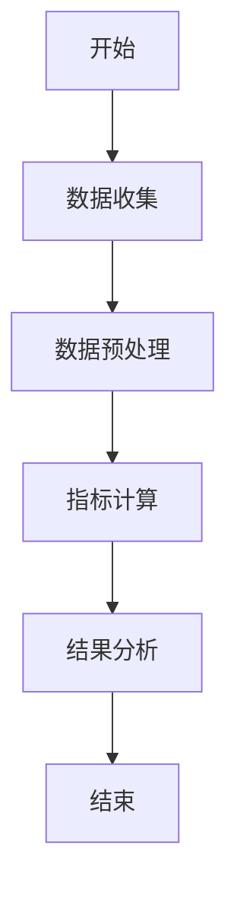
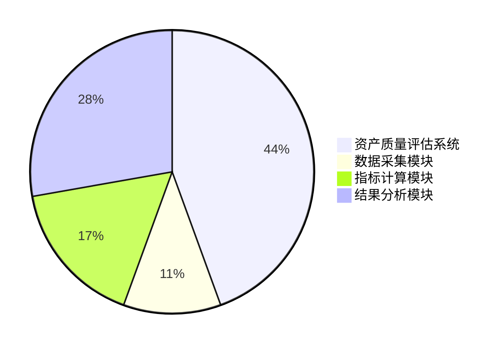

                 

# 彼得林奇对公司资产质量的深度分析

## 关键词：资产质量，彼得林奇，财务分析，投资策略，公司估值

## 摘要：  
本文深入分析了彼得·林奇在公司资产质量评估中的方法和策略，探讨了资产质量的核心概念、数学模型、系统设计以及实际案例分析，帮助读者理解如何通过资产质量评估做出明智的投资决策。

---

## 第1章：资产质量的背景与概念

### 1.1 资产质量的定义与重要性

#### 1.1.1 资产的定义与分类
资产是企业拥有或控制的资源，预期能为企业带来经济利益。根据流动性，资产可分为流动资产和非流动资产；根据有无实物形态，可分为有形资产和无形资产。

#### 1.1.2 资产质量的定义
资产质量指的是资产的健康状况和变现能力，衡量资产的实际价值和潜在风险。

#### 1.1.3 资产质量的重要性
资产质量直接影响企业的偿债能力、运营效率和投资价值，是评估企业财务状况的重要指标。

### 1.2 资产质量的评估背景

#### 1.2.1 投资决策中的资产质量考量
投资者通过分析企业的资产质量，评估其盈利能力和风险，从而做出投资决策。

#### 1.2.2 资产质量与企业价值的关系
资产质量优的企业通常具有更高的市场价值和更强的竞争力，是企业价值的重要组成部分。

#### 1.2.3 资产质量评估的边界与外延
资产质量评估需考虑企业所处行业、市场环境和经营战略，避免单一维度的评估偏差。

---

## 第2章：资产质量的核心概念与联系

### 2.1 核心概念原理

#### 2.1.1 资产质量的核心要素
- 流动性：资产的变现能力。
- 使用寿命：资产的长期使用价值。
- 账面价值与公允价值：资产的会计价值与市场价值差异。

#### 2.1.2 资产质量的评估维度
- 流动资产：如现金、应收账款。
- 非流动资产：如固定资产、无形资产。

### 2.2 资产类别对比分析

#### 2.2.1 流动资产与非流动资产的特征对比

| 类别             | 特征             |
|------------------|------------------|
| 流动资产         | 变现能力强，周期短 |
| 非流动资产       | 变现能力弱，周期长 |

#### 2.2.2 有形资产与无形资产的属性分析

| 类别             | 特征             |
|------------------|------------------|
| 有形资产         | 具有实物形态     |
| 无形资产         | 无实物形态，如专利 |

---

## 第3章：资产质量评估的数学模型与算法

### 3.1 资产质量评估的指标体系

#### 3.1.1 流动资产周转率
$$ \text{流动资产周转率} = \frac{\text{营业收入}}{\text{流动资产平均余额}} $$

#### 3.1.2 速动比率
$$ \text{速动比率} = \frac{\text{速动资产}}{\text{流动负债}} $$

#### 3.1.3 资产回报率
$$ \text{资产回报率} = \frac{\text{净利润}}{\text{平均资产总额}} $$

### 3.2 资产质量评估的算法流程

---

## 第4章：资产质量评估的系统架构与设计

### 4.1 系统功能设计

#### 4.1.1 数据采集模块
- 从财务报表中提取资产数据。
- 数据清洗和转换。

#### 4.1.2 指标计算模块
- 计算流动资产周转率、速动比率等指标。

#### 4.1.3 结果分析模块
- 对资产质量进行综合评分。

### 4.2 系统架构设计

---

## 第5章：实际案例分析与解读

### 5.1 案例背景介绍

#### 5.1.1 案例公司概况
以某制造企业为例，分析其资产质量。

#### 5.1.2 资产质量评估的目的
识别资产潜在风险，优化资产结构。

### 5.2 指标计算与分析

#### 5.2.1 流动资产周转率计算
- 营业收入：1000万元
- 流动资产平均余额：500万元
$$ \text{流动资产周转率} = \frac{1000}{500} = 2 $$

#### 5.2.2 速动比率分析
- 速动资产：300万元
- 流动负债：150万元
$$ \text{速动比率} = \frac{300}{150} = 2 $$

---

## 第6章：投资策略与注意事项

### 6.1 投资策略制定

#### 6.1.1 资产质量评估在投资中的应用
- 选择资产质量高的企业进行投资。

#### 6.1.2 不同资产类别的投资策略
- 高流动资产企业适合短期投资。
- 高无形资产企业适合长期投资。

### 6.2 投资中的注意事项

#### 6.2.1 资产质量评估的局限性
- 仅依赖财务数据可能导致片面判断。

#### 6.2.2 市场波动对资产质量的影响
- 宏观经济波动会影响资产的市场价值。

---

## 第7章：总结与未来研究方向

### 7.1 全书总结

#### 7.1.1 资产质量的核心概念
资产质量是企业财务健康的重要指标，影响企业的偿债能力和盈利能力。

#### 7.1.2 评估方法与系统的构建
通过数学模型和系统设计，实现资产质量的量化评估。

### 7.2 未来研究方向

#### 7.2.1 引入机器学习技术
利用机器学习模型提高资产质量评估的准确性。

#### 7.2.2 实时监控与预警系统
开发实时监控系统，及时发现资产质量风险。

---

## 作者：AI天才研究院/AI Genius Institute & 禅与计算机程序设计艺术 /Zen And The Art of Computer Programming

---

**感谢您的阅读！希望本文能为您提供有价值的信息和启发。**

