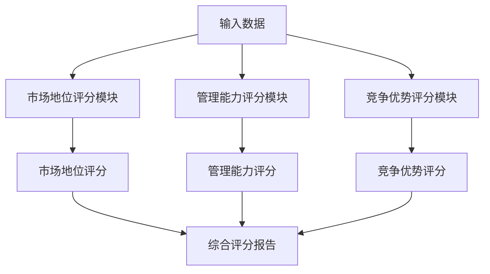

                 


# 彼得林奇对公司非财务报告质量的评估方法

> 关键词：彼得·林奇，非财务报告，公司评估，投资方法，市场分析

> 摘要：本文深入探讨了彼得·林奇在评估公司非财务报告质量方面的独特方法，分析了其背后的理论基础、评估标准及实际应用。通过结合定性和定量分析，本文展示了如何利用非财务信息来辅助投资决策，帮助投资者更全面地评估公司价值。

---

# 第一部分：非财务报告质量评估的背景与核心概念

## 第1章：非财务报告质量评估的背景与重要性

### 1.1 非财务报告的定义与特点

#### 1.1.1 非财务报告的核心概念
非财务报告是指公司通过文字、图表等形式提供的除财务数据之外的其他信息，用于描述企业的市场地位、管理能力、竞争优势等。这些信息通常不直接反映在财务报表中，但对企业的整体价值评估具有重要意义。

#### 1.1.2 非财务报告与财务报告的区别
- **内容**：财务报告主要涉及企业的财务状况、经营成果和现金流量，而非财务报告则关注企业的市场地位、管理能力、竞争优势等。
- **目的**：财务报告主要用于评估企业的财务健康状况，而非财务报告则用于评估企业的经营能力和未来发展前景。
- **信息类型**：财务报告主要包含数字和财务指标，而非财务报告则包含更多的定性信息。

#### 1.1.3 非财务报告在企业价值评估中的作用
非财务报告能够提供财务数据之外的重要信息，帮助投资者更全面地评估企业的价值。例如，通过分析企业的市场地位、管理团队的能力以及竞争优势，投资者可以更好地判断企业的未来发展潜力。

---

### 1.2 彼得·林奇与非财务报告评估方法

#### 1.2.1 彼得·林奇的背景与投资理念
彼得·林奇是美国著名投资经理，以其独特的投资理念和对基本面分析的深入研究而闻名。他认为，投资成功的的关键在于对企业基本面的全面了解，包括财务和非财务因素。

#### 1.2.2 非财务报告在彼得·林奇投资决策中的地位
林奇认为，非财务报告是评估企业价值的重要依据。他特别关注企业的市场地位、管理团队的能力以及竞争优势等非财务因素，认为这些因素能够更准确地反映企业的长期发展潜力。

#### 1.2.3 非财务报告评估方法的核心思想
林奇的评估方法强调定性和定量分析的结合。他通过分析企业的市场地位、管理团队的能力、竞争优势等非财务因素，结合财务数据，综合评估企业的价值。

---

### 1.3 非财务报告质量评估的必要性

#### 1.3.1 财务数据的局限性
财务数据虽然能够反映企业的财务状况，但无法全面描述企业的经营能力和未来发展潜力。例如，财务数据无法直接反映企业的市场地位和管理团队的能力。

#### 1.3.2 非财务信息对企业价值的影响
非财务信息能够提供更多关于企业经营状况的信息，如市场需求变化、竞争对手情况、企业管理层的决策能力等，这些信息对企业的价值评估至关重要。

#### 1.3.3 投资者如何通过非财务报告识别企业风险
通过分析非财务报告，投资者可以识别企业的潜在风险，如管理不善、市场竞争加剧等，从而做出更明智的投资决策。

---

## 第2章：非财务报告的核心要素与评估标准

### 2.1 非财务报告的主要类型

#### 2.1.1 管理层报告
管理层报告通常包括企业的战略规划、管理团队的构成和能力、管理决策的合理性等内容。通过分析管理层报告，投资者可以了解企业的管理风格和决策能力。

#### 2.1.2 市场地位报告
市场地位报告描述企业在市场中的位置，包括市场份额、品牌影响力、客户忠诚度等。这些信息能够帮助投资者判断企业的市场竞争力。

#### 2.1.3 竞争优势分析
竞争优势分析包括企业的核心竞争力、成本优势、技术优势等。这些因素能够影响企业的长期盈利能力。

---

### 2.2 非财务报告的核心要素

#### 2.2.1 市场地位
市场地位是衡量企业竞争力的重要指标。企业的市场地位越高，其抗风险能力越强，未来发展潜力也越大。

#### 2.2.2 管理团队能力
管理团队的能力直接影响企业的经营效果。一个能力强、决策果断的管理团队能够带领企业应对各种挑战，抓住发展机遇。

#### 2.2.3 企业竞争优势
竞争优势是企业在市场中立足的关键。企业必须具备独特的竞争优势，才能在激烈的市场竞争中占据优势地位。

---

### 2.3 非财务报告的评估标准

#### 2.3.1 定性评估标准
定性评估标准包括市场地位、管理团队能力、竞争优势等。这些标准通常需要通过文字描述和案例分析来评估。

#### 2.3.2 定量评估标准
定量评估标准包括市场份额、客户满意度、员工稳定性等。这些指标可以通过数据量化来评估。

#### 2.3.3 综合评估模型
综合评估模型是将定性和定量评估标准结合起来，形成一个全面的评估体系。通过综合评估模型，投资者可以更全面地评估企业的价值。

---

## 第3章：彼得·林奇的非财务报告评估方法

### 3.1 彼得·林奇的非财务报告分析框架

#### 3.1.1 基于管理能力的分析
林奇认为，管理能力是影响企业价值的重要因素。他通过分析管理团队的稳定性、决策能力以及管理风格来评估企业的管理能力。

#### 3.1.2 基于市场地位的分析
林奇关注企业的市场地位，特别是企业的市场份额和品牌影响力。他认为，市场地位强的企业更有可能在竞争中获胜。

#### 3.1.3 基于竞争优势的分析
林奇强调竞争优势的重要性。他通过分析企业的核心竞争力、成本优势和技术优势等，来评估企业的竞争优势。

---

### 3.2 非财务报告的定性分析方法

#### 3.2.1 管理层稳定性分析
林奇通过分析管理团队的稳定性来评估企业的管理能力。稳定的管理团队能够为企业带来持续的经营成果。

#### 3.2.2 企业战略目标评估
林奇关注企业的战略目标是否清晰，并且是否能够实现。他通过分析企业的战略规划和目标，评估企业的未来发展潜力。

#### 3.2.3 市场反馈与客户满意度分析
林奇通过分析市场反馈和客户满意度，评估企业的市场地位和品牌影响力。他认为，客户满意度高的企业更容易获得市场份额。

---

### 3.3 非财务报告的定量分析方法

#### 3.3.1 市场占有率分析
市场占有率是衡量企业市场地位的重要指标。林奇通过分析企业的市场占有率，评估其在市场中的竞争力。

#### 3.3.2 盈利能力分析
虽然盈利能力是财务指标，但林奇认为，通过分析企业的盈利能力，可以间接反映其管理能力和市场地位。

#### 3.3.3 成本控制能力分析
成本控制能力是企业竞争优势的重要组成部分。林奇通过分析企业的成本结构和成本控制能力，评估其竞争优势。

---

## 第4章：非财务报告质量评估的数学模型与公式

### 4.1 非财务报告评估的数学模型

#### 4.1.1 市场地位评分模型
市场地位评分模型可以通过以下公式计算：
$$ \text{市场地位评分} = \text{市场份额} \times 0.4 + \text{品牌影响力} \times 0.3 + \text{客户满意度} \times 0.3 $$

#### 4.1.2 管理能力评分模型
管理能力评分模型可以通过以下公式计算：
$$ \text{管理能力评分} = \text{管理团队稳定性} \times 0.5 + \text{决策能力} \times 0.3 + \text{管理风格} \times 0.2 $$

#### 4.1.3 竞争优势评分模型
竞争优势评分模型可以通过以下公式计算：
$$ \text{竞争优势评分} = \text{核心竞争力} \times 0.4 + \text{成本优势} \times 0.3 + \text{技术优势} \times 0.3 $$

---

### 4.2 系统分析与架构设计方案

#### 4.2.1 问题场景介绍
假设我们有一个企业，需要对其非财务报告质量进行评估。我们可以通过分析企业的市场地位、管理团队能力以及竞争优势等非财务因素，结合财务数据，综合评估企业的价值。

#### 4.2.2 系统功能设计
- **输入**：企业的市场地位数据、管理团队能力数据、竞争优势数据。
- **处理**：通过市场地位评分模型、管理能力评分模型和竞争优势评分模型，计算各项评分。
- **输出**：综合评分报告，评估企业的非财务报告质量。

#### 4.2.3 系统架构设计
以下是系统的架构图：



---

### 4.3 项目实战

#### 4.3.1 环境安装
需要安装Python和相关的数据分析库，如Pandas、NumPy等。

#### 4.3.2 核心实现源代码
以下是Python代码示例：

```python
import pandas as pd

# 定义市场地位评分模型
def market_position_score(share, brand, satisfaction):
    return share * 0.4 + brand * 0.3 + satisfaction * 0.3

# 定义管理能力评分模型
def management_score(stability, decision, style):
    return stability * 0.5 + decision * 0.3 + style * 0.2

# 定义竞争优势评分模型
def competitive_edge_score(core, cost, tech):
    return core * 0.4 + cost * 0.3 + tech * 0.3

# 示例数据
data = {
    '企业': ['企业A', '企业B', '企业C'],
    '市场份额': [0.3, 0.4, 0.2],
    '品牌影响力': [0.7, 0.6, 0.5],
    '客户满意度': [0.8, 0.7, 0.6],
    '管理团队稳定性': [0.6, 0.5, 0.7],
    '决策能力': [0.8, 0.7, 0.9],
    '管理风格': [0.5, 0.6, 0.4],
    '核心竞争力': [0.9, 0.8, 0.7],
    '成本优势': [0.7, 0.6, 0.8],
    '技术优势': [0.6, 0.5, 0.7]
}

df = pd.DataFrame(data)

# 计算评分
df['市场地位评分'] = df.apply(lambda x: market_position_score(x['市场份额'], x['品牌影响力'], x['客户满意度']), axis=1)
df['管理能力评分'] = df.apply(lambda x: management_score(x['管理团队稳定性'], x['决策能力'], x['管理风格']), axis=1)
df['竞争优势评分'] = df.apply(lambda x: competitive_edge_score(x['核心竞争力'], x['成本优势'], x['技术优势']), axis=1)

# 输出结果
print(df)
```

---

### 4.4 小结

通过以上分析，我们可以看到，彼得·林奇的非财务报告评估方法是一种结合定性和定量分析的综合评估体系。它不仅能够帮助投资者更全面地评估企业的价值，还能为企业的经营决策提供重要参考。

---

作者：AI天才研究院/AI Genius Institute & 禅与计算机程序设计艺术 /Zen And The Art of Computer Programming

