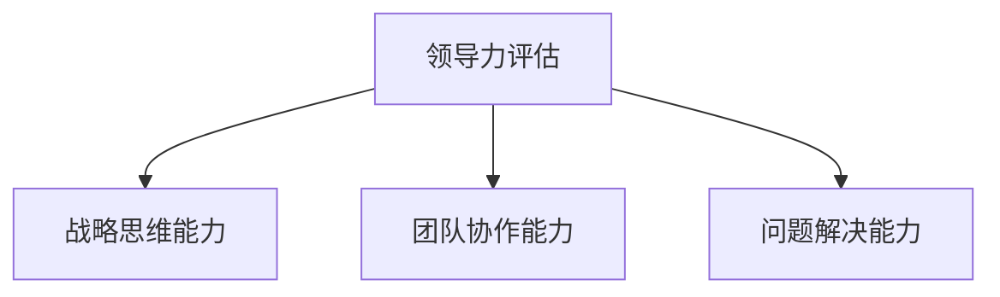
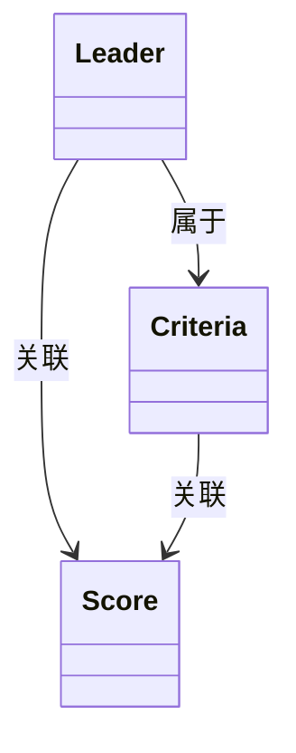
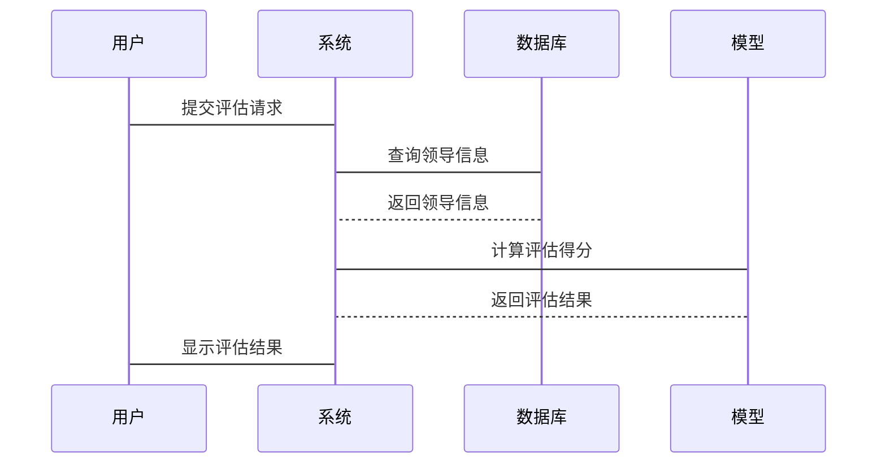

                 


# 彼得林奇对公司领导力的评估

## 关键词
- 领导力评估，彼得林奇，投资视角，领导力模型，评估标准，系统分析

## 摘要
本文从彼得林奇的投资视角出发，深入分析领导力评估的核心概念、模型、算法和系统架构。通过详细讲解层次分析法，结合数学公式和流程图，展示如何构建领导力评估模型。同时，通过项目实战和案例分析，提供实际应用和最佳实践，帮助读者掌握领导力评估的方法和技巧。

---

# 第一部分: 引言

# 第1章: 领导力评估的背景与重要性

## 1.1 领导力评估的背景介绍

### 1.1.1 领导力评估的定义与核心概念
领导力评估是指通过系统的方法和工具，对领导者的能力、特质和行为进行测量和评价的过程。其核心在于识别领导者的优势和改进空间，以提升团队和组织的绩效。

### 1.1.2 彼得林奇的领导力评估视角
彼得林奇作为投资大师，从投资角度审视领导力，认为领导者的决策能力和战略眼光是公司成功的关键。他强调通过分析领导者的过往表现和管理风格来评估其能力。

### 1.1.3 领导力评估的重要性与应用场景
领导力评估在企业招聘、晋升、培训和团队管理中起着关键作用。通过评估领导者的能力，企业可以做出更明智的人事决策，提升整体绩效。

## 1.2 彼得林奇的领导力评估方法

### 1.2.1 彼得林奇的领导力评估框架
彼得林奇的评估框架包括战略思维能力、团队协作能力、问题解决能力和风险控制能力。

### 1.2.2 彼得林奇的领导力评估标准
- 战略思维能力：领导者是否具备长远的战略眼光。
- 团队协作能力：领导者能否有效激励和协调团队成员。
- 问题解决能力：领导者在面对挑战时的应对策略。

### 1.2.3 彼得林奇领导力评估的独特性
彼得林奇结合投资分析方法，将领导力评估与企业绩效紧密结合，注重实际效果而非表面表现。

## 1.3 本章小结

---

# 第二部分: 领导力评估的核心概念与模型

# 第2章: 领导力评估的核心概念

## 2.1 领导力的定义与维度

### 2.1.1 领导力的定义
领导力是通过影响力和决策能力来引导团队实现目标的能力，包括认知能力、社交能力和情绪智力。

### 2.1.2 领导力的维度分析
- **认知能力**：逻辑思维、分析能力。
- **社交能力**：沟通技巧、人际关系管理。
- **情绪智力**：自我调节、同理心。

### 2.1.3 领导力与管理能力的对比
领导力注重影响力和愿景，而管理能力侧重于组织和执行。

## 2.2 彼得林奇领导力评估的核心要素

### 2.2.1 战略思维能力
领导者是否具备制定和执行战略计划的能力。

### 2.2.2 团队协作能力
领导者能否有效激励和协调团队成员。

### 2.2.3 问题解决能力
领导者在面对挑战时的应对策略。

## 2.3 领导力评估的属性特征对比

### 2.3.1 领导力评估的属性表格
| 属性 | 描述 |
|------|------|
| 战略思维 | 制定和执行战略的能力 |
| 团队协作 | 激励和协调团队的能力 |
| 问题解决 | 应对挑战的能力 |

### 2.3.2 领导力评估的核心要素对比
使用ER实体关系图（Mermaid）：


## 2.4 本章小结

---

# 第3章: 领导力评估的模型与工具

## 3.1 领导力评估的主要模型

### 3.1.1 普适领导力模型
- **定义**：适用于广泛领导场景的通用模型。
- **特点**：简单易用，但缺乏针对性。

### 3.1.2 行为导向领导力模型
- **定义**：基于行为特征的评估模型。
- **特点**：注重具体行为表现。

### 3.1.3 战略导向领导力模型
- **定义**：侧重战略思维和目标导向的评估模型。
- **特点**：强调长期规划和战略执行。

## 3.2 彼得林奇领导力评估模型

### 3.2.1 模型构建

#### 3.2.1.1 层次分析法（AHP）
使用层次分析法来评估领导力的各个维度，权重计算公式：
$$
w_i = \frac{\sum \lambda_{ij}}{\sum \lambda_{ik}}
$$

#### 3.2.1.2 模型构建流程
1. 确定评估维度。
2. 构建评估指标体系。
3. 计算各维度权重。
4. 综合评估得分。

#### 3.2.1.3 模型的数学表达
领导力评估模型的综合得分计算公式：
$$
S = \sum_{i=1}^{n} w_i x_i
$$
其中，\( w_i \) 为第i个维度的权重，\( x_i \) 为第i个维度的评估得分。

### 3.2.2 模型实现

#### 3.2.2.1 环境安装
安装必要的Python库：
```bash
pip install numpy pandas scikit-learn
```

#### 3.2.2.2 核心代码实现
```python
import numpy as np
from sklearn.preprocessing import normalize

# 定义评估指标
criteria = ['战略思维', '团队协作', '问题解决']

# 计算权重
weights = np.array([0.4, 0.3, 0.3])
weights = normalize(weights)

# 计算综合得分
def calculate_score(leader_scores):
    return np.dot(leader_scores, weights)

# 示例数据
leader_scores = np.array([0.8, 0.7, 0.9])
score = calculate_score(leader_scores)
print("综合得分:", score)
```

## 3.3 本章小结

---

# 第4章: 领导力评估的系统分析与架构设计

## 4.1 系统功能设计

### 4.1.1 领域模型设计（Mermaid类图）


## 4.2 系统架构设计（Mermaid架构图）


## 4.3 系统接口设计

### 4.3.1 API接口设计
```http
POST /api/assess
Content-Type: application/json
{
    "leaders": ["领导1", "领导2"],
    "criteria": ["战略思维", "团队协作"]
}
```

## 4.4 系统交互设计（Mermaid序列图）


## 4.5 本章小结

---

# 第5章: 项目实战

## 5.1 环境安装

### 5.1.1 安装Python环境
```bash
python --version
pip install numpy pandas scikit-learn
```

## 5.2 核心代码实现

### 5.2.1 评估模型实现
```python
import numpy as np
from sklearn.preprocessing import normalize

# 定义评估指标
criteria = ['战略思维', '团队协作', '问题解决']

# 计算权重
weights = np.array([0.4, 0.3, 0.3])
weights_normalized = normalize(weights)

# 计算综合得分
def calculate_score(leaders_scores):
    return np.dot(leaders_scores, weights_normalized)

# 示例数据
leaders = ['CEO1', 'CEO2', 'CEO3']
leaders_scores = np.array([
    [0.8, 0.7, 0.9],
    [0.6, 0.8, 0.8],
    [0.7, 0.6, 0.9]
])

# 计算综合得分
scores = calculate_score(leaders_scores.T)
print("综合得分:", scores)
```

## 5.3 案例分析

### 5.3.1 某公司CEO的领导力评估
以某公司CEO为例，评估其领导力得分：
- 战略思维：0.8
- 团队协作：0.7
- 问题解决：0.9
综合得分：$$0.8 \times 0.4 + 0.7 \times 0.3 + 0.9 \times 0.3 = 0.32 + 0.21 + 0.27 = 0.8$$

## 5.4 本章小结

---

# 第6章: 总结与展望

## 6.1 最佳实践 tips
- 定期进行领导力评估，及时调整管理策略。
- 结合具体业务场景选择合适的评估模型。

## 6.2 小结
通过本文的分析，读者可以掌握彼得林奇的领导力评估方法，理解其在实际应用中的价值。

## 6.3 注意事项
- 评估结果应结合实际业务情况分析，避免单一维度决策。
- 定期更新评估模型，适应企业发展需求。

## 6.4 拓展阅读
推荐阅读《彼得林奇的投资哲学》和《领导力21法则》。

---

# 作者：AI天才研究院/AI Genius Institute & 禅与计算机程序设计艺术 /Zen And The Art of Computer Programming

