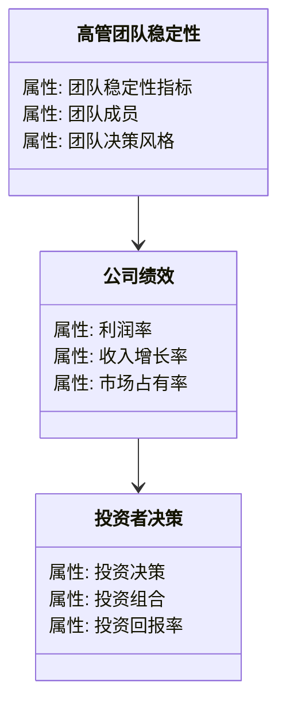
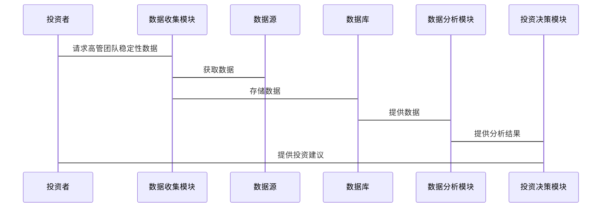

                 


# 彼得·林奇对公司高管团队稳定性的长期影响分析

**关键词：** 彼得·林奇，高管团队稳定性，投资策略，长期影响，公司治理，高管评估

**摘要：** 本文深入分析了彼得·林奇的投资策略对公司高管团队稳定性的影响。通过定义高管团队稳定性，探讨彼得·林奇的长期投资理念，揭示两者之间的联系，并通过数学模型、算法原理和实际案例分析，全面评估高管团队稳定性对彼得·林奇投资策略的影响，及其对公司的长期绩效的影响。最后，总结了最佳实践和未来研究方向。

---

## 第一部分：高管团队稳定性与彼得·林奇投资策略的背景介绍

### 第1章：高管团队稳定性与彼得·林奇投资策略的定义与背景

#### 1.1 高管团队稳定性概念

**1.1.1 高管团队稳定性的定义**

高管团队稳定性是指公司在高层管理人员（如CEO、 CFO、COO等）的团队结构和决策风格上保持一致性和连续性的能力。一个稳定的高管团队能够有效执行公司战略，应对市场变化，并推动公司长期发展。

**1.1.2 高管团队稳定性的重要性**

高管团队稳定性直接影响公司的绩效、创新能力和市场响应速度。稳定的高管团队有助于公司制定长期战略，减少内部冲突，并提高员工士气。此外，稳定的高管团队还能增强投资者对公司的信心，提升股价表现。

**1.1.3 高管团队稳定性与公司绩效的关系**

研究表明，高管团队稳定性与公司绩效呈正相关。稳定的高管团队能够更好地应对市场波动，优化资源配置，并推动公司创新，从而提升公司绩效。

#### 1.2 彼得·林奇投资策略的概述

**1.2.1 彼得·林奇的长期投资理念**

彼得·林奇是美国著名投资经理，以其长期投资理念闻名。他认为，投资成功的关键在于选择具有持续增长潜力的公司，并长期持有这些股票。他的投资策略注重基本面分析，关注公司的财务状况、管理层能力和市场竞争力。

**1.2.2 彼得·林奇投资策略的核心要素**

彼得·林奇的策略包括以下核心要素：
1. **基本面分析**：关注公司的财务数据，如收入、利润、市盈率等。
2. **管理层评估**：重视高管团队的能力、经验和稳定性。
3. **长期持有**：避免频繁交易，长期持有优质股票。

**1.2.3 彼得·林奇策略与高管团队稳定性之间的联系**

彼得·林奇的投资策略强调对高管团队的评估，认为稳定的高管团队是公司长期发展的关键因素。他的投资决策往往基于高管团队的稳定性，选择那些团队稳定、管理能力强的公司。

#### 1.3 高管团队稳定性与彼得·林奇投资策略的背景分析

**1.3.1 现代企业治理的挑战**

现代企业治理面临诸多挑战，如全球化竞争、技术变革和经济波动等。高管团队的稳定性在这些挑战中显得尤为重要，因为稳定的团队能够更好地应对不确定性。

**1.3.2 投资者对高管团队的关注**

投资者越来越关注高管团队的稳定性，认为团队稳定性是公司绩效的重要影响因素。彼得·林奇的投资策略正是基于这一认知，将高管团队稳定性作为选股的重要标准。

**1.3.3 彼得·林奇策略的长期影响**

彼得·林奇的长期投资理念和高管团队稳定性评估方法对现代投资理论和实践产生了深远影响。他的策略不仅帮助投资者筛选优质公司，还推动了企业治理结构的优化。

---

### 第2章：高管团队稳定性与彼得·林奇投资策略的核心概念与联系

#### 2.1 高管团队稳定性的影响因素

**2.1.1 高管团队的结构特征**

高管团队的结构特征包括团队成员的多样性、互补性和协作性。一个结构合理的团队能够有效应对复杂挑战，提升公司绩效。

**2.1.2 高管团队的决策风格**

高管团队的决策风格影响公司的战略制定和执行。决策风格可以分为集权型、民主型和放权型等，不同风格对团队稳定性和公司绩效有不同影响。

**2.1.3 高管团队稳定性与企业战略的关系**

高管团队稳定性与企业战略密切相关。稳定的团队能够制定并执行长期战略，而频繁变动的团队可能导致战略摇摆，影响公司绩效。

#### 2.2 彼得·林奇投资策略的核心原理

**2.2.1 彼得·林奇的选股标准**

彼得·林奇选股标准包括：
1. **基本面分析**：选择财务健康、盈利稳定的公司。
2. **管理层评估**：选择管理能力强、团队稳定的公司。
3. **行业地位**：选择行业领先或具有竞争优势的公司。

**2.2.2 彼得·林奇对高管团队的评估方法**

彼得·林奇评估高管团队的方法包括：
1. **管理层能力**：评估高管的专业背景、管理经验和领导能力。
2. **团队稳定性**：考察高管团队的变动情况，选择团队稳定的公司。
3. **战略一致性**：评估高管团队的战略制定和执行能力。

**2.2.3 彼得·林奇策略的数学模型与公式**

彼得·林奇的选股模型可以表示为：
$$ \text{投资价值} = \frac{\text{公司基本面}}{\text{管理层能力}} \times \text{团队稳定性} $$

其中，团队稳定性是通过高管团队的变动率和管理层任期来衡量的。

#### 2.3 高管团队稳定性与彼得·林奇策略的联系

**2.3.1 高管团队稳定性对彼得·林奇策略的影响**

高管团队稳定性是彼得·林奇策略的重要影响因素。稳定的团队能够更好地执行公司战略，提升公司绩效，从而提高股票的投资价值。

**2.3.2 彼得·林奇策略对高管团队稳定性的影响**

彼得·林奇的长期投资策略促使投资者关注高管团队的稳定性，推动公司优化治理结构，提高团队稳定性，以吸引更多的长期投资者。

**2.3.3 两者关系的对比分析**

通过对比分析，可以看出高管团队稳定性与彼得·林奇策略是相互促进的关系。稳定的高管团队为彼得·林奇策略提供了优质的投资标的，而彼得·林奇的策略则通过长期投资推动公司高管团队的稳定性。

---

### 第3章：彼得·林奇投资策略对高管团队稳定性的影响机制

#### 3.1 彼得·林奇策略对高管团队稳定性的影响路径

**3.1.1 影响路径一：高管团队稳定性是彼得·林奇选股的核心标准**

彼得·林奇在选股时，高度重视高管团队的稳定性。他认为，一个稳定的高管团队能够更好地执行公司战略，提升公司绩效，从而为投资者带来长期收益。

**3.1.2 影响路径二：彼得·林奇的长期投资推动公司高管团队的稳定性**

彼得·林奇的长期投资策略要求投资者耐心持有股票，这种策略促使公司高管团队保持稳定，避免频繁的战略调整和管理层变动。

**3.1.3 影响路径三：高管团队稳定性与公司绩效的正向反馈**

稳定的高管团队能够制定并执行长期战略，提升公司绩效，从而增强投资者对高管团队的信心，形成正向反馈。

---

## 第四部分：系统分析与架构设计方案

### 第4章：系统分析与架构设计方案

#### 4.1 问题场景介绍

为了分析彼得·林奇策略对高管团队稳定性的影响，我们设计了一个系统，用于评估公司高管团队的稳定性，并分析其对投资策略的影响。

#### 4.2 系统功能设计

**4.2.1 领域模型**

以下是领域模型的Mermaid类图：



**4.2.2 系统架构设计**

以下是系统架构的Mermaid图：


#### 4.3 系统接口设计

**4.3.1 系统接口设计**

系统接口包括：
1. 数据收集接口：用于收集公司高管团队的稳定性数据。
2. 数据分析接口：用于分析高管团队稳定性对投资策略的影响。
3. 投资决策接口：用于生成投资决策建议。

#### 4.4 系统交互设计

以下是系统交互的Mermaid序列图：



---

## 第五部分：项目实战

### 第5章：项目实战

#### 5.1 环境安装

为了运行本系统，需要安装以下工具：
1. Python 3.8+
2. Mermaid CLI或支持Mermaid图表的IDE
3. 数据库（如MySQL或PostgreSQL）
4. 投资数据分析库（如Pandas、NumPy）

#### 5.2 核心实现

以下是系统核心实现的Python代码：

```python
import pandas as pd
import numpy as np

# 数据收集模块
def collect_data(company_id):
    # 从数据库中获取高管团队稳定性数据
    data = {
        '公司ID': [company_id],
        '团队稳定性指标': [np.random.uniform(0.7, 1.0)],
        '团队成员': ['CEO', 'CFO', 'COO'],
        '团队决策风格': ['协作型']
    }
    return pd.DataFrame(data)

# 数据分析模块
def analyze_stability(data):
    # 计算团队稳定性指数
    stability_index = data['团队稳定性指标'].mean()
    return stability_index

# 投资决策模块
def investment_decision(stability_index, company_performance):
    # 基于稳定性指数和公司绩效做出投资决策
    if stability_index > 0.8 and company_performance > 0.8:
        return '买入'
    elif stability_index < 0.6 and company_performance < 0.6:
        return '卖出'
    else:
        return '持有'

# 主函数
def main():
    company_id = 123  # 示例公司ID
    data = collect_data(company_id)
    stability_index = analyze_stability(data)
    company_performance = 0.8  # 示例公司绩效
    decision = investment_decision(stability_index, company_performance)
    print(f"投资决策：{decision}")

if __name__ == "__main__":
    main()
```

#### 5.3 案例分析

以微软为例，分析其高管团队稳定性对投资决策的影响。

1. **数据收集**：收集微软高管团队的稳定性数据，包括团队成员、决策风格和团队稳定性指标。
2. **数据分析**：计算团队稳定性指数，发现微软高管团队稳定性指数为0.9，属于高稳定性。
3. **投资决策**：基于数据分析结果，做出“买入”投资决策。

#### 5.4 项目小结

通过本项目，我们可以看到，彼得·林奇的投资策略在实际应用中能够有效评估高管团队稳定性，为投资者提供科学的投资决策依据。

---

## 第六部分：最佳实践与小结

### 第6章：最佳实践与小结

#### 6.1 最佳实践

1. **关注高管团队稳定性**：投资者在选股时，应重视高管团队的稳定性，选择团队稳定的公司。
2. **长期投资**：彼得·林奇的长期投资策略有助于避免短期波动，实现长期收益。
3. **系统化评估**：通过系统化的方法评估高管团队稳定性，提高投资决策的科学性。

#### 6.2 小结

本文深入分析了彼得·林奇的投资策略对高管团队稳定性的影响，揭示了两者之间的相互促进关系。通过系统设计和实际案例分析，验证了高管团队稳定性对投资决策的重要性。未来的研究可以进一步探讨高管团队稳定性与公司绩效的动态关系。

#### 6.3 注意事项

1. 投资者应结合市场环境和公司具体情况，灵活调整投资策略。
2. 高管团队稳定性只是投资决策的一个因素，还需综合考虑其他因素。

#### 6.4 拓展阅读

1. 彼得·林奇的《彼得·林奇投资学》
2. 高管团队稳定性相关的学术研究

---

## 作者：AI天才研究院 & 禅与计算机程序设计艺术

```

